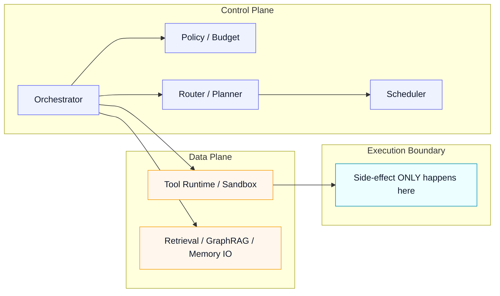
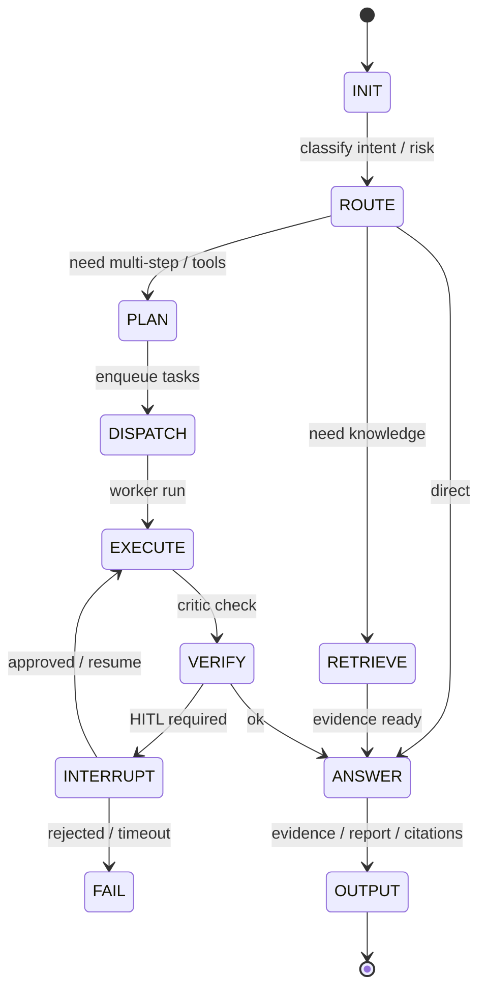
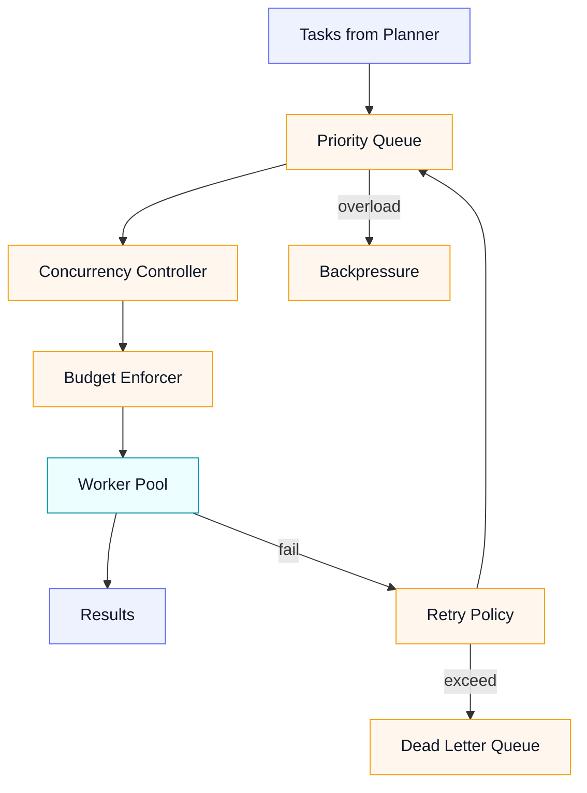
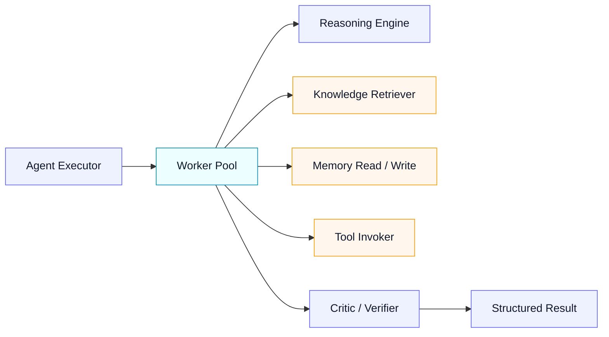
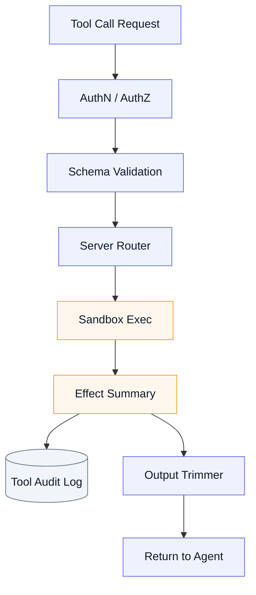
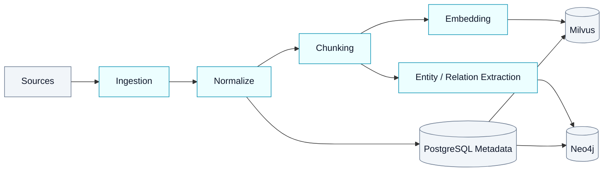

# Meyo 企业级 AgentOS 架构设计文档（实施蓝图版）

版本：v1.0  
日期：2026-04-22  
定位：实施蓝图  
技术基线：`FastAPI + LangGraph + PostgreSQL + Redis + Milvus + Neo4j + MinIO/S3 + MCP + Langfuse + OpenTelemetry`

## 0. 文档目标

这份文档不是框架选型笔记，也不是某个 demo 的设计说明，而是 `Meyo` 的完整架构基线。

它回答 4 个问题：

1. 平台整体分几层，每层负责什么。
2. `LangGraph` 在平台里的位置到底是什么。
3. `knowledge + skill + memory + tool mesh` 如何进入同一套体系。
4. 未来落地代码仓库时，哪些边界必须先定义清楚。

## 1. 总体结论

`Meyo` 采用 **三层架构 + 双平面边界 + Memory OS + Evidence-first** 的整体模型。

### 1.1 三层架构

1. **Apps Layer**
   - BFF / App API
   - 工作台
   - HITL Console
   - Studio / Admin

2. **Infra Layer**
   - Orchestrator
   - Scheduler
   - Agent Runtime
   - Tool Mesh
   - Observability

3. **DataOps Layer**
   - RAG / GraphRAG
   - Knowledge metadata
   - Memory OS
   - Evidence / Governance

### 1.2 双平面边界

- **Control Plane**：决策、编排、治理、预算、审批
- **Data Plane**：工具执行、知识检索、数据访问、文件生成

### 1.3 Memory OS

Memory 不是 transcript 的别名，而是分层系统：

- working memory
- checkpoint memory
- episodic memory
- semantic memory
- graph / insight memory

### 1.4 一句话收口

`Meyo` 的核心不是“让 LLM 多调几个工具”，而是：

**以 `LangGraph` 作为 agent runtime 内核，以 `PostgreSQL + Milvus + Neo4j` 作为知识与记忆底座，以 `MemoryGateway / KnowledgeGateway / ToolGateway / Run API` 作为平台稳定边界。**

## 2. 总体蓝图

```mermaid
flowchart TB
  classDef app fill:#ecfeff,stroke:#0891b2,color:#0f172a,stroke-width:1px;
  classDef infra fill:#eef2ff,stroke:#6366f1,color:#0f172a,stroke-width:1px;
  classDef data fill:#fff7ed,stroke:#f59e0b,color:#0f172a,stroke-width:1px;
  classDef store fill:#f1f5f9,stroke:#64748b,color:#0f172a,stroke-width:1px;

  U[User / Operator] --> UI[Web / Chat / Console]:::app --> BFF[BFF / App API]:::app

  subgraph Apps[Layer 3: Apps]
    DOMAIN[Domain Agent Apps]:::app
    HITL[HITL Console]:::app
    STUDIO[Studio / Admin / Policy]:::app
    BFF --> DOMAIN
    BFF --> HITL
    BFF --> STUDIO
  end

  subgraph Infra[Layer 1: Infra]
    subgraph CP[Control Plane]
      ORCH[Orchestrator Runtime]:::infra
      ROUTER[Router]:::infra
      PLANNER[Planner]:::infra
      SCHED[Scheduler]:::infra
      POLICY[Policy / RBAC / DLP]:::infra
      FINOPS[Budget / Cost / SLO]:::infra
      GRD[Guardrails]:::infra
      ORCH --> ROUTER --> PLANNER --> SCHED
      ORCH --> POLICY
      ORCH --> FINOPS
      ORCH --> GRD
    end

    subgraph RT[Agent Runtime]
      EXEC[Agent Executor]:::infra
      VERIFY[Verifier / Critic]:::infra
      TOOLGW[ToolGateway]:::infra
      MEMGW[MemoryGateway]:::infra
      KNOWGW[KnowledgeGateway]:::infra
      EVIDGW[EvidenceGateway]:::infra
      EXEC --> VERIFY
      EXEC --> TOOLGW
      EXEC --> MEMGW
      EXEC --> KNOWGW
      EXEC --> EVIDGW
    end

    subgraph TM[Tool Mesh]
      MCP[MCP Gateway]:::infra
      TREG[Tool Registry]:::infra
      SB[Sandbox Runtime]:::infra
      TAUD[(Tool Audit)]:::store
      MCP --> TREG
      MCP --> SB
      MCP --> TAUD
    end

    subgraph OBS[Observability]
      LF[Langfuse]:::infra
      OTEL[OpenTelemetry]:::infra
      TRACE[(Trace / Log / Metric)]:::store
      LF --> TRACE
      OTEL --> TRACE
    end
  end

  subgraph DataOps[Layer 2: DataOps]
    RET[Retrieval API]:::data
    GR[GraphRAG API]:::data
    MEMOS[Memory OS]:::data
    EVID[(Evidence Store)]:::store
    PG[(PostgreSQL)]:::store
    REDIS[(Redis)]:::store
    MILVUS[(Milvus)]:::store
    NEO[(Neo4j)]:::store
    S3[(MinIO / S3)]:::store
    RET --> MILVUS
    GR --> NEO
    MEMOS --> PG
    MEMOS --> REDIS
    MEMOS --> MILVUS
    MEMOS --> NEO
    EVID --> PG
    EVID --> S3
  end

  BFF --> ORCH
  ORCH --> EXEC
  EXEC --> MCP
  EXEC --> RET
  EXEC --> GR
  EXEC --> MEMOS
  ORCH --> LF
  ORCH --> OTEL
```

## 3. Control Plane vs Data Plane

企业级 AI 平台最大的问题不是“模型够不够强”，而是：

- 规划逻辑和执行逻辑混在一起
- 副作用和决策没有边界
- 错误无法恢复
- 审计无法落地

所以 `Meyo` 强制采用双平面边界。

约束：

- 路由、规划、预算、审批都在 `Control Plane`
- 真正访问外部系统、写文件、调工具、查数据库都在 `Data Plane`
- 所有副作用都必须有 trace 和审计记录

## 4. Agent Kernel

`Meyo` 的 Agent Kernel 不是具体框架，而是一组平台 primitives。

必须先定义的内核能力：

- `Planner Engine`
- `Execution Engine`
- `Tool Manager`
- `Memory Manager`
- `Knowledge Manager`
- `Guardrails`
- `Trace Manager`

这些能力不要求一开始就独立成微服务，但要求：

- 有接口
- 有配置
- 有日志
- 有测试

## 5. Orchestrator：Durable State Machine + HITL

`LangGraph` 在 `Meyo` 中的首要角色，是实现可恢复的编排运行时。

这里最关键的是：

- 有状态
- 可 checkpoint
- 可 resume
- 可 interrupt
- 可 replay

这也是为什么 `Meyo` 选择 `LangGraph-first`，但不让业务层直接依赖 `LangGraph` 类型。

## 6. Scheduler：队列、并发、预算、重试、背压

Agent Runtime 不是“收请求就跑”，必须有平台级调度。

必须具备：

- tenant / workspace 级队列
- 并发配额
- token / latency / cost 限额
- 重试策略
- 退化和拒绝机制

## 7. Agent Runtime Engine

`Agent Runtime` 负责把规划结果真正落到执行。

这里不直接暴露 `LangGraph` 内部 graph API，而是通过平台内聚的 `AgentRuntime` 接口提供能力。

## 8. Tool Mesh（MCP Gateway）

工具调用必须进入统一网关。

`Tool Mesh` 负责：

- 工具注册
- schema 校验
- allowlist
- 风险分级
- 执行审计
- 输出裁剪

## 9. DataOps：Knowledge + Retrieval + GraphRAG

`Meyo` 的知识层不是一个单向量库，而是三段式：

1. metadata / registry
2. semantic retrieval
3. graph retrieval

这一层的关键是：

- `PostgreSQL` 管 metadata 和 registry
- `Milvus` 管语义检索
- `Neo4j` 管图关系和 GraphRAG

## 10. Memory OS

`Meyo` 的 Memory OS 设计单独见 [Meyo Memory OS 设计](./memory_os_design.md)，但在总体架构里必须先记住一句话：

**memory 不是对话历史，而是分层系统。**

最小分层：

- `working memory`
- `checkpoint memory`
- `episodic memory`
- `semantic memory`
- `graph / insight memory`

推荐落位：

- `LangGraph state + checkpointer`
- `PostgreSQL`
- `Milvus`
- `Neo4j`

## 11. Observability：Langfuse + OpenTelemetry

观测层拆成两条线：

### 11.1 Langfuse

负责：

- LLM traces
- prompt / model / token / cost
- memory hit / miss
- eval 与错误记忆分析

### 11.2 OpenTelemetry

负责：

- 平台 trace / metric / log
- 非 LLM 子系统观测
- run / tool / retrieval / sandbox 链路追踪

## 12. Security

`Meyo` 的安全模型默认认为：

- 模型不可信
- 工具返回不可信
- 外部数据不可信

必须具备：

- input guardrails
- output guardrails
- tool risk policy
- data access policy
- secret isolation
- sandbox timeout / quota

## 13. 平台 API 契约

### 对外接口

- `/runs`
- `/runs/{id}`
- `/approvals`
- `/evidence/{run_id}`

### 对内接口

- `/internal/retrieve`
- `/internal/graph-rag/query`
- `/internal/tools/call`
- `/internal/memory/search`
- `/internal/memory/commit`

这个约束很关键：

**平台对外暴露的是 Run API，不是 LangGraph API。**

## 14. 最小数据模型

`PostgreSQL` 最少需要：

- `runs`
- `run_steps`
- `approvals`
- `tool_audit`
- `knowledge_spaces`
- `knowledge_assets`
- `skill_registry`
- `skill_versions`
- `episodic_events`
- `semantic_memory_items`
- `memory_promotion_jobs`
- `evidence_index`

## 15. 技术落位

### 15.1 首选技术

- API：`FastAPI`
- Runtime：`LangGraph`
- 主数据库：`PostgreSQL`
- 短期缓存：`Redis`
- 向量库：`Milvus`
- 图数据库：`Neo4j`
- 对象存储：`MinIO / S3`
- Tool Mesh：`MCP`
- LLM Observability：`Langfuse`
- Platform Observability：`OpenTelemetry`

### 15.2 不采用的路线

- 不把 `Mem0` 当平台主记忆底座
- 不让业务层直接依赖 `LangGraph`
- 不把 transcript 当长期记忆
- 不把向量库当系统事实主库

## 16. 实施顺序

### Phase 1：先跑通

- FastAPI
- LangGraph runtime
- Run API
- Langfuse
- OpenTelemetry

### Phase 2：接知识与工具

- PostgreSQL registry
- Milvus retrieval
- Neo4j graph retrieval
- MCP Gateway
- Sandbox

### Phase 3：补 Memory OS

- checkpointer
- MemoryGateway
- episodic store
- semantic store
- promotion worker

### Phase 4：补治理与生产能力

- approvals
- budget / quota
- policy engine
- evidence store
- eval pipeline

## 17. 一句话收口

`Meyo` 的架构设计，不是“多加几个 agent 模块”，而是：

**把 `LangGraph` 放在最合适的 runtime 位置，把 `PostgreSQL + Milvus + Neo4j` 放在最合适的知识和记忆位置，再用 `MemoryGateway / KnowledgeGateway / ToolGateway / Run API` 把整个平台稳定下来。**
