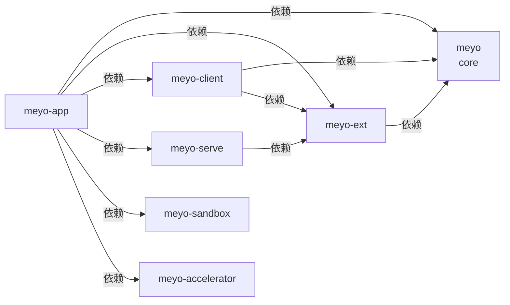
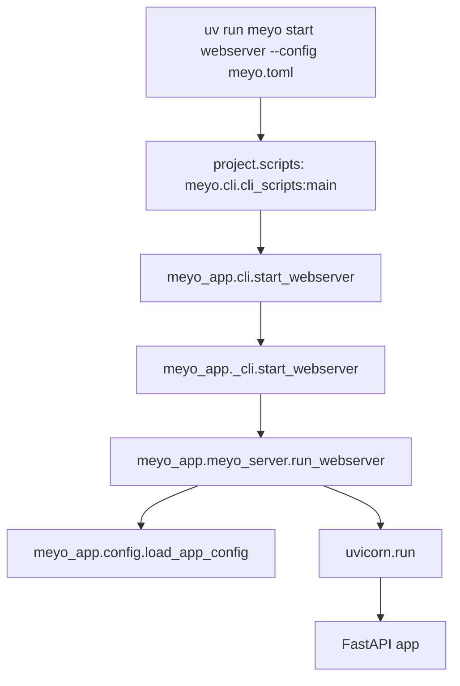

# 从零开始上手：uv、Workspace 与包加载链路

这篇只讲当前仓库真实能跑的壳。

先不要急着看业务设计，先把 3 件事搞清楚：

- `uv` 怎么把环境装起来
- workspace 里的 package 是怎么互相依赖的
- `uv run meyo start webserver --config meyo.toml` 到底走了哪些代码

## 1. 先记住一句话

`uv` 负责装环境和跑命令，`packages/` 负责拆包，`meyo-app` 负责把所有包装配成一个能启动的应用。

当前最短启动命令：

```shell
uv sync --all-packages \
  --extra "base" \
  --extra "siliconflow"
uv run meyo start webserver --config meyo.toml
```

启动后：

```text
前端静态页: http://127.0.0.1:5670/
后端健康检查: http://127.0.0.1:5670/api/healthz
后端 hello 接口: http://127.0.0.1:5670/api/hello
```

## 2. 先分清目录名、包名、import 名

第一次看这种 monorepo，最容易混的是这几个名字。

| 目录 | pip 包名 | Python import 名 | 说明 |
|---|---|---|---|
| `packages/meyo-core` | `meyo` | `meyo` | core 包，注册总 CLI |
| `packages/meyo-app` | `meyo-app` | `meyo_app` | app 装配层，启动 webserver |
| `packages/meyo-ext` | `meyo-ext` | `meyo_ext` | 外部系统适配，比如数据库、向量库、对象存储 |
| `packages/meyo-client` | `meyo-client` | `meyo_client` | SDK / client 侧封装 |
| `packages/meyo-serve` | `meyo-serve` | `meyo_serve` | 服务编排层 |
| `packages/meyo-sandbox` | `meyo-sandbox` | `meyo_sandbox` | 隔离执行能力 |
| `packages/meyo-accelerator` | `meyo-accelerator` | `meyo_accelerator` | 可选加速能力 |

注意这里有一个特殊点：

- 目录叫 `meyo-core`
- 但 pip 包名叫 `meyo`
- 代码 import 名叫 `meyo`

这是参考 `Umber Studio` 的形态：core 包承担项目主包和 CLI 总入口。

## 3. 根 `pyproject.toml` 是 workspace 容器

根项目现在叫：

```toml
[project]
name = "meyo-mono"
dependencies = []
```

它不是业务包，也不注册 CLI。

它主要做三件事：

- 声明这个仓库有哪些 workspace member
- 告诉 `uv` 本地包从 workspace 里找
- 放全局工具配置，比如 Ruff

## 4. `[tool.uv.workspace]` 是成员列表

根 `pyproject.toml` 里这段：

```toml
[tool.uv.workspace]
members = [
    "packages/meyo-core",
    "packages/meyo-ext",
    "packages/meyo-client",
    "packages/meyo-serve",
    "packages/meyo-sandbox",
    "packages/meyo-accelerator",
    "packages/meyo-app",
]
```

意思是：

- 这些目录都是当前 workspace 的 package
- `uv sync --all-packages` 会一起处理它们
- 它们可以通过 `[tool.uv.sources]` 互相使用本地源码

它不代表这些包可以随便互相 import。

真正的依赖关系还是看每个 package 自己的 `pyproject.toml`。

## 5. `[tool.uv.sources]` 是本地包映射

根 `pyproject.toml` 里还有：

```toml
[tool.uv.sources]
meyo = { workspace = true }
meyo-app = { workspace = true }
meyo-client = { workspace = true }
meyo-ext = { workspace = true }
meyo-serve = { workspace = true }
meyo-sandbox = { workspace = true }
meyo-accelerator = { workspace = true }
```

这段的意思是：

> 如果某个子包依赖 `meyo`，不要去 PyPI 下载，直接用当前仓库里的 workspace 包。

所以改本地源码后，不需要先发包，也不需要 `pip install -e .`。

用：

```shell
uv sync --all-packages --extra "base"
```

就能把 workspace 里的包和基础后端依赖重新装进 `.venv`。

## 6. 当前包依赖关系

当前真实依赖关系是：



可以先这样理解：

- `core` 放基础类型、版本号、CLI 总入口、核心 optional deps
- `ext` 放外部系统驱动和 adapter 依赖
- `client` 放 SDK / HTTP client 侧能力
- `serve` 放服务编排
- `sandbox` 放隔离执行
- `accelerator` 放可选加速能力
- `app` 负责最终装配和启动

## 7. 第三方依赖放在哪里

当前依赖不是全部塞进 `app`，而是分组放在 `core` 和 `ext`。

`meyo` core 包负责这些 extras：

| extra | 主要内容 | 用途 |
|---|---|---|
| `cli` | `click` / `rich` / `tomlkit` | CLI |
| `client` | `httpx` / `tenacity` | HTTP client |
| `simple_framework` | `FastAPI` / `Uvicorn` / `Gunicorn` / `python-multipart` | Web 服务 |
| `runtime` | `LangGraph` / `langchain-core` | Agent runtime |
| `framework` | `SQLAlchemy` / `Alembic` / `jsonschema` | 基础框架能力 |
| `proxy_openai` | `openai` / `tiktoken` / `httpx[socks]` | OpenAI 兼容代理 |
| `tool` | `mcp` | MCP 工具协议 |
| `observability` | `Langfuse` / `OpenTelemetry` / `Prometheus` / `structlog` | 观测 |

`meyo-ext` 负责这些 extras：

| extra | 主要内容 | 用途 |
|---|---|---|
| `storage_postgres` | `asyncpg` / `psycopg` | PostgreSQL |
| `storage_redis` | `redis` | Redis |
| `storage_milvus` | `pymilvus` | Milvus |
| `storage_neo4j` | `neo4j` | Neo4j |
| `file_s3` | `boto3` / `minio` | S3 / MinIO |
| `model_tongyi` | `dashscope` | 通义 embedding |

最终 `meyo-app` 只声明 workspace 包关系，具体能力通过 optional extras 按需打开：

```toml
dependencies = [
    "meyo",
    "meyo-accelerator",
    "meyo-client",
    "meyo-ext",
    "meyo-sandbox",
    "meyo-serve",
]

[project.optional-dependencies]
base = [
    "meyo[cli,client,framework,runtime,simple_framework,tool]",
]
siliconflow = [
    "meyo[proxy_openai]",
]
pg_milvus_neo4j = [
    "meyo-ext[storage_postgres,storage_milvus,storage_neo4j]",
]
```

也就是说：

- `FastAPI / Uvicorn` 来自 `meyo[simple_framework]`
- `LangGraph` 来自 `meyo[runtime]`
- `OpenAI / tiktoken` 来自 `meyo[proxy_openai]`，SiliconFlow LLM 也复用这一组
- `MCP` 来自 `meyo[tool]`
- `PostgreSQL / Milvus / Neo4j` 来自 `meyo-ext[...]`

## 8. CLI 是怎么注册的

真正的命令入口在 core 包：

```toml
[project.scripts]
meyo = "meyo.cli.cli_scripts:main"
```

这句话的意思是：

> 安装 `meyo` 这个包以后，系统里会多一个 `meyo` 命令，它会执行 `meyo.cli.cli_scripts:main`。

所以执行：

```shell
uv run meyo --help
```

会进入：

```text
packages/meyo-core/src/meyo/cli/cli_scripts.py
```

这个文件只负责注册命令，不负责真正启动服务。

## 9. 启动命令怎么走

执行：

```shell
uv run meyo start webserver --config meyo.toml
```

真实链路是：

```text
uv run
-> meyo 命令
-> meyo.cli.cli_scripts:main
-> meyo_app.cli.start_webserver
-> meyo_app._cli.start_webserver
-> meyo_app.meyo_server.run_webserver
-> meyo_app.config.load_app_config
-> uvicorn.run(create_app(...))
```

图里看更直观：



## 10. `meyo.toml` 为什么能工作

你传的是：

```shell
--config meyo.toml
```

但项目会把它映射到：

```text
configs/meyo.toml
```

当前解析规则是：

- 不传 `--config`，默认找 `configs/meyo.toml`
- 传真实存在的绝对路径，直接用
- 传 `meyo.toml`，先按当前目录找，找不到再去 `configs/meyo.toml`
- 传 `/meyo.toml` 这类伪绝对路径，如果真实文件不存在，也会回退到 `configs/meyo.toml`

这样本地启动不用写一大串绝对路径。

## 11. 启动后现在有什么

当前不是完整业务系统，还是最小壳。

它已经有：

- 一个统一 CLI：`meyo`
- 一个启动命令：`meyo start webserver`
- 一个 FastAPI 后端
- 一个静态首页
- 一个配置解析器
- 一套核心依赖分组

接口：

```shell
curl http://127.0.0.1:5670/api/healthz
curl http://127.0.0.1:5670/api/hello
```

静态页：

```shell
curl http://127.0.0.1:5670/
```

## 12. 新同学按这个顺序看代码

先看这几个文件就够：

```text
pyproject.toml
packages/meyo-core/pyproject.toml
packages/meyo-core/src/meyo/cli/cli_scripts.py
packages/meyo-app/pyproject.toml
packages/meyo-app/src/meyo_app/cli.py
packages/meyo-app/src/meyo_app/_cli.py
packages/meyo-app/src/meyo_app/config.py
packages/meyo-app/src/meyo_app/meyo_server.py
```

先别看太多设计文档。

先把一条线跑通：

```text
命令怎么进来 -> 配置怎么读取 -> FastAPI 怎么启动 -> 页面和接口怎么访问
```

这条线通了，再回头看架构文档会顺很多。

## 13. 最容易误解的点

`uv init` 只是生成基础骨架，不会替你设计 monorepo 架构。

`workspace` 只是告诉 `uv` 哪些包一起管理，不代表这些包可以随便互相 import。

`app` 是最终装配层，不是所有代码都往里塞。

`core` 不是“所有实现都放这里”，它更像稳定底座。

`uv run meyo ...` 不是跑根目录的 `main.py`，而是跑 `[project.scripts]` 注册出来的 CLI。

## 14. 你现在应该记住什么

只记 5 句：

1. 根项目叫 `meyo-mono`，只做 workspace 容器。
2. core 包目录叫 `meyo-core`，但 pip 包名是 `meyo`。
3. CLI 注册在 `packages/meyo-core/pyproject.toml` 的 `[project.scripts]`。
4. WebServer 由 `meyo-app` 启动，依赖通过 core/ext extras 装配。
5. 本地启动固定用 `uv sync --all-packages` 和 `uv run meyo start webserver --config meyo.toml`。
