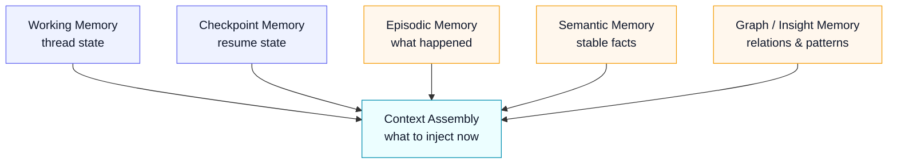
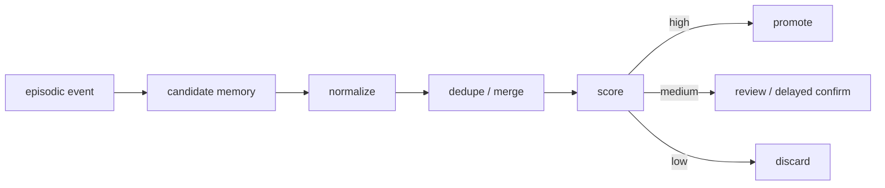

# Meyo Memory OS 设计

版本：v1.0  
日期：2026-04-22  
目标：定义 Meyo 的 **混合记忆系统**，覆盖短期记忆、长期记忆、洞见提升、上下文组装和记忆观测。

## 一、先说结论

Meyo 不采用“把所有历史聊天塞回 prompt”的 memory 方案，也不把 memory 完全托管给单一黑盒框架。

推荐路线是：

1. **短期记忆**：`LangGraph state + checkpointer`
2. **长期记忆接口**：自定义 `MemoryGateway`
3. **情节记忆**：`PostgreSQL`
4. **语义记忆**：`PostgreSQL metadata + Milvus vectors`
5. **图洞见记忆**：`Neo4j`，必要时再评估 `Graphiti`
6. **记忆提升流水线**：后台 worker
7. **观测与评测**：`Langfuse`

这不是“全手搓”，而是：

**自己定义记忆边界与策略层，底下尽量用成熟基础件。**

## 二、为什么不能把 transcript 当 memory

把历史对话原样塞回上下文，短期看简单，长期一定失控：

- token 成本越来越高
- stale content 干扰当前任务
- 多 topic 会互相污染
- 模型会把旧事实当现行事实
- 无法区分“发生过什么”和“应该记住什么”

因此，Meyo 的 Memory OS 把“历史”拆成不同层级，而不是一坨文本。

## 三、六层记忆模型



### 3.1 Working Memory

位置：

- `LangGraph state`

内容：

- 当前 thread 最近消息
- 当前 plan
- 当前工具中间结果
- 当前 retrieval results
- 当前审批状态

特点：

- 生命周期短
- 与 thread 强绑定
- 主要服务当前任务

### 3.2 Checkpoint Memory

位置：

- `LangGraph checkpointer`

内容：

- 可恢复执行状态
- 中断点
- HITL 等待状态
- resume 所需最小状态

特点：

- 不是业务长期记忆
- 目的是 `pause / resume / replay`

### 3.3 Episodic Memory

位置：

- `PostgreSQL`

内容：

- 用户发起了什么任务
- agent 做了哪些动作
- 工具返回了什么
- 最终结果是否成功
- 审批是否通过

特点：

- 记录“发生过什么”
- 是审计友好的事实日志
- 是长期记忆提升的主要来源

### 3.4 Semantic Memory

位置：

- `PostgreSQL + Milvus`

内容：

- 用户偏好
- 长期稳定约束
- 常用业务事实
- 已确认的知识结论
- 可跨会话复用的 profile

特点：

- 记录“应该长期记住什么”
- 通过向量召回参与上下文组装

### 3.5 Graph / Insight Memory

位置：

- `Neo4j`

内容：

- 实体关系
- 事件之间的因果或关联
- 冲突事实
- 长期模式与洞见

特点：

- 解决“点状事实”无法表达关系的问题
- 为 GraphRAG 和跨事件推断提供底座

### 3.6 Context Assembly

位置：

- `MemoryGateway + ContextAssembler`

内容：

- 从上述多层记忆里取当前最相关的一小部分
- 不是把所有记忆塞进上下文

特点：

- Memory OS 的真正价值不只在“存”，更在“取什么来用”

## 四、短记忆如何自动提升为长记忆

Meyo 采用 **双通道**：

### 4.1 热路径 Hot Path

在当前请求里直接落入长期记忆的内容，必须满足“高确定性”：

- 用户明确说“记住这个”
- agent 完成并验证通过的稳定结果
- 经审批通过的规则更新
- 明确的 profile / preference / scope 变更

### 4.2 后台路径 Background Promotion

异步 worker 周期性处理 `episodic_events`：

`event -> candidate_memory -> normalize -> dedupe -> score -> promote`



## 五、记忆提升打分模型

至少要看 5 个维度：

- `stability`
- `reuse_value`
- `confidence`
- `scope`
- `sensitivity`

推荐规则：

- 高分：自动提升
- 中分：等待下一次确认或人工审核
- 低分：只保留在 episodic，不升为长期记忆

## 六、长期记忆不能只加不删

长期记忆系统最大的坑，不是记不住，而是：

**旧事实不会失效。**

因此必须支持：

- 覆盖旧偏好
- 失效旧规则
- 冲突事实标记
- TTL / freshness 控制
- source / evidence 追踪

## 七、MemoryGateway 设计

平台内部统一通过 `MemoryGateway` 访问记忆，而不是直接访问存储层。

### 7.1 建议接口

```python
class MemoryGateway:
    async def load_working_set(self, *, thread_id: str, query: str) -> dict: ...
    async def search_semantic(self, *, namespace: str, query: str, top_k: int = 8) -> list[dict]: ...
    async def search_graph(self, *, namespace: str, query: str, top_k: int = 6) -> list[dict]: ...
    async def commit_episode(self, *, run_id: str, event: dict) -> None: ...
    async def promote_candidates(self, *, run_id: str | None = None) -> list[dict]: ...
    async def upsert_semantic_memory(self, *, item: dict) -> str: ...
    async def write_graph_fact(self, *, fact: dict) -> str: ...
```

### 7.2 设计目标

- 隔离业务与底层存储
- 隔离业务与 `LangGraph` / `Mem0` / `Graphiti` 等实现差异
- 让未来替换记忆后端时，影响收敛在 adapter 层

## 八、三库分工

### 8.1 PostgreSQL

负责：

- episodic events
- semantic memory metadata
- promotion jobs
- scopes / namespaces
- evidence links
- invalidation / status

### 8.2 Milvus

负责：

- semantic memory vectors
- similarity search
- related fact recall

### 8.3 Neo4j

负责：

- entity-relation graph
- event-to-entity graph
- contradiction / support edges
- GraphRAG / insight recall

## 九、与 LangGraph 的分工

LangGraph 在 Memory OS 里的职责非常明确：

- 管理 thread-scoped state
- 管理 checkpointer
- 提供 tool / node 中对 memory 的接入点
- 提供 interrupt / resume 的状态恢复能力

它**不直接替你做**：

- 提升策略
- 失效策略
- 语义记忆治理
- 图洞见治理
- 记忆质量评分

## 十、是否推荐接 Mem0

当前结论：

- 可以接
- 但不建议把它作为平台主记忆底座

原因：

- 它更适合“长期个性化记忆插件”
- 它不是你整套 Memory OS 的 system of record
- 如果你要把 `Neo4j` 做成正式 graph memory，Mem0 并不适合当唯一主轴

## 十一、是否推荐 Graphiti

如果后续你发现图洞见和跨事件关系越来越重要，可以评估：

- `Neo4j + 自研写入模型`
- 或 `Graphiti` 作为图洞见层的实现

当前推荐做法是：

- v1 先用 `Neo4j + 自定义 graph fact schema`
- 等语义与图事实模型稳定后，再评估 `Graphiti`

## 十二、Langfuse 观察什么

`Langfuse` 在 Memory OS 里不是存储，而是观测层。

重点追：

- memory hit rate
- memory miss rate
- injection token size
- promoted memory acceptance rate
- stale memory error rate
- wrong-memory correction rate
- graph recall usefulness

## 十三、建议表结构

最小可用表：

- `episodic_events`
- `semantic_memory_items`
- `semantic_memory_embeddings_ref`
- `memory_promotion_jobs`
- `memory_promotion_results`
- `memory_invalidations`
- `memory_feedback`
- `graph_fact_sources`

## 十四、最小落地顺序

### Phase 1

- `LangGraph state + checkpointer`
- `MemoryGateway` 接口
- `episodic_events` 表

### Phase 2

- semantic memory metadata
- Milvus vector write / search
- basic context assembly

### Phase 3

- background promotion worker
- invalidation / overwrite
- Langfuse memory metrics

### Phase 4

- graph memory
- contradiction / support edges
- GraphRAG memory recall

## 十五、一句话收口

Meyo 的混合记忆系统，不是押一个现成 memory 框架，而是：

**用 `LangGraph` 管短期状态和可恢复执行，用 `MemoryGateway` 定义平台边界，用 `PostgreSQL + Milvus + Neo4j` 承接长期记忆和洞见，再用后台提升流水线把“发生过什么”转成“应该记住什么”。**
