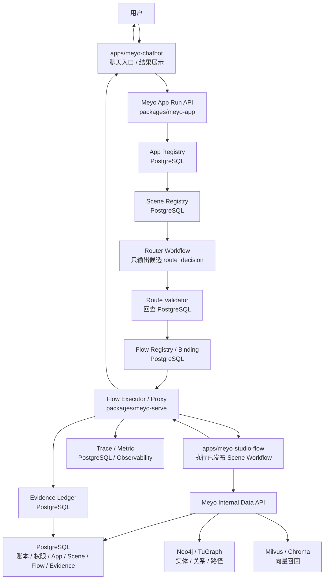

# Meyo 推理入口运行框架设计

## 0. 文档定位

本文只定义 **推理入口运行框架**，也就是用户从 `meyo-chatbot` 发起自然语言请求后，Meyo 如何完成 app 识别、scene 路由、flow 校验、flow 执行、证据审计和结果返回。

本文不定义某一个具体业务 scene 的内部 workflow。具体 scene 必须独立成文档，例如：

- [RAG 问答 Scene Workflow 设计](scenes/01_rag_qa_scene_workflow_design.md)

本文承接 [Meyo DataOps + RAG 企业级完整方案](../feature/07_dataops-rag-agentos-implementation.md)，但边界更窄：

| 文档 | 负责内容 |
|---|---|
| Feature 方案 | 企业级 DataOps + RAG 总体方案、G/K/I/S/R/F 全量节点 |
| 推理入口运行框架设计 | `chatbot -> meyo-stack -> router -> studio-flow -> meyo-stack data gateway` 的通用运行框架 |
| Scene Workflow 设计 | 某个 scene 内部有哪些节点、查哪些事实源、如何产出答案 |

## 1. 核心判断

你的系统不是让 `chatbot` 直接判断该走哪个 RAG，也不是让代码里写死业务关键词。

正确结构是：

```text
chatbot
 -> Meyo App Run API
 -> Meyo App / Scene Registry
 -> Router Workflow
 -> Route Validator
 -> Flow Executor / Proxy
 -> studio-flow 执行已发布 Scene Workflow
 -> Meyo Internal Data API 查询三库
 -> Evidence / Trace / Metric
 -> chatbot 展示
```

这里的关键是：

| 组件 | 定位 |
|---|---|
| `apps/meyo-chatbot` | 用户入口和结果展示层 |
| `meyo-stack` | 唯一生产控制面、事实访问面、审计面 |
| Router Workflow | 只在已注册 scene 候选中做路由决策 |
| `apps/meyo-studio-flow` | 已发布 workflow 的设计、调试、执行承载 |
| Scene Workflow | 某个业务场景的固定流程 |
| PostgreSQL / Neo4j / Milvus | 唯一业务事实来源 |

## 2. 硬性约束

### 2.1 不允许隐藏节点

所有生产功能必须有显式节点、显式输入、显式输出、显式状态、显式失败记录。

| 规则 | 要求 |
|---|---|
| 节点显式 | 每个 service 方法、API、worker job 都必须声明 node id |
| 状态显式 | 每个 run、flow run、scene node 都必须有状态记录 |
| 输入输出显式 | 每个节点必须有 request schema、response schema 或落库记录 |
| 失败显式 | 失败必须记录 `node_id`、`error_code`、`error_detail_ref` |
| 跳过显式 | 跳过节点必须写 `skipped` 和原因 |
| 禁止隐式推理 | 代码不能根据字符串、缓存、prompt 自行推断业务事实 |

### 2.2 三库唯一事实源

生产业务事实只能来自：

```text
PostgreSQL：租户、用户、权限、app、scene、flow、资产、版本、chunk、Skill、Run、Evidence、Policy
Neo4j / TuGraph：实体、关系、路径、子图、图谱证据
Milvus / Chroma：向量、向量集合、相似度、召回候选
```

硬规则：

1. `chatbot` 不直连 PostgreSQL / Neo4j / Milvus。
2. `studio-flow` 不直连生产 PostgreSQL / Neo4j / Milvus。
3. Router Workflow 不创造 `scene_id`、`flow_id`。
4. `flow_id`、`flow_version_id`、`scene_id` 必须回查 PostgreSQL 后才能执行。
5. 对象存储只存 artifact 和原文件，是否可读必须由 PostgreSQL 决定。
6. LLM 输出只能是候选、草稿、解释，不能是事实源。
7. 三库没有证据时，系统必须返回无证据、无数据或需要补充知识。

## 3. 项目职责

当前仓库没有独立 `meyo-stack` 目录。本文中的 `meyo-stack` 指：

```text
packages/meyo-core
packages/meyo-ext
packages/meyo-serve
packages/meyo-app
packages/meyo-client
packages/meyo-sandbox
packages/meyo-accelerator
configs
```

| 项目 | 职责 | 禁止事项 |
|---|---|---|
| `meyo-stack` | App Registry、Scene Registry、Flow Registry、Router、Route Validator、Internal Data API、Evidence、Trace、Policy | 不把业务事实写死在代码里 |
| `apps/meyo-chatbot` | 提交 app run、展示答案、展示引用、展示状态、提交反馈 | 不判断 scene，不拼 citation，不直连三库 |
| `apps/meyo-studio-flow` | 设计 flow、调试 flow、导出 artifact、执行已发布 Scene Workflow | 不作为生产事实源，不作为 Skill Registry，不直连生产三库 |

## 4. 运行架构图



## 5. 框架组件

| 组件 | 落位 | 事实源 | 输入 | 输出 | 禁止事项 |
|---|---|---|---|---|---|
| Chat UI | `apps/meyo-chatbot` | 无 | message、conversation_id、app_hint | app run request | 判断 scene、拼 citation、直连三库 |
| App Run API | `packages/meyo-app` | PostgreSQL | app run request | `app_run_id`、`run_id` | 直接 import 三库 SDK |
| App Registry | `packages/meyo-serve` + `meyo-ext/postgres` | PostgreSQL | `app_id`、tenant、domain | app profile | 从配置文件读取业务 app |
| Scene Registry | `packages/meyo-serve` + `meyo-ext/postgres` | PostgreSQL | `app_id`、tenant、domain | active scene candidates | 代码里写死 scene 列表 |
| Router Workflow | `packages/meyo-serve` 或已发布 router flow | PostgreSQL 候选列表 | query、active scenes、examples | route candidate | 产出未注册 scene |
| Route Validator | `packages/meyo-serve` | PostgreSQL | route candidate | validated route decision | 信任 LLM 输出 |
| Flow Registry | `packages/meyo-serve` + `meyo-ext/postgres` | PostgreSQL | scene_id、version policy | active flow binding | 从 studio-flow 本地 DB 当生产事实 |
| Flow Artifact Store | `meyo-ext/object_store` | PostgreSQL URI | artifact ref | artifact bytes | 用对象存储绕过账本 |
| Flow Executor / Proxy | `packages/meyo-serve` | PostgreSQL | validated binding、scene input | flow result | 执行未激活 flow |
| Studio Flow Runtime | `apps/meyo-studio-flow` | 无 | scene invocation | scene output | 直接访问生产三库 |
| Internal Data API | `packages/meyo-app` | PostgreSQL / Neo4j / Milvus | typed data query | typed data result | 开放任意 SQL / Cypher |
| Evidence Gateway | `packages/meyo-serve` | PostgreSQL | selected evidence | evidence ledger | 接收无来源证据 |
| Trace Gateway | `packages/meyo-serve` | PostgreSQL / Observability | node events | trace、metric | 丢失 node_id |

## 6. 框架运行全链路

框架节点使用 `FW` 前缀。`FW` 是推理入口运行框架节点，不替代 Feature 方案中的 `R00-R26`，而是把运行时实现拆得更清楚。

| 节点 | 名称 | 映射 | 执行位置 | 输入 | 必查事实源 | 输出 | 失败处理 |
|---|---|---|---|---|---|---|---|
| `FW00` | 接收聊天请求 | `R00` | chatbot -> Meyo API | message、conversation_id、app_hint | 无 | app run request | 请求结构错误返回 `invalid_request` |
| `FW01` | 创建 app run | `R00` | Meyo Stack | app run request | PostgreSQL | `app_run_id`、`run_id` | 写 `run_failed` |
| `FW02` | 身份与租户校验 | `R01` | Meyo Stack | user_id、tenant_id | PostgreSQL | auth context | deny 并写 `run_step` |
| `FW03` | 输入安全检查 | `R02` | Meyo Stack | message、attachments | PostgreSQL policy | sanitized input | block 或 require approval |
| `FW04` | 查询 App Registry | `R03` | Meyo Stack | app_id / app_hint | PostgreSQL | app profile | app 不存在返回 `app_not_found` |
| `FW05` | 查询 Scene Registry | `R03` | Meyo Stack | app_id、tenant、domain | PostgreSQL | active scene candidates | 无 active scene 返回 `no_active_scene` |
| `FW06` | 构造 router input | `R03` | Meyo Stack | sanitized input、scene candidates | PostgreSQL | router input | 候选为空直接停止 |
| `FW07` | 执行 Router Workflow | `R03` | Meyo Stack | router input | PostgreSQL 候选列表 | route candidate | 模型失败返回 `route_failed` |
| `FW08` | 保存 route candidate | `R03` | Meyo Stack | route candidate | PostgreSQL | `route_decision_id` | 保存失败返回 `route_record_failed` |
| `FW09` | 校验 route decision | `R03` | Meyo Stack | route_decision_id | PostgreSQL | validated scene_id | 未注册 / 未激活则 reject |
| `FW10` | 查询 Flow Binding | `R04` | Meyo Stack | scene_id、app_id | PostgreSQL | active flow binding | 无 binding 返回 `flow_not_bound` |
| `FW11` | 执行权限与发布策略 | `R04` | Meyo Stack | user、scene、flow | PostgreSQL | allow / deny / approval | deny 或进入审批 |
| `FW12` | 创建 flow run | `R04` | Meyo Stack | flow binding、scene input | PostgreSQL | `flow_run_id` | 写 flow run failed |
| `FW13` | 代理调用 Studio Flow | `R17-R19` | Meyo Stack -> Studio Flow | flow artifact、scene input | PostgreSQL | studio run id | 调用失败写 `flow_proxy_failed` |
| `FW14` | Scene Workflow 数据查询 | `R05-R14` | Studio Flow -> Meyo Internal API | scene node query | PostgreSQL / Neo4j / Milvus | data result | 查询失败按节点失败 |
| `FW15` | 接收 scene output | `R21` | Meyo Stack | flow result | PostgreSQL | raw scene output | schema 不符返回 `invalid_scene_output` |
| `FW16` | 绑定引用和证据 | `R22` | Meyo Stack | scene output、evidence refs | PostgreSQL | citation package | citation 不完整则阻断 |
| `FW17` | 输出安全检查 | `R23` | Meyo Stack | answer、citations | PostgreSQL policy | safe answer | 不合规返回安全拦截 |
| `FW18` | 返回 chatbot | `R24` | Meyo Stack -> chatbot | safe answer | PostgreSQL | response payload | 返回失败只影响传输 |
| `FW19` | 写 Evidence Ledger | `R25` | Meyo Stack | answer、citations、used assets | PostgreSQL | evidence ledger | 失败标记 run 不完整 |
| `FW20` | 写 Trace / Metric | `R26` | Meyo Stack | run steps、latency、token | PostgreSQL / Observability | trace、metric | 失败写观测告警 |

## 7. PostgreSQL 必备注册表

| 表 | 作用 | 必备字段 |
|---|---|---|
| `app_registry` | 定义一个可运行 app | `app_id`、`tenant_id`、`domain_id`、`name`、`status`、`default_router_id`、`created_by`、`created_at` |
| `scene_registry` | 定义 app 下的业务 scene | `scene_id`、`app_id`、`name`、`status`、`intent_description`、`input_schema_ref`、`output_schema_ref` |
| `scene_route_examples` | 给 router 的正反例 | `example_id`、`scene_id`、`text`、`label`、`reason`、`status` |
| `scene_workflow_specs` | 保存 scene workflow 显式节点定义 | `workflow_spec_id`、`scene_id`、`nodes`、`edges`、`status`、`schema_version` |
| `flow_templates` | Studio Flow 模板元数据 | `flow_template_id`、`source`、`name`、`artifact_schema_ref`、`status` |
| `flow_versions` | 可发布 flow 版本 | `flow_version_id`、`flow_template_id`、`artifact_uri`、`checksum`、`status`、`created_by` |
| `app_scene_flow_bindings` | scene 到 flow 的绑定 | `binding_id`、`app_id`、`scene_id`、`flow_version_id`、`status`、`effective_from` |
| `router_versions` | router workflow 版本 | `router_id`、`router_version_id`、`artifact_uri`、`status`、`eval_report_id` |
| `route_decisions` | 路由决策审计 | `route_decision_id`、`run_id`、`candidate_scene_id`、`validated_scene_id`、`confidence`、`reason`、`status` |
| `app_runs` | app 级运行记录 | `app_run_id`、`app_id`、`run_id`、`user_id`、`status`、`route_decision_id` |
| `flow_runs` | flow 级运行记录 | `flow_run_id`、`app_run_id`、`scene_id`、`flow_version_id`、`status`、`started_at`、`ended_at` |
| `run_steps` | 全链路节点记录 | `step_id`、`run_id`、`node_id`、`status`、`input_ref`、`output_ref`、`error_code` |

这些表只能由 Meyo Stack 写入。`apps/meyo-chatbot` 和 `apps/meyo-studio-flow` 都不能直接写生产表。

## 8. Scene 注册生命周期

Scene 是可扩展业务能力的最小单位。新增 scene 不能改 chatbot 代码，也不能在 router 代码中新增关键词分支。

| 节点 | 名称 | 执行位置 | 输入 | 必查事实源 | 输出 | 失败处理 |
|---|---|---|---|---|---|---|
| `SD00` | 创建 scene draft | Meyo Stack | app_id、name、owner | PostgreSQL | draft scene | app 不存在则失败 |
| `SD01` | 定义触发意图 | Meyo Stack | description、examples | PostgreSQL | route examples | 样例为空不能进入 testing |
| `SD02` | 定义输入契约 | Meyo Stack | input schema | PostgreSQL | schema ref | schema 无法解析则失败 |
| `SD03` | 定义输出契约 | Meyo Stack | output schema | PostgreSQL | schema ref | schema 无 citation 字段则失败 |
| `SD04` | 定义 workflow 节点 | Meyo Stack | node list | PostgreSQL | workflow spec | 节点不完整则失败 |
| `SD05` | 绑定知识资产 | Meyo Stack | asset/version filters | PostgreSQL | knowledge bindings | 资产未发布则失败 |
| `SD06` | 绑定向量集合 | Meyo Stack | collection refs | PostgreSQL / Milvus | vector bindings | binding 与 Milvus 不一致则失败 |
| `SD07` | 绑定图谱 profile | Meyo Stack | graph profile | PostgreSQL / Neo4j | graph bindings | 图谱不可达则失败 |
| `SD08` | 绑定工具和模型 | Meyo Stack | tool/model policy | PostgreSQL | tool bindings | 无权限工具不能绑定 |
| `SD09` | 设计 Studio Flow | Studio Flow | workflow spec | 无生产事实源 | flow draft | 草稿不能用于生产 |
| `SD10` | 导出 Flow Artifact | Studio Flow | flow draft | 无生产事实源 | artifact | artifact 校验失败则失败 |
| `SD11` | 注册 Flow Version | Meyo Stack | artifact URI、checksum | PostgreSQL | flow_version | checksum 不一致则失败 |
| `SD12` | 运行评测 | Meyo Stack | eval cases | PostgreSQL / 三库 | eval report | 低于门槛不能审批 |
| `SD13` | 审批发布 | Meyo Stack | eval report、approver | PostgreSQL | approved version | 审批缺失则失败 |
| `SD14` | 激活绑定 | Meyo Stack | scene_id、flow_version_id | PostgreSQL | active binding | 同一 scene 只能一个 active binding |

## 9. Public API 与 Internal API

### 9.1 Public API

Public API 面向 chatbot、管理后台、外部系统：

```text
POST /api/v1/apps
GET  /api/v1/apps/{app_id}
POST /api/v1/apps/{app_id}/scenes
GET  /api/v1/apps/{app_id}/scenes
POST /api/v1/apps/{app_id}/scene-route-examples
POST /api/v1/flow-templates
POST /api/v1/flow-templates/{flow_template_id}/versions
POST /api/v1/apps/{app_id}/scenes/{scene_id}/flow-bindings
POST /api/v1/app-runs
GET  /api/v1/app-runs/{app_run_id}
GET  /api/v1/app-runs/{app_run_id}/steps
GET  /api/v1/app-runs/{app_run_id}/route-decision
GET  /api/v1/app-runs/{app_run_id}/evidence
```

### 9.2 Internal API

Internal API 只给已授权的 Scene Workflow 调用：

```text
POST /internal/v1/retrieval/vector-query
POST /internal/v1/retrieval/chunk-hydrate
POST /internal/v1/retrieval/fulltext-query
POST /internal/v1/graph/entity-query
POST /internal/v1/graph/path-query
POST /internal/v1/policy/check
POST /internal/v1/evidence/candidates
POST /internal/v1/evidence/selected
POST /internal/v1/evidence/citations
POST /internal/v1/trace/scene-node-events
```

Internal API 必须校验：

```text
app_run_id 存在
flow_run_id 存在
scene_id 与 flow_binding 匹配
flow_version_id 是 active 或 approved
调用方是注册过的 studio-flow runtime
每个 data query 都带 scene_node_id
每个返回数据都带 source_ref
```

## 10. 详细分层开发设计

推理入口运行框架必须按层开发。每一层只做自己的职责，不跨层拿事实、不跨层写状态。

### 10.1 分层总览

| 层级 | 名称 | 主要落位 | 负责内容 | 禁止事项 |
|---|---|---|---|---|
| `L0` | 用户交互层 | `apps/meyo-chatbot` | 聊天输入、结果展示、引用展示、运行状态展示、反馈提交 | 判断 scene、拼 citation、直连三库 |
| `L1` | Public API 层 | `packages/meyo-app` | `POST /api/v1/app-runs`、查询 run、查询 evidence、管理 app / scene / flow | 直接写业务逻辑、直接 import 三库 SDK |
| `L2` | 控制面服务层 | `packages/meyo-serve` | App Registry、Scene Registry、Route Validator、Flow Binding、Policy、Evidence、Trace | 绕过 NodeRunner、在代码里硬编码业务事实 |
| `L3` | Router 编排层 | `packages/meyo-serve` 或已发布 router flow | 从 PostgreSQL active scenes 中选择候选 scene | 生成未注册 scene、根据关键词硬编码路由 |
| `L4` | Flow 执行代理层 | `packages/meyo-serve` | 创建 flow run、校验 active binding、代理调用 studio-flow、接收 scene output | 执行未发布 flow、绕过 route decision |
| `L5` | Scene Workflow 执行层 | `apps/meyo-studio-flow` | 执行已发布 scene workflow，按节点调用 Internal API | 直连生产 PostgreSQL / Neo4j / Milvus |
| `L6` | Internal Data API 层 | `packages/meyo-app` + `packages/meyo-serve` | 给 scene workflow 提供受控数据查询、证据写入、trace 写入 | 开放任意 SQL / Cypher / Milvus query |
| `L7` | 事实源适配层 | `packages/meyo-ext` | PostgreSQL repository、Milvus gateway、Neo4j gateway、object store adapter | 自己决定业务状态、跳过 PostgreSQL 账本 |
| `L8` | 协议与模型层 | `packages/meyo-core` | node id、schema、gateway protocol、事件、错误码 | 连接数据库、依赖上层应用 |
| `L9` | SDK 层 | `packages/meyo-client` | 给 chatbot、测试脚本、外部系统调用 Public API | 绕过 Public API 直接查库 |

### 10.2 Meyo Stack 需要开发什么

`meyo-stack` 是生产控制面和事实访问面。所有 app、scene、flow、run、evidence、policy 的生产事实都必须在这里落库和校验。

#### 10.2.1 `packages/meyo-core`

新增建议：

```text
packages/meyo-core/src/meyo/inference_runtime/
  __init__.py
  node_ids.py
  errors.py
  schemas.py
  events.py
  gateways.py
```

| 文件 | 必须定义 | 不允许 |
|---|---|---|
| `node_ids.py` | `FW00-FW20`、`SD00-SD14`、公共 `SceneNodeId` 类型 | 定义具体 scene 的业务节点细节 |
| `errors.py` | `app_not_found`、`no_active_scene`、`route_failed`、`flow_not_bound`、`invalid_scene_output` 等错误码 | 抛原始数据库异常给上层 |
| `schemas.py` | App、Scene、Flow、RouteDecision、AppRun、FlowRun、RunStep、EvidenceRef 的 typed schema | 写业务事实默认值 |
| `events.py` | `NodeStarted`、`NodeSucceeded`、`NodeFailed`、`NodeSkipped`、`RouteDecided`、`FlowInvoked` | 直接写数据库 |
| `gateways.py` | `AppRegistryGateway`、`SceneRegistryGateway`、`FlowRegistryGateway`、`PolicyGateway`、`EvidenceGateway`、`InternalDataGateway` 协议 | 依赖 `meyo-app` 或具体 FastAPI |

验收：

```text
core 不 import psycopg / neo4j / pymilvus
core 不 import meyo_app
所有框架节点 id 有枚举
所有 public schema 有输入、输出、状态、错误字段
```

#### 10.2.2 `packages/meyo-ext`

新增建议：

```text
packages/meyo-ext/src/meyo_ext/inference_runtime/
  postgres/
    repositories.py
    migrations/
  milvus/
    vector_gateway.py
  neo4j/
    graph_gateway.py
  object_store/
    flow_artifact_store.py
```

| 模块 | 需要开发 | 事实源 | 禁止事项 |
|---|---|---|---|
| `postgres/repositories.py` | app、scene、flow、binding、route_decision、app_run、flow_run、run_step、evidence、policy repository | PostgreSQL | repository 自己做业务路由判断 |
| `postgres/migrations/` | 第 7 节所有 PostgreSQL 表结构 | PostgreSQL | 省略状态、版本、审计字段 |
| `milvus/vector_gateway.py` | 仅暴露受控 vector query，返回 vector id / score | Milvus / Chroma | 返回正文并绕过 PostgreSQL hydrate |
| `neo4j/graph_gateway.py` | 仅暴露受控 entity / path / subgraph query | Neo4j / TuGraph | 接收任意未审计 Cypher |
| `object_store/flow_artifact_store.py` | 读取 flow artifact，校验 checksum | 非事实源 | 用对象存储路径决定是否可执行 |

验收：

```text
Milvus 查询结果必须回查 PostgreSQL binding
Neo4j path 必须回查 PostgreSQL evidence binding
object store 只通过 PostgreSQL artifact_uri 读取
所有 repository 方法都有 tenant / domain / status 过滤
```

#### 10.2.3 `packages/meyo-serve`

新增建议：

```text
packages/meyo-serve/src/meyo_serve/inference_runtime/
  node_runner.py
  app_registry_service.py
  scene_registry_service.py
  router_service.py
  route_validator.py
  flow_registry_service.py
  flow_execution_service.py
  internal_data_service.py
  evidence_service.py
  trace_service.py
  policy_service.py
```

| Service | 覆盖节点 | 需要开发 | 禁止事项 |
|---|---|---|---|
| `NodeRunner` | 所有 `FW/SD` 节点 | 统一写 started / succeeded / failed / skipped | 允许 service 绕过它执行生产节点 |
| `AppRegistryService` | `FW04` | 查询 app、校验 tenant/domain/status | 从配置文件创建业务 app |
| `SceneRegistryService` | `FW05`、`SD00-SD08` | 管理 scene、route examples、workflow spec、bindings | 代码里写死 scene 列表 |
| `RouterService` | `FW06-FW08` | 构造 router input、调用 router、保存 route candidate | 根据关键词直接返回 scene |
| `RouteValidator` | `FW09` | 回查 scene 是否 active、是否属于 app、是否允许用户访问 | 信任 LLM 输出 |
| `FlowRegistryService` | `FW10`、`SD11-SD14` | 管理 flow template、version、binding、activation | 从 studio-flow 本地 DB 读生产 flow |
| `FlowExecutionService` | `FW12-FW15` | 创建 flow run、代理调用 studio-flow、校验 output schema | 执行未 active 的 flow |
| `InternalDataService` | `FW14` | 提供 vector、graph、policy、evidence、trace 的受控查询服务 | 开放任意查询 |
| `EvidenceService` | `FW16`、`FW19` | citation 校验、evidence ledger 写入 | 接收无 source_ref 的 evidence |
| `TraceService` | `FW20` | run_step、flow_step、scene_node_event、metric | 丢失 node_id |
| `PolicyService` | `FW02`、`FW03`、`FW11`、`FW17` | 身份、租户、ACL、发布策略、输出安全策略 | 查不到策略时默认 allow |

`NodeRunner` 必须统一执行：

```python
class NodeRunner:
    async def run(
        self,
        *,
        node_id: str,
        run_id: str,
        entity_type: str,
        entity_id: str,
        input_ref: str | None,
        handler: Callable[[], Awaitable[object]],
    ) -> object:
        ...
```

验收：

```text
每个 service public 方法必须声明 node_id
每个 node_id 必须写 run_steps
route_decision 必须先落库再执行 flow
flow_run 必须绑定 app_run_id / scene_id / flow_version_id
InternalDataService 只调用 gateway/repository，不直接拼事实
```

#### 10.2.4 `packages/meyo-app`

新增建议：

```text
packages/meyo-app/src/meyo_app/routers/
  inference_apps.py
  inference_scenes.py
  inference_flows.py
  inference_runs.py
  internal_retrieval.py
  internal_graph.py
  internal_policy.py
  internal_evidence.py
  internal_trace.py
```

Public API：

| Router | API | 调用 service |
|---|---|---|
| `inference_apps.py` | `POST /api/v1/apps`、`GET /api/v1/apps/{app_id}` | `AppRegistryService` |
| `inference_scenes.py` | `POST /api/v1/apps/{app_id}/scenes`、`GET /api/v1/apps/{app_id}/scenes` | `SceneRegistryService` |
| `inference_flows.py` | `POST /api/v1/flow-templates`、`POST /api/v1/flow-templates/{id}/versions`、`POST /api/v1/apps/{app_id}/scenes/{scene_id}/flow-bindings` | `FlowRegistryService` |
| `inference_runs.py` | `POST /api/v1/app-runs`、`GET /api/v1/app-runs/{id}`、`GET /api/v1/app-runs/{id}/steps`、`GET /api/v1/app-runs/{id}/evidence` | `FlowExecutionService`、`EvidenceService` |

Internal API：

| Router | API | 调用 service | 调用方 |
|---|---|---|---|
| `internal_retrieval.py` | vector、chunk hydrate、fulltext、active batch | `InternalDataService` | studio-flow |
| `internal_graph.py` | entity、path、graph evidence binding | `InternalDataService` | studio-flow |
| `internal_policy.py` | policy check、evidence ACL filter | `PolicyService` | studio-flow |
| `internal_evidence.py` | selected evidence、citation、coverage check | `EvidenceService` | studio-flow |
| `internal_trace.py` | scene node events、flow metrics | `TraceService` | studio-flow |

验收：

```text
router 只调用 service，不直接 import psycopg / neo4j / pymilvus
Internal API 必须校验 app_run_id / flow_run_id / scene_id / flow_version_id
Internal API 不允许接收任意 SQL / Cypher
Public API 返回结构必须可被 chatbot 直接展示
```

#### 10.2.5 `packages/meyo-client`

新增建议：

```text
packages/meyo-client/src/meyo_client/inference_runtime/
  app_runs.py
  scenes.py
  flows.py
  evidence.py
  internal.py
```

| Client | 使用方 | 需要开发 |
|---|---|---|
| `AppRunClient` | chatbot、测试脚本 | create run、get run、get steps |
| `SceneClient` | 管理后台、测试脚本 | create scene、register examples、publish scene |
| `FlowClient` | studio-flow 发布适配器 | register template、upload version、activate binding |
| `EvidenceClient` | chatbot、测试脚本 | get evidence、get citations |
| `InternalRuntimeClient` | studio-flow runtime adapter | 调用 Internal API，自动透传 run context |

验收：

```text
client 只访问 HTTP API
client 不携带数据库连接配置
InternalRuntimeClient 每次请求必须带 scene_node_id
```

#### 10.2.6 `configs`

需要新增配置段：

```toml
[inference_runtime]
enabled = true
default_app_id = "rag_assistant_app"
router_timeout_seconds = 30
flow_timeout_seconds = 120

[inference_runtime.studio_flow]
base_url = "${env:MEYO_STUDIO_FLOW_BASE_URL:-http://localhost:7860}"
service_token = "${env:MEYO_STUDIO_FLOW_SERVICE_TOKEN:-}"

[inference_runtime.internal_api]
service_token_ttl_seconds = 300
require_flow_binding_validation = true
```

禁止：

```text
配置文件里写 scene 业务规则
配置文件里写资产 ID、权限关系、业务映射
配置文件里绕过 PostgreSQL active binding
```

### 10.3 apps/meyo-studio-flow 需要开发什么

`apps/meyo-studio-flow` 是 workflow 设计和执行承载。它不拥有生产事实，只能从 Meyo Stack 获取注册信息、发布 flow artifact，并在运行时通过 Internal API 查数据。

#### 10.3.1 Studio Flow 设计态开发

需要开发：

| 能力 | 落位建议 | 内容 |
|---|---|---|
| Meyo 登录 / token 配置 | Studio 后端设置或环境变量 | 保存调用 Meyo Public API 的 service token |
| App / Scene 选择器 | Studio 前端组件 | 从 Meyo Public API 查询 app、scene、workflow spec |
| Scene Workflow 导入 | Studio 后端 API | 根据 `scene_workflow_specs` 生成可编辑 flow 草稿 |
| Meyo 组件面板 | Studio 组件目录 | 提供 Internal Retrieval、Internal Graph、Evidence、Trace 等组件 |
| Flow Artifact 导出 | Studio 后端 | 导出 flow JSON、依赖、checksum、schema |
| 发布到 Meyo | Studio 后端 -> Meyo Public API | 调 `POST /api/v1/flow-templates/{id}/versions` |

禁止：

```text
Studio 本地草稿 DB 作为生产 Flow Registry
Studio 本地用户权限作为生产 ACL
Studio 直接激活生产 scene
Studio 跳过 Meyo 审批发布 flow
```

#### 10.3.2 Studio Flow 运行态开发

需要开发：

| 能力 | 落位建议 | 内容 |
|---|---|---|
| Scene Invocation Endpoint | Studio 后端 | 接收 Meyo Flow Executor 调用 |
| Run Context 注入 | Studio runtime | 注入 `app_run_id`、`run_id`、`flow_run_id`、`scene_id`、`flow_version_id` |
| Internal API Client | Studio 后端 SDK | 统一调用 Meyo Internal API |
| Scene Node Event 上报 | Studio runtime middleware | 每个节点开始、成功、失败、跳过都上报 |
| Output Schema 校验 | Studio runtime | 返回前校验 scene output schema |
| 错误归因 | Studio runtime | 区分 component_error、internal_api_error、model_error、schema_error |

运行态必须透传：

```text
app_run_id
run_id
flow_run_id
scene_id
flow_version_id
scene_node_id
trace_id
```

#### 10.3.3 Studio Flow 需要提供的 Meyo 组件

| 组件 | 调用 API | 用途 | 禁止事项 |
|---|---|---|---|
| `MeyoActiveBatch` | `/internal/v1/retrieval/active-batch` | 查询当前 scene 可用发布批次 | 从本地配置读 batch |
| `MeyoVectorQuery` | `/internal/v1/retrieval/vector-query` | 向量召回 | 直接连接 Milvus |
| `MeyoChunkHydrate` | `/internal/v1/retrieval/chunk-hydrate` | 用 vector id 回填 chunk | 用 Milvus metadata 当正文 |
| `MeyoFulltextQuery` | `/internal/v1/retrieval/fulltext-query` | 全文召回 | 直接写 SQL |
| `MeyoGraphEntityQuery` | `/internal/v1/graph/entity-query` | 查询实体候选 | 让 LLM 生成实体事实 |
| `MeyoGraphPathQuery` | `/internal/v1/graph/path-query` | 查询图谱路径 | 直接写 Cypher |
| `MeyoPolicyCheck` | `/internal/v1/policy/check` | 权限和策略校验 | 查不到策略默认 allow |
| `MeyoEvidenceSelect` | `/internal/v1/evidence/selected` | 写入选中证据 | 写入无 source_ref 证据 |
| `MeyoCitationBind` | `/internal/v1/evidence/citations` | 引用绑定 | 前端或 flow 自己拼 citation |
| `MeyoTraceEvent` | `/internal/v1/trace/scene-node-events` | 上报节点 trace | 丢失 scene_node_id |

#### 10.3.4 Studio Flow 发布链路

```text
Studio 草稿 flow
 -> 结构校验
 -> artifact 导出
 -> checksum 计算
 -> 调 Meyo Public API 注册 flow_version
 -> Meyo Stack 写 PostgreSQL
 -> Meyo 审批 / 评测
 -> Meyo Stack 激活 app_scene_flow_binding
```

Studio Flow 只能创建 draft 和提交 artifact，不能自己决定 production active。

#### 10.3.5 Studio Flow 验收

```text
Studio Flow 无生产 PostgreSQL / Neo4j / Milvus 连接配置
Studio Flow 每个 Meyo 组件只调用 Meyo API
Studio Flow 运行时每个节点都带 scene_node_id
Studio Flow output schema 不符时不能返回成功
Studio Flow artifact 发布后能在 PostgreSQL flow_versions 查到
Studio Flow 不能绕过 Meyo Stack 激活 binding
```

### 10.4 apps/meyo-chatbot 需要开发什么

`apps/meyo-chatbot` 只做用户入口和结果展示。

需要开发：

| 能力 | 内容 | 禁止事项 |
|---|---|---|
| App Run 调用 | 把用户输入提交到 `POST /api/v1/app-runs` | 调用 studio-flow |
| Run 状态展示 | 展示 running / waiting_approval / failed / succeeded | 自己解释后端状态 |
| 引用展示 | 展示 Meyo API 返回的 citations | 自己拼 citation |
| 使用证据展示 | 展示 used assets / chunks / graph paths | 自己查数据库 |
| 反馈入口 | 提交 thumbs / correction / missing knowledge | 只写本地 UI 状态 |
| Trace 调试入口 | 管理员可查看 run_steps | 前端生成 run_steps |

建议新增：

```text
apps/meyo-chatbot/backend/open_webui/routers/meyo_app_runs.py
apps/meyo-chatbot/backend/open_webui/routers/meyo_feedback.py
apps/meyo-chatbot/src/lib/apis/meyo-app-runs.ts
apps/meyo-chatbot/src/lib/components/meyo/CitationPanel.svelte
apps/meyo-chatbot/src/lib/components/meyo/RunStepsPanel.svelte
```

验收：

```text
chatbot 没有 PostgreSQL / Neo4j / Milvus 连接配置
chatbot 没有 scene keyword routing
chatbot 不 import packages/meyo-*
chatbot 只展示后端返回的 answer / citations / run_steps
```

### 10.5 开发任务到节点映射

| 开发任务 | 主要落位 | 对应节点 |
|---|---|---|
| 创建 app run API | `meyo-app` + `meyo-serve` | `FW00-FW01` |
| 身份、租户、输入安全 | `meyo-serve` | `FW02-FW03` |
| App / Scene Registry | `meyo-serve` + `meyo-ext/postgres` | `FW04-FW05` |
| Router Workflow | `meyo-serve` 或 router flow | `FW06-FW08` |
| Route Validator | `meyo-serve` | `FW09` |
| Flow Binding 查询 | `meyo-serve` + `meyo-ext/postgres` | `FW10` |
| 发布策略和执行权限 | `meyo-serve` | `FW11` |
| Flow run 创建 | `meyo-serve` | `FW12` |
| Studio Flow 代理调用 | `meyo-serve` + `apps/meyo-studio-flow` | `FW13` |
| Internal Data API | `meyo-app` + `meyo-serve` + `meyo-ext` | `FW14` |
| Scene output 接收和校验 | `meyo-serve` | `FW15` |
| Citation / Evidence | `meyo-serve` + `meyo-ext/postgres` | `FW16`、`FW19` |
| 输出安全检查 | `meyo-serve` | `FW17` |
| Chatbot 展示 | `apps/meyo-chatbot` | `FW18` |
| Trace / Metric | `meyo-serve` | `FW20` |
| Scene 注册和发布 | `meyo-serve` + `apps/meyo-studio-flow` | `SD00-SD14` |

## 11. 开发阶段

| 阶段 | 必做内容 | 不做内容 |
|---|---|---|
| Stage 1 | `app_registry`、`scene_registry`、`flow_versions`、`app_scene_flow_bindings` 表和 API | 不做复杂 router |
| Stage 2 | Router Workflow 查询 active scenes 并写 `route_decisions` | 不在代码里写关键词分支 |
| Stage 3 | Flow Executor / Proxy 调用 studio-flow | 不让 studio-flow 直连三库 |
| Stage 4 | Internal Data API 访问 PG / Milvus / Neo4j | 不开放任意 SQL / Cypher |
| Stage 5 | 接入首个 scene：`rag_qa` | 不把 RAG 逻辑写在框架层 |
| Stage 6 | chatbot 展示 answer / citations / run steps | 不在 chatbot 拼引用 |
| Stage 7 | eval case、feedback、quality report | 不把反馈只存在日志里 |

## 12. 验收口径

推理入口运行框架验收：

```text
用户请求只进入 /api/v1/app-runs
router 只从 PostgreSQL active scenes 中选择
route_decision 落 PostgreSQL
flow_id / flow_version_id 必须回查 PostgreSQL 后执行
studio-flow 只能通过 Internal Data API 查数据
run_steps 包含 FW00-FW20
新增 scene 不需要改 chatbot 代码
新增 scene 不需要改 router 关键词分支
```

最终原则：

```text
chatbot 做入口
meyo-stack 做控制面和事实面
router 只选已注册 scene
studio-flow 只执行已发布 workflow
三库给事实
Evidence 做审计
```
