# 日志系统设计

本文说明 Meyo 后端日志系统的设计、启动链路、目录结构、配置方式和扩展方法。

这套日志不是简单依赖某个外部框架默认输出，而是在 Python 标准 `logging` 基础上做了一层项目封装，同时组合了 `uvicorn` 访问日志、模型推理指标日志和链路追踪日志。

## 设计目标

日志系统要解决四类问题：

1. 服务启动后，控制台日志可读，能快速定位当前请求走到了哪个模块。
2. 业务日志和 HTTP 访问日志可以同时输出，不互相覆盖。
3. 模型推理过程要能看到 prompt、输出、token、首 token 延迟、decode 速度等关键指标。
4. 复杂请求要有 trace/span 文件，后续可以关联 API、Worker、Provider 的调用链路。

## 最终效果

控制台里会同时看到两类日志。

第一类是 uvicorn HTTP 访问日志：

```text
INFO:     127.0.0.1:55284 - "GET / HTTP/1.1" 200 OK
INFO:     127.0.0.1:57406 - "POST /api/v1/embeddings HTTP/1.1" 200 OK
```

第二类是 Meyo 业务日志：

```text
2026-04-25 10:55:44 | INFO | meyo.model.proxy.llms.chatgpt | Send request to openai, payload: ...
2026-04-25 10:55:51 | INFO | meyo.model.cluster.worker.default_worker | full stream output: ...
```

两者来源不同：

| 日志类型 | 来源 | 作用 |
| --- | --- | --- |
| HTTP 访问日志 | `uvicorn.access` | 看请求路径、状态码、客户端地址 |
| 业务日志 | `logging.getLogger(__name__)` | 看代码执行、模型选择、供应商请求 |
| 推理指标日志 | `ModelInferenceMetrics.to_printable_string()` | 看首 token 延迟、decode 速度、token 用量 |
| 链路追踪日志 | `root_tracer` + `FileSpanStorage` | 看 API 到 Worker 的 span 结构 |

## 核心目录

```text
packages/
  meyo-app/
    src/meyo_app/
      meyo_server.py
      config.py

  meyo-core/
    src/meyo/
      util/
        utils.py
        tracer/
          __init__.py
          base.py
          tracer_impl.py
          tracer_middleware.py
          span_storage.py
      model/
        cluster/
          apiserver/api.py
          controller/controller.py
          worker/manager.py
          worker/default_worker.py
          worker/embedding_worker.py
        core/interface/llm.py
```

核心职责：

| 文件 | 职责 |
| --- | --- |
| `meyo_app/meyo_server.py` | Webserver 启动入口，装配日志、模型服务、uvicorn |
| `meyo_app/config.py` | 定义全局 `log`、`trace`、各服务局部 `log`、`trace` 配置 |
| `meyo/util/utils.py` | 日志封装核心，负责 formatter、文件 handler、uvicorn 过滤 |
| `meyo/util/tracer/*` | 链路追踪、span 结构、文件落盘、OpenTelemetry 扩展 |
| `model/cluster/apiserver/api.py` | API 服务日志和请求 span |
| `model/cluster/worker/default_worker.py` | LLM 推理过程日志和推理指标 |
| `model/cluster/worker/embedding_worker.py` | 向量请求日志 |
| `core/interface/llm.py` | `ModelInferenceMetrics` 指标格式化 |

## Logging 代码结构设计

Logging 相关代码集中在 `meyo.util.utils` 和各个启动入口。

```text
packages/meyo-core/src/meyo/util/utils.py
  LoggingParameters
  _get_logging_level()
  setup_logging_level()
  setup_logging()
  _build_logger()
  logging_str_to_uvicorn_level()
  EndpointFilter
  setup_http_service_logging()

packages/meyo-app/src/meyo_app/meyo_server.py
  initialize_app()
  run_uvicorn()

packages/meyo-core/src/meyo/model/cluster/apiserver/api.py
  initialize_apiserver()

packages/meyo-core/src/meyo/model/cluster/worker/manager.py
  initialize_worker_manager_in_client()

packages/meyo-core/src/meyo/model/cluster/controller/controller.py
  initialize_controller()
```

### Logging 核心对象

| 对象 | 类型 | 职责 |
| --- | --- | --- |
| `LoggingParameters` | 配置 dataclass | 描述日志等级和日志文件路径 |
| `_get_logging_level()` | 函数 | 从 `MEYO_LOG_LEVEL` 读取默认日志等级 |
| `setup_logging_level()` | 函数 | 设置 root logger 或指定 logger 的等级 |
| `setup_logging()` | 函数 | 统一入口，解析配置并调用 `_build_logger()` |
| `_build_logger()` | 函数 | 创建 formatter、文件 handler、stdout/stderr handler |
| `logging_str_to_uvicorn_level()` | 函数 | 把 Python 日志等级转换成 uvicorn 的小写等级 |
| `EndpointFilter` | `logging.Filter` | 过滤 uvicorn 高频访问路径 |
| `setup_http_service_logging()` | 函数 | 给 `uvicorn.access`、`httpx` 设置过滤和等级 |

### Logging 调用关系

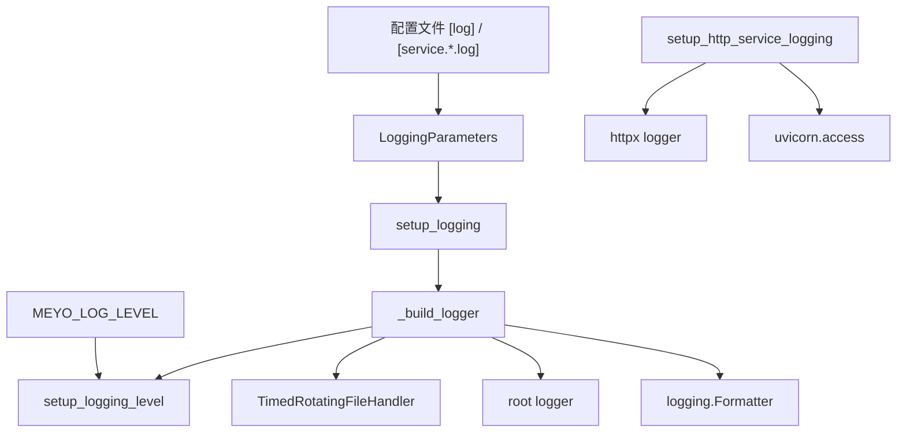

### Logging 初始化顺序

Webserver 一体化启动时，日志初始化顺序是：

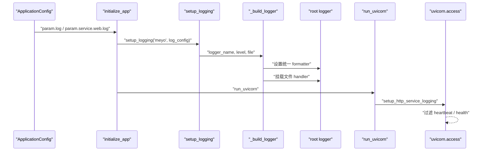

具体入口：

| 组件 | 初始化位置 | 默认日志文件 |
| --- | --- | --- |
| Webserver | `meyo_app/meyo_server.py::initialize_app()` | `logs/meyo_webserver.log` |
| API Server | `model/cluster/apiserver/api.py::initialize_apiserver()` | `logs/meyo_model_apiserver.log` |
| Worker Manager | `model/cluster/worker/manager.py` | `logs/meyo_model_worker_manager.log` |
| Controller | `model/cluster/controller/controller.py` | `logs/meyo_model_controller.log` |

### Logging 配置对象

`LoggingParameters` 是统一配置入口：

```python
@dataclass
class LoggingParameters(BaseParameters):
    level: Optional[str] = "${env:MEYO_LOG_LEVEL:-INFO}"
    file: Optional[str] = None

    def get_real_log_file(self) -> Optional[str]:
        if self.file:
            return resolve_root_path(self.file)
        return None
```

设计要点：

1. `level` 支持 `${env:MEYO_LOG_LEVEL:-INFO}`，可以从环境变量控制。
2. `file` 支持相对路径，最终通过 `resolve_root_path()` 转成项目路径。
3. 全局 `log` 和服务局部 `log` 都复用同一个配置类。
4. 各组件可以传入自己的默认日志文件，避免配置为空时没有落盘。

### Handler 构建策略

`_build_logger()` 做了四件事：

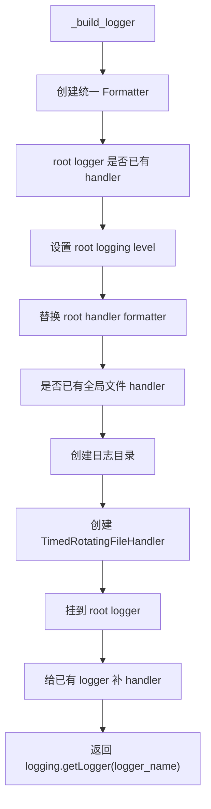

这里有一个全局变量：

```python
handler = None
```

它用于避免重复创建文件 handler。第一次调用 `setup_logging()` 时创建文件 handler，后续组件复用同一个 handler。

这个设计的好处：

1. 多个模块使用同一套 formatter。
2. 避免重复 handler 导致日志重复打印。
3. 已经存在的 logger 也会补上文件 handler。

需要注意：

1. 单进程内这个设计简单有效。
2. 多进程部署时，每个进程都会有自己的 handler，需要确认文件写入策略。
3. 当前全局 handler 只能代表一个主要日志文件，后续如果要每个组件严格分文件，需要调整 handler 管理结构。

### HTTP 日志结构

HTTP 日志不是通过业务 logger 打印，而是由 uvicorn 自己打印：

```text
uvicorn.access
```

Meyo 只做两件事：

1. 保留 uvicorn 默认访问日志。
2. 给高频路径加过滤器。

代码结构：

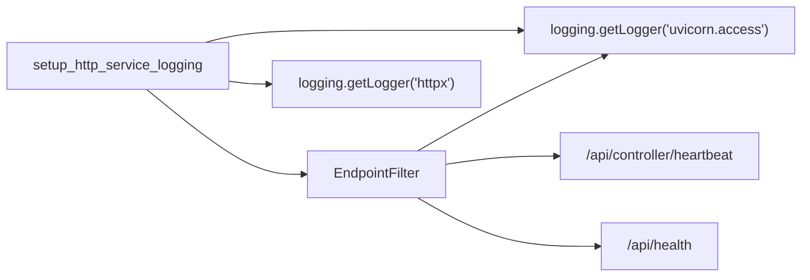

`httpx` 会被设置成 `WARNING`，避免外部 HTTP 客户端输出太多低价值日志。

## Tracer 代码结构设计

Tracer 相关代码集中在 `meyo.util.tracer` 包下。

```text
packages/meyo-core/src/meyo/util/tracer/
  __init__.py
  base.py
  tracer_impl.py
  span_storage.py
  tracer_middleware.py
  opentelemetry.py
```

### Tracer 文件职责

| 文件 | 职责 |
| --- | --- |
| `__init__.py` | 对外导出 `root_tracer`、`trace`、`initialize_tracer` 等公共 API |
| `base.py` | 定义 `Span`、`SpanType`、`Tracer`、`SpanStorage` 抽象 |
| `tracer_impl.py` | 默认 tracer 实现、全局 `root_tracer`、`trace()` 装饰器、初始化逻辑 |
| `span_storage.py` | 内存存储、文件存储、异步批量存储容器 |
| `tracer_middleware.py` | HTTP 中间件，解析请求里的 span id 并创建入口 span |
| `opentelemetry.py` | OpenTelemetry span storage 扩展 |

### Tracer 核心类图

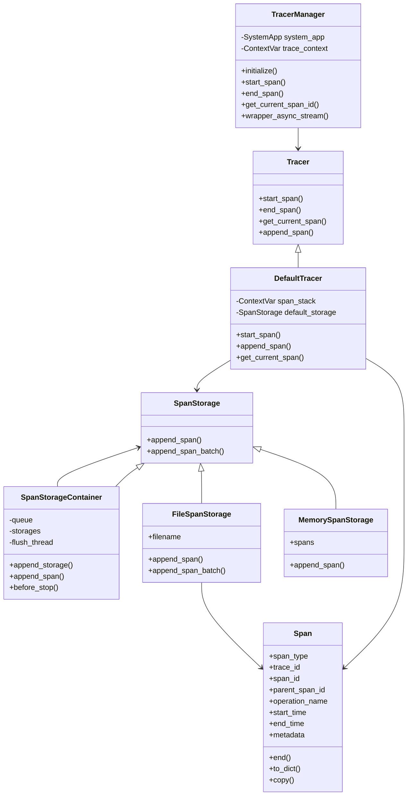

### Span 数据结构

`Span` 是 tracer 的最小数据单元。

```python
class Span:
    span_type: SpanType
    trace_id: str
    span_id: str
    parent_span_id: str | None
    operation_name: str | None
    start_time: datetime
    end_time: datetime | None
    metadata: dict | None
```

`span_id` 的格式是：

```text
{trace_id}:{span_id}
```

例如：

```text
498c9695a977feda94fc1fbfdd6ef59e:9cf3ca10fe5aef5f
```

这样做的好处是：

1. 单个字符串就能携带 trace id 和当前 span id。
2. 跨 HTTP 请求传递时可以直接放到 header 或 body。
3. 子 span 可以从父 span id 中解析 trace id，保证链路归属一致。

### TracerManager 的定位

`root_tracer` 是全局入口：

```python
root_tracer: TracerManager = TracerManager()
```

业务代码不直接依赖 `DefaultTracer`，而是依赖 `root_tracer`：

```python
with root_tracer.start_span("meyo.model.apiserver.create_chat_completion"):
    ...
```

这样做的好处：

1. 业务层不关心 tracer 是否已经初始化。
2. 未初始化时可以返回空 span，不阻塞业务执行。
3. 真实 tracer 可以通过 `SystemApp` 组件机制替换。
4. 后续接 OpenTelemetry 或自定义存储时，不需要改业务调用点。

### Tracer 初始化流程

`initialize_tracer()` 负责把 tracer 注册进 `SystemApp`。

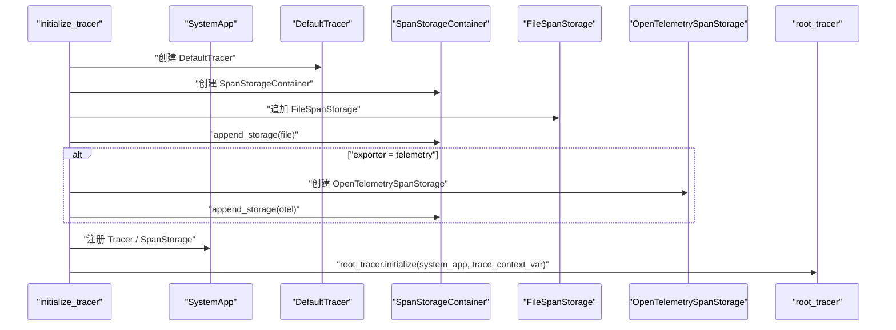

初始化后：

1. `root_tracer.start_span()` 可以拿到 `SystemApp` 中的 `Tracer`。
2. `DefaultTracer` 创建 span。
3. `SpanStorageContainer` 负责把 span 写入多个 storage。
4. `FileSpanStorage` 把 span 写到 JSONL 文件。

### Span 写入流程

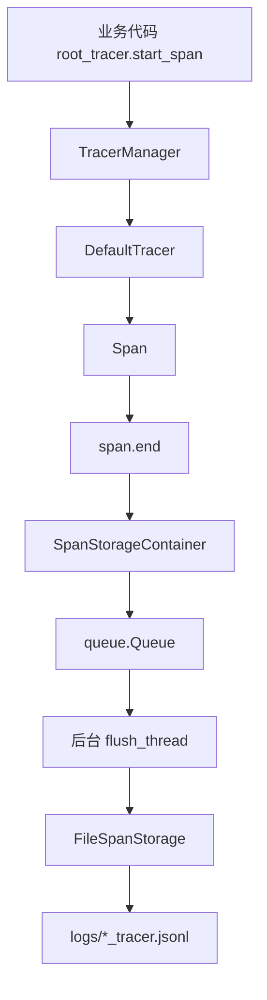

关键设计点：

1. `DefaultTracer.start_span()` 会创建 span，并把 span 放入当前协程上下文栈。
2. span 结束时通过 `add_end_caller()` 回调写入 storage。
3. `SpanStorageContainer` 不直接同步写文件，而是先进入队列。
4. 后台线程按 `batch_size` 或 `flush_interval` 批量 flush。
5. 文件写入格式是 JSONL，方便后续按 trace id 检索。

### ContextVar 上下文设计

Tracer 使用 `ContextVar` 保存当前请求的 span 上下文：

```python
self._span_stack_var = ContextVar("span_stack", default=[])
self._trace_context_var = ContextVar("trace_context", default=TracerContext())
```

用途：

| ContextVar | 作用 |
| --- | --- |
| `span_stack` | 保存当前调用栈里的 span，支持嵌套 span |
| `trace_context` | 保存从 HTTP 请求解析出的父 span id |

为什么不用全局变量：

1. Web 服务是并发执行的。
2. 不同请求不能互相污染 span。
3. `ContextVar` 可以在 async 调用链里保持请求级上下文。

### HTTP TraceIDMiddleware

`TraceIDMiddleware` 的职责是从 HTTP 请求中恢复父 span：

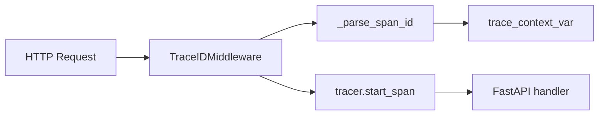

它默认只处理 `/api` 前缀，并排除：

```text
/api/controller/heartbeat
/api/health
```

这样静态页面、健康检查、心跳不会产生大量无意义 span。

### trace 装饰器

`trace()` 是函数级 tracing 的便捷入口：

```python
@trace()
async def chat_completion_generate(...):
    ...
```

它做三件事：

1. 自动解析 operation name。
2. 自动提取函数参数作为 metadata。
3. 自动用 `with root_tracer.start_span(...)` 包住函数执行。

参数提取逻辑会默认排除：

```python
self
cls
```

这样可以避免把大型对象直接塞进 metadata。

### Tracer 存储扩展点

Tracer 的扩展点是 `SpanStorage`：

```python
class SpanStorage(BaseComponent, ABC):
    def append_span(self, span: Span):
        ...

    def append_span_batch(self, spans: List[Span]):
        ...
```

当前已有实现：

| Storage | 作用 |
| --- | --- |
| `MemorySpanStorage` | 内存里保存 span，适合测试和临时查询 |
| `FileSpanStorage` | 写入本地 JSONL 文件 |
| `SpanStorageContainer` | 聚合多个 storage，批量异步写入 |
| `OpenTelemetrySpanStorage` | 可选导出到 OpenTelemetry |

新增存储时，只需要实现：

```python
class MySpanStorage(SpanStorage):
    def append_span(self, span: Span):
        ...
```

然后在配置里指定：

```toml
[trace]
tracer_storage_cls = "your.package.MySpanStorage"
```

### Logging 与 Tracer 的代码边界

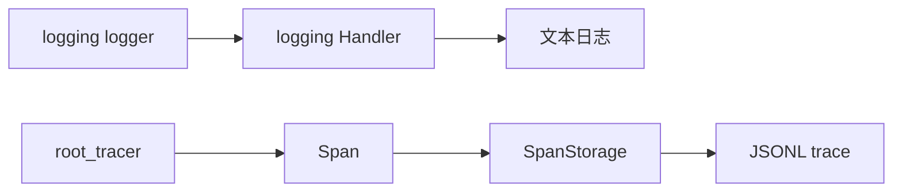

二者边界非常清楚：

| 能力 | 使用入口 | 输出 |
| --- | --- | --- |
| Logging | `logger.info()` / `logger.warning()` / `logger.error()` | 控制台和 `.log` 文本文件 |
| Tracer | `root_tracer.start_span()` / `@trace()` | `*_tracer.jsonl` 结构化 span |

不要把 tracer 当日志用，也不要用普通日志模拟调用链。

推荐方式：

1. 需要人读的过程信息，用 logging。
2. 需要跨模块关联和耗时分析，用 tracer。
3. 一条关键请求通常两者都需要。

## 整体架构

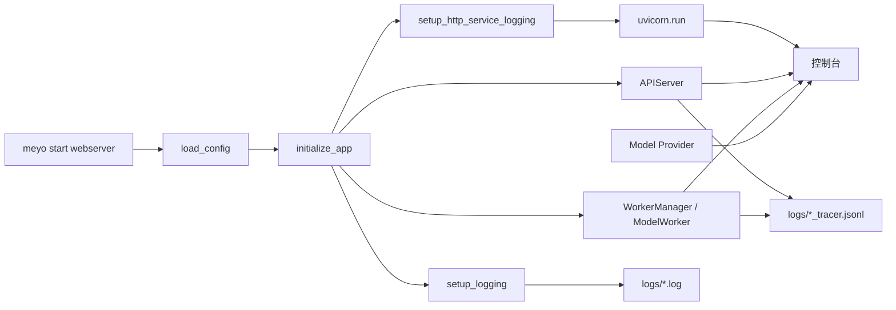

## 启动链路

Webserver 启动入口在 `meyo_app/meyo_server.py`。

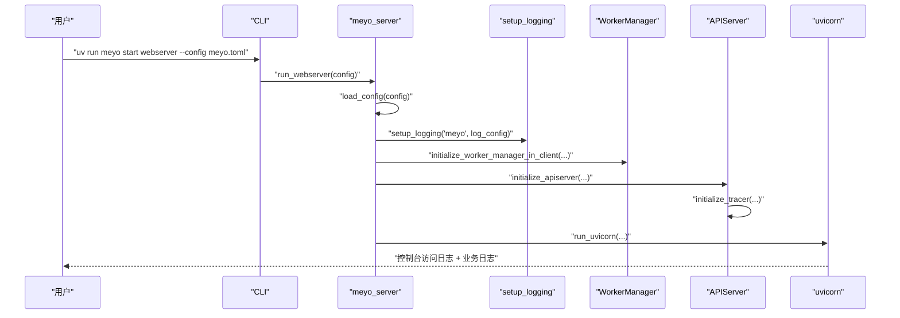

启动过程中有三个关键点：

1. `initialize_app()` 先调用 `setup_logging("meyo", ...)`，设置项目业务日志格式。
2. `initialize_worker_manager_in_client()` 和 `initialize_apiserver()` 会继续初始化模型服务、API 服务和 tracer。
3. `run_uvicorn()` 在启动前调用 `setup_http_service_logging()`，调整 HTTP 访问日志过滤规则。

## 控制台日志格式

业务日志格式定义在 `meyo/util/utils.py` 的 `_build_logger()`：

```python
logging.Formatter(
    fmt="%(asctime)s | %(levelname)s | %(name)s | %(message)s",
    datefmt="%Y-%m-%d %H:%M:%S",
)
```

所以业务日志长这样：

```text
2026-04-25 10:55:44 | INFO | meyo.model.proxy.llms.chatgpt | Send request to openai, payload: ...
```

字段含义：

| 字段 | 示例 | 含义 |
| --- | --- | --- |
| `asctime` | `2026-04-25 10:55:44` | 日志时间 |
| `levelname` | `INFO` | 日志等级 |
| `name` | `meyo.model.proxy.llms.chatgpt` | logger 名称，通常等于模块路径 |
| `message` | `Send request to openai...` | 业务消息 |

所有模块推荐这样创建 logger：

```python
import logging

logger = logging.getLogger(__name__)
```

这样日志里的 `name` 就会自动显示模块路径，便于定位代码。

## 文件日志

`setup_logging()` 支持文件日志：

```python
setup_logging(
    "meyo",
    log_config,
    default_logger_filename=os.path.join(LOGDIR, "meyo_webserver.log"),
)
```

文件 handler 使用：

```python
logging.handlers.TimedRotatingFileHandler(
    logger_filename,
    when="D",
    utc=True,
    encoding="utf-8",
)
```

含义：

| 设计 | 说明 |
| --- | --- |
| 每日滚动 | `when="D"`，按天切分日志文件 |
| UTF-8 | 中文 prompt、模型输出、错误信息不会乱码 |
| 全局 handler | 第一次初始化后复用同一个文件 handler |
| 目录自动创建 | 日志目录不存在时自动 `os.makedirs` |

默认文件通常在：

```text
logs/meyo_webserver.log
logs/meyo_model_apiserver.log
logs/meyo_model_worker_manager.log
logs/meyo_model_controller.log
```

具体文件名由不同启动组件传入的 `default_logger_filename` 决定。

## 配置结构

应用配置里有全局日志配置：

```toml
[log]
level = "${env:MEYO_LOG_LEVEL:-INFO}"
file = "logs/meyo.log"
```

服务也可以有局部日志配置，例如：

```toml
[service.web.log]
level = "INFO"
file = "logs/meyo_webserver.log"

[service.model.api.log]
level = "INFO"
file = "logs/meyo_model_apiserver.log"

[service.model.worker.log]
level = "INFO"
file = "logs/meyo_model_worker_manager.log"
```

优先级：

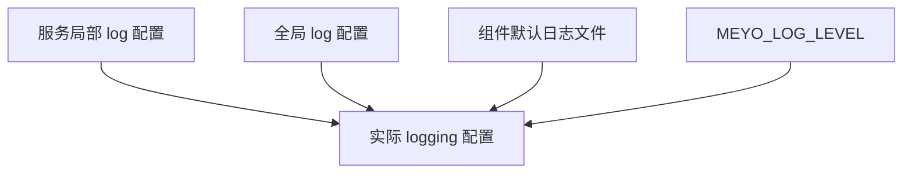

实际读取逻辑：

1. 如果组件有局部 `log`，优先使用局部配置。
2. 如果局部 `log` 为空，使用全局 `log`。
3. 如果没有显式配置日志文件，使用组件传入的默认文件名。
4. 日志等级默认从 `MEYO_LOG_LEVEL` 读取，未设置时是 `INFO`。

## HTTP 访问日志

HTTP 访问日志来自 `uvicorn.access`：

```text
INFO:     127.0.0.1:55284 - "GET / HTTP/1.1" 200 OK
```

项目没有重写 uvicorn 的访问日志格式，只做了过滤：

```python
setup_http_service_logging()
```

默认过滤掉：

```text
/api/controller/heartbeat
/api/health
```

原因是心跳和健康检查频率高，如果不滤掉，会冲掉真正有价值的业务日志。

过滤器是 `EndpointFilter`：

```python
class EndpointFilter(logging.Filter):
    def filter(self, record):
        return record.getMessage().find(self._path) == -1
```

## 业务日志从哪里来

业务日志是代码里主动写的。

例如 Controller 查询模型实例：

```text
2026-04-25 10:55:35 | INFO | meyo.model.cluster.controller.controller | Get all instances with None, healthy_only: True
```

它用于确认模型注册表是否查到了实例。

例如 Chat Provider 请求：

```text
2026-04-25 10:55:44 | INFO | meyo.model.proxy.llms.chatgpt | Send request to openai, payload: ...
```

它用于确认最终发给供应商的 payload。

例如 Embedding Worker：

```text
2026-04-25 11:03:53 | INFO | meyo.model.cluster.worker.embedding_worker | Receive embeddings request, model: Qwen/Qwen3-Embedding-8B
```

它用于确认请求已经走到了 `text2vec` worker。

## 模型推理日志

LLM 推理日志由 `model/cluster/worker/default_worker.py` 输出。

关键内容包括：

| 内容 | 作用 |
| --- | --- |
| `llm_adapter` | 当前请求选中了哪个模型适配器 |
| `model prompt` | 最终传给模型的 prompt |
| `async generate stream output` | 流式输出开始位置 |
| `full stream output` | 完整模型输出 |
| `model generate_stream params` | 模型调用参数 |
| `Model Inference Metrics` | 首 token 延迟、速度、token 用量 |

推理指标由 `ModelInferenceMetrics.to_printable_string()` 格式化：

```text
=== Model Inference Metrics ===

▶ Latency:
  • First Token Latency: 1.863s

▶ Speed:
  • Prefill Speed: N/A
  • Decode Speed: 45.12 tokens/s

▶ Tokens:
  • Prompt Tokens: 7
  • Completion Tokens: 205
  • Total Tokens: 212
```

这部分不是 uvicorn 提供的，而是模型 worker 在拿到模型输出和 usage 后自己统计、自己打印。

## 链路追踪

日志系统旁边还有一套独立的 tracer。

普通日志适合人读，tracer 适合机器分析调用链。

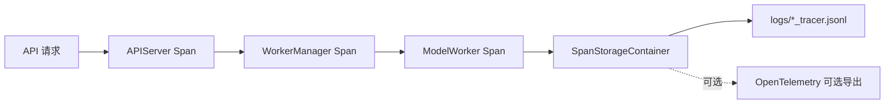

核心对象：

| 对象 | 职责 |
| --- | --- |
| `root_tracer` | 全局 tracer 管理器 |
| `DefaultTracer` | 创建 trace/span，维护当前上下文 |
| `Span` | 单个调用片段，包含 trace_id、span_id、operation_name、metadata |
| `SpanStorageContainer` | 批量异步写入多个存储 |
| `FileSpanStorage` | 写入 JSONL trace 文件 |
| `TraceIDMiddleware` | 从 HTTP 请求里解析 span id，串起请求上下文 |

span 文件是 JSONL，一行一个 span：

```json
{
  "span_type": "base",
  "trace_id": "498c9695a977feda94fc1fbfdd6ef59e",
  "span_id": "498c9695a977feda94fc1fbfdd6ef59e:9cf3ca10fe5aef5f",
  "parent_span_id": null,
  "operation_name": "meyo.model.apiserver.create_chat_completion",
  "start_time": "2026-04-25 10:55:44.123",
  "end_time": "2026-04-25 10:55:51.456",
  "metadata": {
    "model": "Pro/zai-org/GLM-5.1"
  }
}
```

## 日志和 Tracer 的区别

| 对比项 | 日志 | Tracer |
| --- | --- | --- |
| 目标 | 给人看 | 给调用链分析用 |
| 数据形态 | 文本 | JSONL 结构化 span |
| 记录方式 | `logger.info()` | `root_tracer.start_span()` |
| 典型内容 | 请求、模型、输出、错误 | trace_id、span_id、operation、metadata |
| 查询方式 | grep / tail | 按 trace_id 聚合 |

二者是互补关系：

```text
日志回答：发生了什么？
Tracer 回答：这个请求经历了哪些步骤，每一步耗时多少？
```

## 请求日志链路

一次非流式聊天请求的日志链路如下：

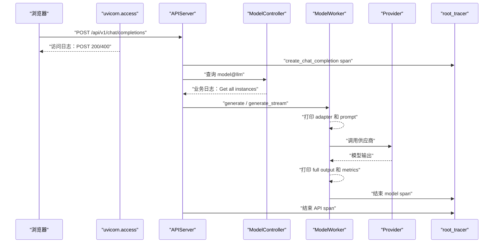

一次向量请求的日志链路如下：

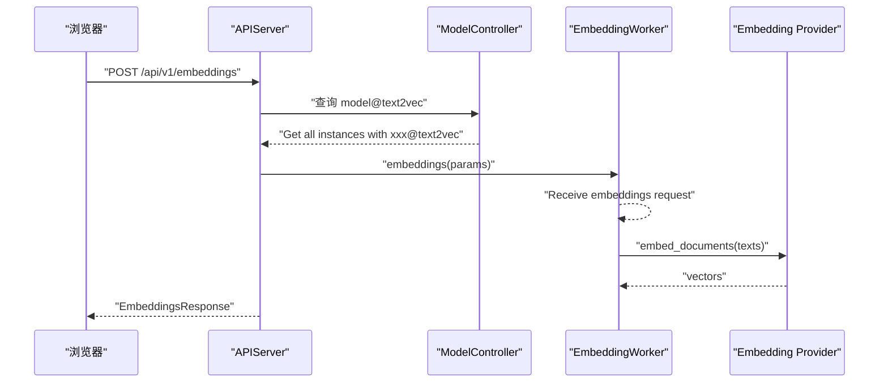

## 为什么日志看起来清楚

主要有四个原因：

1. 统一业务日志格式：时间、级别、模块、消息固定顺序。
2. 模块 logger 使用 `__name__`：日志天然带完整模块路径。
3. 模型 worker 在关键节点主动打印：adapter、prompt、输出、metrics 都能看到。
4. uvicorn 访问日志和业务日志同时保留：既能看 HTTP 状态，也能看内部执行。

## 开发规范

新增模块时，统一这样写：

```python
import logging

logger = logging.getLogger(__name__)
```

推荐日志等级：

| 等级 | 使用场景 |
| --- | --- |
| `DEBUG` | 细节调试、内部变量、低频排查 |
| `INFO` | 请求入口、模型选择、关键调用、启动状态 |
| `WARNING` | 可恢复异常、配置降级、外部服务短暂异常 |
| `ERROR` | 请求失败、模型调用失败、不可恢复错误 |

日志内容建议：

1. 写清楚当前模块正在做什么。
2. 模型请求要记录 `model`、`worker_type`、provider。
3. 外部 API 请求可以记录 payload 结构，但不要记录密钥。
4. 大模型输出可以在开发阶段记录，生产环境应考虑脱敏和截断。
5. 高频日志要加过滤或降低等级，避免影响性能。

## 敏感信息处理

当前日志里可能包含：

| 内容 | 风险 |
| --- | --- |
| prompt | 可能包含用户隐私 |
| full stream output | 可能包含业务数据 |
| provider payload | 可能包含请求参数 |
| trace metadata | 可能包含输入文本 |

必须避免记录：

```text
api_key
Authorization
password
secret
token
```

建议后续增加统一脱敏函数：

```python
SENSITIVE_KEYS = {"api_key", "authorization", "password", "secret", "token"}
```

所有 payload 进入日志前统一递归清洗。

## 扩展：给 Embedding 增加耗时日志

如果要定位向量请求为什么慢，可以在 embedding provider 层增加耗时日志：

```python
import logging
import time

logger = logging.getLogger(__name__)

start = time.perf_counter()
response = requests.post(...)
elapsed = time.perf_counter() - start
logger.info(
    "SiliconFlow embedding request finished, model=%s, texts=%s, elapsed=%.3fs",
    self.model_name,
    len(batch_texts),
    elapsed,
)
```

同时在 API 层增加总耗时：

```python
start = time.perf_counter()
...
logger.info(
    "Embedding request finished, model=%s, inputs=%s, elapsed=%.3fs",
    request.model,
    len(texts),
    time.perf_counter() - start,
)
```

这样可以直接区分：

```text
API 总耗时慢，但 provider 耗时不慢 -> Meyo 内部调度问题
provider 耗时本身慢 -> 供应商接口或网络问题
```

## 扩展：接入 OpenTelemetry

`TracerParameters` 已经预留 OpenTelemetry：

```toml
[trace]
exporter = "telemetry"
otlp_endpoint = "${env:OTEL_EXPORTER_OTLP_TRACES_ENDPOINT}"
otlp_insecure = "${env:OTEL_EXPORTER_OTLP_TRACES_INSECURE:-true}"
otlp_timeout = "${env:OTEL_EXPORTER_OTLP_TRACES_TIMEOUT:-10}"
```

初始化时如果 `exporter = "telemetry"`，会额外注册 `OpenTelemetrySpanStorage`。

这意味着当前架构可以从本地 JSONL trace 平滑扩展到远程观测平台。

## 复刻实现顺序

如果从零复刻这套日志系统，建议按下面顺序开发：

1. 定义 `LoggingParameters`：支持 `level`、`file`。
2. 实现 `setup_logging_level()`：统一日志等级。
3. 实现 `setup_logging()`：统一 formatter、文件 handler、目录创建。
4. 接入 webserver 启动链路：在 app 初始化时调用 `setup_logging()`。
5. 接入 uvicorn 访问日志：保留 `uvicorn.access`，增加健康检查过滤。
6. 所有模块统一 `logging.getLogger(__name__)`。
7. 在 Controller、API、Worker、Provider 关键节点补 `logger.info()`。
8. 实现 `ModelInferenceMetrics`：封装首 token、速度、token 统计。
9. 实现 `Span`、`Tracer`、`root_tracer`。
10. 实现 `FileSpanStorage`：JSONL 文件落盘。
11. API 和 Worker 链路接入 `root_tracer.start_span()`。
12. 后续再接 OpenTelemetry 或其它日志平台。

## 当前限制

当前实现已经能支撑开发调试，但还有几个后续优化点：

1. prompt 和 full output 默认打印较完整，生产环境需要脱敏和截断策略。
2. provider 请求耗时还没有统一打点，需要按 provider 补齐。
3. `setup_logging()` 使用全局 handler，未来多进程部署时要确认文件写入策略。
4. uvicorn 访问日志格式仍是默认格式，暂未统一成业务日志的 `时间 | 级别 | 模块 | 消息` 格式。
5. trace 文件是本地 JSONL，查询能力需要额外工具或接入观测平台。

## 总结

Meyo 当前日志系统由四块组成：

```text
Python logging 封装
+ uvicorn HTTP 访问日志
+ 模型推理指标日志
+ root_tracer 链路追踪
```

这就是为什么启动后既能看到：

```text
INFO: 127.0.0.1 - "POST /api/v1/chat/completions" 200 OK
```

也能看到：

```text
2026-04-25 10:55:44 | INFO | meyo.model.proxy.llms.chatgpt | Send request to openai...
```

HTTP 日志负责告诉你请求是否成功，业务日志负责告诉你内部执行到哪里，推理指标负责告诉你模型性能，trace 文件负责让你按调用链复盘请求。
