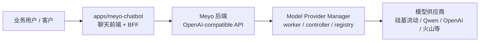
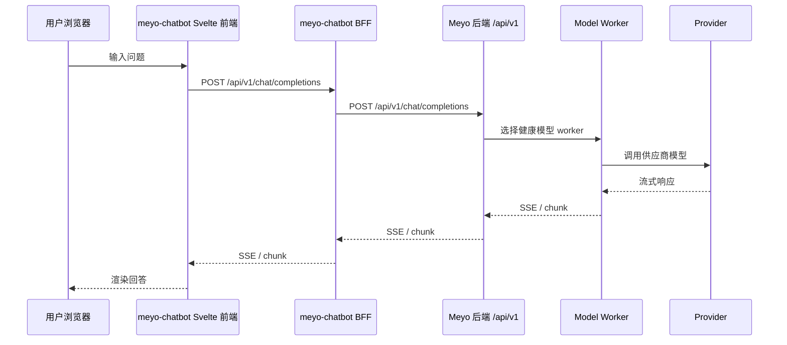

# Meyo Chatbot 迁移与改造设计

本文按开发者迁移视角记录 `apps/meyo-chatbot`：先说明为什么放在 `apps/`，再说明当前保留了什么、已经改了什么、还没有接上什么，最后给出下一步改造顺序。

这不是产品宣传文档，也不是说当前已经完成了 Meyo Chatbot 的最终集成。当前阶段更准确的描述是：

```text
先把聊天前端项目完整迁进 mono repo，保留它能跑的结构；
再找到最小接入点，也就是 OpenAI-compatible 上游；
后面再逐步把模型、用户、会话、文件、知识库收敛到 Meyo 后端。
```

一句话定位：

```text
meyo-chatbot 是给业务和客户使用的独立聊天前端，不是 Meyo 后端源码的一部分。
```

它可以保留自己的前端、BFF、会话、权限和聊天工作台能力，但 AI Chat、模型 provider、embedding、rerank、RAG 编排等后端模型能力最终都应该由 Meyo 后端提供。

## 0. 开发者故事线

这次迁移的开发顺序应该这样理解：

```text
1. 先确定项目边界
   meyo-chatbot 是客户聊天前端，放在 apps/，不放进 packages/meyo-app。

2. 再保留原项目结构
   先不重写 Svelte 页面，也不急着拆 BFF，否则会同时破坏登录、会话、模型选择和流式输出。

3. 接着找最小可验证链路
   当前最小链路是：前端 -> chatbot BFF -> Meyo /api/v1/chat/completions。

4. 先只切模型入口
   provider、worker、模型类型过滤都交给 Meyo 后端，chatbot 只当消费方。

5. 最后再收敛长期能力
   用户、权限、会话、文件、知识库、admin 页面拆分，等聊天链路稳定后再迁。
```

所以 review 这篇文档时，不要先看“功能有多少”，应该先看“边界有没有守住、最小链路能不能跑、后续哪些能力还没有收敛”。

## 1. 项目定位

`meyo-chatbot` 的目标不是重新开发一个聊天页面，而是把已有聊天应用迁移进当前 mono repo，作为独立应用继续演进。

它的定位是：

| 维度 | 说明 |
|---|---|
| 面向用户 | 业务用户、客户、外部使用者 |
| 产品形态 | 独立聊天前端应用 |
| 部署边界 | 可以独立构建、独立部署、独立升级 |
| 后端依赖 | 调用 Meyo 提供的 OpenAI-compatible API 和后续业务 API |
| 不承担职责 | 不承担 Meyo model worker manager、provider manager、存储网关、业务管理后台职责 |

这个项目和未来 admin 管理平台是两个不同前端：

| 项目 | 定位 |
|---|---|
| `apps/meyo-chatbot` | 客户聊天前端，关注对话体验、模型选择、知识引用、文件上传、历史会话 |
| admin 管理平台 | 运营和管理前端，关注租户、用户、provider、计费、权限、知识库管理、审计 |
| `packages/meyo-app` | Meyo 后端应用装配层，负责启动后端服务，不承载聊天前端源码 |

## 2. 边界设计

推荐的渐进式边界如下：



这里的关键约束是：

1. `meyo-chatbot` 不直接内嵌到 `packages/meyo-app`。
2. `meyo-chatbot` 可以先保留自己的 BFF，避免一次性重写所有 Svelte 页面。
3. 模型调用统一经过 Meyo 后端，避免客户前端直接散落各种 provider key。
4. 聊天前端只消费模型、文件、知识库、会话等 API，不拥有 provider 管理能力。

## 3. 当前目录结构

当前项目在 mono repo 中的位置：

```text
apps/meyo-chatbot/
  package.json
  pyproject.toml
  Dockerfile
  docker-compose.yaml
  src/
    app.html
    app.css
    routes/
      +layout.svelte
      (app)/
        +page.svelte
        admin/
        home/
        workspace/
        playground/
        notes/
        automations/
        calendar/
      auth/
      error/
      s/
      watch/
    lib/
      apis/
      components/
        chat/
        workspace/
        admin/
        layout/
        common/
      stores/
      i18n/
      utils/
      workers/
  backend/
    open_webui/
      main.py
      env.py
      config.py
      routers/
      models/
      internal/
      retrieval/
      socket/
      storage/
      utils/
      static/
      frontend/
```

不应该把下面这些本地或生成内容当成迁移设计的一部分：

| 路径 | 说明 |
|---|---|
| `.venv/` | 本地 Python 虚拟环境 |
| `.svelte-kit/` | SvelteKit 构建缓存 |
| `build/` | 前端构建产物 |
| `__pycache__/` | Python 缓存 |
| `backend/open_webui/data/` | 本地运行数据、上传文件、向量库缓存 |
| `.env` | 本地开发环境变量 |
| `.webui_secret_key` | 本地密钥文件 |

## 4. 已有功能

### 4.1 前端已有功能

`src/` 是 SvelteKit 前端，当前已经具备完整聊天产品能力：

| 能力 | 主要位置 | 说明 |
|---|---|---|
| 登录注册 | `src/routes/auth/` | 支持登录、注册、OAuth/LDAP 等后端能力的页面入口 |
| 聊天首页 | `src/routes/(app)/+page.svelte` | 主聊天入口 |
| 聊天组件 | `src/lib/components/chat/` | 消息列表、输入框、模型选择、聊天控制、文件引用 |
| 工作区 | `src/routes/(app)/workspace/`、`src/lib/components/workspace/` | Knowledge、Models、Prompts、Skills、Tools |
| 管理页面 | `src/routes/(app)/admin/`、`src/lib/components/admin/` | 用户、设置、函数、评估、分析等管理能力 |
| Playground | `src/routes/(app)/playground/` | 模型和接口调试页面 |
| Notes / Calendar / Automations | `src/routes/(app)/notes/` 等 | 协作和辅助功能 |
| 多语言 | `src/lib/i18n/` | 前端国际化资源 |
| PWA / 静态资源 | `src/app.html`、`static/` | 浏览器入口、图标、manifest |

这些能力说明 `meyo-chatbot` 不只是一个简单聊天输入框，而是一个完整聊天工作台。

### 4.2 后端已有功能

`backend/open_webui/` 是 FastAPI BFF 和服务端能力层，当前已有能力包括：

| 能力 | 主要位置 | 说明 |
|---|---|---|
| FastAPI 应用装配 | `backend/open_webui/main.py` | 注册中间件、路由、静态资源、生命周期任务 |
| 环境变量和日志 | `backend/open_webui/env.py` | 读取 `.env`、设置日志、配置运行环境 |
| 持久配置 | `backend/open_webui/config.py` | 配置表、配置加载和运行时配置保存 |
| OpenAI 兼容代理 | `backend/open_webui/routers/openai.py` | 转发 OpenAI-compatible `/models`、chat、embedding 等请求 |
| Ollama 代理 | `backend/open_webui/routers/ollama.py` | 保留 Ollama 兼容入口 |
| 聊天和会话 | `routers/chats.py`、`models/chats.py` | 会话、消息、分享、历史记录 |
| 用户和权限 | `routers/auths.py`、`routers/users.py`、`models/users.py` | 用户、角色、登录、认证 |
| 文件和知识库 | `routers/files.py`、`routers/knowledge.py`、`retrieval/` | 上传、解析、检索、向量库适配 |
| 工具和函数 | `routers/tools.py`、`routers/functions.py` | BYOF、工具调用和扩展能力 |
| WebSocket | `socket/` | 实时事件、会话池、在线状态、模型刷新 |
| 数据库 | `internal/`、`migrations/` | SQLAlchemy、迁移、SQLite/PostgreSQL 兼容能力 |

## 5. 当前已经完成的迁移和改造

先把范围说清楚：当前完成的是“迁入和接入准备”，不是“最终 Meyo-only 聊天前端”。

### 5.1 独立应用目录已经落位

`apps/meyo-chatbot` 已经作为独立 app 放入 mono repo，保留了前端、后端、Docker、脚本、依赖锁文件和静态资源。

这一步完成的是项目边界迁移：

```text
外部聊天项目
-> apps/meyo-chatbot
-> 独立 package / pyproject / Docker / 前后端目录继续保留
```

### 5.2 包名和启动入口已经开始 Meyo 化

当前已经看到这些 Meyo 化内容：

| 文件 | 已完成内容 |
|---|---|
| `apps/meyo-chatbot/package.json` | 前端 package 名称为 `meyo-chatbot` |
| `apps/meyo-chatbot/pyproject.toml` | Python project 名称为 `meyo-chatbot` |
| `apps/meyo-chatbot/pyproject.toml` | 提供 `meyo-chatbot = "open_webui:app"` 命令入口 |
| `backend/open_webui/env.py` | 默认 `WEBUI_NAME` 为 `Meyo` |
| `backend/open_webui/main.py` | FastAPI title 为 `Meyo` |
| `src/app.html` | 浏览器标题为 `Meyo` |

这里还没有把 Python import namespace 从 `open_webui` 改成 `meyo_chatbot`。现阶段可以先保留原命名，减少迁移风险。

### 5.3 OpenAI-compatible 接入点已经具备

当前后端已经有成熟的 OpenAI-compatible 代理能力：

```text
backend/open_webui/routers/openai.py
backend/open_webui/main.py
```

它可以通过配置把 OpenAI-compatible 上游指向 Meyo 后端，例如后续可以配置为：

```text
OPENAI_API_BASE_URLS=http://127.0.0.1:5670/api/v1
OPENAI_API_KEYS=<meyo local key or empty placeholder>
ENABLE_OLLAMA_API=false
```

这意味着第一阶段不需要改 Svelte 聊天页面。先让现有 BFF 把聊天请求转发到 Meyo 后端，就能验证聊天链路。

### 5.4 原有功能暂时保留

当前保留了 OpenAI、Ollama、RAG、文件、知识库、工具、函数、admin、workspace、playground 等大量能力。

这是有意保守的迁移方式：

1. 先保证项目能独立运行。
2. 再把模型调用入口切到 Meyo。
3. 最后逐步删除不需要的 provider、RAG、admin 或本地后端能力。

## 6. 当前明确没有完成什么

这一段是为了避免 review 时误判当前状态。

| 未完成项 | 当前状态 | 为什么先不做 |
|---|---|---|
| 纯前端化 | 还没有把 BFF 删除 | BFF 里仍有登录、会话、文件、模型代理等关键能力 |
| Meyo 用户体系接入 | 还没有完成 | 需要先确定 token、租户、权限模型 |
| 会话数据迁到 Meyo | 还没有完成 | 会话表、消息表、分享、标签、文件引用需要单独设计 |
| 文件和知识库接到 Meyo | 还没有完成 | 上传、解析、向量库、检索结果格式还没统一 |
| admin 页面拆分 | 还没有完成 | 未来 admin 是独立管理平台，不应该默认混在客户聊天前端里 |
| Open WebUI 命名清理 | 还没有完成 | Python import namespace 大面积改名风险高，应该晚一点做 |
| Docker / env 模板收敛 | 还没有完成 | 需要等 Meyo 后端地址、鉴权、部署方式稳定 |

这个列表比“已经做了什么”更重要，因为它决定后续不能直接把 `meyo-chatbot` 当成最终客户生产前端使用。

## 7. 目标接入方式

### 7.1 第一阶段推荐方式

第一阶段推荐保留 `meyo-chatbot` 自己的 BFF，只把模型上游改成 Meyo 后端：



这样做的原因：

1. 前端不用立刻重写认证、会话、模型选择、聊天流式渲染。
2. Meyo 后端可以专注提供模型能力和业务 API。
3. 风险集中在配置和代理链路，而不是整个聊天产品重构。

### 7.2 第二阶段再决定是否拆掉 BFF

等 Meyo 后端具备完整用户、会话、文件、知识库和权限 API 后，再评估是否把 `meyo-chatbot` 改成纯前端。

纯前端模式要求 Meyo 后端补齐：

| 后端能力 | 说明 |
|---|---|
| 用户认证 | 登录、token、刷新、SSO、租户 |
| 会话存储 | chat、message、share、tag、folder |
| 文件上传 | 文件、图片、音频、解析状态 |
| 知识库 | collection、document、chunk、retrieval |
| 工具和函数 | tool registry、function registry、权限 |
| 前端配置 | UI 开关、默认模型、模型 pin、系统 prompt |

没有这些能力前，不建议直接删除 `meyo-chatbot` BFF。

## 8. 后续改造计划

### 8.1 本地配置和运行清理

需要把配置从本地散落文件收敛成明确模板：

| 任务 | 目标 |
|---|---|
| 整理 `.env.example` | 提供 Meyo 后端地址、是否启用 Ollama、是否启用本地 RAG 等变量 |
| 忽略 `.env` 和本地密钥 | 避免把本地开发 secret 提交 |
| 清理运行数据 | 明确 `data/`、db、cache、upload、vector_db 是否进入 gitignore |
| 保留 license 文件 | 迁移时继续遵守原项目 license 和 NOTICE 约束 |

### 8.2 模型入口改造

需要把聊天模型入口统一指向 Meyo：

| 任务 | 目标 |
|---|---|
| `OPENAI_API_BASE_URLS` 指向 Meyo `/api/v1` | 让聊天请求经过 Meyo 后端 |
| 关闭不需要的 Ollama | 避免客户前端显示本地 Ollama 能力 |
| 屏蔽非聊天模型 | embedding、rerank 不应该出现在聊天模型选择器 |
| 验证流式输出 | 确认 SSE 在 Chatbot BFF 和 Meyo 后端之间透传正常 |
| 统一错误结构 | Meyo 后端错误要能被前端 toast 和消息框识别 |

### 8.3 用户和权限改造

客户聊天前端最终需要接入 Meyo 的用户体系：

| 任务 | 目标 |
|---|---|
| 登录态对齐 | token、cookie、session、refresh 机制一致 |
| 租户隔离 | 不同客户只能看到自己的模型、知识库和会话 |
| 模型权限 | 模型列表按用户角色和租户过滤 |
| 操作审计 | 重要操作写入 Meyo 审计日志 |

### 8.4 会话和知识库改造

会话和知识库需要确认数据归属：

| 方向 | 说明 |
|---|---|
| 短期 | 继续使用 `meyo-chatbot` 自己的 DB 保存聊天历史 |
| 中期 | 文件上传和知识库检索逐步接到 Meyo 后端 |
| 长期 | 会话、文件、知识库、权限统一进入 Meyo 后端数据模型 |

### 8.5 Admin 能力拆分

当前 `meyo-chatbot` 内部仍保留 admin 页面。未来需要明确：

1. 客户聊天前端是否允许进入 admin 页面。
2. admin 管理平台是否另起独立 app。
3. `meyo-chatbot` 中的 admin 路由是删除、隐藏，还是只保留内部调试模式。

## 9. Review Map

快速 review 时优先看这些文件：

| 文件或目录 | 作用 | Review 重点 |
|---|---|---|
| `apps/meyo-chatbot/package.json` | 前端依赖和脚本 | package 名称、build、dev、check 命令 |
| `apps/meyo-chatbot/pyproject.toml` | Python 包和依赖 | package 名称、入口、optional dependencies |
| `apps/meyo-chatbot/src/routes/+layout.svelte` | 全局前端初始化 | config、model refresh、socket、direct connection |
| `apps/meyo-chatbot/src/routes/(app)/+page.svelte` | 聊天首页 | 聊天入口和默认状态 |
| `apps/meyo-chatbot/src/lib/components/chat/` | 聊天 UI 组件 | 模型选择、输入、消息渲染、流式输出 |
| `apps/meyo-chatbot/backend/open_webui/main.py` | FastAPI 主应用 | 路由注册、模型列表、chat completions |
| `apps/meyo-chatbot/backend/open_webui/routers/openai.py` | OpenAI 兼容代理 | 上游地址、请求头、流式透传、错误处理 |
| `apps/meyo-chatbot/backend/open_webui/env.py` | 环境变量 | WEBUI_NAME、日志、数据路径 |
| `apps/meyo-chatbot/backend/open_webui/config.py` | 持久配置 | DB 配置、运行时配置保存 |

## 10. 当前结论

`meyo-chatbot` 当前完成的是“独立聊天应用迁入 mono repo，并具备接入 Meyo 后端的基础入口”。

还没有完成的是“完全 Meyo-only 化”。后续改造顺序应该是：

```text
配置 Meyo OpenAI-compatible 上游
-> 验证聊天、模型列表、流式输出
-> 屏蔽不需要的本地 provider
-> 接入 Meyo 用户和权限
-> 接入 Meyo 文件、知识库和会话能力
-> 最后清理 Open WebUI 遗留命名和多余功能
```
