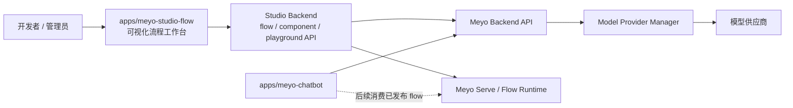
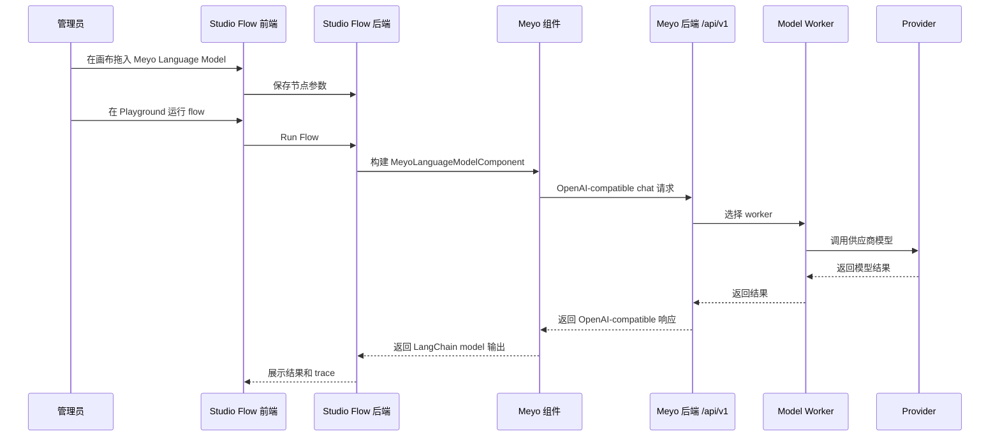
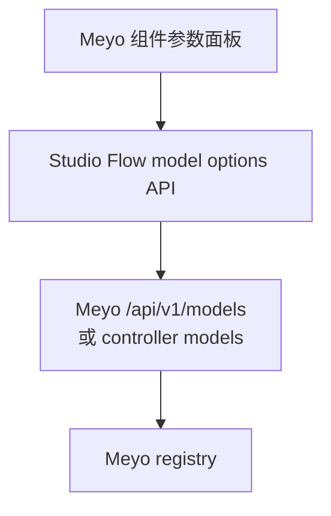
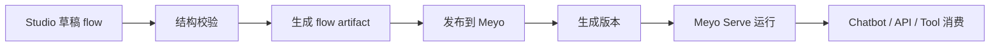

# Meyo Studio Flow 迁移与改造设计

本文按开发者迁移视角记录 `apps/meyo-studio-flow`：先说明它为什么是独立 Studio 项目，再说明当前保留了哪些能力、已经改了哪些地方、还没有和 Meyo 后端打通哪些链路。

这不是说当前已经完成了最终的 flow 平台。当前阶段更准确的描述是：

```text
先把可视化流程工作台完整迁进 mono repo；
保留它原来的画布、组件、运行、trace、SDK 结构；
先补 Meyo 模型组件和基础品牌改造；
后面再把模型列表、flow 发布、权限、trace、运行时收敛到 Meyo 后端。
```

一句话定位：

```text
meyo-studio-flow 是独立的可视化流程工作台，用来设计、测试、发布 AI workflow / agent flow。
```

它不是客户聊天前端，也不是 `packages/meyo-app` 的后端源码。它应该作为独立 Studio 应用存在，通过 API 使用 Meyo 的模型、知识库、工具、flow runtime 和观测能力。

## 0. 开发者故事线

这次迁移的开发顺序应该这样理解：

```text
1. 先保留 Studio 的完整工程
   画布、组件系统、后端 API、lfx、sdk 都先保留，否则很难判断后续改造破坏了哪里。

2. 再做最小 Meyo 化
   先改前端包名、Logo、局部中文文案，再补 Meyo Language / Embedding 组件。

3. 接着验证模型组件是否真的可用
   重点不是文件是否存在，而是组件能否被发现、能否出现在前端、能否调用 Meyo /api/v1。

4. 然后把模型列表交给 Meyo
   Studio 不应该自己维护 provider 列表，应从 Meyo registry / models API 读取。

5. 最后做 flow 发布和运行时收敛
   flow 的版本、权限、运行记录、trace，后续应由 Meyo 后端管理。
```

所以 review 这篇文档时，重点不是“迁进来了多少文件”，而是“可视化编辑仍能跑、Meyo 组件能被使用、后续发布链路有明确落点”。

## 1. 项目定位

`meyo-studio-flow` 面向的是开发者、内部运营、交付人员和后续 admin 管理平台中的高级用户。

它主要解决这些问题：

| 问题 | Studio Flow 的职责 |
|---|---|
| 如何可视化编排一个 AI 工作流 | 提供画布、节点、边、组件面板和 flow 结构 |
| 如何调试一个 flow | 提供 playground、运行结果、错误展示、trace 页面 |
| 如何复用模型和工具 | 通过组件系统接入模型、embedding、工具、知识库 |
| 如何把 flow 交给业务使用 | 后续发布到 Meyo 后端，成为 API、工具或 agent |

项目边界如下：

| 项目 | 职责 |
|---|---|
| `apps/meyo-studio-flow` | 可视化 flow 设计、调试、导入导出、组件编辑 |
| `apps/meyo-chatbot` | 客户聊天前端，消费后端模型和业务 API |
| admin 管理平台 | 运营管理、租户、权限、provider、计费、审计 |
| `packages/meyo-*` | Meyo 后端核心能力、模型 worker、provider、serve、storage |

## 2. 架构边界

推荐的目标架构：



这里的关键约束是：

1. Studio Flow 负责“设计和调试”，Meyo 后端负责“运行和治理”。
2. Studio Flow 可以保留自己的后端服务，但模型调用入口应统一指向 Meyo。
3. Flow 的发布、版本、权限、运行记录，后续应落到 Meyo 后端。
4. Chatbot 后续只消费发布后的 flow，不参与 flow 设计。

## 3. 当前目录结构

当前项目在 mono repo 中的位置：

```text
apps/meyo-studio-flow/
  package.json
  pyproject.toml
  Makefile
  deploy/
  docker/
  src/
    backend/
      base/
        langflow/
          main.py
          server.py
          api/
          components/
            Meyo/
              meyo_language_model.py
              meyo_embedding_model.py
          graph/
          schema/
          services/
          settings.py
      tests/
    frontend/
      package.json
      vite.config.mts
      src/
        assets/
          MeyoLogo.tsx
          meyo-icon-square.png
          meyo-logo-wide.png
          meyo-logo-wide-dark.png
        customization/
        pages/
          MainPage/
          FlowPage/
          Playground/
          StorePage/
          AdminPage/
          SignUpPage/
          DeleteAccountPage/
        components/
        controllers/
        locales/
          en.json
          zh-Hans.json
    lfx/
    sdk/
```

不应该把下面这些本地或生成内容当成迁移设计的一部分：

| 路径 | 说明 |
|---|---|
| `.venv/` | 本地 Python 虚拟环境 |
| `node_modules/` | 前端依赖安装目录 |
| `langflow.db`、`.langchain.db` | 本地开发数据库 |
| `__pycache__/` | Python 缓存 |
| `dist/`、`build/` | 前端或后端构建产物 |
| `.env` | 本地开发环境变量 |

## 4. 已有功能

### 4.1 后端已有功能

`src/backend/base/langflow/` 是 Studio Flow 后端核心，当前已有能力包括：

| 能力 | 主要位置 | 说明 |
|---|---|---|
| 服务启动 | `main.py`、`server.py`、`langflow_launcher.py` | 应用启动、路由挂载、生命周期管理 |
| API 路由 | `api/` | flows、folders、files、models、mcp、traces、workflow、knowledge_bases 等接口 |
| 组件系统 | `components/`、`interface/components.py` | 把 Python 组件暴露成前端可拖拽节点 |
| Flow 图结构 | `graph/`、`schema/graph.py` | 节点、边、运行图、序列化 |
| 运行和构建 | `interface/run.py`、`api/build.py` | 构建 flow、运行 flow、返回结果 |
| 事件和日志 | `events/`、`api/log_router.py` | 运行事件、日志输出 |
| 服务管理 | `services/` | manager、factory、依赖注入、服务生命周期 |
| 数据迁移 | `alembic/` | 数据库迁移和校验 |
| 配置 | `settings.py` | 应用配置和运行参数 |

### 4.2 前端已有功能

`src/frontend/` 是 React + Vite 前端，当前已有能力包括：

| 能力 | 主要位置 | 说明 |
|---|---|---|
| 首页和 flow 列表 | `pages/MainPage/` | flow/component 列表、搜索、菜单、导入导出 |
| Flow 画布 | `pages/FlowPage/` | 可视化节点编排、组件面板、画布控制 |
| Playground | `pages/Playground/` | 测试 flow 的输入输出 |
| Store | `pages/StorePage/` | 模板和组件市场入口 |
| Trace | `pages/FlowPage/components/TraceComponent/` | flow 运行观测和 span 展示 |
| 参数编辑 | `components/core/parameterRenderComponent/` | 节点参数表单、模型选择、工具输入 |
| 自定义扩展点 | `customization/` | 自定义 header、链接、上传、主题、路由、构建行为 |
| 多语言 | `locales/en.json`、`locales/zh-Hans.json` | 英文和中文语言包 |
| 品牌资源 | `assets/MeyoLogo.tsx`、Meyo 图片资源 | Meyo 标识和静态图片 |

### 4.3 SDK 和组件基础包

当前项目还保留了：

| 路径 | 说明 |
|---|---|
| `src/lfx/` | 组件系统、输入类型、基础模型、字段类型等基础能力 |
| `src/sdk/` | 后续给外部调用 Studio Flow API 的 SDK 边界 |

这些目录不应该在第一阶段删除。它们是可视化节点系统和组件运行的基础。

## 5. 当前已经完成的迁移和改造

先把范围说清楚：当前完成的是“迁入、品牌起步、Meyo 模型组件起步”，不是“完整 flow 平台接入 Meyo 后端”。

### 5.1 独立应用目录已经落位

`apps/meyo-studio-flow` 已经作为独立 app 放入 mono repo，保留了后端、前端、SDK、组件基础包、Docker、部署脚本和锁文件。

这一步完成的是项目边界迁移：

```text
外部 flow studio 项目
-> apps/meyo-studio-flow
-> 独立 React 前端 + Python 后端 + lfx 组件基础包 + sdk
```

### 5.2 前端包名和品牌资源已经开始 Meyo 化

当前已经看到这些 Meyo 化内容：

| 文件或目录 | 已完成内容 |
|---|---|
| `src/frontend/package.json` | 前端 package 名称为 `meyo-studio-flow` |
| `src/frontend/src/assets/MeyoLogo.tsx` | 增加 Meyo Logo React 组件 |
| `src/frontend/src/assets/meyo-icon-square.png` | 增加 Meyo 方形图标 |
| `src/frontend/src/assets/meyo-logo-wide.png` | 增加 Meyo 横版浅色 Logo |
| `src/frontend/src/assets/meyo-logo-wide-dark.png` | 增加 Meyo 横版深色 Logo |
| 登录/注册/删除账号页面 | 已经引用 `MeyoLogo` |
| `pages/Playground/index.tsx` | 页面标题默认使用 `Meyo Studio Flow` |

后端 `pyproject.toml` 当前仍保留 `name = "langflow"` 和 `langflow` 命令入口。这个命名还没有完成 Meyo 化，后续需要单独评估是否改包名。

### 5.3 Meyo 模型组件已经存在

当前已经有两个 Meyo 模型组件：

```text
apps/meyo-studio-flow/src/backend/base/langflow/components/Meyo/
  meyo_language_model.py
  meyo_embedding_model.py
```

它们的作用：

| 组件 | 能力 |
|---|---|
| `MeyoLanguageModelComponent` | 使用 `ChatOpenAI` 调用 Meyo 的 OpenAI-compatible chat API |
| `MeyoEmbeddingModelComponent` | 使用 `OpenAIEmbeddings` 调用 Meyo 的 embedding API |

当前默认配置入口：

| 环境变量 | 说明 |
|---|---|
| `MEYO_OPENAI_API_BASE_URL` | Meyo OpenAI-compatible API 地址，默认 `http://127.0.0.1:5670/api/v1` |
| `MEYO_OPENAI_API_KEY` | Meyo API key，本地不强制时可为空 |
| `MEYO_LANGUAGE_MODEL_NAME` | 默认聊天模型名 |
| `MEYO_DEFAULT_LANGUAGE_MODEL` | 聊天模型兜底名 |
| `MEYO_EMBEDDING_MODEL_NAME` | 默认 embedding 模型名 |

这一步说明 Studio Flow 已经有“通过 Meyo 使用模型”的组件入口。

但这里还要继续验证两件事：

| 验证点 | 原因 |
|---|---|
| 组件发现 | 文件存在不等于一定被组件加载器扫描到 |
| 前端可见性 | 后端组件能加载不等于前端组件面板一定能显示 |

后续 review 不能只看 `components/Meyo/` 是否有文件，还要实际启动 Studio Flow，确认画布里能拖出 Meyo Language Model 和 Meyo Embedding Model。

### 5.4 首页列表菜单已经做了 i18n 改造

当前这些文件已经从硬编码英文改为中英文语言包：

| 文件 | 已完成内容 |
|---|---|
| `pages/MainPage/components/dropdown/index.tsx` | Edit details、Export、Duplicate、Delete 改为 `t(...)` |
| `pages/MainPage/components/list/index.tsx` | 删除成功、删除失败、导出成功、更新时间改为 `t(...)` |
| `pages/MainPage/utils/time-elapse.ts` | 支持传入 i18n `TFunction`，输出年/月/日/小时/分钟文案 |
| `locales/en.json` | 补充首页菜单和时间文案 |
| `locales/zh-Hans.json` | 补充中文首页菜单和时间文案 |

这一步完成的是首页 flow 列表基础中文化，方便后续作为 Meyo Studio 使用。

### 5.5 Customer 组件草稿未落地

当前 git 状态里存在一个特殊状态：

```text
AD apps/meyo-studio-flow/src/backend/base/langflow/components/customer/customer.py
```

含义是：这个文件曾经被 staged 为新增，但当前工作区里已经删除。

所以它不应该被当成当前已经落地的能力。后续有两种处理方式：

| 方式 | 说明 |
|---|---|
| 清理 staged 状态 | 如果确定不用 Customer 组件，就从暂存区移除 |
| 重新收敛为 Meyo 组件 | 如果需要保留，就迁移到 `components/Meyo/` 并统一命名和配置 |

当前已经落地的模型组件应以 `components/Meyo/` 下两个文件为准。

## 6. 当前明确没有完成什么

这一段是为了避免把“文件已经迁进来”误解成“平台已经接好了”。

| 未完成项 | 当前状态 | 后续动作 |
|---|---|---|
| 后端包名 Meyo 化 | `pyproject.toml` 仍是 `name = "langflow"` | 等核心链路稳定后再决定是否改 namespace |
| 组件发现验证 | Meyo 组件文件存在，但还需要运行验证 | 启动后确认组件能加载并显示在前端 |
| 模型列表动态读取 | 组件默认值来自环境变量 | 后续从 Meyo `/api/v1/models` 或 controller API 拉取 |
| 模型类型过滤 | 还没有统一接入 Meyo registry 类型 | llm、text2vec、reranker 要分别展示 |
| Flow 发布到 Meyo | 还没有发布协议和后端表结构 | 需要 flow registry、artifact、version、permission |
| Playground trace 对齐 | Studio trace 和 Meyo tracer 还没贯通 | 需要透传 run_id、flow_id、node_id、span_id |
| 用户和权限接入 | 还在 Studio 自己的用户/DB 边界 | 后续接 Meyo 租户、角色、审计 |
| 上游功能裁剪 | Store、外部 provider、本地直连还保留 | 等 Meyo 接入稳定后再隐藏或移除 |

当前最容易遗漏的是“组件发现验证”和“flow 发布协议”。前者决定现在能不能用，后者决定未来能不能从 Studio 走到生产运行。

## 7. 目标运行链路

Studio Flow 后续应该这样使用 Meyo 模型能力：



这条链路的重点：

1. 画布组件只知道 Meyo API，不知道具体 provider。
2. provider 选择、worker 健康、模型注册由 Meyo 后端负责。
3. Studio Flow 的调试结果可以逐步接入 Meyo tracer 和日志系统。

## 8. 后续改造计划

### 8.1 包名和命名空间治理

当前前端已经叫 `meyo-studio-flow`，但后端仍保留 `langflow` 包名。

后续有两个选择：

| 方案 | 优点 | 风险 |
|---|---|---|
| 继续保留 `langflow` import namespace | 改动小，升级和对照原项目更容易 | 代码里会长期出现原项目命名 |
| 改成 `meyo_studio_flow` namespace | 命名统一 | 影响 import、脚本、迁移、插件发现、测试，风险大 |

推荐先保留后端 namespace，等核心接入完成后再做命名治理。

### 8.2 Meyo 组件体系补齐

当前只有 language model 和 embedding。后续组件应按 Meyo 能力分层补齐：

| 组件类型 | 目标 |
|---|---|
| Meyo Language Model | 调用 Meyo chat/completions |
| Meyo Embedding Model | 调用 Meyo embeddings |
| Meyo Rerank Model | 调用 Meyo rerank |
| Meyo Knowledge Retriever | 调用 Meyo 知识库检索 |
| Meyo Tool | 调用 Meyo tool registry |
| Meyo Agent / Flow Runtime | 调用 Meyo serve 中已发布的 agent 或 flow |

组件命名建议统一放在：

```text
src/backend/base/langflow/components/Meyo/
```

不要再分散到 `customer/`、`proxy/` 等临时目录。

### 8.3 模型列表从 Meyo 后端读取

当前模型组件主要通过环境变量填写默认模型。后续应该从 Meyo 后端读取模型列表：



需要注意模型类型过滤：

| 模型类型 | 应显示在哪里 |
|---|---|
| `llm` | Language Model 组件 |
| `text2vec` | Embedding 组件 |
| `reranker` | Rerank 组件 |

不要把 embedding 或 rerank 模型展示到聊天模型组件里。

### 8.4 Flow 发布到 Meyo

Studio Flow 最终不能只停留在本地导入导出 JSON。它需要把 flow 发布到 Meyo 后端。

建议发布链路：



Meyo 后端需要补齐：

| 能力 | 说明 |
|---|---|
| flow registry | 保存 flow 元数据、版本、状态 |
| flow artifact | 保存可运行的 flow 定义 |
| flow validation | 校验节点类型、参数、依赖、权限 |
| flow runtime | 运行已发布 flow |
| flow permission | 控制谁能编辑、发布、运行 |
| flow audit | 记录发布、回滚、运行历史 |

### 8.5 存储和权限接入

短期可以继续使用 Studio Flow 自己的数据库。长期要接入 Meyo 的租户和权限体系。

| 阶段 | 存储策略 |
|---|---|
| 第一阶段 | 保留 Studio Flow 本地 DB，先验证模型组件和画布 |
| 第二阶段 | 用户、项目、文件夹、flow 元数据同步到 Meyo |
| 第三阶段 | flow artifact、版本、权限和运行记录由 Meyo 统一管理 |

权限上至少需要区分：

| 角色 | 能力 |
|---|---|
| viewer | 查看 flow 和运行结果 |
| editor | 编辑 flow、调试 flow |
| publisher | 发布 flow 到 Meyo |
| admin | 管理组件、模型、租户、权限 |

### 8.6 Trace 和日志接入

当前 Studio Flow 有 trace 页面和运行观测组件。后续应该和 Meyo 后端的日志、tracer 对齐。

目标链路：

```text
Studio Flow run_id
-> Meyo request_id / span_id
-> model worker span
-> provider request metrics
-> Studio trace 页面展示
```

需要补齐：

| 能力 | 说明 |
|---|---|
| request id 透传 | Studio 调 Meyo 时传递 run_id、flow_id、node_id |
| span id 对齐 | Meyo 后端返回或暴露 span_id |
| 指标展示 | 首 token 延迟、总耗时、token 数、provider 错误 |
| 错误归因 | 区分组件参数错误、Meyo 后端错误、provider 错误 |

### 8.7 上游功能裁剪

当前项目保留了大量通用能力。等 Meyo 接入稳定后，再评估裁剪：

| 功能 | 处理建议 |
|---|---|
| 外部 store / marketplace | 内部项目可以先隐藏或替换为 Meyo 模板中心 |
| 多云部署脚本 | 保留需要的 Docker 和本地部署，删除不需要的云平台脚本 |
| 原项目品牌页面 | 逐步替换为 Meyo 品牌 |
| 未使用 provider 组件 | 如果不经过 Meyo 后端，后续应隐藏或移除 |
| 本地模型直连 | 默认关闭，避免绕过 Meyo provider manager |

## 9. Review Map

快速 review 时优先看这些文件：

| 文件或目录 | 作用 | Review 重点 |
|---|---|---|
| `apps/meyo-studio-flow/src/frontend/package.json` | 前端工程入口 | package 名称、build、dev、test 命令 |
| `apps/meyo-studio-flow/pyproject.toml` | 后端 workspace 和依赖 | 后端包名仍是 `langflow`，是否需要改名 |
| `src/backend/base/langflow/components/Meyo/meyo_language_model.py` | Meyo LLM 组件 | API base、API key、model name、stream、timeout |
| `src/backend/base/langflow/components/Meyo/meyo_embedding_model.py` | Meyo embedding 组件 | embedding model、dimensions、chunk_size、timeout |
| `src/frontend/src/assets/MeyoLogo.tsx` | 品牌 Logo 组件 | 登录、注册、删除账号页面引用 |
| `src/frontend/src/pages/MainPage/components/dropdown/index.tsx` | 首页菜单 | i18n、编辑、导出、复制、删除 |
| `src/frontend/src/pages/MainPage/components/list/index.tsx` | Flow 列表 | i18n、删除、导出、更新时间 |
| `src/frontend/src/pages/MainPage/utils/time-elapse.ts` | 时间文案 | 中文和英文时间单位 |
| `src/frontend/src/locales/en.json` | 英文语言包 | 新增 key 是否完整 |
| `src/frontend/src/locales/zh-Hans.json` | 中文语言包 | 中文文案是否符合产品语义 |
| `src/frontend/src/customization/` | 自定义扩展点 | 后续品牌、路由、上传、主题改造入口 |
| `src/backend/base/langflow/api/` | 后端 API | 后续 flow 发布、model options、trace 对接入口 |

## 10. 当前结论

`meyo-studio-flow` 当前完成的是“独立 Studio 应用迁入 mono repo，并开始具备 Meyo 品牌和 Meyo 模型组件入口”。

还没有完成的是“完整接入 Meyo 后端作为 flow 设计和发布平台”。后续改造顺序应该是：

```text
稳定 Meyo Language / Embedding 组件
-> 从 Meyo 后端读取模型列表并按模型类型过滤
-> 补齐 Rerank / Knowledge / Tool / Agent 组件
-> Playground 调用 Meyo 后端并透传 trace id
-> Flow 发布到 Meyo serve / registry
-> 接入 Meyo 租户、权限、审计和运行记录
-> 最后再做上游命名、品牌和功能裁剪
```
