# Model Provider Manager 详细设计

本文详细说明 Meyo 后端的多模型、多 provider 管理设计。

读完本文后，应该能复刻一套具备以下能力的模型管理系统：

- 从 TOML 配置声明多个 LLM、embedding、rerank 模型。
- 按 provider 自动找到对应参数类和模型适配器。
- 启动 worker manager，把模型 provider 跑成可调用 worker。
- 通过 controller / registry 记录可用模型实例。
- 对外提供 OpenAI-compatible API。
- 支持新增 provider 时只增加 provider 文件、配置模板和 optional dependency。

## 1. 设计目标

Model Provider Manager 不是一个简单的 `if provider == "xxx"` 分发器。

它是一条完整运行链路：

```text
配置文件
-> provider 参数类注册
-> 配置解析
-> model adapter 选择
-> worker 创建
-> worker manager 管理
-> controller / registry 注册
-> apiserver 暴露 API
```

核心目标：

1. API 层不关心供应商细节。
2. Worker manager 不关心具体 SDK 调用细节。
3. Provider 文件只负责参数、client、metadata 和注册。
4. 配置文件决定启动哪些模型。
5. optional extras 决定安装哪些 SDK。

## 2. 术语

| 术语 | 含义 |
|---|---|
| provider | 模型供应商标识，例如 `proxy/siliconflow`、`proxy/openai` |
| deploy parameters | 启动模型需要的参数对象，例如 api_key、api_base、model name |
| adapter | 把 provider 参数和运行时模型加载方式连接起来的适配器 |
| worker | 真正承接模型调用的运行单元 |
| worker manager | 创建、启动、停止、选择 worker 的管理器 |
| controller | 管理模型实例注册、心跳和健康状态 |
| registry | 保存当前可用模型实例的注册表 |
| apiserver | 对外暴露 `/v1/chat/completions` 等接口 |
| SystemApp | 进程内组件容器，连接 worker manager、registry、apiserver |

## 3. 当前能力范围

当前 LLM provider 目录已经支持：

```text
proxy/aimlapi
proxy/baichuan
proxy/burncloud
proxy/claude
proxy/deepseek
proxy/gemini
proxy/gitee
proxy/infiniai
proxy/minimax
proxy/moonshot
proxy/ollama
proxy/openai
proxy/siliconflow
proxy/spark
proxy/tongyi
proxy/volcengine
proxy/wenxin
proxy/yi
proxy/zhipu
```

默认验证链路使用：

```text
LLM       proxy/siliconflow
Embedding proxy/siliconflow
Rerank    proxy/siliconflow
```

## 4. 目录结构

核心目录：

```text
packages/meyo-app/src/meyo_app/
  config.py
  meyo_server.py

packages/meyo-core/src/meyo/model/
  __init__.py
  parameter.py
  base.py
  resource.py

packages/meyo-core/src/meyo/model/proxy/
  base.py
  llms/
    chatgpt.py
    siliconflow.py
    deepseek.py
    tongyi.py
    volcengine.py
    ...

packages/meyo-core/src/meyo/model/adapter/
  base.py
  proxy_adapter.py
  loader.py
  model_adapter.py
  auto_client.py

packages/meyo-core/src/meyo/model/cluster/
  base.py
  manager_base.py
  worker_base.py
  registry.py
  storage.py
  apiserver/api.py
  controller/controller.py
  worker/
    manager.py
    default_worker.py
    embedding_worker.py
    remote_manager.py

packages/meyo-core/src/meyo/rag/embedding/
  embeddings.py
  rerank.py

packages/meyo-ext/src/meyo_ext/rag/embeddings/
  siliconflow.py
  tongyi.py
```

## 5. 分层职责

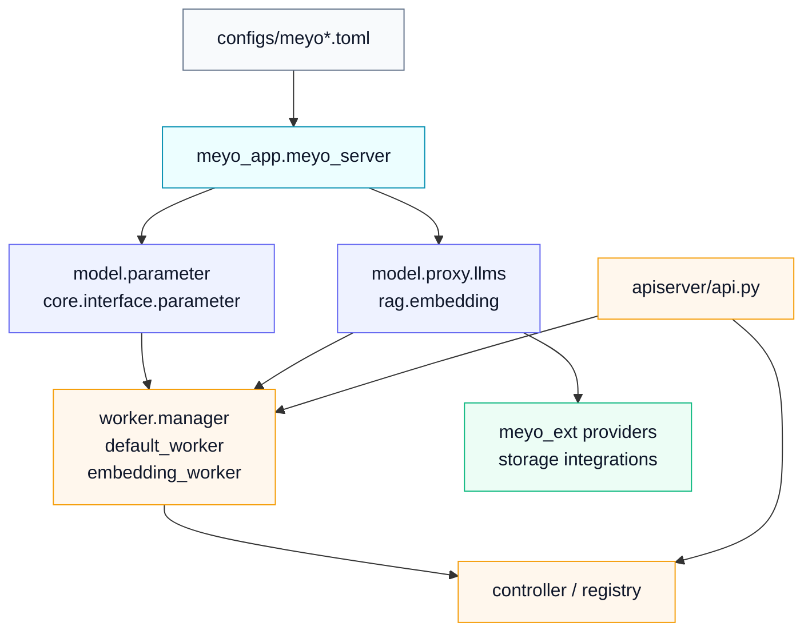

### 5.1 `meyo_app`

负责应用装配：

- 解析 `--config`
- 加载 `.env`
- 调用 `scan_model_providers()`
- 解析 `ApplicationConfig`
- 初始化 worker manager
- 初始化 apiserver
- 挂载静态文件
- 启动 uvicorn

### 5.2 `meyo.model.parameter`

负责模型服务参数：

- `WorkerType`
- `ModelsDeployParameters`
- `ModelWorkerParameters`
- `ModelControllerParameters`
- `ModelAPIServerParameters`
- `ModelServiceConfig`

### 5.3 `meyo.model.proxy.llms`

负责远程 LLM provider：

- provider 参数类
- provider client
- 默认 api_base
- 环境变量 key
- supported model metadata
- adapter 注册

### 5.4 `meyo.model.cluster.worker`

负责运行模型：

- `DefaultModelWorker` 运行 LLM
- `EmbeddingsModelWorker` 运行 embedding
- `RerankerModelWorker` 运行 rerank
- `LocalWorkerManager` 管理本进程 worker
- `RemoteWorkerManager` 对接远程 controller

### 5.5 `meyo.model.cluster.apiserver`

负责对外 API：

- `/api/v1/models`
- `/api/v1/chat/completions`
- `/api/v1/completions`
- `/api/v1/embeddings`
- `/api/v1/beta/relevance`

## 6. 配置模型

典型配置：

```toml
[service.web]
host = "0.0.0.0"
port = 5670

[service.web.database]
type = "postgresql"
host = "${env:MEYO_PG_HOST:-127.0.0.1}"
port = "${env:MEYO_PG_PORT:-14001}"
database = "${env:MEYO_PG_DATABASE:-meyo}"
user = "${env:MEYO_PG_USER:-meyo}"
password = "${env:MEYO_PG_PASSWORD:-meyo_local_20260321}"

[rag.storage.vector]
type = "milvus"
uri = "${env:MEYO_MILVUS_HOST:-127.0.0.1}"
port = "${env:MEYO_MILVUS_PORT:-14009}"

[models]
[[models.llms]]
name = "deepseek-ai/DeepSeek-V3"
provider = "proxy/siliconflow"
api_key = "${env:SILICONFLOW_API_KEY}"

[[models.embeddings]]
name = "BAAI/bge-m3"
provider = "proxy/siliconflow"
api_key = "${env:SILICONFLOW_API_KEY}"

[[models.rerankers]]
name = "BAAI/bge-reranker-v2-m3"
provider = "proxy/siliconflow"
api_key = "${env:SILICONFLOW_API_KEY}"
```

配置解析的核心是 `provider` 字段。

`provider = "proxy/siliconflow"` 会决定：

- LLM 配置解析成 `SiliconFlowDeployModelParameters`
- embedding 配置解析成 `SiliconFlowEmbeddingDeployModelParameters`
- rerank 配置解析成 `SiliconFlowRerankEmbeddingsParameters`

## 7. 启动总流程

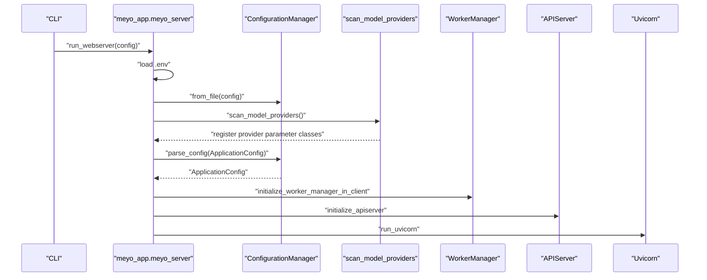

为什么扫描必须在解析配置前执行：

```text
配置解析需要根据 provider 字符串找到具体参数类。
如果 provider 参数类还没注册，parse_config 会报 Unknown type value。
```

## 8. Provider 扫描与注册

入口：

```python
from meyo.model import scan_model_providers
```

扫描范围：

```text
meyo.model.adapter
meyo.model.proxy.llms
meyo.rag.embedding
meyo_ext.rag.embeddings
meyo.rag.embedding.rerank
```

流程：

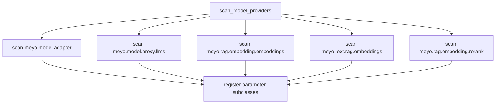

`scan_model_providers()` 只做一次。

```python
_HAS_SCAN = False

def scan_model_providers():
    global _HAS_SCAN
    if _HAS_SCAN:
        return
    ...
    _HAS_SCAN = True
```

这样避免每次请求都重复 import provider 模块。

## 9. 参数类注册机制

配置解析使用多态参数类。

基础类：

```text
LLMDeployModelParameters
EmbeddingDeployModelParameters
RerankerDeployModelParameters
```

具体 provider 参数类示例：

```python
@dataclass
class SiliconFlowDeployModelParameters(OpenAICompatibleDeployModelParameters):
    provider: str = "proxy/siliconflow"
    api_base: Optional[str] = field(
        default="${env:SILICONFLOW_API_BASE:-https://api.siliconflow.cn/v1}"
    )
    api_key: Optional[str] = field(default="${env:SILICONFLOW_API_KEY}")
```

解析时：

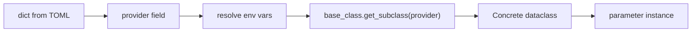

失败场景：

```text
Unknown type value: proxy/xxx
```

常见原因：

- provider 文件没有被扫描。
- 参数类没有继承正确 base class。
- `provider` 字段值和配置文件不一致。
- provider 模块 import 失败。
- optional SDK 在模块顶层导入，导致扫描中断。

## 10. LLM Provider 设计

LLM provider 文件通常包含 4 个部分：

```text
DeployModelParameters
generate_stream function
LLMClient
register_proxy_model_adapter
```

以 SiliconFlow 为例：

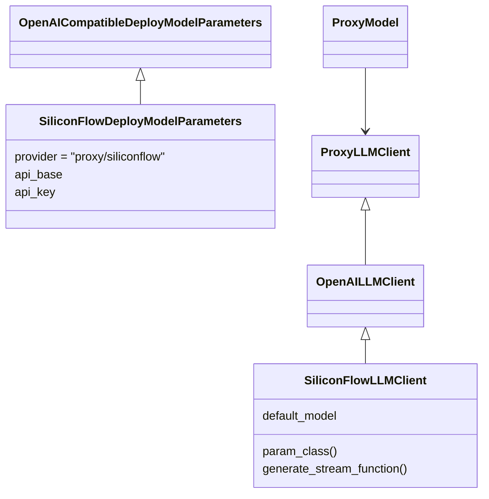

注册逻辑：

```python
register_proxy_model_adapter(
    SiliconFlowLLMClient,
    supported_models=[...],
)
```

`register_proxy_model_adapter()` 会动态创建一个 adapter：

```text
client_cls
-> client_cls.param_class()
-> provider = param_cls.get_type_value()
-> create _DynProxyLLMModelAdapter
-> register_model_adapter(_DynProxyLLMModelAdapter)
```

## 11. Adapter 选择

LLM worker 启动时执行：

```python
get_llm_model_adapter(
    model_name,
    model_path,
    model_type=deploy_model_params.provider,
)
```

选择逻辑：

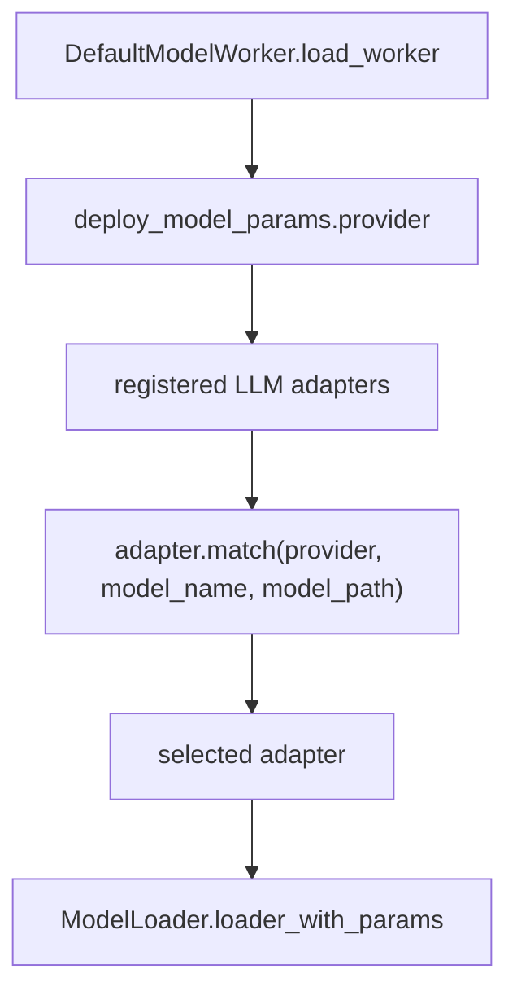

对于 `proxy/siliconflow`：

```text
provider = "proxy/siliconflow"
-> 动态 ProxyLLMModelAdapter match 成功
-> ModelLoader 创建 ProxyModel
-> ProxyModel 持有 SiliconFlowLLMClient
```

## 12. Worker 类型

当前有 3 种 worker type：

| WorkerType | 值 | worker 类 | 能力 |
|---|---|---|---|
| `LLM` | `llm` | `DefaultModelWorker` | chat / completion / count token / metadata |
| `TEXT2VEC` | `text2vec` | `EmbeddingsModelWorker` | embedding |
| `RERANKER` | `reranker` | `RerankerModelWorker` | rerank |

worker key 格式：

```text
{model_name}@{worker_type}
```

示例：

```text
deepseek-ai/DeepSeek-V3@llm
BAAI/bge-m3@text2vec
BAAI/bge-reranker-v2-m3@reranker
```

## 13. Worker Manager 启动流程

入口：

```python
initialize_worker_manager_in_client(
    worker_params=param.service.model.worker,
    models_config=param.models,
    app=app,
    binding_port=binding_port,
    binding_host=binding_host,
    system_app=system_app,
)
```

本地统一部署模式：

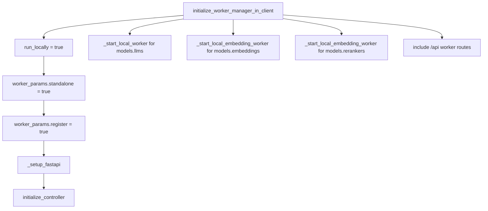

启动 worker 的核心步骤：

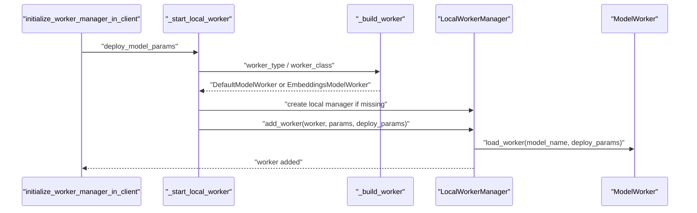

`add_worker()` 做 5 件事：

1. 调用 `worker.load_worker(model_name, deploy_model_params)`。
2. 根据 worker type 生成 worker key。
3. 根据 `concurrency` 创建 `asyncio.Semaphore`。
4. 生成 `WorkerRunData`。
5. 放入 `self.workers[worker_key]`。

## 14. Worker 真正启动

FastAPI startup event 会调用：

```python
await worker_manager.start()
```

`LocalWorkerManager.start()` 流程：

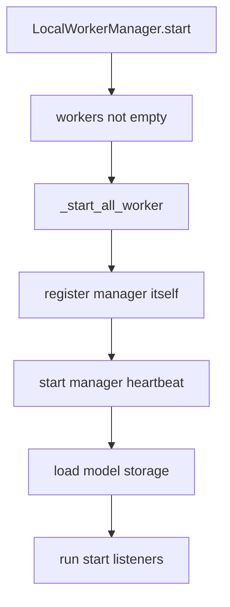

`_start_all_worker()` 对每个 worker：

```text
worker.start(command_args)
-> register worker instance to controller
-> start heartbeat task
```

LLM worker 的 `start()`：

```text
DefaultModelWorker.start
-> ModelLoader.loader_with_params
-> adapter.load / proxy adapter load
-> set model/tokenizer
-> parse context length
```

Embedding worker 的 `start()`：

```text
EmbeddingsModelWorker.start
-> adapter.load_from_params
-> self._embeddings_impl = provider implementation
```

## 15. Controller 与 Registry

Worker manager 运行时会把 worker 注册到 controller。

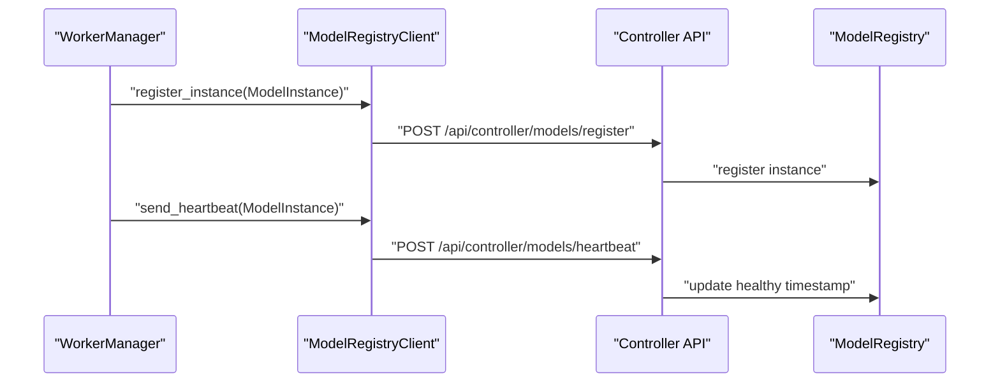

注册信息核心字段：

```text
model_name = "{model}@{worker_type}"
host
port
healthy state
heartbeat timestamp
```

API 层查询模型时会用 registry 判断模型是否可用。

## 16. 请求调用流程

### 16.1 Chat completion

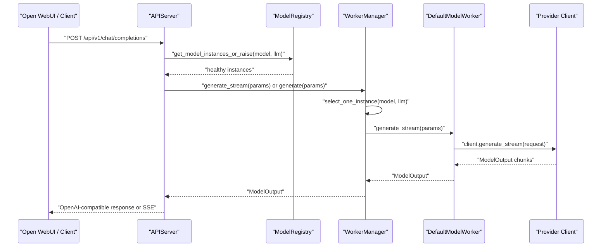

### 16.2 Embedding

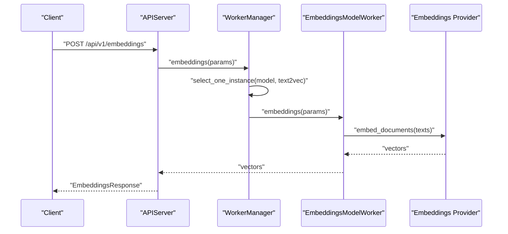

### 16.3 Rerank

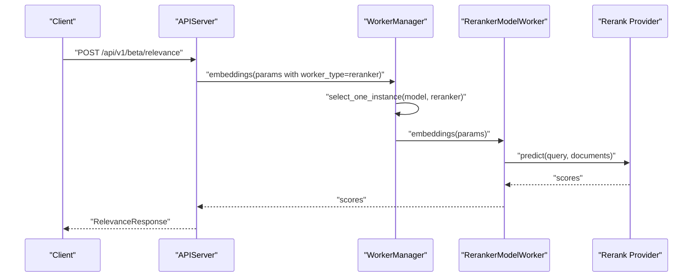

## 17. API 路由

对外模型 API：

| 路由 | 方法 | 能力 |
|---|---|---|
| `/api/v1/models` | GET | 列出可用模型 |
| `/api/v1/chat/completions` | POST | OpenAI-compatible chat |
| `/api/v1/completions` | POST | OpenAI-compatible completion |
| `/api/v1/embeddings` | POST | OpenAI-compatible embeddings |
| `/api/v1/beta/relevance` | POST | rerank / relevance |

内部 worker API：

| 路由 | 方法 | 能力 |
|---|---|---|
| `/api/worker/generate_stream` | POST | worker 流式生成 |
| `/api/worker/generate` | POST | worker 非流式生成 |
| `/api/worker/embeddings` | POST | worker embedding / rerank |
| `/api/worker/count_token` | POST | token 计数 |
| `/api/worker/model_metadata` | POST | 模型元数据 |
| `/api/worker/apply` | POST | start / stop / restart / update |
| `/api/worker/models/startup` | POST | 动态启动模型 |
| `/api/worker/models/shutdown` | POST | 动态停止模型 |

## 18. 并发控制

每个 worker instance 有自己的 semaphore。

```python
concurrency = deploy_model_params.concurrency or 5
worker_run_data.semaphore = asyncio.Semaphore(concurrency)
```

请求进入 worker manager 后：

```python
async with worker_run_data.semaphore:
    ...
```

这样一个模型可以限制并发，避免单个 provider 或本地模型被压垮。

## 19. 流式输出

流式输出的核心对象是 `ModelOutput`。

provider client 输出：

```text
ModelOutput(text=..., thinking=..., usage=..., finish_reason=...)
```

API 层转换为 SSE：

```text
ChatCompletionStreamResponse
-> transform_to_sse
-> StreamingResponse(media_type="text/event-stream")
```

流式增量计算由 apiserver 负责：

```text
full_text
previous_text
delta_text = full_text[len(previous_text):]
```

这样 provider 可以输出全量文本，API 仍然能对外表现成 OpenAI 风格的增量流。

## 20. Trace 与日志

模型服务在几个关键位置打 span：

| 位置 | span 名称 |
|---|---|
| worker manager 生成 | `WorkerManager.generate_stream` / `WorkerManager.generate` |
| worker 启动 | `DefaultModelWorker.start` |
| worker 调用 provider | `DefaultModelWorker_call.generate_stream_func` |
| API chat | `meyo.model.apiserver.create_chat_completion` |
| API embedding | `meyo.model.apiserver.generate_embeddings` |
| API relevance | `meyo.model.apiserver.generate_relevance` |

默认 trace 文件：

```text
logs/meyo_model_apiserver_tracer.jsonl
```

## 21. 新增 LLM Provider 的步骤

假设要新增 `proxy/acme`。

### 21.1 新增 provider 文件

路径：

```text
packages/meyo-core/src/meyo/model/proxy/llms/acme.py
```

### 21.2 定义参数类

```python
@dataclass
class AcmeDeployModelParameters(OpenAICompatibleDeployModelParameters):
    provider: str = "proxy/acme"

    api_base: Optional[str] = field(
        default="${env:ACME_API_BASE:-https://api.acme.com/v1}"
    )
    api_key: Optional[str] = field(default="${env:ACME_API_KEY}")
```

如果不是 OpenAI-compatible，就直接继承 `LLMDeployModelParameters`。

### 21.3 定义 client

OpenAI-compatible provider：

```python
class AcmeLLMClient(OpenAILLMClient):
    @classmethod
    def param_class(cls) -> Type[AcmeDeployModelParameters]:
        return AcmeDeployModelParameters
```

非 OpenAI-compatible provider：

```python
class AcmeLLMClient(ProxyLLMClient):
    @classmethod
    def new_client(cls, model_params, default_executor=None):
        return cls(...)

    def sync_generate_stream(self, request, message_converter=None):
        ...
        yield ModelOutput.build(text=...)
```

### 21.4 注册 adapter

```python
register_proxy_model_adapter(
    AcmeLLMClient,
    supported_models=[
        ModelMetadata(
            model="acme-chat",
            context_length=32 * 1024,
            max_output_length=8 * 1024,
            description="Acme chat model",
        )
    ],
)
```

### 21.5 增加 optional dependency

如果需要 SDK：

```toml
[project.optional-dependencies]
proxy_acme = [
    "acme-sdk>=1.0,<2.0",
]
```

如果复用 OpenAI SDK，就不需要新增 extra，直接使用 `proxy_openai`。

### 21.6 增加配置模板

```toml
[[models.llms]]
name = "acme-chat"
provider = "proxy/acme"
api_base = "${env:ACME_API_BASE:-https://api.acme.com/v1}"
api_key = "${env:ACME_API_KEY}"
```

### 21.7 验证

```bash
uv run python - <<'PY'
from meyo.model import scan_model_providers
items = scan_model_providers() or {}
providers = sorted({
    getattr(cls, "provider", "")
    for cls in items.values()
    if str(getattr(cls, "provider", "")).startswith("proxy/")
})
print(providers)
PY
```

## 22. 新增 Embedding Provider 的步骤

路径建议：

```text
packages/meyo-ext/src/meyo_ext/rag/embeddings/acme.py
```

结构：

```python
@dataclass
class AcmeEmbeddingDeployModelParameters(EmbeddingDeployModelParameters):
    provider: str = "proxy/acme"
    api_key: Optional[str] = field(default="${env:ACME_API_KEY}")

class AcmeEmbeddings(BaseModel, Embeddings):
    @classmethod
    def param_class(cls):
        return AcmeEmbeddingDeployModelParameters

    @classmethod
    def from_parameters(cls, parameters):
        return cls(...)

    def embed_documents(self, texts):
        ...

register_embedding_adapter(
    AcmeEmbeddings,
    supported_models=[EmbeddingModelMetadata(...)]
)
```

注意：

- embedding provider 和 LLM provider 可以共用 provider 字符串，但参数类分别注册到不同 base class。
- 如果 provider 只支持 LLM，不要在配置模板里声明 embedding。

## 23. 新增 Rerank Provider 的步骤

路径建议：

```text
packages/meyo-core/src/meyo/rag/embedding/rerank.py
```

结构：

```python
@dataclass
class AcmeRerankParameters(OpenAPIRerankerDeployModelParameters):
    provider: str = "proxy/acme"
    api_url: str = "https://api.acme.com/v1/rerank"
    api_key: Optional[str] = field(default="${env:ACME_API_KEY}")

class AcmeRerankEmbeddings(OpenAPIRerankEmbeddings):
    @classmethod
    def param_class(cls):
        return AcmeRerankParameters

    def _parse_results(self, response):
        return [...]
```

## 24. 配置错误排查

### 24.1 环境变量不存在

错误：

```text
Environment variable SILICONFLOW_API_KEY not found
```

原因：

```toml
api_key = "${env:SILICONFLOW_API_KEY}"
```

没有设置环境变量。

处理：

```bash
export SILICONFLOW_API_KEY=真实 key
```

或者 `.env`：

```text
SILICONFLOW_API_KEY=真实 key
```

### 24.2 Unknown type value

错误：

```text
Unknown type value: proxy/acme
```

原因：

- provider 没有扫描到。
- 参数类没有继承正确 base class。
- provider 字符串写错。
- 模块 import 失败。

排查：

```bash
uv run python - <<'PY'
import importlib
importlib.import_module("meyo.model.proxy.llms.acme")
PY
```

### 24.3 import SDK 失败

错误：

```text
Could not import python package: xxx
```

原因：

没有安装对应 extra。

处理：

```bash
uv sync --all-packages --extra "base" --extra "multi_proxy"
```

或者新增更细的 extra。

## 25. 设计约束

### 25.1 Provider 层约束

- provider 文件只处理供应商调用。
- 不在 provider 文件里写 API route。
- 不在 provider 文件里直接操作 registry。
- 可选 SDK 必须延迟导入。
- provider 字符串必须稳定，不能随意改名。

### 25.2 Worker 层约束

- worker 只关心模型调用，不关心 HTTP API 结构。
- worker manager 只做 worker 生命周期管理，不写具体供应商 SDK 调用。
- 并发控制放在 worker manager。
- 模型选择策略默认可以简单随机，后续可扩展权重、负载、健康度。

### 25.3 API 层约束

- API 层只通过 worker manager 调用模型。
- API 层只通过 registry 判断模型是否可用。
- API 层不能出现 provider-specific 分支。
- 对外协议保持 OpenAI-compatible。

### 25.4 配置约束

- `models.llms` 只放 LLM。
- `models.embeddings` 只放 embedding。
- `models.rerankers` 只放 rerank。
- 如果某 provider 只迁移了 LLM，不要在配置模板里声明同名 embedding。
- 公共配置使用 `${env:KEY}`，不能提交真实 key。

## 26. 当前限制

当前设计已经完成远程 LLM provider 目录迁移，但仍有几个边界要明确：

- Neo4j 依赖 extra 已有，graph store 实现和 app config 接入还需要继续补。
- MySQL 公共配置模板依赖 MySQL datasource，目前还没接入完整 MySQL datasource 参数类。
- 本地模型适配器如 FastChat、vLLM、MLX、llama.cpp 是预留能力，不是默认 SiliconFlow 启动链路。
- `configs/meyo-proxy-aimlapi.toml`、`configs/meyo-proxy-ollama.toml` 已收敛为 LLM-only，因为当前没有对应 embedding provider。

## 27. 复刻最小版本

如果从零复刻，最小实现顺序是：

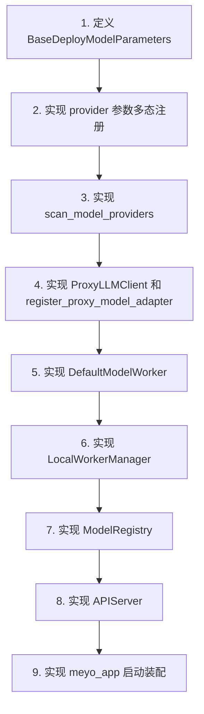

最小可运行能力：

1. 只支持 `models.llms`。
2. 只支持一个 OpenAI-compatible provider。
3. worker manager 使用本地进程模式。
4. registry 使用内存实现。
5. API 只提供 `/v1/chat/completions` 和 `/v1/models`。

然后再逐步增加：

- embedding
- rerank
- controller heartbeat
- remote worker manager
- model storage
- 多 provider
- optional extras
- trace / metrics

## 28. 设计结论

Model Provider Manager 的核心不是 provider 文件本身，而是这条稳定链路：

```text
provider 参数类注册
-> 配置解析
-> adapter 选择
-> worker 生命周期
-> registry 状态
-> OpenAI-compatible API
```

只要这条链路稳定，新增 provider 就不需要修改 API、worker manager 或 controller。
