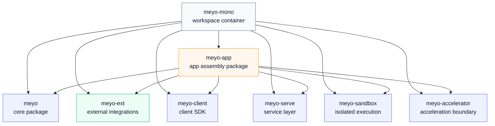
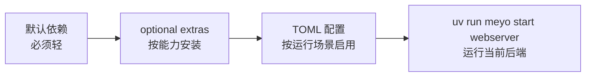
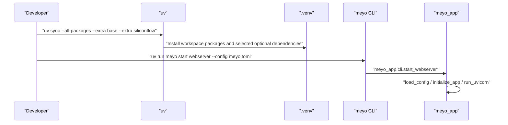
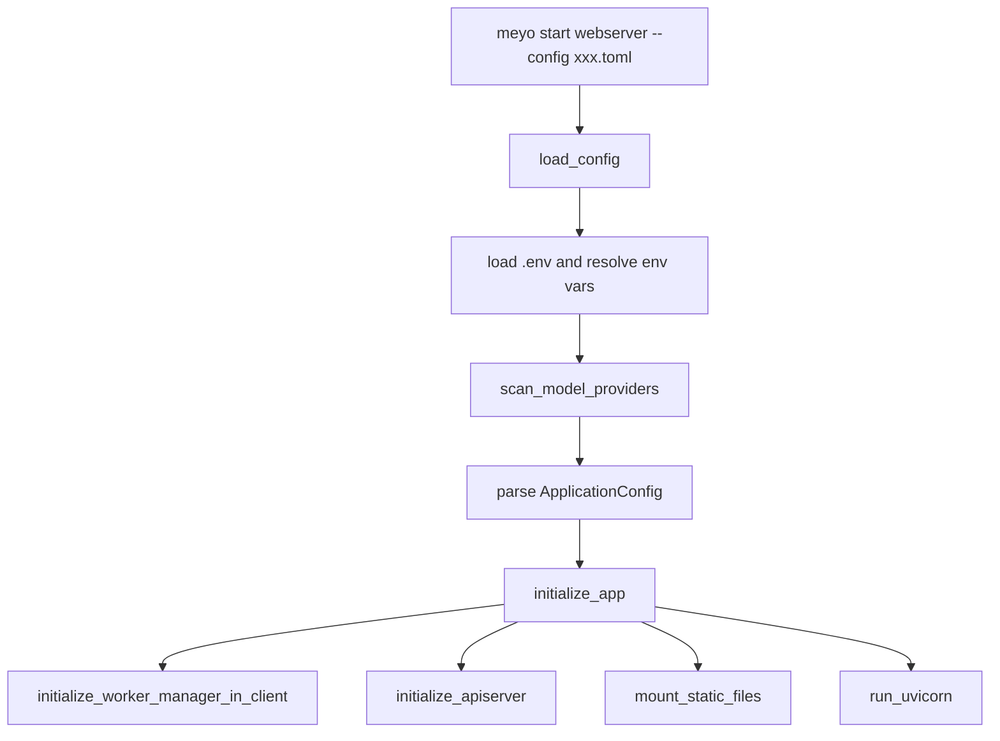

# 项目架构与按需依赖设计

本文定义 Meyo 后端项目的包结构、依赖边界、配置启动方式和按需安装约束。

核心目标是：

```text
仓库可以支持很多 provider、存储、图数据库、RAG 和观测能力；
但本地或生产启动时，只安装当前配置真正需要的依赖。
```

这套设计解决 3 个问题：

1. 不让一个最小聊天后端被所有可选依赖拖慢。
2. 不让 provider、storage、graph store 的 SDK 混在 app 默认依赖里。
3. 让配置文件、安装 extras、运行命令三者一一对应。

## 1. 总体架构

Meyo 使用 `uv workspace + 多 package + optional extras` 的结构。



## 2. Workspace 边界

根项目 `pyproject.toml` 只做 workspace 容器。

```toml
[project]
name = "meyo-mono"
dependencies = []

[tool.uv.workspace]
members = [
    "packages/meyo-core",
    "packages/meyo-ext",
    "packages/meyo-client",
    "packages/meyo-serve",
    "packages/meyo-sandbox",
    "packages/meyo-accelerator",
    "packages/meyo-app",
]
```

这里的设计约束是：

- 根项目不承载业务依赖。
- 每个子包自己声明直接依赖。
- 子包之间通过 `[tool.uv.sources]` 使用 workspace 本地源码。
- 任何真实运行能力都必须落在某个 package 或某个 extra 里。

## 3. 包职责

| package | pip 包名 | import 名 | 职责 |
|---|---|---|---|
| `packages/meyo-core` | `meyo` | `meyo` | 核心协议、配置、模型、worker、controller、apiserver、CLI |
| `packages/meyo-app` | `meyo-app` | `meyo_app` | 应用装配层，读取配置并启动 WebServer |
| `packages/meyo-ext` | `meyo-ext` | `meyo_ext` | 外部基础设施和 provider 扩展，如 PostgreSQL、Milvus、Neo4j、embedding provider |
| `packages/meyo-client` | `meyo-client` | `meyo_client` | SDK / client 侧封装 |
| `packages/meyo-serve` | `meyo-serve` | `meyo_serve` | 服务层边界，后续承接业务服务组合 |
| `packages/meyo-sandbox` | `meyo-sandbox` | `meyo_sandbox` | 隔离执行、工具运行边界 |
| `packages/meyo-accelerator` | `meyo-accelerator` | `meyo_accelerator` | 加速能力边界 |

## 4. 依赖分层原则

依赖分 3 层：



### 4.1 默认依赖

默认依赖只放所有场景都必须有的基础库。

例如 `meyo` core 默认依赖可以包含：

- `pydantic`
- `aiohttp`
- `cachetools`
- `msgpack`
- `typeguard`

不应该默认包含：

- `openai`
- `anthropic`
- `google-generativeai`
- `pymilvus`
- `neo4j`
- `boto3`
- `langfuse`
- `opentelemetry`

### 4.2 optional extras

可选能力通过 `[project.optional-dependencies]` 管理。

`meyo` core 当前的能力组：

| extra | 内容 | 适用场景 |
|---|---|---|
| `cli` | `click` / `rich` / `tomlkit` | 命令行入口 |
| `client` | `httpx` / `tenacity` | HTTP client、模型代理请求 |
| `simple_framework` | `fastapi` / `uvicorn` / `gunicorn` / `shortuuid` | Web API 服务 |
| `framework` | `SQLAlchemy` / `alembic` / `jsonschema` / `sqlparse` | 数据库和基础框架能力 |
| `runtime` | `langgraph` / `langchain-core` | Agent runtime |
| `proxy_openai` | `openai` / `tiktoken` / `httpx[socks]` | OpenAI-compatible provider |
| `proxy_anthropic` | `anthropic` | Claude provider |
| `proxy_google` | `google-generativeai` | Gemini provider |
| `proxy_ollama` | `ollama` | Ollama provider |
| `tool` | `mcp` | MCP 工具协议 |
| `observability` | `langfuse` / `opentelemetry` / `prometheus-client` / `structlog` | 观测和链路追踪 |

`meyo-ext` 当前的能力组：

| extra | 内容 | 适用场景 |
|---|---|---|
| `storage_postgres` | `asyncpg` / `psycopg` | PostgreSQL |
| `storage_redis` | `redis` | Redis |
| `storage_milvus` | `pymilvus` | Milvus 向量库 |
| `storage_neo4j` | `neo4j` | Neo4j 图数据库 |
| `file_s3` | `boto3` / `minio` | S3 / MinIO |
| `model_tongyi` | `dashscope` | 通义 embedding |

### 4.3 app 组合 extras

`meyo-app` 不应该默认写死所有能力，而是提供组合：

```toml
[project.optional-dependencies]
base = [
    "meyo[cli,client,framework,runtime,simple_framework,tool]",
]
siliconflow = [
    "meyo[proxy_openai]",
]
multi_proxy = [
    "meyo[proxy_anthropic,proxy_google,proxy_ollama,proxy_openai]",
    "meyo-ext[model_tongyi]",
]
pg_milvus_neo4j = [
    "meyo-ext[storage_postgres,storage_milvus,storage_neo4j]",
]
storage_common = [
    "meyo-ext[file_s3,storage_milvus,storage_neo4j,storage_postgres,storage_redis]",
]
observability = [
    "meyo[observability]",
]
```

这样安装命令可以和真实配置匹配。

## 5. `uv sync` 与启动命令的区别

这点必须严格区分。

`uv sync` 是安装环境：

```bash
uv sync --all-packages \
  --extra "base" \
  --extra "siliconflow" \
  --extra "pg_milvus_neo4j"
```

`uv run meyo start webserver` 才是启动服务：

```bash
uv run meyo start webserver --config meyo-proxy-siliconflow-pg-milvus.toml
```

两者关系：



## 6. 启动组合

### 6.1 默认 SQLite + Chroma + SiliconFlow

配置文件：

```text
configs/meyo.toml
```

安装：

```bash
uv sync --all-packages \
  --extra "base" \
  --extra "siliconflow"
```

启动：

```bash
uv run meyo start webserver --config meyo.toml
```

### 6.2 PostgreSQL + Milvus + SiliconFlow

配置文件：

```text
configs/meyo-proxy-siliconflow-pg-milvus.toml
```

安装：

```bash
uv sync --all-packages \
  --extra "base" \
  --extra "siliconflow" \
  --extra "pg_milvus_neo4j"
```

启动：

```bash
uv run meyo start webserver --config meyo-proxy-siliconflow-pg-milvus.toml
```

说明：这个 extra 组合已经包含 Neo4j 驱动，但当前 `meyo-proxy-siliconflow-pg-milvus.toml` 只实际声明了 PostgreSQL 和 Milvus。Neo4j graph store 还需要后续接入对应实现和配置段。

### 6.3 多远程 LLM provider

安装：

```bash
uv sync --all-packages \
  --extra "base" \
  --extra "multi_proxy"
```

适用 provider：

```text
proxy/openai
proxy/siliconflow
proxy/deepseek
proxy/tongyi
proxy/volcengine
proxy/claude
proxy/gemini
proxy/ollama
```

其它 OpenAI-compatible provider 通常也复用 `proxy_openai`。

### 6.4 打开观测能力

安装：

```bash
uv sync --all-packages \
  --extra "base" \
  --extra "siliconflow" \
  --extra "observability"
```

观测依赖不放进 `base`，因为本地最小开发不一定需要 Langfuse、OpenTelemetry 或 Prometheus。

## 7. 配置与 extras 的匹配规则

每个 TOML 配置都必须能回答两个问题：

1. 它声明了哪些外部能力。
2. 这些外部能力对应哪个 extra。

映射示例：

| TOML 配置 | 声明内容 | 需要 extra |
|---|---|---|
| `provider = "proxy/siliconflow"` | SiliconFlow LLM | `siliconflow` |
| `[service.web.database] type = "postgresql"` | PostgreSQL 元数据 | `pg_milvus_neo4j` 或 `storage_postgres` |
| `[rag.storage.vector] type = "milvus"` | Milvus 向量库 | `pg_milvus_neo4j` 或 `storage_milvus` |
| `provider = "proxy/claude"` | Claude LLM | `multi_proxy` 或 `proxy_anthropic` |
| `provider = "proxy/gemini"` | Gemini LLM | `multi_proxy` 或 `proxy_google` |
| `provider = "proxy/tongyi"` | 通义 LLM / embedding | `multi_proxy` 或 `model_tongyi` |

如果配置声明了某能力，但没有安装对应 extra，启动时应该尽早失败，错误来源通常是：

- import optional SDK 失败。
- 配置解析找不到对应参数类。
- 运行时实例化 provider client 失败。

## 8. 约束

### 8.1 package 约束

- `meyo-core` 只能放核心抽象、协议、模型服务、worker、controller、apiserver。
- `meyo-ext` 放外部系统适配，包括数据库、向量库、对象存储、扩展 embedding。
- `meyo-app` 只做装配，不直接实现 provider、worker、storage。
- `meyo-client` 只做 client SDK，不反向依赖 app。
- `meyo-serve` 保持服务层边界，不能变成模型 provider 的堆放目录。

### 8.2 optional dependency 约束

- 新 provider 需要第三方 SDK 时，必须新增或复用 extra。
- 不允许把大 SDK 直接加进默认 dependencies。
- 不允许为了一个配置模板，把所有可选依赖都塞进 `meyo-app.dependencies`。
- `base` 必须保持可控，不能放 GPU、本地大模型、图数据库、对象存储或观测重依赖。
- 如果一个 extra 是组合 extra，要在名称上表达运行组合，比如 `pg_milvus_neo4j`。

### 8.3 import 约束

可选 SDK 必须延迟导入。

推荐：

```python
def __init__(self, **kwargs):
    try:
        import dashscope
    except ImportError as exc:
        raise ValueError("Please install meyo-app[model_tongyi]") from exc
```

不推荐：

```python
import dashscope
```

原因是 `scan_model_providers()` 会扫描 provider 模块。如果可选 SDK 在模块顶层导入，就会导致未安装某个 extra 时扫描失败。

### 8.4 配置约束

- 公共配置放 `configs/meyo*.toml`。
- 私有配置放 `configs/my/`，默认忽略。
- 密钥统一使用 `${env:KEY}`。
- 公共配置不能写真实 key。
- `configs/meyo.toml` 是默认配置。
- 启动命令里的 `--config meyo.toml` 会解析到 `configs/meyo.toml`。

## 9. 启动链路



关键点：

- `load_config()` 先加载 `.env`，再扫描 provider。
- `scan_model_providers()` 必须在 `parse_config(ApplicationConfig)` 前执行，因为配置解析需要 provider 参数类已经注册。
- `initialize_app()` 把 worker manager、controller、apiserver 都装进同一个 FastAPI 进程。
- Open WebUI 和 admin 前端后续作为独立前端调用 API，不进入 Meyo 后端源码。

## 10. 开发新能力的流程

新增能力时按这个顺序：


检查清单：

- 是否新增了 provider/storage/graph store 实现。
- 是否新增或复用了 optional extra。
- 配置文件里的 `provider` / `type` 是否能被扫描和注册。
- `uv sync --all-packages --extra ... --dry-run` 是否可解析。
- `load_config("xxx.toml")` 是否通过。
- `uv run meyo start webserver --config xxx.toml` 是否能启动。

## 11. 当前建议命令

本地默认：

```bash
uv sync --all-packages \
  --extra "base" \
  --extra "siliconflow"
```

PG + Milvus：

```bash
uv sync --all-packages \
  --extra "base" \
  --extra "siliconflow" \
  --extra "pg_milvus_neo4j"
```

多 provider 学习和调试：

```bash
uv sync --all-packages \
  --extra "base" \
  --extra "multi_proxy"
```

带观测：

```bash
uv sync --all-packages \
  --extra "base" \
  --extra "siliconflow" \
  --extra "observability"
```

## 12. 设计结论

Meyo 的依赖管理不是简单地把依赖装全，而是把能力拆成：

```text
workspace package 边界
-> package 默认依赖
-> optional extras
-> config template
-> runtime service
```

这种方式可以让项目长期保留很多扩展能力，同时保持每个运行环境只安装自己需要的包。
