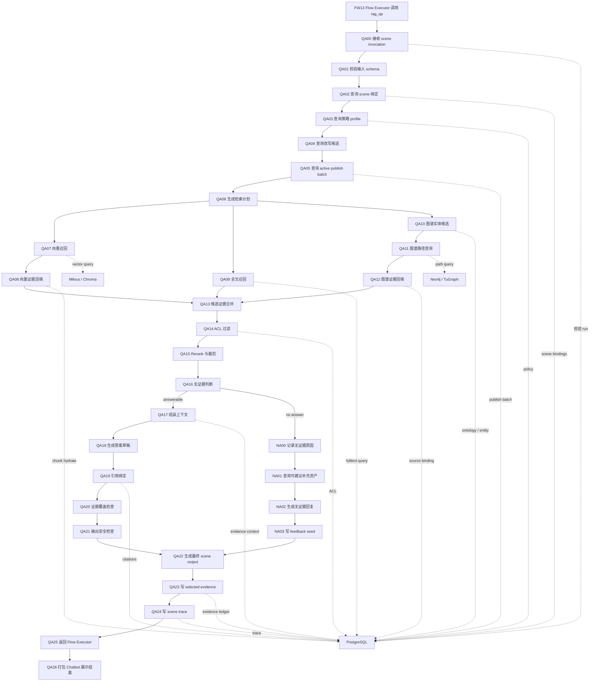

# RAG 问答 Scene Workflow 设计

## 0. 文档定位

本文只定义 `rag_qa` 这个具体 scene 的 workflow。

推理入口、App Registry、Scene Registry、Router Workflow、Flow Executor、Internal Data API 的通用框架见：

- [Meyo 推理入口运行框架设计](../01_inference_runtime_framework_design.md)

企业级 DataOps + RAG 总体方案见：

- [Meyo DataOps + RAG 企业级完整方案](../../feature/07_dataops-rag-agentos-implementation.md)

本文的边界：

| 内容 | 是否属于本文 |
|---|---|
| `chatbot -> meyo-stack -> router -> studio-flow` 通用入口 | 否 |
| `rag_qa` scene 的输入、输出、节点、证据、失败分支 | 是 |
| 知识入库 `K00-K17` | 否，只引用其结果 |
| 索引发布 `I00-I08` | 否，只引用 active batch |
| RAG 问答运行节点 `QA00-QA26` | 是 |
| 无答案分支 `NA00-NA03` | 是 |

## 1. Scene 元信息

```text
app_id: rag_assistant_app
scene_id: rag_qa
scene_name: 知识库 RAG 问答
flow_type: fixed_scene_workflow
router_visibility: active
runtime_owner: meyo-stack
workflow_executor: apps/meyo-studio-flow
data_gateway: Meyo Internal Data API
fact_sources: PostgreSQL + Milvus / Chroma + Neo4j / TuGraph
```

职责边界：

| 组件 | 在本 scene 中的职责 | 禁止事项 |
|---|---|---|
| `apps/meyo-chatbot` | 提交问题、展示答案、展示引用、展示运行状态 | 不判断是否 RAG，不查库，不拼引用 |
| `meyo-stack` | 校验 scene、代理 flow、提供三库查询、写 evidence / trace | 不在代码里硬编码 RAG 业务事实 |
| `apps/meyo-studio-flow` | 执行 `rag_qa` 已发布 workflow | 不直连生产三库，不把 flow 输出当事实源 |
| PostgreSQL | 资产、版本、chunk、ACL、active batch、evidence、run、policy | 不能被绕过 |
| Milvus / Chroma | 向量召回候选和相似度 | 不能直接提供答案正文 |
| Neo4j / TuGraph | 实体、关系、路径、子图证据 | 不能由 LLM 现场生成替代 |

## 2. 前置条件

`rag_qa` 只能在以下条件满足后进入生产：

| 条件 | 来源节点 | 事实源 | 验收 |
|---|---|---|---|
| 租户、业务域、ACL 已配置 | `G00-G02` | PostgreSQL | user / role / policy 可查 |
| 数据源和本体 profile 已配置 | `G03-G04` | PostgreSQL | ontology / publish policy 可查 |
| 知识资产已入库 | `K00-K17` | PostgreSQL | asset / version / chunk 可查 |
| 向量索引已写入 | `I00-I03` | PostgreSQL + Milvus | vector binding 可查 |
| 发布批次已激活 | `I05-I07` | PostgreSQL | active publish batch 可查 |
| scene 已注册并激活 | `SD00-SD14` | PostgreSQL | active scene / flow binding 可查 |
| Flow Version 已发布 | `SD11-SD14` | PostgreSQL + Object Store | artifact URI 和 checksum 可查 |

如果任一前置条件不存在，`rag_qa` 必须返回显式失败或无证据，不能让模型猜。

## 3. 输入契约

`rag_qa` 的 scene invocation 输入必须包含：

```json
{
  "app_run_id": "string",
  "run_id": "string",
  "flow_run_id": "string",
  "app_id": "rag_assistant_app",
  "scene_id": "rag_qa",
  "flow_version_id": "string",
  "tenant_id": "string",
  "user_id": "string",
  "query": "string",
  "conversation_id": "string",
  "attachments": [],
  "request_time": "ISO-8601"
}
```

硬规则：

1. `app_run_id`、`run_id`、`flow_run_id` 必须回查 PostgreSQL。
2. `scene_id` 必须等于已激活的 `rag_qa`。
3. `flow_version_id` 必须与 `app_scene_flow_bindings` 中 active binding 一致。
4. `query` 只作为查询输入，不是事实源。
5. `attachments` 只能是 PostgreSQL 已登记的对象引用，不能是任意文件路径。

## 4. 输出契约

`rag_qa` 的最终输出必须包含：

```json
{
  "answer": "string",
  "citations": [],
  "used_assets": [],
  "used_chunks": [],
  "used_graph_paths": [],
  "confidence": 0.0,
  "no_answer_reason": null,
  "run_id": "string",
  "app_run_id": "string",
  "scene_id": "rag_qa",
  "flow_run_id": "string",
  "trace_id": "string"
}
```

约束：

| 字段 | 要求 |
|---|---|
| `answer` | 事实性内容必须有 citation |
| `citations` | 每条 citation 必须能回查 `asset_id`、`version_id`、`chunk_id` 或 graph evidence |
| `used_assets` | 必须来自 PostgreSQL |
| `used_chunks` | 必须来自 PostgreSQL |
| `used_graph_paths` | 必须来自 Neo4j / TuGraph，并绑定 PostgreSQL evidence |
| `confidence` | 只能是 workflow 评分结果，不是事实 |
| `no_answer_reason` | 无答案时必须存在且来自枚举 |

## 5. Workflow 总图



## 6. RAG 问答全节点

| 节点 | 名称 | 执行位置 | 输入 | 必查事实源 | 输出 | 失败处理 |
|---|---|---|---|---|---|---|
| `QA00` | 接收 scene invocation | Studio Flow | `app_run_id`、`scene_id`、query | PostgreSQL 校验 run | scene context | run 不存在则失败 |
| `QA01` | 校验输入 schema | Studio Flow | scene context | PostgreSQL schema ref | valid input | schema 不符返回 `invalid_scene_input` |
| `QA02` | 查询 scene 绑定 | Studio Flow -> Internal API | scene_id、flow_version_id | PostgreSQL | knowledge / vector / graph bindings | binding 不存在则失败 |
| `QA03` | 查询策略 profile | Studio Flow -> Internal API | user、tenant、scene | PostgreSQL | policy profile | deny 则终止 |
| `QA04` | 查询改写候选 | Studio Flow | query | 无事实源 | normalized query candidate | 只能作为检索候选，不能当事实 |
| `QA05` | 查询 active publish batch | Studio Flow -> Internal API | knowledge bindings | PostgreSQL | active batch | 无 active batch 返回无证据 |
| `QA06` | 生成检索计划 | Studio Flow | normalized query、bindings | PostgreSQL | retrieval plan | plan 必须落 `run_steps` |
| `QA07` | 向量召回 | Studio Flow -> Internal API | retrieval plan | Milvus / Chroma | vector ids、scores | Milvus 失败返回检索失败 |
| `QA08` | 向量证据回填 | Studio Flow -> Internal API | vector ids | PostgreSQL | chunks、asset/version refs | 找不到绑定则丢弃候选 |
| `QA09` | 全文召回 | Studio Flow -> Internal API | retrieval plan | PostgreSQL | text candidates | 未启用则写 skipped |
| `QA10` | 图谱实体候选 | Studio Flow -> Internal API | query、ontology profile | PostgreSQL / Neo4j | entity candidates | 未启用则写 skipped |
| `QA11` | 图谱路径查询 | Studio Flow -> Internal API | entity candidates | Neo4j / TuGraph | graph paths | 无路径则写 no_graph_evidence |
| `QA12` | 图谱证据回填 | Studio Flow -> Internal API | graph paths | PostgreSQL | graph evidence refs | 无 source binding 则丢弃 |
| `QA13` | 候选证据合并 | Studio Flow -> Internal API | vector/text/graph evidence | PostgreSQL | merged evidence set | 空集合进入无答案流程 |
| `QA14` | ACL 过滤 | Studio Flow -> Internal API | evidence set、user | PostgreSQL | allowed evidence set | 全部过滤则返回无权限证据 |
| `QA15` | Rerank 与裁剪 | Studio Flow | allowed evidence set | PostgreSQL 写 selected refs | selected evidence | 分数不足进入无答案流程 |
| `QA16` | 无证据判断 | Studio Flow | selected evidence | PostgreSQL | answerable / no_answer | no_answer 必须带原因 |
| `QA17` | 组装上下文 | Studio Flow -> Internal API | selected evidence | PostgreSQL | grounded context | context 中每段必须有 evidence_id |
| `QA18` | 生成答案草稿 | Studio Flow | grounded context、query | 无事实源 | draft answer | 草稿不能直接返回 |
| `QA19` | 引用绑定 | Studio Flow -> Internal API | draft answer、evidence ids | PostgreSQL | citation mapping | 无 citation 的事实句必须删除或改写 |
| `QA20` | 证据覆盖检查 | Studio Flow -> Internal API | answer、citation mapping | PostgreSQL | coverage result | 覆盖不足返回修正或无答案 |
| `QA21` | 输出安全检查 | Studio Flow -> Internal API | answer、policy | PostgreSQL | safe output | 违规则拦截 |
| `QA22` | 生成最终 scene output | Studio Flow | safe output、citations | PostgreSQL | scene output | output schema 不符则失败 |
| `QA23` | 写 selected evidence | Studio Flow -> Internal API | selected evidence | PostgreSQL | evidence records | 写入失败则 run 不完整 |
| `QA24` | 写 scene trace | Studio Flow -> Internal API | node events | PostgreSQL / Observability | trace refs | 失败写观测告警 |
| `QA25` | 返回 Flow Executor | Studio Flow -> Meyo Stack | scene output | PostgreSQL | flow result | 传输失败可重试 |
| `QA26` | 打包 Chatbot 展示结果 | Meyo Stack | flow result | PostgreSQL | response payload | citation 缺失则不返回事实答案 |

## 7. 无答案流程

`QA16` 判断无证据时必须进入显式无答案流程，不允许让模型自由发挥。

| 节点 | 名称 | 执行位置 | 输入 | 必查事实源 | 输出 |
|---|---|---|---|---|---|
| `NA00` | 记录无证据原因 | Studio Flow -> Internal API | selected evidence、retrieval stats | PostgreSQL | `no_answer_reason` |
| `NA01` | 查询可建议补充资产 | Studio Flow -> Internal API | app_id、scene_id | PostgreSQL | candidate missing asset type |
| `NA02` | 生成用户可见回复 | Studio Flow | no_answer_reason | 无事实源 | 无证据回答 |
| `NA03` | 写 feedback seed | Studio Flow -> Internal API | run_id、query、reason | PostgreSQL | feedback draft |

无答案原因只能取以下枚举：

```text
no_active_batch
no_vector_hit
no_authorized_evidence
low_rerank_score
graph_binding_missing
evidence_coverage_failed
policy_blocked
```

## 8. Internal API 查询映射

| Workflow 节点 | Internal API | 查询事实源 | 返回内容 |
|---|---|---|---|
| `QA02` | `POST /internal/v1/scenes/bindings/resolve` | PostgreSQL | scene bindings |
| `QA03` | `POST /internal/v1/policy/check` | PostgreSQL | allow / deny / approval |
| `QA05` | `POST /internal/v1/retrieval/active-batch` | PostgreSQL | active publish batch |
| `QA07` | `POST /internal/v1/retrieval/vector-query` | Milvus / Chroma | vector ids、scores |
| `QA08` | `POST /internal/v1/retrieval/chunk-hydrate` | PostgreSQL | chunks、asset refs |
| `QA09` | `POST /internal/v1/retrieval/fulltext-query` | PostgreSQL | text candidates |
| `QA10` | `POST /internal/v1/graph/entity-query` | PostgreSQL / Neo4j | entity candidates |
| `QA11` | `POST /internal/v1/graph/path-query` | Neo4j / TuGraph | graph paths |
| `QA12` | `POST /internal/v1/evidence/graph-bindings` | PostgreSQL | graph evidence refs |
| `QA14` | `POST /internal/v1/policy/filter-evidence` | PostgreSQL | allowed evidence |
| `QA17` | `POST /internal/v1/evidence/context` | PostgreSQL | grounded context |
| `QA19` | `POST /internal/v1/evidence/citations` | PostgreSQL | citation mapping |
| `QA20` | `POST /internal/v1/evidence/coverage-check` | PostgreSQL | coverage result |
| `QA23` | `POST /internal/v1/evidence/selected` | PostgreSQL | evidence records |
| `QA24` | `POST /internal/v1/trace/scene-node-events` | PostgreSQL / Observability | trace refs |

禁止路径：

```text
Milvus result -> LLM answer
Neo4j path -> LLM answer without PostgreSQL evidence binding
studio-flow -> PostgreSQL direct connection
studio-flow -> Neo4j direct connection
studio-flow -> Milvus direct connection
chatbot -> evidence construction
```

## 9. Evidence 规则

每个进入答案上下文的证据都必须有：

```text
evidence_id
evidence_type
source_store
asset_id
version_id
chunk_id
graph_path_id
score
acl_decision
selected_by_node_id
```

答案中的事实性句子必须绑定 citation。无法绑定 citation 的句子只能有三种处理：

```text
删除
改写为不含事实断言的说明
进入无答案流程
```

## 10. Studio Flow 实现要求

`apps/meyo-studio-flow` 中的 `rag_qa` workflow 只能做编排：

| 允许 | 禁止 |
|---|---|
| 调用 Meyo Internal API | 直连 PostgreSQL |
| 执行模型生成答案草稿 | 把模型草稿当事实 |
| 组装上下文 | 直接读取对象存储文件回答 |
| 调用 rerank / model component | 在组件里硬编码业务规则 |
| 返回 scene output | 自己写生产 evidence 表 |

每个 Studio Flow 节点必须透传：

```text
app_run_id
run_id
flow_run_id
scene_id
flow_version_id
scene_node_id
trace_id
```

## 11. 测试要求

### 11.1 单元测试

必须覆盖：

```text
QA00-QA26 节点枚举完整
每个数据节点都有事实源声明
Milvus result 必须回查 PostgreSQL
Neo4j path 必须回查 PostgreSQL evidence binding
无 citation 的事实句不能返回
无证据必须进入 NA00-NA03
```

### 11.2 集成测试

必须覆盖：

```text
active publish batch 存在时能够完成 RAG 回答
Milvus 命中但 PostgreSQL chunk 缺失时丢弃候选
ACL 过滤后无证据时返回 no_authorized_evidence
GraphRAG 未启用时 QA10-QA12 写 skipped
citation 缺失时 QA20 阻断
Evidence Ledger 写入失败时 run 标记不完整
```

### 11.3 禁止项测试

必须覆盖：

```text
studio-flow 不出现生产 PostgreSQL / Neo4j / Milvus 连接配置
chatbot 不出现 citation 拼装逻辑
RAG scene 不在 Python 代码里硬编码资产 ID
RAG scene 不在 prompt 中写死业务事实
向量召回失败不能让 LLM 自由回答事实问题
```

## 12. 验收口径

`rag_qa` scene 进入生产前必须满足：

```text
scene_registry 中存在 active rag_qa
app_scene_flow_bindings 中存在 active flow binding
scene_workflow_specs 中存在 QA00-QA26
所有 QA 节点都有 input / output / status / error
所有数据节点都通过 Internal API 查询三库
无证据走 NA00-NA03
答案每个事实性结论都有 citation
evidence_id 能回查 asset_id / version_id / chunk_id / graph_path_id
chatbot 只展示 Meyo API 返回结果
```

最终原则：

```text
RAG scene 是一个具体 scene
推理入口框架只负责找到并执行这个 scene
事实来自三库
模型只生成草稿
citation 和 evidence 决定能不能回答
```
