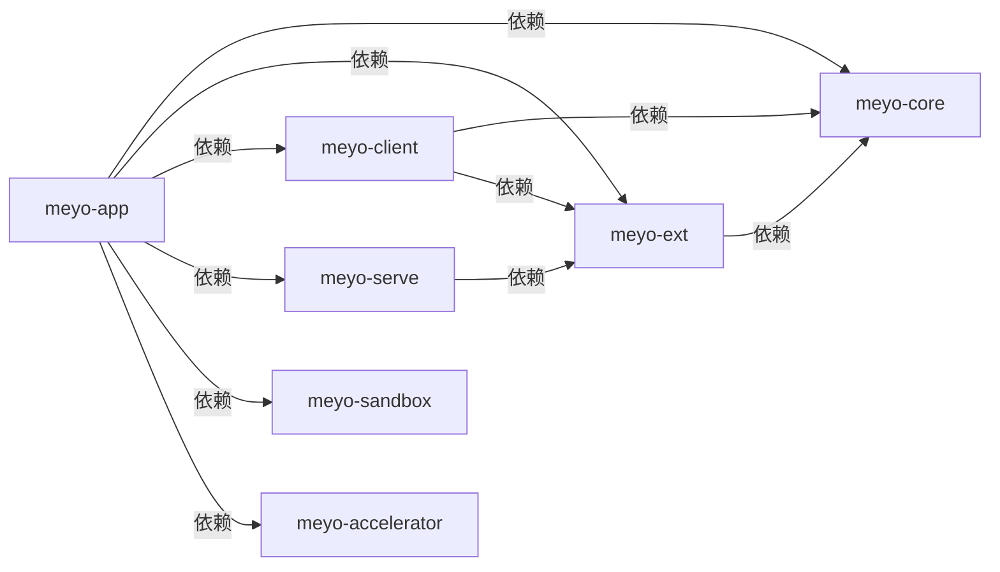

# 从零开始初始化项目
> 先把仓库壳搭起来，再决定包怎么分层

## 1. 初始化根项目

```shell
uv init
```

这一步会生成根 `pyproject.toml`，同时默认带一个根 `main.py`。

## 2. 固定 Python 版本

项目目标版本是 `3.12`，先把本地解释器 pin 住：

```shell
uv python install 3.12
uv python pin 3.12
```

然后把根 `pyproject.toml` 里的版本约束改成：

```toml
requires-python = ">=3.12"
```

`uv python pin` 只会写 `.python-version`，不会自动改 `pyproject.toml`。

## 3. 创建 package 壳

先把第一层骨架建出来：

```shell
uv init --package packages/meyo-core
uv init --package packages/meyo-ext
uv init --package packages/meyo-client
uv init --package packages/meyo-serve
uv init --package packages/meyo-sandbox
uv init --package packages/meyo-accelerator
uv init --package packages/meyo-app
```

这一步先解决“目录和包名有了”，不解决“谁依赖谁”。

## 4. 把子包纳入 workspace

根 `pyproject.toml` 里加上：

```toml
[tool.uv.workspace]
members = [
    "packages/meyo-core",
    "packages/meyo-ext",
    "packages/meyo-client",
    "packages/meyo-serve",
    "packages/meyo-sandbox",
    "packages/meyo-accelerator",
    "packages/meyo-app",
]
```

这里只是告诉 `uv`：

- 这些目录都是 workspace member
- `uv sync --all-packages` 时一起处理
- 子包可以互相引用

这还不是运行时依赖关系。

## 5. 先把包边界想清楚

这里参考 `Umber Studio` 的分层方式，但先保留最小壳。

当前这套分层是：



重点记 4 句就够了：

- `core` 放最稳定的东西
- `ext` 放具体实现
- `serve` 做服务编排
- `app` 负责最终启动和装配

`sandbox` 和 `accelerator` 都是侧向能力，不放进主业务链路里。

## 6. 每个包先干什么

`meyo-core`
- 协议
- 类型
- CLI 总入口

`meyo-ext`
- runtime adapter
- gateway adapter
- 具体实现

`meyo-client`
- SDK
- client 封装

`meyo-serve`
- use case service
- 服务编排

`meyo-sandbox`
- 受控执行
- 隔离运行

`meyo-accelerator`
- 可选加速依赖

`meyo-app`
- 配置加载
- webserver 启动
- 最终装配

## 7. 到这里先停

做完这一步，仓库已经有了：

- 根项目
- workspace
- 多 package 壳
- 包分层方向

下一步再补：

- `pyproject.toml` 依赖关系
- CLI 入口
- 启动方式
- 配置加载

这些放到下一篇。
