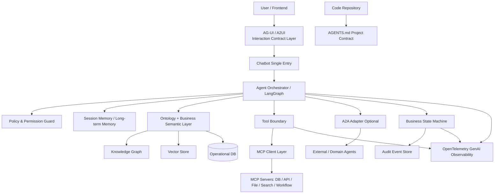

# 企业 AI App 前沿技术方法论雷达

> 本文用于沉淀 AI App 通用架构中的前沿但可落地的方法论与协议标准。重点不追热点，而是判断哪些能力可以进入企业级 AI 应用的长期架构基线。

## 0. 事实边界说明

这篇文档不是任何一个标准组织的官方路线图，而是 `Meyo` 对企业 AI App 技术方向的架构雷达。请按三层阅读：

| 类型 | 含义 | 本文位置 |
|---|---|---|
| 官方事实 | 来自 MCP、A2A、AG-UI、A2UI、AGENTS.md、GraphRAG、OpenTelemetry 等官方文档或项目说明 | 各协议/项目“是什么”的定义、参考资料链接 |
| 本文归纳 | 基于多个协议共同趋势做的架构抽象 | “协议化、契约化、可观测化”的判断、推荐总架构 |
| Meyo 建议 | 针对 `Meyo` 这类企业 AgentOS 的优先级和落地顺序 | P0/P1/P2 成熟度、Tool Boundary、状态机、审计、Optional Adapter 等建议 |

表格中的“成熟度判断”和“是否建议纳入通用架构”不是官方评级，而是本文面向 `Meyo` 的工程判断。

## 1. 总体判断

过去一年 AI App 架构的核心变化，不是“Agent 框架越来越多”，而是底层正在出现一组协议化、契约化、可观测化的工程标准。

| 方向 | 核心作用 | 成熟度判断 | 是否建议纳入通用架构 |
|---|---|---:|---:|
| MCP | Agent 连接工具、数据源、企业系统 | 高 | P0 |
| A2A | Agent 与 Agent 之间互操作 | 中高 | P1 |
| AG-UI / A2UI | Agent 与前端 UI 的交互协议 | 中高 | P1 |
| AGENTS.md | Coding Agent 的仓库级项目契约 | 高 | P0 |
| Ontology + GraphRAG | 业务语义建模 + 关系增强检索 | 高，但实施门槛高 | P0/P1 |
| OpenTelemetry GenAI | AI Agent 可观测、审计与治理标准 | 高 | P0 |
| AP2 / UCP | Agent 支付与 Agent Commerce 协议 | 中 | P2，按场景引入 |

## 2. 推荐总架构



## 3. MCP：模型到工具/数据的标准连接层

MCP，即 Model Context Protocol，是一个开放协议，用于让 AI 应用标准化地连接外部上下文、工具、数据源与系统服务。官方规范说明 MCP 的协议 schema 以 TypeScript 为源，并可生成 JSON Schema，便于多语言与自动化工具集成。

### 3.1 解决的问题

传统工具接入通常是 N 个模型 / 应用 × M 个工具，每一组都要单独写 adapter。MCP 将其收敛为：

```text
Agent Host -> MCP Client -> MCP Server -> External Tool / DB / API / File System
```

### 3.2 架构定位

MCP 不应该作为业务逻辑层，而应作为 Tool Boundary 后面的标准化接入协议：

```text
Agent / Orchestrator
  -> Tool Boundary
  -> MCP Client Layer
  -> MCP Servers
```

### 3.3 企业落地原则

- MCP 只负责标准化连接，不负责业务可信决策。
- 所有 MCP Server 必须进入 Tool Registry。
- 所有调用必须经过权限校验、schema 校验、输出校验、超时、重试、审计。
- 生产环境禁止任意安装、任意 stdio 执行。
- MCP 返回结果只能作为候选数据或证据，不能直接改写业务状态机。

### 3.4 主要风险

MCP 会触达文件系统、数据库、Shell、企业 API 等高危能力。官方规范也明确提醒，MCP 会带来任意数据访问和代码执行路径，因此必须认真处理 security、trust 与 safety。

推荐安全边界：

```text
MCP Server Allowlist
MCP Tool Permission Matrix
Runtime Sandbox
Input / Output Schema Validation
Prompt Injection Guard
Audit Event Store
Secrets Isolation
Network Egress Control
```

## 4. A2A：Agent 之间的互操作协议

A2A，即 Agent2Agent Protocol，是用于 Agent 之间互相发现、通信、交换消息与协作处理任务的开放协议。

### 4.1 与 MCP 的区别

```text
MCP = Agent -> Tool / Data / System
A2A = Agent -> Agent
```

### 4.2 适合场景

```text
主业务 Agent
  -> 数据校验 Agent
  -> 规则解释 Agent
  -> 审计 Agent
  -> 工单 Agent
  -> 通知 Agent
```

A2A 的价值不是让多个 Agent 随意聊天，而是让跨系统、跨供应商、跨团队的 Agent 能力互操作。

### 4.3 当前建议

当前企业 AI App 不建议一开始就把主链路做成大量 Agent 互相调用。建议优先做好单入口、状态机、规则执行、工具边界与审计闭环，A2A 作为未来扩展接口保留。

## 5. AG-UI / A2UI：Agent 到前端 UI 的交互协议

AG-UI 是开放、轻量、事件驱动协议，用于标准化 AI Agent 与用户前端应用之间的连接。A2UI 进一步强调 Agent 可以生成或填充适合当前上下文的 UI，并交给前端渲染。

### 5.1 核心问题

传统 AI App 常见做法是：

```text
LLM 返回 Markdown
前端硬解析
表格、按钮、卡片、确认动作全靠 prompt 约定
```

这会导致 UI 行为不可控、状态与自然语言混在一起、人机确认不可审计。

### 5.2 推荐设计

引入 Interaction Contract：

```json
{
  "type": "task_result",
  "status": "warning",
  "blocks": [
    {"type": "summary", "content": "本次校验存在 3 条异常"},
    {"type": "table", "data_ref": "validation_result_001"},
    {"type": "actions", "items": ["继续执行", "进入修复", "导出报告"]}
  ]
}
```

### 5.3 落地建议

- 先定义内部 Render Payload Contract。
- 将消息、表格、卡片、流程状态、按钮、确认弹窗统一抽象成 block。
- 用户动作回传为 event，不要让前端直接拼自然语言。
- 后端输出状态必须来自状态机，不允许 LLM 文本覆盖状态。

## 6. AGENTS.md：Coding Agent 的项目契约

AGENTS.md 是给 coding agent 使用的开放格式，官方称其为 README for agents，用于在仓库中提供 setup、test、code style、project rules 等稳定上下文。

### 6.1 解决的问题

```text
AI 不知道项目边界
AI 乱改目录
AI 乱引入依赖
AI 不跑测试
AI 不理解旧代码哪些可改、哪些不可改
```

### 6.2 推荐模板

```markdown
# AGENTS.md

## Project Boundary
- 不允许修改 legacy_workflow 目录。
- 新能力只能放在 apps/admin/new_agent_runtime。
- 不允许绕过状态机直接改业务状态。

## Setup
- 后端：uv sync
- 前端：pnpm install

## Test
- 后端：pytest
- 前端：pnpm test

## Code Style
- 后端使用 FastAPI + SQLAlchemy。
- 前端使用 React 18 + Ant Design。
- 禁止手写全局 CSS。

## Architecture Rules
- DB State Machine 是业务状态唯一事实源。
- LLM 输出不能直接改变业务状态。
- 所有 Tool Call 必须写入 audit_event。
```

## 7. Ontology + GraphRAG

详见独立文档：[Ontology + GraphRAG 企业落地说明](02_ontology-graphrag-enterprise-ai.md)。

简要结论：Ontology + GraphRAG 适合业务术语复杂、规则关系复杂、需要可解释、需要可审计的企业知识场景。它不是替代向量库，而是把业务类型系统、关系路径、证据检索组合起来。

## 8. OpenTelemetry GenAI

详见独立文档：[OpenTelemetry GenAI 可观测架构说明](03_opentelemetry-genai-observability.md)。

简要结论：企业 AI 失败常常不是因为没有 Agent，而是因为无法追踪、无法复现、无法审计、无法定位成本与错误。

## 9. AP2 / UCP

详见独立文档：[AP2 / UCP Agent Commerce 协议说明](01_ap2-ucp-agent-commerce.md)。

简要结论：AP2 / UCP 不是通用企业 AI App 的 P0 能力，但在 AI 自动采购、自动报销、订阅管理、电商导购、供应链下单等场景中有明确价值。

## 10. 推荐优先级

### P0：现在纳入架构基线

- MCP Tool Boundary
- AGENTS.md Project Contract
- OpenTelemetry GenAI Observability
- Ontology + GraphRAG 的轻量语义层设计

### P1：预留接口，分阶段落地

- AG-UI / A2UI Interaction Contract
- A2A Adapter
- 完整 Knowledge Graph / GraphRAG Pipeline

### P2：场景驱动引入

- AP2
- UCP
- Agent Commerce runtime

## 11. 参考资料

- Model Context Protocol Specification: https://modelcontextprotocol.io/specification/2025-11-25
- MCP GitHub Repository: https://github.com/modelcontextprotocol/modelcontextprotocol
- A2A Protocol Official Documentation: https://a2a-protocol.org/latest/
- AG-UI GitHub Repository: https://github.com/ag-ui-protocol/ag-ui
- AG-UI Introduction: https://docs.ag-ui.com/introduction
- Google Developers Blog - Introducing A2UI: https://developers.googleblog.com/introducing-a2ui-an-open-project-for-agent-driven-interfaces/
- A2UI Official Site: https://a2ui.org/
- AGENTS.md Official Site: https://agents.md/
- Microsoft Research GraphRAG: https://www.microsoft.com/en-us/research/project/graphrag/
- Microsoft GraphRAG Documentation: https://microsoft.github.io/graphrag/
- OpenTelemetry Blog - AI Agent Observability: https://opentelemetry.io/blog/2025/ai-agent-observability/
- OpenObserve - GenAI Semantic Conventions: https://openobserve.ai/blog/monitor-openai-api-costs-opentelemetry/
