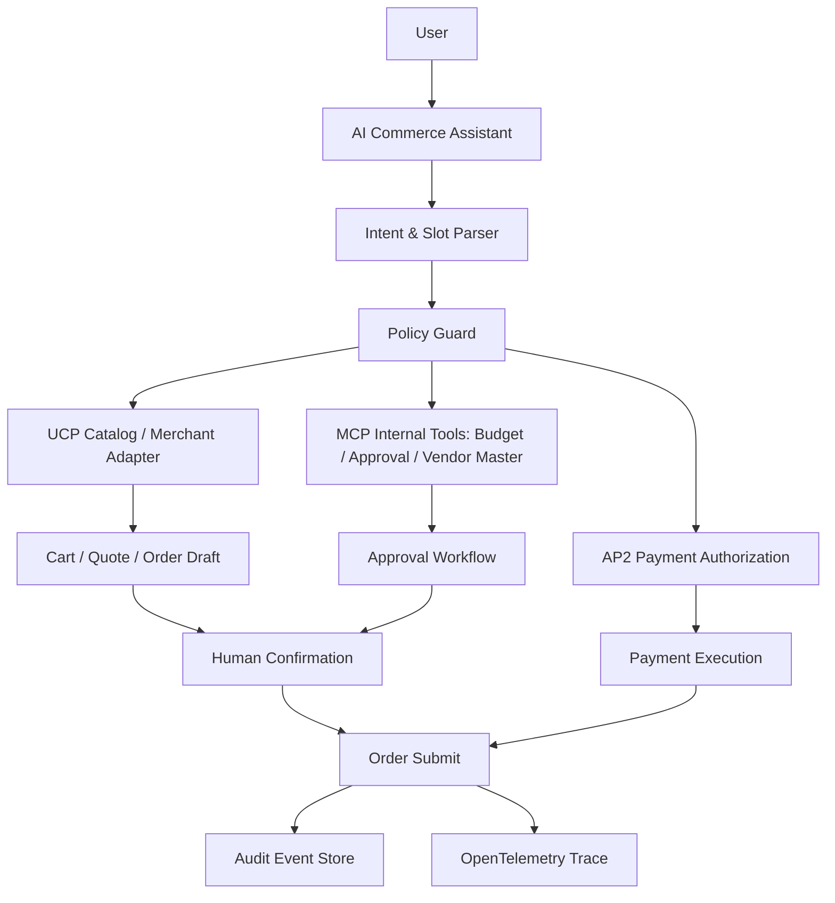

# AP2 / UCP Agent Commerce 协议说明

## 1. 一句话结论

AP2 / UCP 不是所有企业 AI App 都必须上的能力，它主要面向 Agent Commerce：让 AI Agent 在用户授权下完成商品发现、比较、下单、支付、售后等商业交易流程。

对通用企业 AI 架构而言，它属于 P2 能力：

```text
有交易 / 采购 / 支付 / 报销 / 订阅 / 供应链场景时再引入
```

## 2. AP2 与 UCP 分别是什么

### 2.1 AP2：Agent Payments Protocol

AP2 面向 AI Agent 的支付授权与交易执行。公开资料显示，Google 与多家金融、支付与科技公司推进 AP2，目标是让 AI Agent 可以在用户授权下安全完成自动化交易，并通过 mandates 等数字授权机制降低 AI 自主支付风险。

```text
AP2 = Agent 代表用户执行支付时的授权与支付协议
```

### 2.2 UCP：Universal Commerce Protocol

UCP 面向 Agent Commerce 中的商品发现、购物车、会员价、结算、售后等流程。它的价值是让 AI Agent 与商家系统之间形成统一语言，减少每个商家都要单独适配的集成成本。

```text
UCP = Agent 与商家 / 零售 / 交易系统之间的商务交互协议
```

## 3. 与 MCP、A2A 的关系

```text
MCP：Agent 连接工具、数据源、企业系统
A2A：Agent 与 Agent 之间协作
UCP：Agent 与商家系统之间完成商务流程
AP2：Agent 在授权范围内完成支付流程
```

组合场景：

```text
用户：帮我订购 20 台符合公司标准的开发机

采购 Agent
  -> UCP 查询供应商商品、库存、价格
  -> MCP 调用内部预算、审批、供应商主数据
  -> A2A 协调法务 / 财务 / IT Agent
  -> AP2 在授权后完成支付或生成付款请求
  -> Audit 记录完整交易链路
```

## 4. 适合的业务场景

### 4.1 企业采购

- 办公设备采购
- 软件订阅采购
- 云资源采购
- 低值易耗品采购
- 供应商询价与比价

### 4.2 财务与报销

- 差旅订票
- 发票校验
- 费用报销
- 预算占用
- 付款申请

### 4.3 电商与零售

- AI 导购
- 个性化商品推荐
- 自动比价
- 会员价识别
- 购物车结算
- 售后处理

### 4.4 供应链

- 库存补货
- 订单创建
- 供应商协同
- 物流状态查询
- 异常订单处理

## 5. 为什么它不是通用 P0 能力

大多数企业 AI App 的第一阶段能力是问答、知识检索、流程解释、数据查询、规则校验、任务编排、审批辅助。这些场景不一定涉及支付和交易。

AP2 / UCP 真正有价值的前提是：Agent 需要代表用户发起商业交易；交易对象来自多个商家或供应商；需要标准化授权；需要明确责任边界；需要支付、取消、退款、售后闭环能力。

## 6. 企业落地关键风险

### 6.1 授权风险

必须回答：谁授权、授权金额是多少、授权时间多久、授权商品范围是什么、是否允许自动复购、是否需要二次确认。

### 6.2 责任风险

一旦 Agent 下错单，需要明确责任归属：用户指令错误、Agent 理解错误、供应商数据错误、价格变动、审批规则缺失、支付授权过宽等。

### 6.3 数据风险

商务交易涉及收货地址、发票信息、支付 token、采购预算、供应商价格、合同条款等敏感数据。

### 6.4 合规风险

不同地区和行业对支付、采购、发票、隐私、合同有不同要求。AP2 / UCP 即便标准化了协议，也不能替代企业内部合规审查。

## 7. 推荐企业架构



## 8. 最小可行能力

不建议一开始就做自动付款。建议从低风险链路开始：

```text
Phase 1：商品检索 / 比价 / 推荐
Phase 2：购物车草稿 / 采购申请草稿
Phase 3：审批流集成
Phase 4：人工确认后下单
Phase 5：受限额度内自动支付
Phase 6：退款、取消、售后闭环
```

## 9. 必须有的 Contract

### 9.1 User Mandate Contract

```json
{
  "mandate_id": "m_001",
  "user_id": "u_001",
  "scope": "purchase_laptop_accessories",
  "max_amount": 5000,
  "currency": "CNY",
  "valid_until": "2026-12-31T23:59:59+08:00",
  "requires_confirmation": true
}
```

### 9.2 Purchase Intent Contract

```json
{
  "intent": "purchase",
  "category": "laptop",
  "quantity": 20,
  "constraints": {
    "cpu": "Apple M-series or Intel Ultra 7+",
    "memory": ">=32GB",
    "budget_per_unit": "<=15000 CNY"
  }
}
```

### 9.3 Order Draft Contract

```json
{
  "order_draft_id": "od_001",
  "merchant": "vendor_a",
  "items": [],
  "total_amount": 280000,
  "risk_flags": ["over_budget"],
  "requires_approval": true
}
```

## 10. 判断是否需要纳入当前架构

| 问题 | 是 | 否 |
|---|---|---|
| 是否涉及支付？ | 考虑 AP2 | 暂不需要 |
| 是否涉及跨商家商品发现？ | 考虑 UCP | 暂不需要 |
| 是否涉及采购审批？ | 可做 UCP/MCP 混合 | 暂不需要 |
| 是否要求自动下单？ | 必须加授权与审计 | 可只做推荐 |
| 是否有强合规要求？ | 必须灰度落地 | 暂缓自动交易 |

## 11. 架构位置

建议将 AP2 / UCP 放在 optional module：

```text
Enterprise AI Runtime
  -> Tool Boundary
  -> MCP Servers
  -> Optional Commerce Adapter
       -> UCP Merchant Connector
       -> AP2 Payment Authorization
       -> Order / Refund / After-sales Workflow
```

不要把它放进核心 Agent Runtime。

## 12. 总结

AP2 / UCP 的真实价值是让 Agent 从“建议系统”走向“交易执行系统”。但它的风险明显高于普通问答和数据查询。

落地原则：

```text
先建议
再生成草稿
再人工确认
再审批集成
最后才是受限自动支付
```

## 13. 参考资料

- Google Merchant Center - Universal Commerce Protocol: https://developers.google.com/merchant/ucp
- AP2 reporting: https://omni.se/a/RzkWqO
- Klarna backs UCP/AP2 reporting: https://letsdatascience.com/news/klarna-backs-googles-universal-commerce-protocol-ff0ad455
