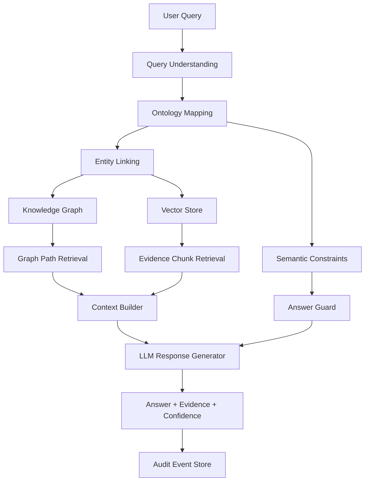

# Ontology + GraphRAG 企业落地说明

## 0. 事实边界说明

这篇文档不是 Microsoft GraphRAG 官方文档翻译，也不是本体工程教科书，而是 `Meyo` 对企业 AI App 中 “Ontology + Knowledge Graph + GraphRAG” 的落地说明。请按三层阅读：

| 类型 | 含义 | 本文位置 |
|---|---|---|
| 官方/通用事实 | Ontology、Knowledge Graph、RAG 是通用技术概念；Microsoft GraphRAG 官方资料描述了基于文本抽取、图构建、社区摘要和检索增强的 GraphRAG 方法 | 第 2-3 节概念分工、参考资料 |
| 本文归纳 | 将 Ontology、KG、GraphRAG 拆成“类型系统 / 事实关系 / 图增强检索”三层，便于企业架构设计 | 第 3-6 节 |
| Meyo 建议 | 针对财务分摊、企业流程助手等场景给出的实施模式和架构原则 | 第 7-11 节 |

文中的业务实体、关系、阶段路线和架构原则是 `Meyo` 的落地建议，不是 Microsoft GraphRAG 或任何本体标准的官方要求。

## 1. 一句话结论

Ontology + GraphRAG 的价值不是“把 RAG 包装成知识图谱”，而是为企业 AI App 建立一个可解释、可治理、可审计的业务语义层。

它适合以下场景：

- 业务术语复杂；
- 规则、指标、流程、角色之间存在复杂关系；
- 回答必须可追溯；
- 不能允许模型自由推理生成未经证据支持的答案；
- 需要把自然语言问题映射到业务对象、关系路径、规则约束与证据片段。

## 2. 普通 RAG 的核心问题

普通 RAG 通常基于：

```text
Query -> Embedding -> Vector Search -> TopK Chunks -> LLM Answer
```

短板包括：相似度不等于语义正确、缺少关系路径、缺少术语约束、缺少规则边界、缺少审计链路。

## 3. Ontology、Knowledge Graph、GraphRAG 的分工

### 3.1 Ontology：业务世界的类型系统

Ontology 关注业务概念、关系、约束和语义规则。

```yaml
types:
  - CostCenter
  - AllocationRule
  - DriverData
  - Task
  - Checkpoint
  - UserRole

relations:
  - CostCenter BELONGS_TO Organization
  - AllocationRule USES DriverData
  - Task HAS_CHECKPOINT Checkpoint
  - UserRole CAN_OPERATE TaskNode

constraints:
  - failed checkpoint must block downstream transition
  - warning checkpoint can create todo but does not block by default
```

### 3.2 Knowledge Graph：业务事实与实例关系

Knowledge Graph 承载具体实例：

```text
成本中心 A 属于组织 B
规则 R1 使用动因 D1
任务 T1 当前处于 C02 阶段
文档 Doc1 解释了规则 R1
用户 U1 属于中心角色
```

### 3.3 GraphRAG：基于图关系增强检索

GraphRAG 的核心不是只检索相似 chunk，而是把图结构也纳入检索上下文。Microsoft Research 将 GraphRAG 描述为结合文本抽取、网络分析、LLM prompting 与 summarization 的端到端系统；Microsoft GraphRAG 文档也指出，其方法会基于输入语料构建知识图谱，并在查询时使用图、社区摘要和图机器学习结果增强 prompt。

典型链路：

```text
User Query
  -> Query Understanding
  -> Ontology Mapping
  -> Entity Linking
  -> Graph Path Retrieval
  -> Vector Evidence Retrieval
  -> Context Assembly
  -> Guarded Answer Generation
  -> Citation / Evidence Output
```

## 4. 推荐架构



## 5. 企业 AI App 中的落地模式

### 5.1 轻量模式：Ontology as Vocabulary + Constraint

适合早期项目。能力包括业务术语表、同义词表、角色权限语义、状态机约束、指标口径、文档类型定义、规则与字段映射。

存储形态可以很轻：YAML / JSON / PostgreSQL tables。不一定一开始就上完整图数据库。

### 5.2 中量模式：Ontology + Relational Graph

适合业务规则复杂但图规模不大的场景。

```sql
semantic_entity(entity_id, entity_type, name, aliases, metadata)
semantic_relation(source_id, relation_type, target_id, confidence, source_ref)
semantic_constraint(constraint_type, expression, scope, status)
```

### 5.3 重量模式：Ontology + Graph DB + Vector DB

适合复杂知识库、跨系统关系、合规问答、医药知识、财务规则、研发知识管理。

可选组件：Neo4j / NebulaGraph / JanusGraph、PostgreSQL + Apache AGE、Milvus / Qdrant / pgvector、LangGraph / LlamaIndex / Haystack、OpenTelemetry + Audit Store。

## 6. 与向量库的关系

Ontology + GraphRAG 不是替代向量库，而是给向量检索增加语义约束。

```text
Vector Search：找证据片段
Graph Search：找关系路径
Ontology：定义什么关系和概念是合法的
LLM：基于证据和约束组织回答
```

## 7. 典型业务场景

### 7.1 财务分摊

核心实体：期间、组织、成本中心、科目、动因、规则、任务、节点、检查点、异常、工单、用户角色。

核心关系：规则引用动因、节点依赖前置节点、异常归属检查点、用户角色影响数据范围、任务状态受检查结果驱动。

### 7.2 医药知识库

核心实体：药品、适应症、不良反应、禁忌、临床研究、法规、术语、文档、章节。

价值：降低同义词和术语歧义，支持证据链输出，支持合规问答边界，禁止无证据推理。

### 7.3 企业流程助手

核心实体：流程、节点、角色、表单、审批、系统、API、SOP、异常处理。

价值：支持流程路径解释、上下文任务推荐、任务状态与操作权限判断。

## 8. 判断是否值得上 Ontology + GraphRAG

| 判断问题 | 如果答案是“是”，则适合引入 |
|---|---|
| 是否存在大量业务术语和别名？ | 是 |
| 是否需要解释实体之间的关系？ | 是 |
| 是否需要输出证据链？ | 是 |
| 是否存在复杂权限或状态规则？ | 是 |
| 是否不能容忍模型自由发挥？ | 是 |
| 是否需要跨文档、跨系统关联？ | 是 |

## 9. 实施风险

### 9.1 最大风险：图谱构建质量差

GraphRAG 的质量高度依赖实体抽取、关系抽取、去重、消歧和来源追踪。如果图谱本身错误，GraphRAG 会把错误放大。

### 9.2 第二风险：过度设计

很多项目不需要完整本体建模。轻量语义层就够了。

### 9.3 第三风险：把 GraphRAG 当万能药

GraphRAG 不能解决原始文档质量差、OCR 错误、数据缺失、权限模型混乱、业务规则未定义、Prompt 治理缺失。

## 10. 推荐最小可行实现

```text
Phase 1：术语表 / 同义词 / 实体类型 / 关系类型
Phase 2：文档 chunk 与实体绑定
Phase 3：规则、流程、状态机进入语义层
Phase 4：图路径检索 + 向量证据检索
Phase 5：答案证据链 + 审计日志 + 质量评估
```

## 11. 架构原则

1. Ontology 定义业务语义，不存全部业务事实。
2. KG 承载事实关系，所有关系必须有来源。
3. Vector Store 承载证据文本，不负责业务规则判断。
4. LLM 只负责解释和组织语言，不作为事实源。
5. 状态机仍然是业务状态唯一事实源。
6. 没有证据链，不允许生成确定性答案。
7. 图谱更新必须有版本管理和回滚机制。

## 12. 参考资料

- Microsoft Research - GraphRAG: https://www.microsoft.com/en-us/research/project/graphrag/
- Microsoft GraphRAG Documentation: https://microsoft.github.io/graphrag/
