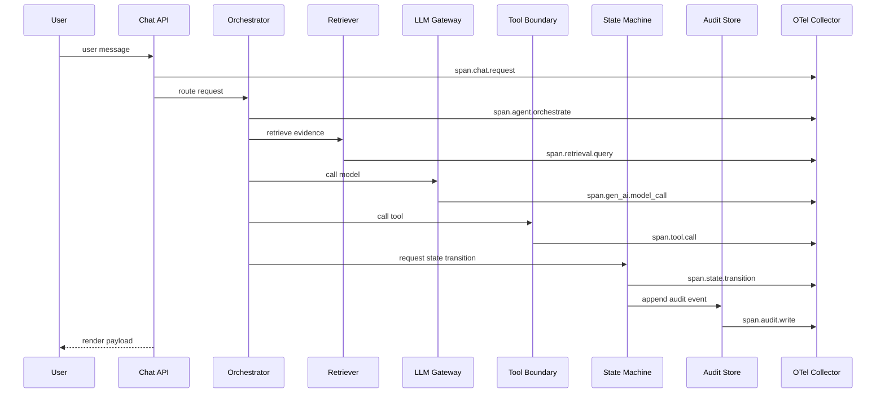
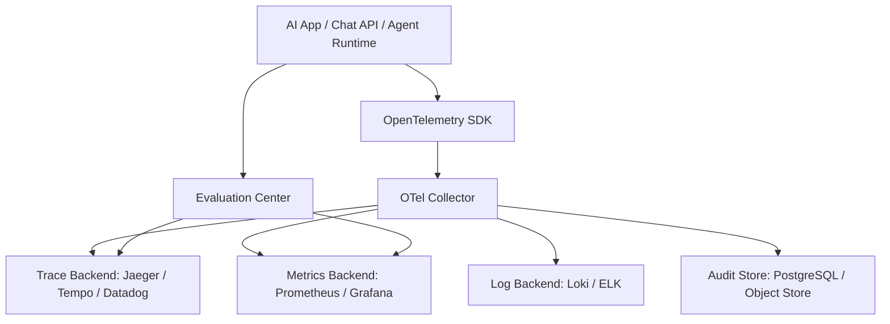

# OpenTelemetry GenAI 可观测架构说明

## 0. 事实边界说明

这篇文档不是 OpenTelemetry GenAI Semantic Conventions 的逐字段翻译，而是 `Meyo` 对 AI Runtime 可观测、审计和治理的落地设计。请按三层阅读：

| 类型 | 含义 | 本文位置 |
|---|---|---|
| 官方事实 | OpenTelemetry 提供 GenAI 语义约定，包含 `gen_ai.*` 等标准化属性、span/event/metric 命名方向；官方也在持续演进 AI agent observability 相关实践 | 第 2 节、参考资料 |
| 本文归纳 | 将 AI App 链路拆成 request、agent、retrieval、model call、tool call、state transition、audit 等观测对象 | 第 3-5 节 |
| Meyo 建议 | 针对 `Meyo` 设计的 span 名称、业务属性、指标体系、audit 边界和分阶段落地方案 | 第 6-12 节 |

第 6-7 节中的字段并不全是 OpenTelemetry 官方语义约定；其中 `gen_ai.*` 应优先对齐官方 semconv，`agent.*`、`skill.*`、`retrieval.*`、`state.*`、`tool.*` 等是本文建议的 `Meyo` 自定义命名空间。

## 1. 一句话结论

OpenTelemetry GenAI 不是“日志增强”。对 `Meyo` 这类企业 AI App 而言，本文建议把它作为进入生产环境前必须具备的可观测与审计基线。

它解决的问题是：一个用户请求为什么慢、为什么回答错、用了哪个模型、调用了哪个工具、检索了哪些文档、Prompt 是哪个版本、花了多少钱、哪个状态被谁改了、是否可复现。

## 2. 为什么传统日志不够

传统应用中，一个请求通常是：

```text
HTTP Request -> Service -> DB -> Response
```

AI Agent 请求通常是：

```text
HTTP Request
  -> Intent Classification
  -> Memory Read
  -> Retrieval
  -> Prompt Build
  -> LLM Call
  -> Tool Call
  -> Tool Result Validation
  -> Second LLM Call
  -> State Transition
  -> UI Render Payload
  -> Audit Event
```

如果只打普通日志，会出现链路断裂、无法聚合成本、无法复现 Prompt、无法判断错误来自检索/模型/工具、无法定位超时节点、无法做质量评估、无法审计状态变化。

OpenTelemetry 的 GenAI 语义约定提供统一的 gen_ai.* 属性命名，使不同模型、不同供应商、不同观测后端之间的 telemetry 保持一致。

## 3. 推荐观测对象

| 对象 | 说明 |
|---|---|
| Session | 一次用户会话 |
| Request | 一次用户请求 |
| Agent | 参与处理的 Agent |
| Skill | 被路由到的能力包 |
| Model Call | LLM 调用 |
| Prompt | Prompt 模板和版本 |
| Retrieval | 检索查询、命中文档、分数 |
| Tool Call | MCP / API / DB / Workflow 调用 |
| State Transition | 状态机流转 |
| Memory | 会话记忆、长期记忆读写 |
| UI Contract | 输出给前端的结构化渲染协议 |
| Audit Event | 审计事件 |
| Cost | token、金额、耗时 |
| Error | 错误类型与错误层级 |

## 4. 推荐 trace 结构



## 5. Span 命名建议

```text
chat.request
agent.route
agent.plan
memory.read
retrieval.query
retrieval.rerank
prompt.build
gen_ai.model_call
tool.call
tool.validate_result
state.transition
audit.write
ui.render_payload
```

## 6. 核心属性设计

以下属性模型是 `Meyo` 推荐设计，包含 OpenTelemetry 官方 `gen_ai.*` 语义约定和本项目自定义业务属性。落地时应优先复用官方字段；官方没有覆盖的部分，再放到项目自定义 namespace 中。

### 6.1 通用属性

```yaml
trace_id: string
span_id: string
session_id: string
request_id: string
user_id: string
tenant_id: string
business_domain: string
environment: dev | test | prod
```

### 6.2 Agent 属性

```yaml
agent.name: finance_allocation_agent
agent.version: 0.3.1
agent.role: orchestrator
skill.name: allocation_validation
skill.version: 2026.04.01
router.intent: validate_driver_data
```

### 6.3 模型属性

```yaml
gen_ai.system: openai | azure_openai | qwen | anthropic | local
gen_ai.request.model: qwen3-max
gen_ai.response.model: qwen3-max
gen_ai.usage.input_tokens: 1200
gen_ai.usage.output_tokens: 450
gen_ai.cost.amount: 0.0031
gen_ai.prompt.version: prompt_v12
gen_ai.temperature: 0.2
```

### 6.4 检索属性

```yaml
retrieval.query: string
retrieval.strategy: vector | hybrid | graph | graph_vector
retrieval.top_k: 8
retrieval.doc_ids: [doc_001, doc_002]
retrieval.chunk_ids: [chunk_001, chunk_002]
retrieval.score_min: 0.72
retrieval.score_max: 0.91
retrieval.index_name: finance_kb_v3
```

### 6.5 工具属性

```yaml
tool.name: query_driver_data
tool.protocol: mcp | http | sql | python
tool.server: finance-data-mcp
tool.args_hash: sha256:xxx
tool.result_hash: sha256:yyy
tool.timeout_ms: 30000
tool.retry_count: 1
tool.status: success | warning | failed
```

### 6.6 状态机属性

```yaml
state.entity_type: allocation_task
state.entity_id: task_123
state.from: C02_RUNNING
state.to: C02_WARNING
state.transition_reason: driver_data_missing
state.transition_source: rule_engine
state.guard_result: allowed
```

## 7. Metrics 指标体系

### 性能指标

```text
request_latency_ms
llm_latency_ms
retrieval_latency_ms
tool_latency_ms
state_transition_latency_ms
```

### 成本指标

```text
input_tokens_total
output_tokens_total
model_cost_total
cost_per_session
cost_per_skill
cost_per_business_task
```

### 质量指标

```text
answer_grounded_rate
retrieval_hit_rate
hallucination_flag_count
tool_success_rate
state_transition_reject_rate
human_correction_rate
```

## 8. Logs、Trace 与 Audit 的边界

| 类型 | 作用 | 是否可采样 | 典型用途 |
|---|---|---:|---|
| Logs | 工程排障 | 可 | 错误堆栈、重试、超时 |
| Trace | 链路复盘 | 可 | 定位慢请求、定位错误层级 |
| Audit | 业务审计 | 不建议 | 合规、责任界定、状态变更 |

推荐原则：Trace 可采样，Audit 不采样；Trace 用于调试，Audit 用于合规和责任界定。

## 9. 企业生产落地架构



## 10. 最小可行实现

### Phase 1：基础链路

- chat.request
- gen_ai.model_call
- retrieval.query
- tool.call
- state.transition

### Phase 2：成本与质量

- token usage
- cost
- retrieval hit
- answer grounded flag
- human feedback

### Phase 3：治理中心

- Prompt version dashboard
- Model performance dashboard
- Tool error dashboard
- Cost by tenant / user / skill
- State transition audit dashboard

## 11. 不建议的做法

```text
只记录最终回答
只记录自然语言日志
不记录 prompt 版本
不记录 tool args hash
不记录 retrieved chunks
不记录 state transition source
把 trace 当 audit 使用
把 audit 当 debug log 使用
```

## 12. 架构口径

> OpenTelemetry GenAI Observability 作为 AI Runtime 的横切治理层，统一采集 Chat Request、Agent Routing、Retrieval、Prompt Build、Model Call、Tool Call、State Transition、Audit Write 与 UI Render Payload 等关键链路，支撑生产环境中的性能分析、错误定位、成本治理、质量评估与合规审计。

## 13. 参考资料

- OpenTelemetry Blog - AI Agent Observability: https://opentelemetry.io/blog/2025/ai-agent-observability/
- OpenObserve - Monitor OpenAI API Costs with OpenTelemetry: https://openobserve.ai/blog/monitor-openai-api-costs-opentelemetry/
- Sentry - AI Agent Observability Developer Guide: https://blog.sentry.io/ai-agent-observability-developers-guide-to-agent-monitoring/
