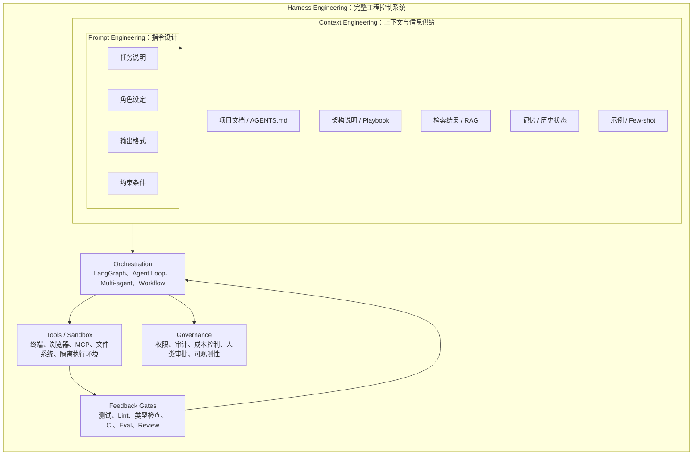
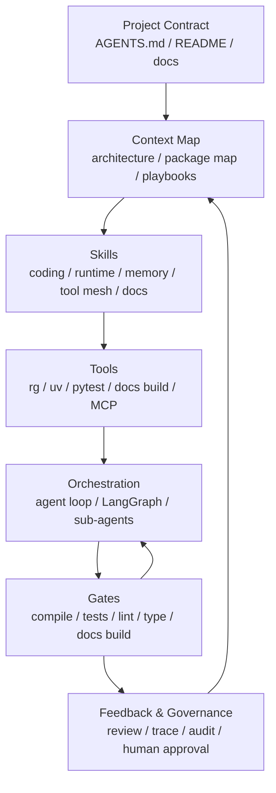

# Harness Engineering：AgentOS 壳项目的开发方法

> 这篇文档用通俗语言解释 Harness Engineering 是什么，并说明它如何落到 `Meyo` 这种还处在框架壳阶段的 AgentOS 项目里。重点不是追新名词，而是把 AI 编码智能体纳入一套可控、可验证、可持续演进的工程系统。

## 0. 阅读结论

先给结论：

- **Harness Engineering 不是一个框架**，而是一种面向 AI Agent 的工程方法。
- **Prompt 是指令层，Context 是信息层，Harness 是完整控制系统层**。
- **Skill 和 multi-agent 只是 Harness 的组成部分**，不能替代测试、权限、审计、CI、人工确认这些工程门。
- **LangGraph 仍然有价值**，它适合承担可恢复的 runtime 和强状态 workflow，但不应该覆盖所有业务逻辑。
- **Meyo 当前还是框架壳，正适合先做 Harness**：先把项目契约、文档入口、package 边界、playbook、验证门和人类确认点立起来，再让 AI 大规模参与开发。

## 1. 一句话解释

**Harness Engineering 就是给 AI 编程智能体搭一套工作环境、规则、工具和验收机制，让它可以在项目里稳定干活。**

以前的软件开发更像这样：

```text
人类理解需求
人类写代码
人类跑测试
机器执行代码
```

使用 AI 编码之后，如果只是随口让模型写代码，就会变成：

```text
人类说个大概
AI 猜需求
AI 生成代码
人类发现不对
继续补 prompt
继续返工
```

Harness Engineering 想解决的就是这种“靠反复补 prompt 纠偏”的低效循环。它把开发方式改成：

```text
人类设计项目约束、上下文、工具和验收门
AI 智能体在约束里搜索、修改、运行、修复
测试、lint、类型检查、CI、review、观测系统不断反馈
人类只在关键判断点掌舵
```

所以它不是某一个框架，也不是某一个工具，而是一种 **AI Agent 时代的软件工程方法**。

## 2. Harness 这个词到底是什么意思

`harness` 原意有“挽具、系带、控制装置”的意思。放到 AI 编程里，可以理解成：

**模型外面的那套控制系统。**

裸模型只会根据输入生成输出。它不知道你的项目边界，不知道哪些目录不能动，不知道应该先看哪份架构文档，也不知道改完后必须跑哪些测试。Harness 的作用，就是把这些隐性规则变成 AI 可读、机器可检查、团队可维护的工程资产。

加上 harness 之后，模型才变成一个可以工作的 coding agent。

```text
Agent = Model + Harness
```

这里的 Harness 包括：

| 组成 | 通俗解释 | 在项目里的例子 |
|---|---|---|
| 项目契约 | 告诉 AI 这个项目怎么工作 | `AGENTS.md`、README、架构文档 |
| 上下文入口 | 告诉 AI 先看哪里、后看哪里 | docs 导航、目录说明、ADR |
| Skills | 给 AI 的领域做事手册 | 新增 API skill、开发 LangGraph runtime skill |
| Tools | AI 能调用的工具 | 终端、搜索、测试、浏览器、MCP |
| Sandbox | 受控执行环境 | 本地 shell、容器、隔离文件系统 |
| Workflow / Orchestration | 任务如何分解和调度 | LangGraph、agent loop、多 agent |
| Gates | 结果能不能通过 | lint、pytest、compileall、docs build、CI |
| Feedback | 失败后怎么修 | 错误信息、review、trace、eval report |
| Memory / State | 如何跨步骤记住状态 | LangGraph checkpoint、run state、scratchpad |
| Human Checkpoint | 人什么时候介入 | 审批、架构确认、安全确认 |

这也是为什么 Harness Engineering 比 Prompt Engineering 大很多。

```text
Prompt Engineering:
  重点是怎么把一句话问好。

Context Engineering:
  重点是怎么把正确上下文交给模型。

Harness Engineering:
  重点是怎么设计整个 AI 工作系统，让模型能被引导、执行、检查和纠偏。
```

三者关系可以这样理解：



## 3. 它和 workflow、LangGraph、multi-agent、skill 的关系

很多团队讨论 Harness Engineering 时，会说“我们把 workflow 干掉了，只开发 skill”。这句话容易误解。

更准确的说法是：

**Harness Engineering 不是消灭 workflow，而是减少不必要的硬编码 workflow，把一部分流程判断交给模型、skill 和反馈门。**

### 3.1 传统 workflow-first

传统 node graph 或 workflow-first 通常是：

```text
需求输入
  -> 意图识别节点
  -> 检索节点
  -> 规划节点
  -> 工具调用节点
  -> 汇总节点
  -> 评估节点
```

优点是确定、可审计、可回放。

缺点是流程容易僵硬。任务稍微变化，就要加节点、改边、加条件分支。对探索性任务和工程开发任务来说，这会让 orchestration 本身变成维护负担。

### 3.2 Skill-first / Agent-loop 风格

Skill-first 更像这样：

```text
Agent 读取项目契约
Agent 根据任务选择 skill
Agent 自己搜索代码和文档
Agent 自己决定调用工具、修改文件、运行测试
Gates 判断结果是否通过
失败则把错误反馈给 Agent 继续修
```

显式 node graph 变少了，但 workflow 没有消失。它只是从“人提前画死”变成了“模型在约束中动态选择”。

```text
硬编码 workflow:
  人规定每一步怎么走。

Harness-style workflow:
  人规定边界、能力、验收标准，模型自己选择路径。
```

### 3.3 Harness Engineering 的真实范围

所以不能把 Harness Engineering 简化成：

```text
Harness Engineering = multi-agent + load skill
```

这个说法只说中了其中一层。

更完整的表达应该是：

```text
Harness Engineering
  = skill/context loading
  + tools/sandbox
  + orchestration / agent loop
  + state / memory
  + tests / lint / eval gates
  + observability / audit
  + human checkpoint
```

`skill` 和 `multi-agent` 是 Harness 的组成部分，不是全部。

也可以换一种更工程化的说法：

```text
Skill 教 AI 怎么做。
Tool 给 AI 能力。
Workflow / Agent Loop 决定任务如何推进。
Gates 判断结果能不能过。
Governance 决定什么事情必须被限制、审计或人工确认。
```

## 4. 什么时候可以少写 workflow

不是所有场景都适合取消显式 node graph。判断标准不是“模型够不够强”，而是“结果能不能被可靠验证，副作用能不能被可靠约束”。

### 4.1 可以减少硬编码 workflow 的场景

适合 skill-first 的任务通常有这些特点：

- 任务路径不固定，需要边做边判断
- 结果可以通过测试或评估兜住
- 主要是工程操作、文档操作、分析操作
- 失败后可以重试和修复
- 副作用风险不高

例子：

- 新增一个 API endpoint
- 补充单元测试
- 重构某个 service
- 生成一份技术调研文档
- 根据错误日志定位 bug
- 根据架构规则整理目录
- 给某个业务场景生成 Skill Spec

### 4.2 不适合完全交给 skill 的场景

这些场景需要保留强 workflow：

- 支付
- 金融审批
- 医疗判断
- 法务合规
- 生产数据删除
- 权限变更
- 强审计流程
- 每一步都必须可证明、可回放、可批准的业务流程

这些场景中，模型可以辅助，但不能让模型自由决定流程。

```text
低风险探索任务:
  skill-first 更合适。

高风险业务流程:
  workflow-first 更合适。

复杂平台工程:
  workflow + skill + gates 混合最合适。
```

## 5. 对 Meyo 当前项目的判断

当前 `Meyo` 的定位是：

**私有化的 LangGraph-first AgentOS 框架壳。**

这个阶段有一个很重要的特征：

```text
业务能力还没有完全长出来，
但架构边界、目录结构、技术栈、开发方法已经开始定型。
```

这恰好非常适合用 Harness Engineering 的方式开发。

原因是：

1. **现在改规则成本低**
   - 项目还没有大量历史包袱。
   - 可以先把约束、目录、接口、测试门定清楚。

2. **AgentOS 本身就需要 harness 思维**
   - `Meyo` 不是一个普通 CRUD 项目。
   - 它要管理 agent runtime、knowledge、skill、memory、tool mesh、observability。
   - 这些概念天然就是 Harness 的组成部分。

3. **LangGraph-first 不等于 workflow-everywhere**
   - 项目已经明确选择 `LangGraph-first`。
   - 但项目不应该变成 `LangGraph-everywhere`。
   - Harness Engineering 可以帮助判断：哪些能力写进 LangGraph，哪些能力写成 skill，哪些能力交给 gates。

4. **框架壳最怕隐性规则**
   - 如果早期规则只在脑子里，AI 会乱补。
   - 需要把规则写进仓库，变成 AI 可读、机器可检查的工程资产。

结论：

**Meyo 现在不只是可以用 Harness Engineering 开发，而且应该用它来定义后续开发方式。**

## 6. 当前项目里应该参考哪些文档

如果用 Harness Engineering 开发 `Meyo`，不要让 AI 直接读全仓库然后猜。应该明确上下文入口。

推荐参考顺序如下。

### 6.1 第一入口：项目定位

- 仓库根目录 `README.md`
- [基座项目总览](../application/base_project/index.md)

它们回答：

- `Meyo` 是什么
- 当前有哪些 app 和 package
- 当前阶段做到哪里
- 最小启动方式是什么

### 6.2 第二入口：架构边界

- [Meyo 企业级 AgentOS 架构设计文档](../application/base_project/architecture_design.md)
- [Meyo 技术栈](../application/base_project/technology_stack.md)
- [Packages 架构与分层](../application/base_project/packages_architecture.md)
- [目录结构与模块职责](../application/base_project/directory_and_module_map.md)

它们回答：

- `LangGraph` 在哪里
- `MemoryGateway / KnowledgeGateway / ToolGateway` 是什么边界
- `packages/meyo-core`、`meyo-ext`、`meyo-serve`、`meyo-app` 分别承担什么
- 哪些层可以依赖哪些层

### 6.3 第三入口：能力模型

- [Meyo 功能设计](../application/base_project/functional_design.md)
- [Meyo Memory OS 设计](../application/base_project/memory_os_design.md)
- [企业 AI App 前沿技术方法论雷达](00_enterprise-ai-methodology-radar.md)
- [OpenTelemetry GenAI 可观测架构说明](03_opentelemetry-genai-observability.md)

它们回答：

- knowledge / skill 如何维护
- Memory OS 如何分层
- MCP / AGENTS.md / Observability 如何进入企业 AI 架构
- 未来的 skill、tool、memory、trace 怎么协作

### 6.4 第四入口：开发操作

- [快速上手](../application/base_project/quick_code_onboarding.md)
- [从零开始上手](../application/base_project/from_zero_to_running.md)
- [开发 Playbooks 与使用方式](../application/base_project/development_playbooks.md)

它们回答：

- 本地怎么跑
- 当前最低验证是什么
- 当前阶段适合怎么切开发任务

## 7. Meyo 的 Harness 分层模型

针对 `Meyo`，可以把 Harness 设计成 7 层。



这 7 层对应到项目里：

| 层 | Meyo 中的落点 | 第一阶段目标 |
|---|---|---|
| Project Contract | 根 `AGENTS.md`、README | 告诉 AI 项目边界和禁止事项 |
| Context Map | docs 里的架构、技术栈、playbook | 告诉 AI 不同任务先看哪几份文档 |
| Skills | 后续沉淀 `coding skill`、`memory skill`、`tool skill` | 把重复开发方法固化 |
| Tools | `uv`、`pytest`、`compileall`、docs build | 让 AI 能自测 |
| Orchestration | `LangGraph`、agent runtime、sub-agent | 管复杂运行链路，不滥用 |
| Gates | CI、pre-commit、结构检查 | 不合格结果不能合并 |
| Feedback & Governance | review、trace、audit、人类批准 | 高风险点由人掌舵 |

## 8. Meyo 应该先做的最小 Harness

当前不要一上来做复杂 meta-harness。先做最小可用版本：让 AI 进项目后知道读什么、能改什么、怎么改、改完怎么验收。

### 8.1 根 AGENTS.md

根目录需要一个面向 coding agent 的项目契约。建议包括：

```markdown
# AGENTS.md

## Project Positioning
- Meyo is a private LangGraph-first AgentOS framework shell.
- Current goal: stabilize workspace, package boundaries, runtime adapters, docs, and minimal webserver.

## Read First
- README.md
- apps/docs-site/docs/application/base_project/index.md
- apps/docs-site/docs/application/base_project/architecture_design.md
- apps/docs-site/docs/application/base_project/technology_stack.md
- apps/docs-site/docs/application/base_project/packages_architecture.md

## Architecture Rules
- Business code must not depend on LangGraph internal types directly.
- LangGraph belongs in runtime / orchestrator adapters.
- PostgreSQL is the system-of-record for registry and metadata.
- Milvus and Neo4j are derived indexes, not source-of-truth stores.
- Tool calls must go through ToolGateway / Tool Mesh boundaries once those modules exist.

## Package Boundaries
- meyo-core: contracts, CLI, core schemas, stable primitives.
- meyo-ext: external adapters.
- meyo-serve: application services and orchestration services.
- meyo-app: final wiring and FastAPI app assembly.
- meyo-client: SDK / API client.
- meyo-sandbox: controlled execution boundary.

## Validation
- Run `python -m compileall packages` after Python changes.
- Run `uv run pytest` when tests exist or touched behavior is covered.
- Run docs build after docs-site changes.

## Do Not
- Do not bypass package boundaries.
- Do not introduce a new framework without updating technology_stack.md.
- Do not make business layer depend on LangGraph graph internals.
- Do not treat LLM text as a trusted business state update.
```

这个文件不是为了写很多规则，而是为了让 AI 每次进项目时有一个稳定入口。

### 8.2 开发 Playbooks

当前项目已经有 playbooks 概念。建议把它们升级成 Harness 的核心资产。

第一批 playbook 可以是：

| Playbook | 作用 |
|---|---|
| 新增一个 core contract | 先定义 schema / protocol / interface |
| 新增一个 ext adapter | 外部依赖只进 adapter |
| 新增一个 serve service | 服务编排不污染 core |
| 新增一个 FastAPI endpoint | API 层只做输入输出和调用 service |
| 新增一个 LangGraph runtime adapter | LangGraph 只在 runtime 层出现 |
| 新增一个 Skill Spec | 业务维护 spec，系统编译 skill |
| 新增一个 ToolGateway tool | 工具必须注册、校验、审计 |

Playbook 的格式要尽量固定：

```markdown
# Playbook: Add New Runtime Adapter

## When to Use
适用于新增一个 agent runtime adapter，例如 LangGraph adapter。

## Read First
- architecture_design.md
- technology_stack.md
- packages_architecture.md

## Files Usually Touched
- packages/meyo-core/...
- packages/meyo-serve/...
- packages/meyo-app/...

## Steps
1. 定义 core contract。
2. 在 serve 层实现 adapter。
3. 在 app 层 wiring。
4. 增加最小测试。
5. 更新文档。

## Validation
- python -m compileall packages
- uv run pytest tests/...

## Common Mistakes
- 不要让业务层直接 import LangGraph graph internals。
- 不要把 provider-specific 配置写进 core。
```

### 8.3 最小验证门

当前项目还是壳，不一定所有模块都有完整测试。但最小验证门必须存在。

建议第一阶段使用：

```bash
python -m compileall packages
uv run pytest
cd apps/docs-site && bun run build
```

如果某些命令暂时不能跑，也要在文档里说明原因，而不是让 AI 猜。

### 8.4 结构性检查

Harness Engineering 很重视“机械化约束”。也就是不要只写“请遵守架构”，而要让检查脚本真的能发现违规。

后续可以增加这些检查：

| 检查 | 目的 |
|---|---|
| package dependency check | 防止 `meyo-core` 反向依赖 app / serve |
| forbidden import check | 防止业务层直接 import LangGraph internals |
| docs link check | 防止文档引用失效 |
| AGENTS.md length check | 防止项目契约变成巨型手册 |
| playbook coverage check | 新增模块必须有对应 playbook 或说明 |
| provider boundary check | 防止模型 provider 逻辑散落在业务层 |

## 9. Skill 在 Meyo 里的位置

`Meyo` 的功能设计已经明确：业务不应该直接维护原始 skill 目录，而是维护 `Skill Spec`，再由系统生成可发布的 Skill Package。

这和 Harness Engineering 很契合。

这里需要区分两类 skill：**开发期 Skill** 和 **运行期 Skill**。前者帮助 coding agent 开发 Meyo，后者是 Meyo 平台交付给业务 agent 的能力包。

### 9.1 开发期 Skill

开发期 Skill 是给 coding agent 用的。

例如：

```text
skills/meyo-add-api-endpoint/
skills/meyo-add-runtime-adapter/
skills/meyo-add-memory-gateway-method/
skills/meyo-add-tool-gateway-tool/
skills/meyo-docs-update/
```

它们解决的是“AI 怎么开发 Meyo”。

### 9.2 运行期 Skill

运行期 Skill 是给 Meyo 平台里的业务 agent 用的。

例如：

```text
contract-review-skill
knowledge-qa-skill
finance-analysis-skill
evidence-report-skill
```

它们解决的是“用户怎么通过 Meyo 使用 AI 能力”。

### 9.3 两类 Skill 不要混在一起

这是一个关键边界。

| 类型 | 使用者 | 作用 | 存放建议 |
|---|---|---|---|
| 开发期 Skill | coding agent | 帮助开发 Meyo | 仓库级开发目录或 Codex skills |
| 运行期 Skill | Meyo 用户 / 业务 agent | 业务能力包 | 平台 skill registry / published package |

如果混在一起，会导致：

- coding agent 误把业务 skill 当开发规则
- 业务 skill 误引用本地开发路径
- 权限和审计边界不清楚

## 10. LangGraph 在 Harness 里的正确位置

`Meyo` 是 `LangGraph-first`，但不是 `LangGraph-everywhere`。

这句话决定了 LangGraph 在项目里的边界：它是 runtime 选择，不是所有层的业务建模方式。

### 10.1 LangGraph 适合做什么

LangGraph 适合做：

- 有状态运行
- durable execution
- checkpoint
- interrupt / resume
- HITL
- 多步骤 agent runtime
- 可恢复的任务编排

也就是：

```text
LangGraph 适合管运行时状态机。
```

### 10.2 LangGraph 不适合承担所有事情

LangGraph 不应该直接变成：

- 业务对象模型
- 知识资产账本
- skill registry
- tool 权限系统
- 审计系统
- 文档治理系统
- 所有业务流程的硬编码画布

这些应该由 Meyo 平台自己的边界承接：

```text
Run API
MemoryGateway
KnowledgeGateway
ToolGateway
Skill Registry
Evidence Store
Observability
Policy / Approval
```

### 10.3 什么时候用 LangGraph，什么时候用 Skill

可以用下面这个判断表。

| 问题 | 更适合 |
|---|---|
| 是否需要 checkpoint / resume / interrupt | LangGraph |
| 是否是高风险、强审计业务流程 | LangGraph / 显式 workflow |
| 是否是开发方法、领域操作说明 | Skill |
| 是否流程不固定、需要模型判断下一步 | Skill + agent loop |
| 是否结果可由测试和 eval 兜住 | Skill-first 可以更多 |
| 是否每一步都必须可证明 | 显式 workflow 更多 |

结论：

**LangGraph 是 runtime harness 的一部分，Skill 是 context harness 的一部分。两者不是替代关系。**

## 11. Multi-agent 在 Harness 里的位置

Multi-agent 不应该为了炫技而引入。

它适合这些情况：

- 一个 agent 负责生成，一个 agent 负责评估
- 一个 agent 做实现，一个 agent 做 review
- 一个 agent 搜索资料，一个 agent 汇总判断
- 一个 agent 负责规划，多个 agent 负责独立子任务

但 multi-agent 有成本：

- 上下文更多
- 调度更复杂
- 成本更高
- 失败链路更难排查
- 多个 agent 可能互相确认错误结论

所以对 `Meyo` 当前阶段，建议：

```text
第一阶段:
  单 agent + 清晰 AGENTS.md + playbook + 测试门

第二阶段:
  引入 reviewer / verifier agent

第三阶段:
  对明确可并行的任务再引入 sub-agent
```

不要一开始就做复杂 multi-agent 平台，否则容易把壳项目变成 orchestration demo，而不是稳定框架。

## 12. Harness Engineering 如何指导 Meyo 从壳长成系统

可以分 5 个阶段。这个顺序的重点是：先让仓库可读，再让开发可复用，再让约束可执行，最后才扩大到运行期 AgentOS 能力。

### 12.1 Phase 0：仓库变成唯一事实源

目标：

```text
不在仓库里的规则，对 AI 就不存在。
```

要做：

- 补根 `AGENTS.md`
- 梳理 docs 入口
- 明确 package 边界
- 明确当前可运行命令
- 把关键架构决策写进文档

交付物：

```text
AGENTS.md
README.md
architecture_design.md
technology_stack.md
packages_architecture.md
development_playbooks.md
```

### 12.2 Phase 1：最小开发 Harness

目标：

```text
AI 能按同一套方法完成小切片开发。
```

要做：

- 新增 API endpoint playbook
- 新增 service playbook
- 新增 runtime adapter playbook
- 新增 docs update playbook
- 固化最小验证命令

交付物：

```text
docs/playbooks/*
compileall / pytest / docs build 验证说明
```

### 12.3 Phase 2：Skill-first 开发

目标：

```text
把重复开发方法沉淀成 skill。
```

要做：

- 把 playbook 升级成开发期 skill
- 给每个 skill 写清楚适用范围
- skill 内只放必要上下文入口，不复制整份大文档
- 每个 skill 都包含 validation 命令

交付物：

```text
coding skills
docs skills
runtime adapter skills
tool gateway skills
memory gateway skills
```

### 12.4 Phase 3：机械化约束

目标：

```text
不要只相信文档，要让脚本真的能拦住错误。
```

要做：

- import boundary check
- package dependency check
- docs link check
- model provider boundary check
- tool registration check

交付物：

```text
scripts/check-architecture.sh
scripts/check-docs.sh
CI gates
pre-commit hooks
```

### 12.5 Phase 4：运行期 Harness

目标：

```text
Meyo 自己也成为可 harness 的 AgentOS。
```

要做：

- Run API
- Skill Registry
- ToolGateway
- MemoryGateway
- Evidence Store
- Observability
- Human Approval

交付物：

```text
agent runtime
tool mesh
memory OS
trace / audit
approval flow
```

## 13. 具体开发任务怎么套 Harness

下面用几个 Meyo 常见任务举例。

### 13.1 新增一个 API endpoint

不要直接让 AI 写：

```text
帮我加一个接口。
```

应该给它 harness：

```text
任务：新增 GET /api/skills 接口。

上下文：
- 先读 README.md
- 再读 architecture_design.md 的 Run API / Skill Registry 相关部分
- 再读 packages_architecture.md

边界：
- core 只放 schema / contract
- serve 放 service
- app 做 FastAPI wiring
- 不允许在 app 层写业务逻辑

验收：
- python -m compileall packages
- uv run pytest tests/...
- 更新 docs
```

这就是 Harness Engineering：不是给一句 prompt，而是给任务上下文、边界和验收门。

### 13.2 新增一个 LangGraph runtime adapter

Harness 应该强调：

```text
LangGraph 只能进入 runtime adapter，不进入业务层。
```

建议流程：

1. 在 `meyo-core` 定义稳定 runtime contract。
2. 在 `meyo-serve` 实现 LangGraph adapter。
3. 在 `meyo-app` wiring 配置。
4. 增加最小测试。
5. 更新架构文档。

验收：

```bash
python -m compileall packages
uv run pytest
```

### 13.3 新增一个 ToolGateway tool

Harness 应该强调：

```text
工具不是函数直调，而是受控能力。
```

必须包含：

- tool name
- input schema
- output schema
- timeout
- permission
- audit event
- error mapping
- sandbox boundary

不允许：

- 在 agent 代码里随手调用 shell
- 在业务 service 里绕过 ToolGateway
- 让 LLM 文本直接决定高危副作用

### 13.4 新增一个业务 Skill

开发业务 Skill 时，不应该只写 prompt。

应该先写 `Skill Spec`：

```text
skill_name
goal
input_schema
output_schema
knowledge bindings
tool bindings
approval policy
citation policy
evaluation cases
```

然后再由系统编译成运行期 Skill Package。

## 14. Definition of Done

如果 `Meyo` 用 Harness Engineering 开发，每个任务的完成标准不应该只是“代码写完了”。

推荐 DoD：

| 检查项 | 必须回答 |
|---|---|
| 上下文 | 是否读了相关架构文档和 playbook |
| 边界 | 是否遵守 package / runtime / gateway 边界 |
| 测试 | 是否有单测或说明为什么暂时没有 |
| 验证 | 是否运行了 compileall / pytest / docs build |
| 文档 | 是否更新了对应 docs |
| 观测 | 如果是 runtime 能力，是否有日志 / trace 设计 |
| 安全 | 是否涉及工具、副作用、密钥、权限 |
| 人类确认 | 是否有需要人工确认的架构或安全决策 |

一个任务只有满足这些，才算真正完成。

## 15. 常见误区

### 15.1 误区一：Harness Engineering 就是多 agent

不是。

Multi-agent 是 harness 的一种组织方式，但没有测试、约束、工具边界和反馈门，多 agent 只是多个模型一起猜。

### 15.2 误区二：Harness Engineering 就是写 skill

不是。

Skill 负责给模型能力和上下文，但 skill 不能替代测试、lint、CI、权限和审计。

### 15.3 误区三：用了 Harness 就不需要 workflow

不是。

高风险、强审计、强状态业务仍然需要 workflow。Harness Engineering 做的是判断哪些流程应该写死，哪些流程可以交给 agent 动态决策。

### 15.4 误区四：AGENTS.md 越长越好

不是。

AGENTS.md 应该像地图，不应该像百科全书。它负责指路：

```text
这个项目是什么
先看哪些文档
哪些目录能动
哪些规则不能破
改完跑什么验证
```

具体细节应该放到架构文档、playbook、skill 里。

### 15.5 误区五：项目还是壳，所以不用 Harness

恰好相反。

项目还是壳时最适合做 Harness，因为此时：

- 约束成本低
- 架构债少
- AI 还没有学到坏模式
- 可以先定义黄金路径

等代码量变大以后再补 Harness，会困难很多。

## 16. 推荐落地顺序

对当前 `Meyo`，建议按这个顺序落地：

1. **补根 AGENTS.md**
   - 项目定位
   - 文档入口
   - package 边界
   - 验证命令
   - 禁止事项

2. **整理 playbooks**
   - 新增 API
   - 新增 service
   - 新增 runtime adapter
   - 新增 tool
   - 新增 skill spec

3. **固定最小验证门**
   - `python -m compileall packages`
   - `uv run pytest`
   - `cd apps/docs-site && bun run build`

4. **增加结构检查**
   - dependency direction
   - forbidden import
   - docs link
   - package ownership

5. **把高频 playbook 变成 skill**
   - coding skill
   - docs skill
   - runtime adapter skill
   - tool gateway skill

6. **再考虑 multi-agent**
   - reviewer agent
   - verifier agent
   - docs agent
   - migration agent

## 17. 最终结论

Harness Engineering 对 `Meyo` 的意义，不是追一个新名词，而是帮项目回答一个非常实际的问题：

**如何让 AI 编码智能体参与开发，但不让项目边界、架构质量和长期可维护性失控。**

对当前这个框架壳来说，最好的做法不是马上堆复杂 agent，也不是把所有流程都画成 LangGraph，而是先建立：

```text
清晰项目契约
稳定文档入口
明确 package 边界
少量高价值 playbook
可执行验证门
必要的人类确认点
```

然后再逐步把重复工作沉淀成 skill，把复杂运行链路交给 LangGraph，把高风险副作用交给 ToolGateway 和审批，把质量反馈交给测试、CI、观测和 review。

一句话收口：

**Meyo 可以用 Harness Engineering 来开发，而且越早用越好；但它应该是 workflow、skill、agent loop、gates 和治理边界的组合，而不是简单地“干掉 workflow，只写 skill”。**
