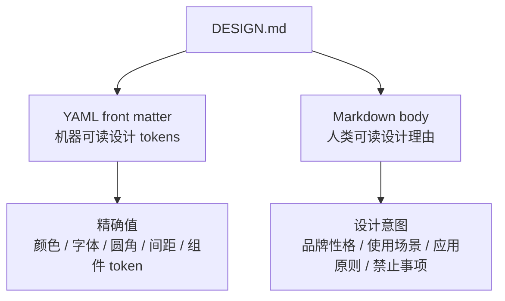
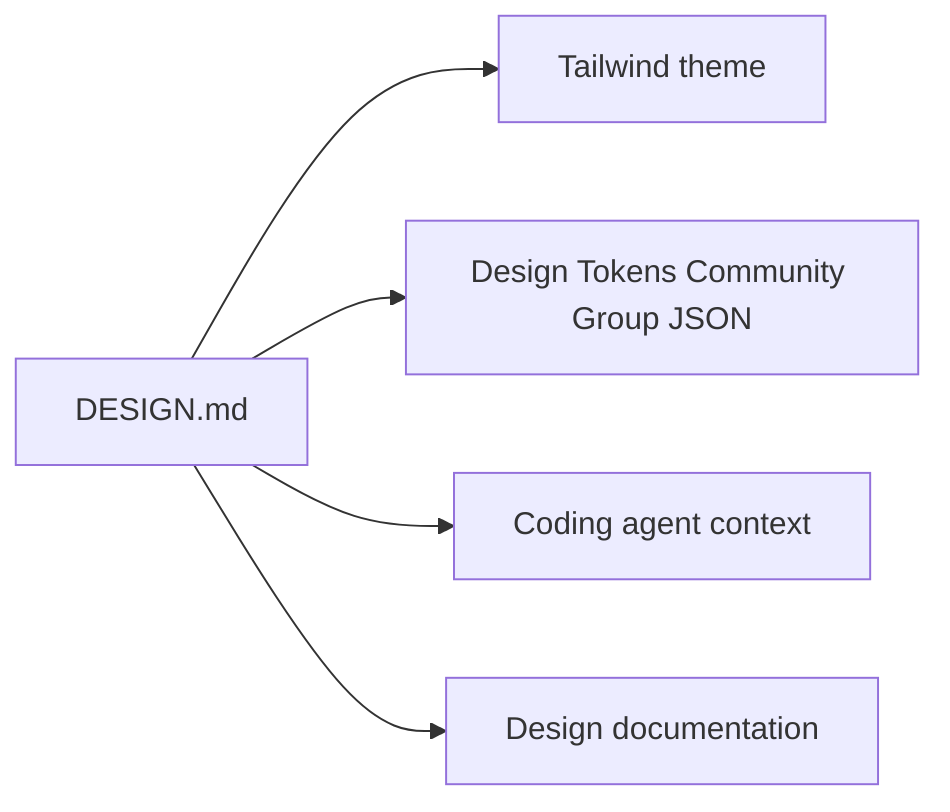

# Google DESIGN.md 设计思路与 Meyo 落地说明

本文用于说明参考项目 `@google/design.md` 的核心设计思路，以及为什么 Meyo 当前选择在仓库根目录新增 `DESIGN.md`，而不是把参考项目的 TypeScript CLI 工程直接搬进根 `uv workspace`。

参考项目的本质不是一个 UI 框架，也不是 Tailwind 主题生成器，而是一个面向 coding agent 的视觉身份描述格式：

```text
DESIGN.md = 可版本化的设计系统源文件
          = 机器可读 tokens
          + 人类可读设计理由
          + 可被 lint / diff / export 的工程契约
```

## 0. 事实边界说明

这篇文档不是 Google `DESIGN.md` 官方 README 的逐段翻译，而是 `Meyo` 对该项目的采用说明。请按三层阅读：

| 类型 | 含义 | 本文位置 |
|---|---|---|
| 官方事实 | `google-labs-code/design.md` 是描述 visual identity 给 coding agents 的格式规范；它使用 YAML front matter 存放机器可读 tokens，用 Markdown prose 存放设计理由；CLI 支持 `lint`、`diff`、`export`、`spec` | 第 1-6 节 |
| 本文归纳 | 将其解释为类似 `AGENTS.md` 的视觉契约，并总结 tokens + prose 对 coding agent 的价值 | 第 1-6 节 |
| Meyo 建议 | 为什么 `Meyo` 只在根目录放 `DESIGN.md`，暂不把 TypeScript CLI monorepo 接入 Python `uv workspace` | 第 7 节之后 |

Google `DESIGN.md` 官方 README 标注该格式当前处于 `alpha`，schema 和 CLI 仍可能变化。本文的 Meyo 落地方式是项目内选择，不是 Google 官方推荐的唯一用法。

## 1. 它要解决什么问题

AI coding agent 做前端时，常见问题不是不会写 CSS，而是缺少稳定的视觉上下文：

- 不知道品牌颜色、字体、圆角、间距应该是什么。
- 只看当前页面，无法理解跨页面一致性。
- 一轮对话里风格正确，下一轮又变了。
- 设计语言只有自然语言描述，无法被校验。
- 设计 token 散落在 CSS、Tailwind、Figma、README、截图里，agent 很难判断哪个是事实源。

`DESIGN.md` 的设计目标是把“视觉身份”变成仓库里的稳定契约。它像 `AGENTS.md` 一样服务 agent，但关注点不同：

| 文件 | 关注点 | 典型内容 |
|---|---|---|
| `AGENTS.md` | 代码协作规则 | 项目边界、测试命令、依赖原则、禁止事项 |
| `DESIGN.md` | 视觉设计规则 | 颜色、字体、圆角、间距、组件风格、设计理由 |

换句话说，`AGENTS.md` 告诉 agent “怎么改这个仓库”，`DESIGN.md` 告诉 agent “这个产品应该长什么样”。

## 2. 核心设计：tokens + prose 双层模型

参考项目最重要的设计取舍，是把一个文件分成两层。



### 2.1 YAML front matter：给机器精确值

YAML 部分是规范值，适合被工具解析、校验和导出。典型结构如下：

```yaml
---
version: alpha
name: Meyo AgentOS
colors:
  primary: "#0F6B4C"
typography:
  body:
    fontFamily: Space Grotesk
    fontSize: 16px
rounded:
  md: 8px
spacing:
  md: 16px
components:
  button-primary:
    backgroundColor: "{colors.primary}"
    rounded: "{rounded.md}"
---
```

这层解决“值是什么”的问题。例如 agent 不需要猜主色是偏蓝还是偏绿，也不需要从 CSS 里反推按钮圆角。

### 2.2 Markdown body：给人和 agent 解释原因

Markdown 部分解释“为什么这么用”。同样是 `#0F6B4C`，如果没有说明，agent 只知道它是绿色；有了 prose，agent 才知道它代表 Meyo 的“操作型绿色”，主要用于链接、活动状态、主操作和平台身份，而不是铺满整页。

这种设计非常关键：token 能保证精确，prose 能约束判断。只有 token 没有 prose，agent 会机械套色；只有 prose 没有 token，agent 会风格漂移。

## 3. 文件结构为什么这么设计

`DESIGN.md` 是 plain text，不依赖 Figma、图片、二进制文件或某个前端框架。这样设计有几个工程收益：

| 设计点 | 作用 |
|---|---|
| 单文件 | 容易放进 prompt、代码审查、PR diff 和仓库根目录 |
| YAML front matter | 机器可读，能 lint、diff、export |
| Markdown body | 人类可维护，能表达设计判断 |
| token reference | 组件 token 可以引用基础 token，减少重复 |
| 固定 section 顺序 | agent 能快速定位 Overview、Colors、Typography、Layout 等内容 |

推荐 section 顺序是：

1. `Overview`
2. `Colors`
3. `Typography`
4. `Layout`
5. `Elevation & Depth`
6. `Shapes`
7. `Components`
8. `Do's and Don'ts`

这个顺序不是为了好看，而是让 agent 先理解整体风格，再读取具体 token，最后读取组件和禁忌。

## 4. Token 模型的设计思路

参考项目采用的是轻量 token schema，而不是完整复刻大型 design system。

```text
colors       -> 视觉语义和色值
typography   -> 字体族、字号、字重、行高、字距
rounded      -> 形状语言
spacing      -> 布局节奏
components   -> 常见组件的语义组合
```

### 4.1 colors：不是调色板截图，而是语义颜色

颜色 token 不是简单列一堆色值，而是要表达语义。例如 Meyo 当前使用：

| token | 含义 |
|---|---|
| `primary` | 平台身份、链接、主操作 |
| `secondary` | 元信息、描述、二级导航 |
| `tertiary` | 警告、排队、数据平面强调 |
| `accent` | 少量关键提醒 |
| `neutral` / `surface` | 页面和内容表面 |

这样 agent 在新增页面时，不会把所有绿色都当主按钮色，也不会把警告色用于普通装饰。

### 4.2 typography：给层级，不只给字体名

字体 token 的重点是“层级”。只写 `fontFamily` 不够，因为 agent 还需要知道标题、正文、标签、代码分别用什么字号、字重和行高。

Meyo 的落地选择是：

- `Space Grotesk`：产品与文档 UI 的主字体。
- `JetBrains Mono`：代码、配置 key、日志、终端输出。
- 产品工具界面优先小字号和高信息密度，避免把 dashboard 做成营销页。

### 4.3 rounded / spacing：约束基础节奏

圆角和间距看似小，但它们决定界面气质。参考项目把它们放进 schema，是为了让 agent 不要每次随手写 `rounded-2xl`、`p-10` 或随机间距。

Meyo 当前的设计基线是：

- 默认组件圆角：`8px`。
- 紧凑导航、列表项：`6px`。
- 文档站继承 Docusaurus 的区域可到 `12px` / `14px`。
- 间距以 `8px` 为主节奏，`4px` 做微调。

### 4.4 components：不是完整组件库，而是语义样例

`components` 的作用是给 agent 一组可复用的组合规则：

```yaml
components:
  button-primary:
    backgroundColor: "{colors.primary}"
    textColor: "{colors.surface}"
    typography: "{typography.label}"
    rounded: "{rounded.md}"
    padding: 12px
```

它不是要替代 React/Svelte 组件库，而是告诉 agent “这种组件在这个品牌下应该如何组合 token”。这样即使具体实现落在 Docusaurus、SvelteKit、React 或普通 CSS 里，设计意图仍然一致。

## 5. Lint / Diff / Export 的工程价值

参考项目提供了 CLI，核心命令包括：

```bash
npx @google/design.md lint DESIGN.md
npx @google/design.md diff DESIGN.md DESIGN-v2.md
npx @google/design.md export --format tailwind DESIGN.md
npx @google/design.md export --format dtcg DESIGN.md
npx @google/design.md spec
```

### 5.1 lint：让设计契约可校验

`lint` 会检查结构问题和部分可访问性问题，例如：

- token reference 是否断裂。
- 是否缺少 `primary` 颜色。
- section 顺序是否异常。
- 是否有重复 section。
- 组件前景色和背景色对比度是否不满足 WCAG AA。

这让 `DESIGN.md` 不只是“写给人看的说明”，而是能进入 CI 或本地验证的工程文件。

Meyo 当前新增的根目录 `DESIGN.md` 已验证通过：

```bash
npx --yes @google/design.md lint DESIGN.md
```

当前结果是 `errors: 0`、`warnings: 0`。

### 5.2 diff：评估设计系统变更风险

`diff` 用于比较两个版本的 `DESIGN.md`。它关注 token 级变化，并判断新版本是否引入更多问题。

这适合用在 PR 审查里：

```text
主色改了？
字体层级改了？
按钮 token 改了？
新版本 lint warning 是否增加？
```

对于长期项目，这比只看 CSS diff 更容易判断“设计系统是否被破坏”。

### 5.3 export：连接 Tailwind / DTCG / 其他工具链

`export` 的意义是让 `DESIGN.md` 成为上游源文件，而不是孤立文档。



后续如果 Meyo 需要更强的前端设计系统，可以从根目录 `DESIGN.md` 导出 token，再同步到 docs site、admin console 或其他 app 的主题配置。

## 6. 它和 Figma / Tailwind / CSS 变量的关系

`DESIGN.md` 不取代 Figma，也不取代 Tailwind 或 CSS 变量。它的位置更像“agent 可读的设计源说明”。

| 工具 | 主要使用者 | 优势 | 不足 |
|---|---|---|---|
| Figma | 设计师、人类评审 | 视觉直观、适合组件设计 | agent 很难稳定读取完整设计意图 |
| CSS variables | 前端运行时 | 直接参与渲染 | 难表达品牌理由和使用原则 |
| Tailwind theme | 前端工程 | utility 体系内好用 | 绑定具体工具链 |
| `DESIGN.md` | 人 + agent + CLI | 可读、可版本化、可校验、可放进 prompt | 不负责具体渲染 |

因此它更适合作为“跨工具设计契约”。Figma 可以提供视觉稿，Tailwind/CSS 负责实现，`DESIGN.md` 负责把视觉身份和设计判断固定下来。

## 7. 对 Meyo 的落地判断

Meyo 当前是 Python `uv workspace` + 多 package 的 AgentOS 仓库，根目录不应该承载无关运行时依赖。参考项目本身是 Bun/Turbo + TypeScript CLI monorepo，如果直接搬进来，会破坏当前仓库边界。

所以当前采用的落地方式是：

```text
Meyo root
  ├─ DESIGN.md                       # 设计系统事实源
  ├─ AGENTS.md                       # agent 协作规则
  ├─ apps/docs-site                  # Docusaurus 文档站
  ├─ apps/meyo-chatbot               # 独立 Open WebUI 应用
  ├─ apps/meyo-studio-flow           # 独立 Langflow 实验台
  └─ packages/*                      # Python workspace packages
```

这个选择符合 Meyo 的边界原则：

- 根目录继续保持 `uv workspace` 容器职责。
- `DESIGN.md` 作为文本文档，不引入运行时依赖。
- 不默认改造 `apps/meyo-chatbot` 和 `apps/meyo-studio-flow` 的原生设计系统。
- 后续如果需要 CLI 校验，可以通过 `npx @google/design.md lint DESIGN.md` 临时运行，或在 docs/CI 层单独接入。

## 8. Meyo 的 DESIGN.md 当前表达了什么

根目录的 `DESIGN.md` 已经把 Meyo 的视觉方向收敛为：

```text
冷静、技术化、操作优先、适合平台工程和 agent runtime 管理。
```

它明确了几条关键原则：

- Meyo 不是公开营销站，而是私有化 AgentOS 框架壳。
- UI 应该优先支持扫描、比较、配置和重复操作。
- 文档站可以更舒展，但产品工具不应做成 hero landing page。
- 主色是深绿色，但不能把界面做成单色绿色系统。
- amber 用于警告和数据平面强调，coral 只用于关键提醒。
- 卡片只用于重复项、弹窗和真正需要框住的工具，不应层层嵌套。
- `apps/meyo-chatbot` 和 `apps/meyo-studio-flow` 保持应用边界，除非有明确任务，不默认强行套 Meyo 视觉系统。

## 9. 后续可以怎么增强

短期建议保持轻量：

1. 根目录保留 `DESIGN.md` 作为 agent 读取的事实源。
2. 前端改造时先让 agent 阅读 `DESIGN.md`，再改 CSS 或组件。
3. 设计 token 变更时运行：

```bash
npx --yes @google/design.md lint DESIGN.md
```

中期可以考虑：

1. 在 docs-site 的构建或 CI 中加入 `DESIGN.md lint`。
2. 将 `DESIGN.md export --format tailwind` 的输出用于新建的 Meyo 专属前端工具。
3. 如果 Meyo 后续有独立 admin console，再把 token 同步为 CSS variables。
4. 对关键 UI PR 使用 `DESIGN.md diff` 检查设计系统回归。

暂时不建议：

- 把参考项目的 `packages/cli` 复制进 Meyo 根 workspace。
- 为了一个设计说明引入 Bun/Turbo monorepo。
- 直接用 `DESIGN.md` 去改造 Open WebUI 或 Langflow 的全部 UI。

## 10. 总结

Google `DESIGN.md` 的思路可以概括为一句话：

```text
把设计系统从“截图和口头约定”变成“agent 能读、工具能校验、代码仓库能版本化”的文本契约。
```

这对 Meyo 很适合，因为 Meyo 本身就是面向 agent、tool mesh、runtime 和工程治理的私有化平台。根目录 `DESIGN.md` 不只是视觉说明，它会成为后续 coding agent 在 Meyo 仓库里做 UI、文档页、控制台和工作台时的稳定设计上下文。

## 11. 参考资料

- Google Labs Code - DESIGN.md: https://github.com/google-labs-code/design.md
- Google DESIGN.md Specification: https://github.com/google-labs-code/design.md/blob/main/docs/spec.md
- Design Tokens Community Group Format: https://tr.designtokens.org/format/
