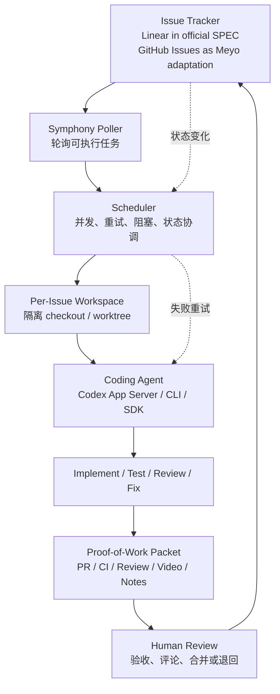
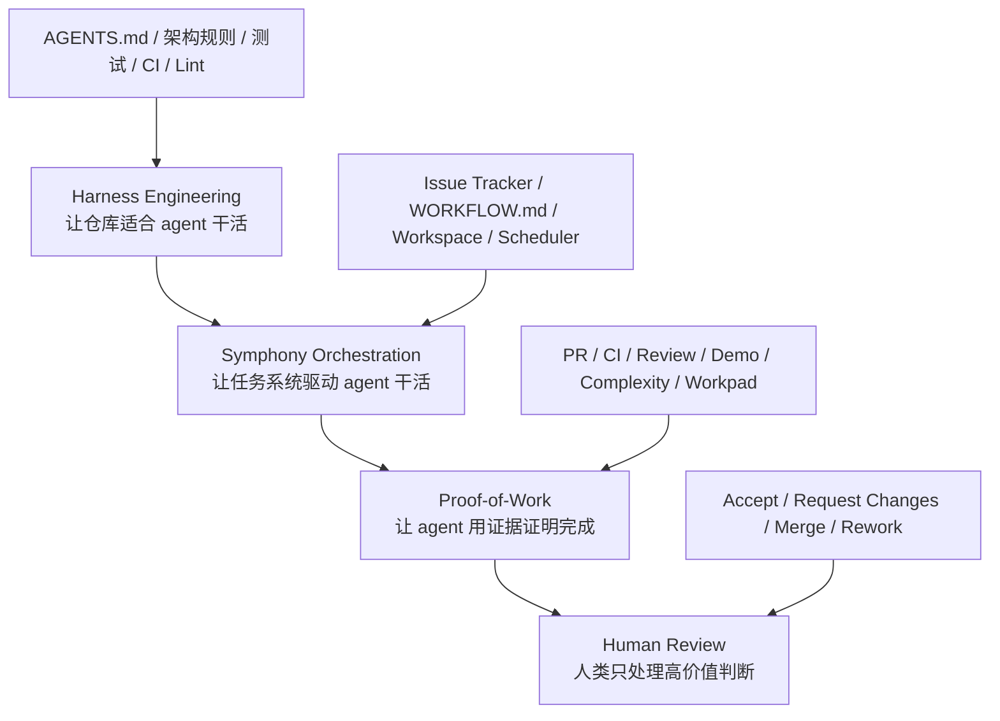
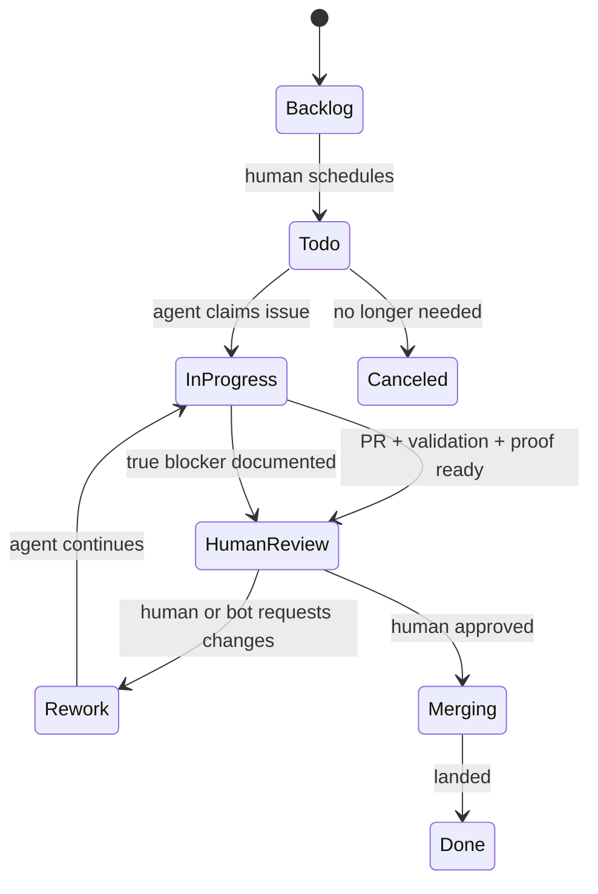
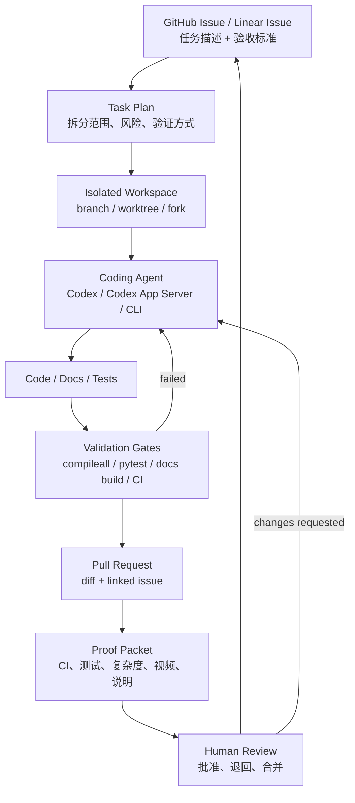
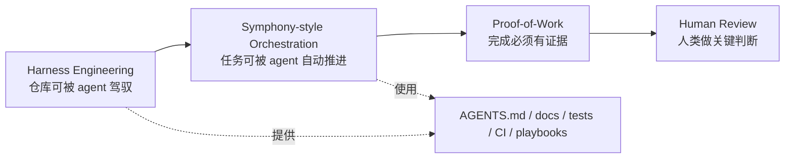

# Symphony：从管理 Codex Session 到管理工程任务

> Symphony 是 OpenAI 开源的 Codex 编排参考方案。它把 Linear 这类项目管理工具变成 coding agent 的控制面：每个 issue 对应一个隔离 workspace 和一个持续运行的 agent，agent 通过 PR、CI、review、复杂度分析、演示视频等 proof-of-work 证明工作完成。本文解释 Symphony 的核心思想，并讨论它如何指导 `Meyo` 的开发方式。

## 0. 阅读结论

先给结论：

- **官方事实**：Symphony 不是新的代码生成模型，也不是替代 LangGraph 的应用运行时。OpenAI 将它定义为一个把工程任务交给 coding agent 执行的编排规格和参考实现。
- **官方事实**：Symphony 的核心变化是控制面迁移：从“人盯着多个 Codex session”迁移到“issue tracker 管任务状态，agent 在隔离 workspace 里执行工作”。
- **官方事实 + 本文归纳**：OpenAI 明确说 Symphony 适合已经采用 Harness Engineering 的代码库，并把它描述为从“管理 coding agents”到“管理要完成的工作”的下一步；本文把它归纳为 Harness Engineering 的工作编排层。
- **官方事实 + 本文扩展**：OpenAI README 明确列出的 proof-of-work 包括 CI status、PR review feedback、complexity analysis、walkthrough videos。本文扩展了 workpad、日志、阻塞说明、验收清单等更适合 `Meyo` 的证据包。
- **本文建议**：对 Meyo 来说，短期不需要照搬 Symphony 服务，但可以采用 Symphony-style 的 issue-driven development harness：每个开发任务都有 issue、隔离分支/workspace、验证门、证据包和 human review。

## 0.1 事实边界说明

这篇文档不是 OpenAI Symphony 原文翻译，而是分成三层：

| 类型 | 含义 | 本文位置 |
|---|---|---|
| 官方事实 | 来自 OpenAI 官方文章、`openai/symphony` README、SPEC、WORKFLOW 示例、Codex App Server 文档 | Symphony 定义、Linear/issue tracker、隔离 workspace、`WORKFLOW.md`、Codex App Server、CI/PR/review/复杂度/视频 proof-of-work |
| 本文归纳 | 基于官方资料做的架构抽象，帮助理解其设计模式 | “Session Control 到 Work Control”、Symphony 与 Harness Engineering 分层、状态机示意、Symphony 与 LangGraph 边界 |
| Meyo 建议 | 针对当前 `Meyo` 项目的落地方案，不是 OpenAI 官方要求 | `Meyo Symphony Lite`、Issue 模板、PR proof packet 模板、`WORKFLOW.md for Meyo`、落地路线 |

如果你要学习“OpenAI 官方 Symphony 是什么”，请优先看第 1 到第 9 节和参考资料。第 10 节之后更多是本文对 `Meyo` 的架构迁移建议。

## 1. Symphony 是什么

OpenAI 在 2026-04-27 发布了 Symphony 文章和开源仓库。它的定位很清楚：

**Symphony turns project work into isolated, autonomous implementation runs.**

通俗讲：

```text
以前：
  工程师打开多个 Codex session
  手动分配任务
  手动检查进度
  手动催它修 CI
  手动整理 PR

Symphony：
  工程师只维护 issue board
  Symphony 轮询 issue
  每个 issue 启动一个隔离 workspace + coding agent
  agent 自己实现、验证、开 PR、更新状态
  人类最后看 proof-of-work 和 PR
```

它解决的不是“模型会不会写代码”，而是更靠后的问题：

**当 coding agent 变多以后，人类注意力成了瓶颈。**

一个工程师也许可以同时看 3 到 5 个 Codex session。再多之后，就会忘记哪个 session 在做什么、哪个卡住了、哪个要 review、哪个 CI 挂了。Symphony 的思路是：不要再管理 session，而是管理工作项。

## 2. Symphony 的核心模型

基于 OpenAI README 和 SPEC，本文把 Symphony 抽象成 6 个核心对象。

| 对象 | 作用 | 通俗解释 |
|---|---|---|
| Issue Tracker | 控制面 | 官方 SPEC 当前版本是 Linear；GitHub Issues 属于本文对 Meyo 的可选扩展设想 |
| Issue | 工作单元 | 一个需求、bug、重构、调查任务 |
| Workspace | 隔离执行空间 | 每个 issue 独立 checkout / worktree / sandbox |
| Coding Agent | 执行者 | Codex 或其他 coding agent |
| Workflow Contract | 行为规则 | 仓库里的 `WORKFLOW.md` |
| Proof-of-Work | 完成证明 | PR、CI、review、视频、分析报告等证据 |

整体流程如下：



关键是：issue tracker 不再只是人类排期工具，而是 agent 的状态机。

## 3. 从 Session Control 到 Work Control

传统 coding agent 使用方式是 session-centric：

```text
Session 1: 修 bug
Session 2: 写测试
Session 3: 做重构
Session 4: 查 CI
```

这个方式的问题是：

- session 太多时人类会丢上下文
- session 卡住后需要人工发现
- session 的工作进度不一定同步到项目管理工具
- session 和 PR、CI、review 之间缺少统一状态
- session 结束不代表任务完成

Symphony 把中心从 session 换成 issue：

```text
Issue A:
  workspace A
  agent A
  branch A
  PR A
  proof packet A

Issue B:
  workspace B
  agent B
  branch B
  PR B
  proof packet B
```

这就是控制面的变化：

```text
以前：人类管理 Codex session
现在：任务系统管理 agent work
```

## 4. Symphony 和 Harness Engineering 的关系

Symphony 不是替代 Harness Engineering，而是建立在 Harness Engineering 之上。

可以这样分层：



Harness Engineering 解决的是：

```text
AI 进仓库后怎么不乱写？
AI 怎么知道架构边界？
AI 改完怎么自测？
AI 失败后怎么纠偏？
```

Symphony 进一步解决的是：

```text
谁给 AI 分配任务？
多个 AI 同时工作怎么隔离？
AI 卡住了谁重启？
CI 挂了谁盯？
PR 到什么状态才交给人？
人类怎么只看结果和证据？
```

所以可以把 Symphony 理解成：

**面向 coding agent 的 work orchestration harness。**

## 5. WORKFLOW.md：把隐性工程流程写进仓库

Symphony 的一个关键设计是把 workflow policy 放进仓库的 `WORKFLOW.md`。

这很重要。很多团队真实的开发流程其实是口口相传的：

```text
领任务前先改 issue 状态
开发前先确认复现路径
开 PR 后要贴 Linear 链接
CI 失败要自己修
复杂改动要写风险说明
前端改动要录演示视频
合并前要等 review
```

对人类来说，这些是习惯。对 agent 来说，如果不写进仓库，它就不存在。

Symphony-style 的 `WORKFLOW.md` 应该至少描述：

| 内容 | 说明 |
|---|---|
| Tracker 配置 | 用 Linear、GitHub Issues，哪些状态可执行 |
| Workspace 配置 | workspace 根目录、初始化 hook、清理 hook |
| Agent 配置 | 使用 Codex App Server、CLI、SDK 或其他 runtime |
| Issue 状态机 | Todo、In Progress、Rework、Human Review、Merging、Done |
| 默认行为 | 先更新 workpad、先复现、先规划验证 |
| Proof 要求 | PR、CI、测试结果、复杂度分析、视频、风险说明 |
| 阻塞策略 | 缺权限、缺 secret、环境不可用时怎么记录 |
| 安全策略 | 允许什么工具、禁止什么路径、是否需要审批 |

它本质上是 coding agent 的工程操作手册。

## 6. Proof-of-Work：Agent 不能只说完成

Symphony 最值得借鉴的不是“自动开很多 agent”，而是 **Proof-of-Work**。

对 coding agent 来说，最危险的输出是：

```text
我已经完成了。
```

这句话没有工程价值。真正有价值的是证据：

```text
PR 在这里。
CI 全绿。
测试命令是这些。
复杂度变化是这些。
我改了哪些文件，为什么改。
这个视频展示了功能真的能跑。
这个 review comment 已经处理。
这个风险还需要人类确认。
```

OpenAI README 明确提到的 proof-of-work 包括：

- CI status
- PR review feedback
- complexity analysis
- walkthrough videos

下面这张表是本文面向 `Meyo` 扩展出来的 proof packet 建议，不是 Symphony SPEC 的强制字段：

| 证据 | 作用 |
|---|---|
| PR 链接 | 人类审查真实 diff |
| CI 状态 | 证明基础验证通过 |
| 本地测试命令和结果 | 证明 agent 自己跑过验证 |
| Review feedback 状态 | 证明评论被处理 |
| Complexity analysis | 说明改动复杂度、风险点、热点文件 |
| Demo video / screenshot | 对 UI 和交互功能提供可见证明 |
| Workpad comment | 记录过程、假设、阻塞和决策 |
| Acceptance criteria checklist | 一条条对应 issue 需求 |
| Rollback note | 出问题时怎么回滚 |

这和 Harness Engineering 的核心一致：

```text
不要相信声明，要相信可验证证据。
```

## 7. Symphony 的状态机

不同团队的状态可以不同。下面这张图是本文为了帮助理解而画的状态机示意，不是 OpenAI SPEC 的规范状态机。

OpenAI 示例 `WORKFLOW.md` 中出现的状态包括 `Backlog`、`Todo`、`In Progress`、`Human Review`、`Merging`、`Rework`、`Done` 等；SPEC 也强调具体状态和 handoff state 可以由 workflow 定义。



这个状态机体现了一个重要原则：

**Agent 可以推进工作，但不应该绕过验证和人类验收。**

## 8. Codex App Server 在 Symphony 里的位置

OpenAI 官方文章提到，Symphony 使用 Codex App Server 来做可编程集成。

可以这样理解：

```text
Codex CLI:
  更适合人类在终端里交互使用。

Codex App Server:
  更适合被 Symphony 这类 orchestrator 以协议方式驱动。
```

Codex App Server 提供了线程、turn、事件流、approval、动态工具调用等能力。对 Symphony 来说，它解决的是：

- 如何程序化启动一个 Codex 工作线程
- 如何监听 agent 进度
- 如何处理命令执行和文件变更审批
- 如何注入动态工具，例如 Linear GraphQL
- 如何把 agent 运行状态变成 orchestrator 可观察事件

在 `Meyo` 语境下，可以把它类比成：

```text
Symphony = engineering work orchestrator
Codex App Server = coding-agent runtime adapter
Linear / GitHub Issues = work control plane
GitHub PR / CI = proof-of-work surface
```

## 9. Symphony 不是通用 workflow engine

这一点非常重要。

根据 SPEC 的 Non-Goals，Symphony 不是通用工作流引擎或分布式任务调度器，也不试图规定完整的 dashboard、多租户控制面或业务审批系统。本文归纳为：Symphony 不是：

- 通用 BPMN
- 通用分布式任务调度器
- 通用 LangGraph 替代品
- 通用企业审批流
- 多租户 SaaS 控制面

它更像是：

```text
Coding-agent work runner
Issue-driven implementation daemon
Reference implementation for orchestration
```

OpenAI 也把它定位成参考实现，而不是长期维护的完整产品。

所以对 `Meyo` 来说，正确姿势不是照搬 Symphony，而是吸收它的架构原则：

```text
Issue as work unit
Workspace as isolation
Workflow as repository contract
Agent as executor
CI/PR/demo as proof
Human review as final gate
```

## 10. Symphony 和 LangGraph 的边界

这篇文章需要和前一篇 Harness Engineering 文档连起来看。

`Meyo` 是 `LangGraph-first`，但 Symphony 不应该被理解成“再搞一个 LangGraph”。

本节是针对 `Meyo` 的架构判断，不是 OpenAI 官方对 LangGraph 的比较。

两者边界不同：

| 维度 | Symphony | LangGraph |
|---|---|---|
| 管什么 | 工程任务执行 | 应用运行时流程 |
| 面向谁 | Coding agent / 工程开发 | 业务 agent / 产品能力 |
| 控制面 | Issue tracker | Run API / state graph |
| 状态单位 | Issue / PR / workspace | Thread / run / state |
| 输出 | PR、报告、视频、proof packet | 用户回答、工具结果、业务动作 |
| 验收 | CI、review、人类合并 | eval、guardrail、业务状态机 |
| 适用场景 | 开发任务自动化 | 产品 agent runtime |

换句话说：

```text
Symphony 管“怎么让 AI 帮我们开发 Meyo”。
LangGraph 管“Meyo 运行时怎么编排业务 agent”。
```

它们是互补关系，不是替代关系。

## 11. 对 Meyo 的启发

`Meyo` 当前还是框架壳，正处于从“文档基线”走向“真实可运行系统”的阶段。这个阶段最需要的是：

- 稳定的任务切片方式
- 清晰的 package 边界
- 可重复的开发 playbook
- 最小但真实的验证门
- 人类只在关键判断点介入

从这里开始，内容主要是本文对 `Meyo` 的落地建议，不属于 Symphony 官方规范。

Symphony 给 `Meyo` 的启发是：

**不要把 AI 开发当成临时对话，要把它纳入工程任务流。**

对 `Meyo` 来说，短期可以先做一个轻量版。这个 `Meyo Symphony Lite` 是本文命名的内部实践方案，不是 OpenAI 官方项目：

```text
Meyo Symphony Lite
  = GitHub Issue / Linear Issue
  + 独立分支或 worktree
  + coding agent prompt
  + development playbook
  + test/docs build gates
  + PR proof packet
  + human review
```

不需要一开始就有 daemon，不需要一开始就有多 agent，不需要一开始就有完整 app-server 集成。

先把每个开发任务变成可审查、可复现、可验证的工作单元。

## 12. Meyo Symphony Lite：建议架构

第一阶段可以设计成下面这样：



这条链路对当前 `Meyo` 很实用，因为它不要求一次性建设完整平台，只要求每个任务有明确证据。

## 13. Meyo Issue 模板

如果要按 Symphony-style 开发，issue 不能只写一句话。

建议 issue 至少包含：

```markdown
# Task

一句话说明要完成什么。

## Context

- 相关文档：
  - apps/docs-site/docs/application/base_project/architecture_design.md
  - apps/docs-site/docs/application/base_project/packages_architecture.md
- 相关模块：
  - packages/meyo-core/...
  - packages/meyo-serve/...

## Scope

- 需要修改什么
- 不允许修改什么
- 是否涉及 public API
- 是否涉及数据库 schema
- 是否涉及 LangGraph runtime

## Acceptance Criteria

- [ ] 功能行为满足描述
- [ ] package 边界没有被破坏
- [ ] 有测试或明确说明为什么暂时没有
- [ ] 文档已更新
- [ ] CI / 本地验证通过

## Proof-of-Work Required

- PR 链接
- 测试命令和结果
- 复杂度 / 风险说明
- UI 改动需要截图或视频
- 如果无法完成，必须说明 blocker
```

这样 issue 本身就是 agent 的任务合同。

## 14. Meyo PR Proof Packet 模板

PR 描述应该变成 agent 的 proof packet，而不是普通总结。

推荐模板：

````markdown
## Summary

- 做了什么
- 为什么这么做

## Linked Issue

- Closes #...

## Files Changed

- packages/...
- apps/docs-site/...

## Architecture Boundary Check

- [ ] 没有让业务层直接依赖 LangGraph internals
- [ ] 没有把 provider-specific 逻辑写进 core
- [ ] 没有绕过 ToolGateway / MemoryGateway / KnowledgeGateway 边界

## Validation

```bash
python -m compileall packages
uv run pytest
cd apps/docs-site && bun run build
```

结果：

- compileall: pass / fail / not run
- pytest: pass / fail / not run
- docs build: pass / fail / not run

## Complexity / Risk

- 改动复杂度：low / medium / high
- 风险点：
- 回滚方式：

## Demo

- 截图 / 视频 / curl 输出 / trace 链接

## Blockers

- 无
````

这个模板的价值是把 review 从“读 agent 自夸”变成“审查证据”。

## 15. WORKFLOW.md for Meyo

如果 `Meyo` 要采用 Symphony-style 开发，建议后续新增一个仓库级 `WORKFLOW.md`。

它和 `AGENTS.md` 的区别是：

| 文件 | 作用 |
|---|---|
| `AGENTS.md` | 项目规则、架构边界、开发入口 |
| `WORKFLOW.md` | issue 如何被 agent 执行、验证、提交和交接 |

一个最小版 `WORKFLOW.md` 可以这样定义：

```markdown
# Meyo Agent Development Workflow

## Tracker

- Source: GitHub Issues or Linear
- Active states: Todo, In Progress, Rework
- Human states: Human Review, Merging
- Terminal states: Done, Canceled

## Default Agent Posture

- Read AGENTS.md first.
- Read linked docs before editing.
- Work only in the assigned branch/worktree.
- Reproduce or inspect current behavior before changing code.
- Keep issue progress updated.
- Do not stop with "next steps for user" unless blocked.

## Required Proof

- PR linked to issue.
- Validation commands and results.
- Architecture boundary checklist.
- Complexity/risk note.
- Demo evidence for UI/API behavior.

## Validation Gates

- Python changes: python -m compileall packages
- Behavior changes: uv run pytest
- Docs changes: cd apps/docs-site && bun run build

## Human Review

- Human approval is required before merge.
- High-risk changes require explicit architecture note.
- Security, permission, tool execution, and data mutation changes require manual review.
```

这就是把隐性工程流程变成 agent 可执行协议。

## 16. 和现有 Harness 文档的关系

前一篇 Harness Engineering 文档回答的是：

```text
Meyo 这种 AgentOS 壳项目，怎样让 AI 编码智能体可靠参与开发？
```

这篇 Symphony 文档回答的是：

```text
当 AI 编码智能体可以可靠参与开发之后，怎样把一批工程任务交给它们自动推进？
```

关系如下：



所以不要跳过 Harness 直接上 Symphony。

如果仓库没有清晰架构、没有测试、没有 CI、没有开发 playbook，Symphony 只会把混乱并发放大。

## 17. 风险和限制

Symphony-style 工作方式很强，但有明显边界。

### 17.1 它会放大已有问题

如果仓库本身没有规则，多个 agent 同时开发只会更快地产生坏代码。

前提条件应该是：

- package 边界清楚
- 验证命令可运行
- docs 可信
- issue 描述足够清楚
- PR review 能跟上

### 17.2 它不适合强判断任务

这些任务不应该直接扔给 unattended agent：

- 核心架构方向
- 安全边界设计
- 数据权限模型
- 重大依赖替换
- 产品策略判断
- 高风险生产变更

这类任务可以让 agent 做调研和候选方案，但最终判断必须由人类负责。

### 17.3 Proof 不是正确性的充分条件

CI 绿、PR 存在、视频能跑，都不能百分百证明需求正确。

它们只能说明：

```text
这个结果具备可审查证据。
```

最终仍然需要 human review、业务验收和长期反馈。

### 17.4 成本和并发需要治理

Symphony-style 会增加：

- agent token 成本
- CI 成本
- workspace 存储成本
- review 压力
- 冲突处理成本

所以必须有并发上限、任务优先级、自动停止、重试上限和预算记录。

## 18. Meyo 的落地路线

建议分 4 步做，不要一口吃成完整 Symphony。

### 18.1 Step 1：先把 issue 写好

目标：

```text
每个任务都能被 agent 读懂，并且有明确验收标准。
```

要做：

- 增加 issue 模板
- 增加 PR proof packet 模板
- 要求 issue 链接相关文档
- 要求任务写清楚 scope / non-scope

### 18.2 Step 2：补 WORKFLOW.md

目标：

```text
把开发流程写成 agent 可执行契约。
```

要做：

- 明确 issue 状态
- 明确 agent 默认行为
- 明确 proof-of-work 要求
- 明确 validation gates
- 明确 human review 条件

### 18.3 Step 3：做手动 Symphony Lite

目标：

```text
先用人工触发 agent，但按 Symphony 证据标准交付。
```

做法：

- 人从 issue 创建 agent task
- agent 在独立分支/worktree 做
- agent 开 PR
- agent 填 proof packet
- 人 review

这个阶段不需要 daemon。

### 18.4 Step 4：再做自动 orchestrator

目标：

```text
当手动流程稳定后，再自动轮询 issue 和调度 agent。
```

可以逐步加入：

- issue polling
- bounded concurrency
- workspace manager
- Codex App Server adapter
- retry / stall detection
- CI watcher
- PR status sync
- Linear / GitHub state transitions

这个阶段才接近真正的 Symphony。

## 19. 最终结论

Symphony 给 `Meyo` 的最大启发，不是“马上做一个多 agent 平台”，而是：

**把 AI 编码从聊天窗口，搬进工程任务系统。**

也就是说：

```text
Issue 是任务合同。
Workspace 是隔离执行空间。
Workflow 是 agent 行为协议。
PR 是交付物。
CI 和 review 是质量门。
Demo 和复杂度分析是证明材料。
Human Review 是最终判断。
```

对当前 `Meyo` 来说，最实用的落地方式是：

```text
先做 Harness Engineering，
再做 Symphony-style issue workflow，
最后才考虑自动化 orchestrator。
```

这样既能利用 AI 编码智能体的吞吐量，又不会把一个还在成形中的 AgentOS 壳项目变成无人监管的并发代码生成实验。

## 20. 参考资料

- [OpenAI：An open-source spec for Codex orchestration: Symphony](https://openai.com/index/open-source-codex-orchestration-symphony/)
- [GitHub：openai/symphony](https://github.com/openai/symphony)
- [GitHub：Symphony SPEC.md](https://github.com/openai/symphony/blob/main/SPEC.md)
- [OpenAI Developers：Codex App Server](https://developers.openai.com/codex/app-server/)
