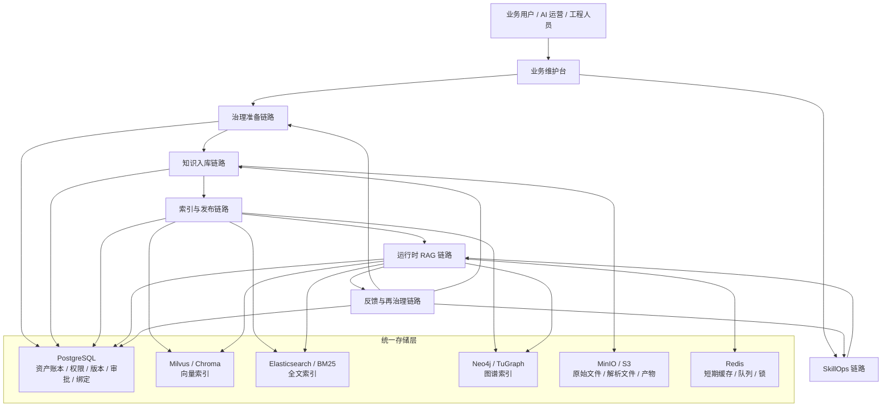
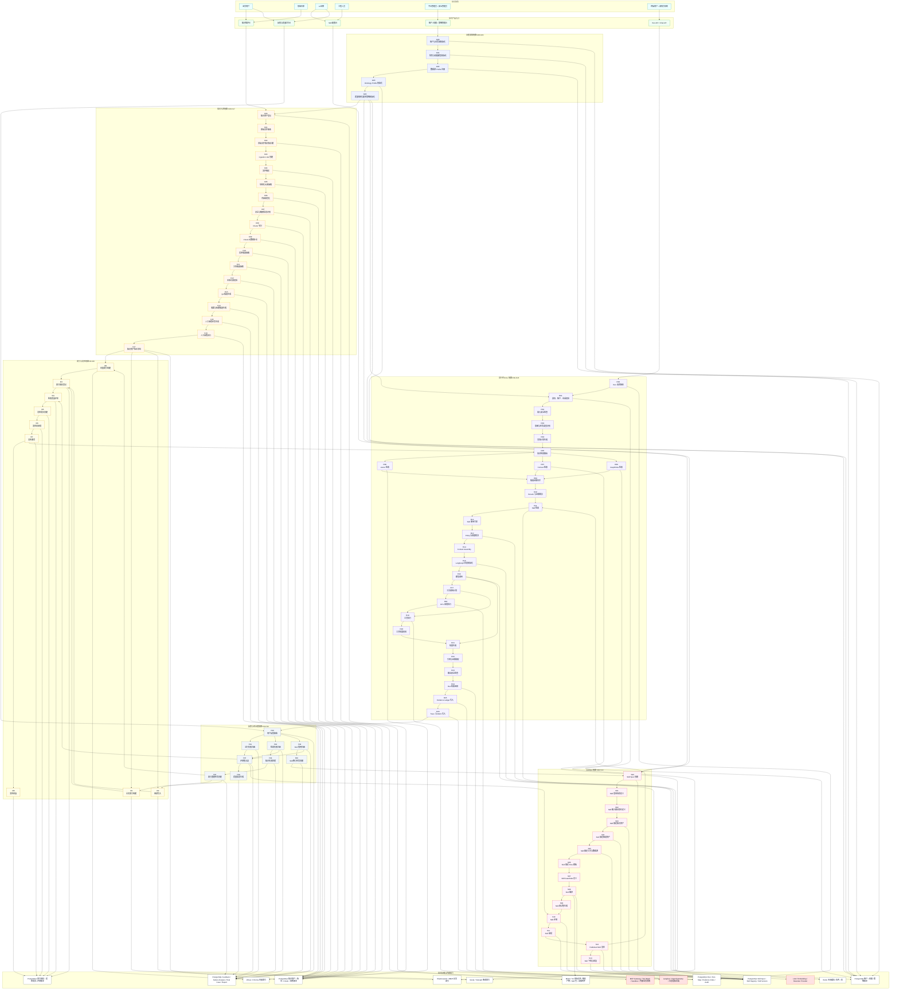
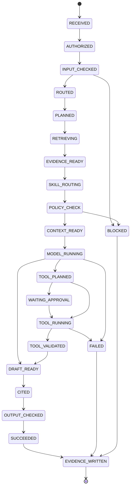

# Meyo DataOps + RAG 企业级完整方案

## 0. 文档边界

本文定义 `Meyo` 中面向企业 AgentOS 的完整 `DataOps + RAG` 方案。它不是单独的向量检索方案，也不是只讲 Ontology 或 GraphRAG 的专题，而是把知识维护、技能维护、资产发布、运行时检索、审计、反馈闭环放进同一条显式链路。

本文有三个强约束：

1. **所有生产节点必须显式编号**：没有“系统自动处理一下”“平台内部转换一下”这类隐式节点。
2. **所有节点必须有输入、处理、输出、落库、责任方、失败处理、验收口径**。
3. **所有运行时决策必须可追踪**：包括为什么检索、为什么不用检索、为什么加载 Skill、为什么拒绝工具调用。

本文默认 `Meyo` 的技术底座为：

```text
FastAPI + LangGraph + PostgreSQL + Redis + Milvus/Chroma + Elasticsearch/BM25 + Neo4j/TuGraph + MinIO/S3 + MCP + Langfuse + OpenTelemetry
```

## 1. 一句话结论

`Meyo DataOps + RAG` 的完整方案是：

**业务用户维护知识和 Skill Spec，平台用 DataOps 把它们治理成可版本化、可审核、可检索、可执行、可审计的资产；运行时由 LangGraph 通过 KnowledgeGateway、SkillGateway、ToolGateway、PolicyGateway 和 EvidenceGateway 显式编排。**

这里的 RAG 不是只有文档 RAG，而是四类召回同时治理：

| 召回类型 | 检索对象 | 主要用途 | 主要存储 |
|---|---|---|---|
| Vector RAG | Chunk、QA、术语、摘要 | 语义相似召回 | Milvus / Chroma |
| Full-text RAG | 原文、标题、编号、关键词 | 精确词、编号、法规条款召回 | Elasticsearch / BM25 |
| GraphRAG | 实体、关系、路径、子图 | 关系推理、证据链、影响分析 | Neo4j / TuGraph |
| Skill-RAG | Skill Spec、Published Skill、Flow 模板 | 任务能力路由和流程执行 | PostgreSQL + Skill Registry |

## 2. 总体架构



### 2.1 RAG 场景全量显式架构图

这张图是生产链路总图，约束如下：

- 不使用省略号。
- 不使用“内部处理”“平台自动处理”“Pipeline”这类未编号节点。
- 每个 `G/K/I/S/R/F` 节点都和第 5 节的完整节点清单一一对应。
- 节点第一行显示第 5 节编号，第二行显示节点名称，便于按编号查阅展开说明。
- 存储、模型、工具、观测、人工入口都用命名节点表示。



## 3. 分层职责

| 层 | 职责 | 不负责 |
|---|---|---|
| 业务维护层 | 上传知识、维护术语、本体草案、审核 QA、审核关系、配置 Skill Spec | 直接写 Python、直接改向量库、绕过发布流程 |
| DataOps 层 | 解析、清洗、切分、抽取、索引、质量评估、发布、回滚 | 代替业务方判断业务事实是否正确 |
| Runtime 层 | 意图识别、检索、Skill 路由、工具执行、答案生成、证据记录 | 静默使用无权限资产、静默调用高风险工具 |
| Governance 层 | RBAC、ACL、DLP、审批、版本、审计、风险策略 | 只靠 Prompt 约束安全 |
| Observability 层 | Trace、Metric、Eval、成本、错误归因、质量面板 | 作为事实主库 |

## 4. 三库一账本

成熟方案的系统事实主轴不是向量库，也不是图库，而是 `PostgreSQL` 资产账本。

```text
PostgreSQL：谁、在什么业务域、维护了哪个资产、哪个版本、绑定了哪些索引、何时发布、谁审批、谁使用
Vector Store：根据 asset_version 派生出的语义索引
Full-text Store：根据 asset_version 派生出的关键词索引
Graph Store：根据 asset_version 派生出的实体关系索引
Object Store：原始文件、解析中间产物、报告、证据附件
```

核心原则：

1. `asset_id` 表示逻辑知识资产。
2. `version_id` 表示一次可追溯内容版本。
3. `publish_batch_id` 表示一次对外生效的发布批次。
4. `vector_id`、`fulltext_doc_id`、`graph_node_id`、`graph_edge_id` 都是派生索引，不是事实主键。
5. 删除、回滚、重建索引都必须从 `PostgreSQL` 的资产账本发起。

## 5. 完整大节点链路

本节是全链路的唯一编号清单。任何实现、流程图、产品页面、API、后台任务都必须能映射到以下节点之一。没有列出的节点不允许在生产链路中隐式存在。

```text
治理准备链路：
G00 租户与业务域初始化
G01 角色与权限模型初始化
G02 数据源 Profile 注册
G03 Ontology Profile 初始化
G04 质量规则与发布策略初始化

知识入库链路：
K00 知识资产登记
K01 原始文件接收
K02 原始文件落对象存储
K03 Ingestion Job 创建
K04 文件解析
K05 结构化元素抽取
K06 内容规范化
K07 安全与敏感信息识别
K08 Chunk 切分
K09 Chunk 元数据补全
K10 实体候选抽取
K11 关系候选抽取
K12 本体约束校验
K13 QA 候选生成
K14 摘要与标题候选生成
K15 人工审核任务生成
K16 人工审核执行
K17 知识资产版本冻结

索引与发布链路：
I00 向量索引构建
I01 全文索引构建
I02 图谱写入
I03 索引绑定登记
I04 检索质量评测
I05 发布批次创建
I06 发布前审批
I07 发布激活
I08 发布回滚

SkillOps 链路：
S00 Skill Spec 创建
S01 Skill 适用场景定义
S02 Skill 输入输出契约定义
S03 Skill 绑定知识资产
S04 Skill 绑定图谱资产
S05 Skill 绑定工具与数据源
S06 Skill 绑定 Flow 模板
S07 Skill Guardrails 定义
S08 Skill 编译
S09 Skill 测试集生成
S10 Skill 评测
S11 Skill 审批
S12 Published Skill 发布
S13 Skill 下线与回滚

运行时 RAG 链路：
R00 Run 请求接收
R01 身份、租户、会话校验
R02 输入安全检查
R03 意图与任务类型识别
R04 查询计划生成
R05 知识检索路由
R06 Vector 检索
R07 Full-text 检索
R08 GraphRAG 检索
R09 候选证据归并
R10 Rerank 与证据裁剪
R11 Skill 检索
R12 Skill 使用门控
R13 Policy 与权限裁决
R14 Context Assembly
R15 LangGraph 状态初始化
R16 模型调用
R17 工具调用计划
R18 HITL 审批执行
R19 工具执行
R20 工具结果校验
R21 结果生成
R22 引用与证据绑定
R23 输出安全检查
R24 Run 结果返回
R25 Evidence Ledger 写入
R26 Trace 与 Metric 写入

反馈与再治理链路：
F00 用户反馈接收
F01 运行失败归因
F02 检索失败归因
F03 Skill 错用归因
F04 知识失效处理
F05 索引重建任务创建
F06 Skill 修订任务创建
F07 评测集沉淀
F08 质量报表生成
```

## 6. 治理准备链路节点展开

### G00 租户与业务域初始化

- 目的：创建知识、Skill、运行时隔离边界。
- 输入：租户名称、业务域名称、环境标识、管理员账号。
- 处理：生成 `tenant_id`、`domain_id`、默认 namespace、默认存储前缀。
- 输出：租户记录、业务域记录、默认 namespace。
- 落库：`tenants`、`business_domains`、`namespaces`。
- 责任方：平台管理员。
- 失败处理：缺少管理员或业务域重名时拒绝创建；不得自动合并业务域。
- 验收口径：任意资产、Skill、Run 都能追溯到唯一 `tenant_id` 和 `domain_id`。

### G01 角色与权限模型初始化

- 目的：定义谁能看、谁能改、谁能发布、谁能运行。
- 输入：角色列表、用户组、数据级别、操作权限。
- 处理：创建 RBAC、ACL、发布审批角色、运行时访问策略。
- 输出：角色、权限、用户组绑定。
- 落库：`roles`、`permissions`、`user_groups`、`acl_policies`。
- 责任方：平台管理员、安全管理员。
- 失败处理：权限策略不完整时禁止资产发布；不得默认开放给全部用户。
- 验收口径：任意检索结果都必须经过 ACL 过滤。

### G02 数据源 Profile 注册

- 目的：把外部系统接入变成可审计资产。
- 输入：数据源类型、连接方式、凭据引用、同步范围、刷新周期。
- 处理：登记连接配置，测试连通性，绑定密钥引用，定义同步边界。
- 输出：`data_source_profile_id`。
- 落库：`data_source_profiles`、`secret_refs`、`sync_policies`。
- 责任方：工程人员、数据管理员。
- 失败处理：连接失败或凭据缺失时 Profile 不可启用。
- 验收口径：凭据只保存引用，不在配置、日志、文档中出现明文。

### G03 Ontology Profile 初始化

- 目的：定义业务实体、关系、属性和约束。
- 输入：业务术语表、实体类型、关系类型、属性定义、约束规则。
- 处理：创建本体版本，定义抽取白名单、关系合法性、字段敏感级别。
- 输出：`ontology_profile_id`、`ontology_version_id`。
- 落库：`ontology_profiles`、`ontology_entity_types`、`ontology_relation_types`、`ontology_constraints`。
- 责任方：领域专家、知识管理员。
- 失败处理：关系没有定义方向或约束时不得进入自动图谱写入。
- 验收口径：每个图谱实体和关系都能映射到本体类型。

### G04 质量规则与发布策略初始化

- 目的：定义知识和 Skill 什么时候可以发布。
- 输入：质量阈值、审核策略、风险等级、回滚规则、有效期规则。
- 处理：生成质量规则集和发布策略。
- 输出：`quality_policy_id`、`publish_policy_id`。
- 落库：`quality_policies`、`publish_policies`。
- 责任方：AI 运营、安全管理员、业务负责人。
- 失败处理：无发布策略的业务域不得发布知识或 Skill。
- 验收口径：每个发布批次都有明确质量规则和审批策略。

## 7. 知识入库链路节点展开

### K00 知识资产登记

- 目的：先建立资产账本，再处理内容。
- 输入：标题、业务域、来源、资产类型、Owner、ACL、有效期、风险等级。
- 处理：生成 `asset_id`，记录逻辑资产。
- 输出：`knowledge_asset`。
- 落库：`knowledge_assets`。
- 责任方：业务用户、知识管理员。
- 失败处理：缺少 Owner、ACL、业务域时拒绝登记。
- 验收口径：任何文件处理任务都必须引用已存在的 `asset_id`。

### K01 原始文件接收

- 目的：接收用户上传或系统同步的原始内容。
- 输入：文件、URL、数据库记录、API 返回、表格、图片或压缩包。
- 处理：计算文件 hash、识别 MIME、记录大小、记录来源。
- 输出：`raw_object_manifest`。
- 落库：`raw_object_manifests`。
- 责任方：系统。
- 失败处理：文件为空、类型不支持、大小超限时拒绝。
- 验收口径：原始内容有 hash，可重复检测。

### K02 原始文件落对象存储

- 目的：保存不可变原始证据。
- 输入：原始文件、`asset_id`、hash。
- 处理：写入对象存储，生成 `object_uri`。
- 输出：不可变原始对象。
- 落库：`object_store_refs`，对象存储为 MinIO/S3。
- 责任方：系统。
- 失败处理：写入失败时停止后续解析；不得只在临时目录继续处理。
- 验收口径：任何解析结果都能追溯到原始对象 URI 和 hash。

### K03 Ingestion Job 创建

- 目的：把处理过程变成可恢复任务。
- 输入：`asset_id`、`object_uri`、解析配置、目标本体、质量策略。
- 处理：生成 `ingestion_job_id`，初始化状态。
- 输出：入库任务。
- 落库：`ingestion_jobs`。
- 责任方：系统。
- 失败处理：重复文件可创建新版本任务，但必须记录重复来源。
- 验收口径：每次入库都有独立任务 ID 和状态流转。

### K04 文件解析

- 目的：把原始文件解析为可处理文本和结构。
- 输入：`object_uri`、MIME、解析器配置。
- 处理：PDF 解析、Office 解析、HTML 解析、Markdown 解析、表格解析。
- 输出：`parsed_document`。
- 落库：`parsed_document_refs`，解析产物落对象存储。
- 责任方：系统。
- 失败处理：解析失败时记录解析器、错误、页码或对象位置。
- 验收口径：解析产物保留页码、段落、表格、图片引用。

### K05 结构化元素抽取

- 目的：保留文档结构，不把文档压平成一坨文本。
- 输入：`parsed_document`。
- 处理：抽取标题、段落、列表、表格、图片、脚注、页眉页脚、章节层级。
- 输出：`document_elements`。
- 落库：`document_elements`。
- 责任方：系统。
- 失败处理：无法识别结构时降级为段落元素，但必须标记 `structure_confidence`。
- 验收口径：Chunk 能追溯到具体元素、页码和章节。

### K06 内容规范化

- 目的：统一文本编码、空白、标题层级、表格文本化格式。
- 输入：`document_elements`。
- 处理：去噪、去重复页眉页脚、统一编号、保留表格语义、保留原文映射。
- 输出：`normalized_elements`。
- 落库：`normalized_elements`。
- 责任方：系统。
- 失败处理：规范化不得覆盖原文；冲突时保留原文和规范化版本。
- 验收口径：规范化文本和原文位置能双向追溯。

### K07 安全与敏感信息识别

- 目的：识别密级、PII、密钥、合同敏感字段。
- 输入：`normalized_elements`、安全规则。
- 处理：DLP 检测、敏感实体标注、脱敏视图生成。
- 输出：`security_labels`、`redacted_elements`。
- 落库：`security_labels`、`redaction_refs`。
- 责任方：系统、安全管理员。
- 失败处理：高敏内容未分类时禁止自动发布。
- 验收口径：检索和上下文组装必须使用安全标签过滤。

### K08 Chunk 切分

- 目的：生成可检索、可引用、可重建上下文的最小文本单元。
- 输入：`normalized_elements`、切分策略、本体 Profile。
- 处理：按章节、段落、表格、语义边界切分；记录重叠和父子关系。
- 输出：`document_chunks`。
- 落库：`document_chunks`。
- 责任方：系统。
- 失败处理：过长 Chunk 必须拆分；过短 Chunk 必须合并或标记。
- 验收口径：每个 Chunk 有 `chunk_id`、`asset_id`、`version_id`、source span。

### K09 Chunk 元数据补全

- 目的：让检索能基于业务元数据过滤。
- 输入：`document_chunks`、资产元数据、章节信息、安全标签。
- 处理：补全业务域、主题、文档类型、页码、章节、ACL、有效期、风险等级。
- 输出：`chunk_metadata`。
- 落库：`chunk_metadata`。
- 责任方：系统、知识管理员。
- 失败处理：关键元数据缺失时进入人工补全队列。
- 验收口径：检索前过滤不依赖模型猜测。

### K10 实体候选抽取

- 目的：从文本中抽取图谱实体候选。
- 输入：`document_chunks`、Ontology Profile。
- 处理：按实体类型抽取名称、别名、属性、来源 span、置信度。
- 输出：`entity_candidates`。
- 落库：`entity_candidates`。
- 责任方：系统。
- 失败处理：低置信度实体不得自动写入图谱。
- 验收口径：每个候选实体都有本体类型和来源 Chunk。

### K11 关系候选抽取

- 目的：从文本中抽取实体之间的关系候选。
- 输入：`entity_candidates`、`document_chunks`、Ontology Profile。
- 处理：抽取关系类型、头实体、尾实体、方向、证据句、置信度。
- 输出：`relation_candidates`。
- 落库：`relation_candidates`。
- 责任方：系统。
- 失败处理：缺少头尾实体、方向或证据句时不得进入审核通过状态。
- 验收口径：每条关系都能显示证据来源。

### K12 本体约束校验

- 目的：防止无效实体和无效关系污染图谱。
- 输入：`entity_candidates`、`relation_candidates`、Ontology Profile。
- 处理：校验实体类型、关系方向、属性类型、基数约束、敏感级别。
- 输出：`ontology_validation_results`。
- 落库：`ontology_validation_results`。
- 责任方：系统、领域专家。
- 失败处理：违反硬约束的候选进入拒绝队列；软约束进入人工审核队列。
- 验收口径：图谱写入前必须有校验结果。

### K13 QA 候选生成

- 目的：把知识资产变成可评测、可召回的问答资产。
- 输入：`document_chunks`、资产元数据、业务场景。
- 处理：生成标准问题、标准答案、引用 Chunk、适用范围、难度标签。
- 输出：`qa_pair_candidates`。
- 落库：`qa_pair_candidates`。
- 责任方：系统。
- 失败处理：QA 候选不得自动作为正式答案上线。
- 验收口径：正式 QA 必须经过审核或规则批准。

### K14 摘要与标题候选生成

- 目的：为检索、预览、Skill 绑定提供短描述。
- 输入：`document_chunks`、章节结构。
- 处理：生成 Chunk 摘要、章节摘要、资产摘要、候选标题。
- 输出：`summary_candidates`。
- 落库：`summary_candidates`。
- 责任方：系统。
- 失败处理：摘要不得替代原文作为唯一证据。
- 验收口径：摘要引用的原文范围明确。

### K15 人工审核任务生成

- 目的：把需要业务判断的内容显式进入审核队列。
- 输入：实体候选、关系候选、QA 候选、低质量 Chunk、敏感标签。
- 处理：按 Owner、业务域、风险等级分配审核任务。
- 输出：`review_tasks`。
- 落库：`review_tasks`。
- 责任方：系统。
- 失败处理：找不到审核人时资产版本不可冻结。
- 验收口径：所有需审核项都有任务、状态、处理人。

### K16 人工审核执行

- 目的：由领域专家确认业务事实和 QA 正确性。
- 输入：`review_tasks`、候选项、原文证据。
- 处理：通过、驳回、修改、补充元数据、标记争议。
- 输出：审核结果。
- 落库：`review_decisions`、正式 `entity_assets`、`relation_assets`、`qa_pair_assets`。
- 责任方：领域专家、知识管理员。
- 失败处理：超时未审核的高风险资产不得发布。
- 验收口径：每个正式候选都有审核来源或自动批准规则。

### K17 知识资产版本冻结

- 目的：把一个可发布版本固定下来。
- 输入：处理完成的 Chunk、审核结果、安全标签、质量结果。
- 处理：生成 `version_id`，冻结内容、元数据、审核状态。
- 输出：`knowledge_asset_version`。
- 落库：`knowledge_asset_versions`。
- 责任方：系统、知识管理员。
- 失败处理：冻结后不得原地修改；修订必须创建新版本。
- 验收口径：任意索引都绑定到冻结版本。

## 8. 索引与发布链路节点展开

### I00 向量索引构建

- 目的：构建语义召回索引。
- 输入：冻结版本的 Chunk、QA、摘要、Embedding 配置。
- 处理：批量 embedding，写入向量库，记录向量 ID。
- 输出：`vector_index_records`。
- 落库：Milvus/Chroma，绑定信息落 `vector_bindings`。
- 责任方：系统。
- 失败处理：部分失败必须记录失败 Chunk，不得静默跳过。
- 验收口径：每个可检索 Chunk 有向量绑定或明确失败原因。

### I01 全文索引构建

- 目的：支持编号、关键词、法规条款、专有名词精确检索。
- 输入：冻结版本的 Chunk、标题、元数据。
- 处理：写入全文索引，配置分词、同义词、字段权重。
- 输出：`fulltext_index_records`。
- 落库：Elasticsearch/BM25，绑定信息落 `fulltext_bindings`。
- 责任方：系统。
- 失败处理：全文索引失败时发布策略决定是否阻断发布。
- 验收口径：可按资产 ID、版本、ACL、有效期过滤。

### I02 图谱写入

- 目的：把审核通过的实体和关系写入图谱。
- 输入：正式实体、正式关系、本体版本、证据来源。
- 处理：实体去重、关系 upsert、证据边绑定、子图版本绑定。
- 输出：图节点、图边、子图 ID。
- 落库：Neo4j/TuGraph，绑定信息落 `graph_bindings`。
- 责任方：系统、知识管理员。
- 失败处理：图谱写入失败不得影响资产账本；必须允许重试。
- 验收口径：每个图节点和图边都有来源资产版本。

### I03 索引绑定登记

- 目的：把派生索引和资产版本绑定回主账本。
- 输入：向量索引记录、全文索引记录、图谱写入记录。
- 处理：写入绑定表，记录索引状态、索引配置、构建时间。
- 输出：索引绑定清单。
- 落库：`vector_bindings`、`fulltext_bindings`、`graph_bindings`。
- 责任方：系统。
- 失败处理：绑定登记失败时索引不可被运行时使用。
- 验收口径：运行时不直接扫描索引库，而是先查绑定清单。

### I04 检索质量评测

- 目的：发布前验证召回质量。
- 输入：QA 资产、人工测试集、检索配置、索引绑定。
- 处理：执行 recall、precision、MRR、引用命中率、ACL 过滤测试。
- 输出：`retrieval_eval_report`。
- 落库：`eval_runs`、`eval_results`。
- 责任方：AI 运营、系统。
- 失败处理：低于阈值时阻断发布或要求人工豁免。
- 验收口径：每个发布批次有检索评测报告。

### I05 发布批次创建

- 目的：把一个或多个资产版本组合成可激活批次。
- 输入：资产版本列表、索引绑定、质量报告、发布策略。
- 处理：生成 `publish_batch_id`，记录发布范围。
- 输出：发布批次。
- 落库：`publish_batches`、`publish_batch_items`。
- 责任方：知识管理员。
- 失败处理：存在未完成索引或未通过审核资产时不可创建生产批次。
- 验收口径：批次内每个资产版本状态一致。

### I06 发布前审批

- 目的：显式确认知识资产可进入运行时。
- 输入：发布批次、质量报告、风险等级、变更说明。
- 处理：业务审批、安全审批、平台审批。
- 输出：审批结果。
- 落库：`approvals`、`approval_events`。
- 责任方：业务负责人、安全管理员、平台管理员。
- 失败处理：审批拒绝时批次不可激活。
- 验收口径：生产激活必须有审批记录或明确免审策略。

### I07 发布激活

- 目的：让运行时可以检索新版本。
- 输入：已审批发布批次。
- 处理：切换 active batch，刷新运行时缓存，记录生效时间。
- 输出：active publish state。
- 落库：`active_publish_batches`、Redis 缓存。
- 责任方：系统。
- 失败处理：缓存刷新失败时回滚 active 指针。
- 验收口径：运行时只读取 active 批次。

### I08 发布回滚

- 目的：在知识错误或事故时恢复到旧版本。
- 输入：目标历史批次、回滚原因、审批记录。
- 处理：切换 active batch，冻结问题批次，写入事故记录。
- 输出：回滚后的 active 状态。
- 落库：`publish_rollbacks`、`active_publish_batches`。
- 责任方：平台管理员、知识管理员。
- 失败处理：没有历史批次时进入紧急下线流程。
- 验收口径：回滚后新请求不再使用问题批次。

## 9. SkillOps 链路节点展开

### S00 Skill Spec 创建

- 目的：让业务维护结构化任务能力，而不是直接写代码。
- 输入：Skill 名称、业务域、Owner、目标描述、风险等级。
- 处理：生成 `skill_spec_id`。
- 输出：Skill Spec 草稿。
- 落库：`skill_specs`。
- 责任方：AI 运营、高级业务用户。
- 失败处理：无 Owner 或业务域时不得创建。
- 验收口径：每个 Skill 都有结构化 Spec。

### S01 Skill 适用场景定义

- 目的：定义什么时候这个 Skill 适用。
- 输入：任务类型、触发意图、反例、适用业务域、不适用条件。
- 处理：生成场景规则和检索描述。
- 输出：`skill_scenarios`。
- 落库：`skill_scenarios`。
- 责任方：业务用户、AI 运营。
- 失败处理：没有反例的高风险 Skill 不得发布。
- 验收口径：运行时可判断“该用”和“不该用”。

### S02 Skill 输入输出契约定义

- 目的：约束 Skill 可接收什么、必须产出什么。
- 输入：输入 schema、输出 schema、必填字段、错误码。
- 处理：生成 JSON Schema 或 Pydantic Schema。
- 输出：`skill_io_contract`。
- 落库：`skill_io_contracts`。
- 责任方：AI 运营、工程人员。
- 失败处理：无输出契约的 Skill 不得进入工具执行链路。
- 验收口径：运行时可以校验输入输出。

### S03 Skill 绑定知识资产

- 目的：定义 Skill 可以使用哪些知识。
- 输入：Skill Spec、知识资产、版本策略、引用策略。
- 处理：绑定 `asset_id`、版本范围、active batch 策略。
- 输出：`skill_knowledge_bindings`。
- 落库：`skill_knowledge_bindings`。
- 责任方：业务用户、知识管理员。
- 失败处理：绑定无权限资产时拒绝。
- 验收口径：Skill 运行时不得检索未绑定资产，除非策略显式允许公共资产。

### S04 Skill 绑定图谱资产

- 目的：定义 Skill 可用的图谱范围。
- 输入：Skill Spec、Ontology Profile、Graph Profile、子图范围。
- 处理：绑定本体版本、关系类型白名单、最大路径深度。
- 输出：`skill_graph_bindings`。
- 落库：`skill_graph_bindings`。
- 责任方：业务用户、知识管理员。
- 失败处理：图谱范围缺失时 GraphRAG 节点不得启用。
- 验收口径：GraphRAG 查询有明确节点、关系、深度限制。

### S05 Skill 绑定工具与数据源

- 目的：定义 Skill 可调用哪些外部能力。
- 输入：MCP 工具、HTTP API、SQL Profile、沙箱脚本、数据源 Profile。
- 处理：绑定工具权限、参数策略、超时、重试、审批级别。
- 输出：`skill_tool_bindings`。
- 落库：`skill_tool_bindings`、`tool_policies`。
- 责任方：工程人员、平台管理员。
- 失败处理：高风险写操作必须配置审批或禁用。
- 验收口径：工具调用前可完成策略裁决。

### S06 Skill 绑定 Flow 模板

- 目的：把业务 Skill 绑定到可执行流程。
- 输入：Flow 模板、节点参数、数据绑定、错误处理策略。
- 处理：生成 Flow Binding。
- 输出：`skill_flow_binding`。
- 落库：`skill_flow_bindings`。
- 责任方：AI 运营、工程人员。
- 失败处理：没有 Flow 的 Skill 只能作为 Prompt Skill，不得执行工具。
- 验收口径：Published Skill 能映射到 LangGraph 或 Studio Flow。

### S07 Skill Guardrails 定义

- 目的：约束输入、输出、工具、副作用和引用策略。
- 输入：敏感词、DLP 策略、输出格式、审批策略、引用策略。
- 处理：生成运行时 guardrail 配置。
- 输出：`skill_guardrails`。
- 落库：`skill_guardrails`。
- 责任方：安全管理员、AI 运营。
- 失败处理：高风险 Skill 无 guardrails 时不得发布。
- 验收口径：运行时有输入前、执行中、输出后三类检查。

### S08 Skill 编译

- 目的：把业务 Spec 编译成 Meyo 可运行能力包。
- 输入：Skill Spec、绑定清单、Flow 模板、Guardrails、IO 契约。
- 处理：生成 `SKILL.md`、asset bindings、schema、运行入口、版本元数据。
- 输出：`published_skill_candidate`。
- 落库：`skill_versions`、对象存储中的 Skill 包。
- 责任方：系统、工程人员。
- 失败处理：编译失败必须指出缺失字段，不得生成半成品。
- 验收口径：Skill 包内容可由 Spec 重建。

### S09 Skill 测试集生成

- 目的：验证 Skill 是否会被正确召回和正确执行。
- 输入：场景定义、反例、QA 资产、历史 Run。
- 处理：生成正例、反例、边界例、权限例、过期知识例。
- 输出：`skill_test_cases`。
- 落库：`skill_test_cases`。
- 责任方：AI 运营、系统。
- 失败处理：高风险 Skill 不允许无测试集发布。
- 验收口径：测试集覆盖该用、不该用、无权限、工具失败。

### S10 Skill 评测

- 目的：验证 Skill-RAG 和执行质量。
- 输入：Published Skill 候选、测试集、运行时配置。
- 处理：评估召回率、误召回率、漏召回率、执行成功率、输出合规率。
- 输出：`skill_eval_report`。
- 落库：`skill_eval_runs`、`skill_eval_results`。
- 责任方：AI 运营、系统。
- 失败处理：低于阈值时禁止发布或进入人工豁免。
- 验收口径：每个 Skill 版本有评测报告。

### S11 Skill 审批

- 目的：确认 Skill 可以进入生产运行。
- 输入：Skill 包、评测报告、风险说明、绑定清单。
- 处理：业务审批、安全审批、平台审批。
- 输出：审批结果。
- 落库：`approvals`、`skill_approval_events`。
- 责任方：业务负责人、安全管理员、平台管理员。
- 失败处理：审批拒绝时不得进入 Published 状态。
- 验收口径：生产 Skill 必须有审批记录或免审策略。

### S12 Published Skill 发布

- 目的：让运行时可以检索和加载 Skill。
- 输入：已审批 Skill 版本。
- 处理：写入 Skill Registry，激活版本，刷新缓存。
- 输出：active Skill。
- 落库：`skill_registry`、`active_skill_versions`、Redis 缓存。
- 责任方：系统。
- 失败处理：缓存刷新失败时回滚 active 指针。
- 验收口径：运行时只加载 active Skill 版本。

### S13 Skill 下线与回滚

- 目的：处理错误 Skill、过期 Skill 或高风险事故。
- 输入：Skill ID、目标版本、下线原因、审批结果。
- 处理：禁用当前版本或切回历史版本。
- 输出：下线或回滚状态。
- 落库：`skill_rollbacks`、`active_skill_versions`。
- 责任方：平台管理员、AI 运营。
- 失败处理：无可回滚版本时禁用 Skill。
- 验收口径：新请求不再加载被下线版本。

## 10. 运行时 RAG 链路节点展开

### R00 Run 请求接收

- 目的：接收对外统一任务请求。
- 输入：用户消息、附件、会话 ID、业务参数、调用方信息。
- 处理：生成 `run_id`、`request_id`。
- 输出：Run 记录。
- 落库：`runs`。
- 责任方：Meyo API。
- 失败处理：请求体非法时返回结构化错误。
- 验收口径：任何运行时链路都有唯一 `run_id`。

### R01 身份、租户、会话校验

- 目的：确认请求来自合法主体。
- 输入：token、API key、session、tenant。
- 处理：认证、租户解析、会话恢复、用户组加载。
- 输出：`runtime_identity_context`。
- 落库：`run_steps`。
- 责任方：PolicyGateway。
- 失败处理：认证失败直接终止。
- 验收口径：后续节点都使用同一个 identity context。

### R02 输入安全检查

- 目的：拦截注入、敏感数据、越权意图。
- 输入：用户输入、附件、identity context。
- 处理：prompt injection 检测、DLP、附件安全检查、风险分级。
- 输出：`input_guard_result`。
- 落库：`guardrail_events`。
- 责任方：PolicyGateway、Guardrails。
- 失败处理：高风险输入拒绝或转人工。
- 验收口径：被拒绝请求有明确原因和事件记录。

### R03 意图与任务类型识别

- 目的：判断请求是问答、分析、执行、生成、审批还是闲聊。
- 输入：用户输入、会话上下文、业务域。
- 处理：分类、风险识别、是否需要知识、是否可能需要 Skill。
- 输出：`intent_result`。
- 落库：`run_steps`。
- 责任方：Router。
- 失败处理：低置信度时走保守路径，不调用高风险工具。
- 验收口径：检索和 Skill 路由都有意图依据。

### R04 查询计划生成

- 目的：把用户输入拆成可执行检索计划。
- 输入：`intent_result`、用户输入、Skill 候选策略。
- 处理：生成知识查询、关键词查询、图谱查询、Skill 查询、过滤条件。
- 输出：`query_plan`。
- 落库：`query_plans`。
- 责任方：Planner。
- 失败处理：无法生成计划时走澄清问题或直接回答路径。
- 验收口径：每次检索都有 query plan，不允许直接临时拼查询。

### R05 知识检索路由

- 目的：决定调用哪些检索通道。
- 输入：`query_plan`、业务域、Skill 绑定、发布批次。
- 处理：选择 Vector、Full-text、GraphRAG 的组合。
- 输出：`retrieval_route`。
- 落库：`retrieval_routes`。
- 责任方：KnowledgeGateway。
- 失败处理：无可用知识资产时返回空证据，不伪造证据。
- 验收口径：为什么调用或不调用某个检索通道可解释。

### R06 Vector 检索

- 目的：召回语义相关 Chunk、QA、摘要。
- 输入：语义查询、过滤条件、active batch、ACL。
- 处理：embedding、向量搜索、metadata filter。
- 输出：`vector_candidates`。
- 落库：向量库查询结果写入 `retrieval_events`。
- 责任方：KnowledgeGateway。
- 失败处理：向量服务失败时记录错误，允许全文或图谱降级。
- 验收口径：返回候选都带 `asset_id`、`version_id`、`chunk_id`、score。

### R07 Full-text 检索

- 目的：召回精确词、编号、条款、专有名词。
- 输入：关键词查询、字段权重、过滤条件、ACL。
- 处理：全文搜索、短语匹配、同义词扩展、字段加权。
- 输出：`fulltext_candidates`。
- 落库：`retrieval_events`。
- 责任方：KnowledgeGateway。
- 失败处理：全文服务失败时记录错误，允许向量或图谱降级。
- 验收口径：关键词命中位置可展示。

### R08 GraphRAG 检索

- 目的：召回实体、关系、路径和子图证据。
- 输入：图谱查询、本体约束、关系白名单、最大深度、ACL。
- 处理：实体链接、子图扩展、路径搜索、关系证据回查。
- 输出：`graph_candidates`。
- 落库：`graph_retrieval_events`。
- 责任方：KnowledgeGateway。
- 失败处理：实体链接失败时返回空图谱证据，不自动编造关系。
- 验收口径：图谱结果包含实体、关系、路径、证据 Chunk。

### R09 候选证据归并

- 目的：把不同检索通道的候选统一成 Evidence Candidate。
- 输入：Vector、Full-text、GraphRAG 候选。
- 处理：去重、合并分数、保留来源通道、合并引用范围。
- 输出：`evidence_candidates`。
- 落库：`evidence_candidates`。
- 责任方：EvidenceGateway。
- 失败处理：候选冲突时标记冲突，不直接覆盖。
- 验收口径：每个候选知道来自哪个通道。

### R10 Rerank 与证据裁剪

- 目的：控制上下文质量和 token 成本。
- 输入：`evidence_candidates`、查询、预算、引用策略。
- 处理：Reranker 排序、去冗余、按预算裁剪、保留证据链。
- 输出：`selected_evidence`。
- 落库：`selected_evidence`。
- 责任方：KnowledgeGateway、EvidenceGateway。
- 失败处理：rerank 失败时使用规则排序并记录降级。
- 验收口径：进入 Prompt 的证据和未进入的候选都可追踪。

### R11 Skill 检索

- 目的：召回可能适用的 Skill。
- 输入：Skill 查询、意图结果、业务域、用户权限。
- 处理：检索 Skill 场景、目标、反例、绑定资产、历史命中。
- 输出：`skill_candidates`。
- 落库：`skill_retrieval_events`。
- 责任方：SkillGateway。
- 失败处理：Skill 检索失败时不得自动选择默认高风险 Skill。
- 验收口径：候选 Skill 带匹配原因和不适用风险。

### R12 Skill 使用门控

- 目的：判断是否真的要加载 Skill。
- 输入：`skill_candidates`、`intent_result`、证据、反例、风险策略。
- 处理：判断 no-skill、single-skill、multi-skill、clarify、human approval。
- 输出：`skill_gate_decision`。
- 落库：`skill_gate_events`。
- 责任方：SkillGateway、PolicyGateway。
- 失败处理：低置信度时优先澄清或不调用副作用工具。
- 验收口径：必须记录“为什么用”和“为什么不用”。

### R13 Policy 与权限裁决

- 目的：统一裁决知识、Skill、工具、输出权限。
- 输入：identity context、selected evidence、Skill 决策、工具绑定。
- 处理：ACL 过滤、工具风险检查、预算检查、审批检查。
- 输出：`policy_decision`。
- 落库：`policy_decisions`。
- 责任方：PolicyGateway。
- 失败处理：拒绝时终止或进入 HITL。
- 验收口径：不得在 policy 之后新增未裁决资产或工具。

### R14 Context Assembly

- 目的：组装模型上下文。
- 输入：用户问题、会话状态、selected evidence、Skill、工具说明、策略。
- 处理：按模板组装 system、developer、evidence、tool contract、output schema。
- 输出：`assembled_context`。
- 落库：`prompt_snapshots` 或 hash 引用。
- 责任方：ContextAssembler。
- 失败处理：上下文超预算时按证据优先级裁剪并记录。
- 验收口径：最终 Prompt 可复现。

### R15 LangGraph 状态初始化

- 目的：把运行时上下文变成可恢复状态机。
- 输入：run_id、assembled context、Skill、策略、工具计划。
- 处理：初始化 graph state、checkpoint、节点状态。
- 输出：`langgraph_state`。
- 落库：checkpointer、`run_steps`。
- 责任方：Agent Runtime。
- 失败处理：状态初始化失败时 Run 失败，不得无状态继续执行。
- 验收口径：中断后可 resume 或 replay。

### R16 模型调用

- 目的：执行推理、规划或生成。
- 输入：assembled context、模型配置、输出 schema。
- 处理：调用 LLM，记录 token、成本、延迟、模型版本。
- 输出：`model_response`。
- 落库：Langfuse、`model_call_events`。
- 责任方：ModelGateway。
- 失败处理：模型失败按策略重试或降级。
- 验收口径：每次模型调用可追踪成本和输入输出 hash。

### R17 工具调用计划

- 目的：把模型意图转成受控工具计划。
- 输入：model_response、Skill IO 契约、工具绑定、策略。
- 处理：解析工具名、参数、风险、依赖、审批需求。
- 输出：`tool_call_plan`。
- 落库：`tool_call_plans`。
- 责任方：ToolGateway、Agent Runtime。
- 失败处理：参数不合法时要求模型修正或转人工。
- 验收口径：工具执行前必须有计划和策略裁决。

### R18 HITL 审批执行

- 目的：让需要人工确认的高风险工具计划显式进入审批节点。
- 输入：`tool_call_plan`、`policy_decision`、审批策略、identity context。
- 处理：创建审批任务，等待通过、拒绝、超时或撤销，记录审批意见。
- 输出：`approval_decision`。
- 落库：`approvals`、`approval_events`、`run_steps`。
- 责任方：业务审批人、安全管理员、平台管理员。
- 失败处理：审批拒绝或超时时不得进入工具执行；无审批人时 Run 进入 waiting_approval_blocked。
- 验收口径：需要审批的工具计划必须有通过记录；免审工具计划必须有免审策略和跳过记录。

### R19 工具执行

- 目的：调用 MCP、HTTP、SQL、沙箱脚本或业务系统。
- 输入：`tool_call_plan`、`approval_decision` 或免审策略、授权上下文、超时和重试策略。
- 处理：执行工具、记录请求 hash、返回 hash、耗时、状态。
- 输出：`tool_result`。
- 落库：`tool_audit`、`run_steps`。
- 责任方：ToolGateway、Sandbox。
- 失败处理：失败按工具策略重试、降级或中断。
- 验收口径：所有副作用只发生在该节点。

### R20 工具结果校验

- 目的：防止工具错误、注入、schema 不匹配污染后续推理。
- 输入：`tool_result`、输出 schema、安全策略。
- 处理：schema 校验、DLP、业务规则校验、异常值检测。
- 输出：`validated_tool_result`。
- 落库：`tool_validation_events`。
- 责任方：ToolGateway、Verifier。
- 失败处理：不合格结果不得进入最终上下文。
- 验收口径：最终回答只使用校验通过的工具结果。

### R21 结果生成

- 目的：生成面向用户的结构化输出。
- 输入：validated tool result、selected evidence、Skill 输出契约、模型上下文。
- 处理：生成答案、报告、结构化 JSON、行动建议。
- 输出：`draft_output`。
- 落库：`run_outputs`。
- 责任方：Agent Runtime。
- 失败处理：输出不符合契约时重新生成或失败。
- 验收口径：输出能映射到 Skill output schema。

### R22 引用与证据绑定

- 目的：把回答中的结论和证据绑定。
- 输入：draft_output、selected evidence、工具结果。
- 处理：为结论绑定 chunk、QA、图路径、工具结果、时间戳。
- 输出：`cited_output`。
- 落库：`answer_citations`。
- 责任方：EvidenceGateway。
- 失败处理：无法绑定证据的事实性结论必须标记为无证据或移除。
- 验收口径：用户能看到引用来源或审计能追溯来源。

### R23 输出安全检查

- 目的：防止敏感信息泄露、越权回答、危险操作建议。
- 输入：cited_output、identity context、安全策略。
- 处理：DLP、权限过滤、格式检查、合规检查。
- 输出：`safe_output`。
- 落库：`output_guardrail_events`。
- 责任方：Guardrails、PolicyGateway。
- 失败处理：拦截、脱敏、转人工或返回合规错误。
- 验收口径：返回前必须经过输出检查。

### R24 Run 结果返回

- 目的：向调用方返回最终结果。
- 输入：safe_output、run 状态、引用、下一步动作。
- 处理：构造 API response 或 UI payload。
- 输出：响应。
- 落库：`runs` 状态更新。
- 责任方：Meyo API。
- 失败处理：返回失败时保留 run 结果供重试读取。
- 验收口径：用户响应与账本状态一致。

### R25 Evidence Ledger 写入

- 目的：沉淀可审计证据账本。
- 输入：Run、证据、引用、模型调用、工具调用、策略裁决。
- 处理：写入 evidence index，关联全部事件 ID。
- 输出：`evidence_ledger_record`。
- 落库：`evidence_index`、对象存储附件。
- 责任方：EvidenceGateway。
- 失败处理：写入失败时 Run 标记为 evidence_incomplete。
- 验收口径：审计可重放完整决策链。

### R26 Trace 与 Metric 写入

- 目的：支撑观测、成本、质量和事故排查。
- 输入：所有 run events、latency、token、cost、error。
- 处理：写 Langfuse、OpenTelemetry、指标后端。
- 输出：trace、metric、log。
- 落库：Langfuse、OTel Collector、日志存储。
- 责任方：Observability。
- 失败处理：观测写入失败不应影响用户响应，但必须本地缓冲或记录。
- 验收口径：每个 Run 能按 trace_id 串起全链路。

## 11. 反馈与再治理链路节点展开

### F00 用户反馈接收

- 目的：接收业务用户对答案、引用、Skill 执行的反馈。
- 输入：点赞、点踩、错误标注、正确答案、缺失知识、错误 Skill。
- 处理：绑定 run_id、answer span、citation、Skill、用户。
- 输出：`feedback_event`。
- 落库：`feedback_events`。
- 责任方：业务用户、AI 运营。
- 失败处理：无 run_id 的反馈进入人工归档队列。
- 验收口径：反馈能定位到具体节点或输出片段。

### F01 运行失败归因

- 目的：判断错误来自模型、工具、策略、流程还是外部系统。
- 输入：Run trace、错误事件、反馈。
- 处理：分类为 model_error、tool_error、policy_error、flow_error、system_error。
- 输出：`runtime_root_cause`。
- 落库：`failure_analysis`。
- 责任方：AI 运营、工程人员。
- 失败处理：无法归因时进入人工排障。
- 验收口径：每个 P1/P2 事故都有归因结论。

### F02 检索失败归因

- 目的：判断错误是否来自知识召回。
- 输入：query plan、候选证据、selected evidence、正确证据。
- 处理：分类为无知识、索引缺失、召回失败、rerank 失败、ACL 过滤、过期知识。
- 输出：`retrieval_root_cause`。
- 落库：`retrieval_failure_analysis`。
- 责任方：AI 运营、知识管理员。
- 失败处理：无法判断时创建人工评审任务。
- 验收口径：检索问题能映射到资产、索引或策略。

### F03 Skill 错用归因

- 目的：判断错误是否来自 Skill 召回或门控。
- 输入：Skill 候选、gate 决策、执行结果、反馈。
- 处理：分类为误召回、漏召回、错误加载、该用未用、不该用却用、工具绑定错误。
- 输出：`skill_root_cause`。
- 落库：`skill_failure_analysis`。
- 责任方：AI 运营、工程人员。
- 失败处理：高风险 Skill 错用时自动暂停或降级。
- 验收口径：Skill 错用有可执行修订项。

### F04 知识失效处理

- 目的：让过期、错误、冲突知识退出运行时。
- 输入：反馈、事故、人工标注、有效期规则。
- 处理：标记 stale、invalid、conflict、superseded，触发下线或修订。
- 输出：`knowledge_invalidation`。
- 落库：`knowledge_invalidations`。
- 责任方：知识管理员。
- 失败处理：高风险错误知识立即从 active batch 排除或回滚。
- 验收口径：失效知识不再进入 selected evidence。

### F05 索引重建任务创建

- 目的：在知识或配置变更后重建派生索引。
- 输入：资产版本、失效记录、检索失败归因、索引配置。
- 处理：创建向量、全文、图谱重建任务。
- 输出：`reindex_jobs`。
- 落库：`reindex_jobs`。
- 责任方：系统、AI 运营。
- 失败处理：重建失败不得切换 active batch。
- 验收口径：重建任务可追踪到触发原因。

### F06 Skill 修订任务创建

- 目的：把 Skill 错用转化为 Spec 或测试集修订。
- 输入：Skill 归因、失败案例、正确行为、业务说明。
- 处理：生成 Skill Spec 修订任务、测试集补充任务、审批任务。
- 输出：`skill_revision_task`。
- 落库：`skill_revision_tasks`。
- 责任方：AI 运营、业务用户。
- 失败处理：高风险 Skill 在修订完成前降级或暂停。
- 验收口径：每次 Skill 事故都有修订闭环。

### F07 评测集沉淀

- 目的：把真实失败案例变成长期评测资产。
- 输入：反馈、失败 Run、正确答案、正确 Skill、正确证据。
- 处理：生成 regression case、权限 case、边界 case。
- 输出：`eval_case_assets`。
- 落库：`eval_case_assets`。
- 责任方：AI 运营。
- 失败处理：没有正确答案时进入人工补全。
- 验收口径：修复后必须跑回归评测。

### F08 质量报表生成

- 目的：让业务方和平台方看到质量趋势。
- 输入：Run、检索评测、Skill 评测、反馈、事故。
- 处理：聚合质量、成本、延迟、错误、资产健康度。
- 输出：日报、周报、发布报告、事故报告。
- 落库：`quality_reports`。
- 责任方：系统、AI 运营。
- 失败处理：报表失败不影响运行时，但必须报警。
- 验收口径：质量报表能支撑发布决策和客户复盘。

## 12. 关键数据模型

以下是最小生产模型。字段可以扩展，但不得删除核心追踪字段。

### 12.1 知识资产账本

```yaml
knowledge_assets:
  asset_id: string
  tenant_id: string
  domain_id: string
  title: string
  asset_type: document | table | faq | rule | api_record | manual_note
  owner_user_id: string
  acl_policy_id: string
  risk_level: low | medium | high
  status: draft | processing | frozen | published | disabled
  created_at: datetime
  updated_at: datetime

knowledge_asset_versions:
  version_id: string
  asset_id: string
  source_object_uri: string
  source_hash: string
  ontology_version_id: string
  ingestion_job_id: string
  quality_policy_id: string
  status: processing | frozen | indexed | published | rollbacked | invalid
  effective_from: datetime
  effective_to: datetime | null
```

### 12.2 Chunk 与索引绑定

```yaml
document_chunks:
  chunk_id: string
  asset_id: string
  version_id: string
  parent_element_id: string
  text: string
  page_number: int | null
  section_path: string
  source_span: object
  security_label: string
  metadata: object

vector_bindings:
  binding_id: string
  chunk_id: string
  vector_store: string
  vector_collection: string
  vector_id: string
  embedding_model: string
  index_config_hash: string
  status: ready | failed | disabled

fulltext_bindings:
  binding_id: string
  chunk_id: string
  index_name: string
  fulltext_doc_id: string
  analyzer_config_hash: string
  status: ready | failed | disabled

graph_bindings:
  binding_id: string
  version_id: string
  graph_profile_id: string
  subgraph_id: string
  node_ids: list
  edge_ids: list
  status: ready | failed | disabled
```

### 12.3 本体与图谱

```yaml
ontology_profiles:
  ontology_profile_id: string
  tenant_id: string
  domain_id: string
  name: string
  active_version_id: string

ontology_entity_types:
  entity_type_id: string
  ontology_version_id: string
  name: string
  required_properties: object
  sensitive_properties: list

ontology_relation_types:
  relation_type_id: string
  ontology_version_id: string
  name: string
  source_entity_type: string
  target_entity_type: string
  direction: directed | undirected
  cardinality: string
```

### 12.4 Skill 资产

```yaml
skill_specs:
  skill_spec_id: string
  tenant_id: string
  domain_id: string
  name: string
  goal: string
  owner_user_id: string
  risk_level: low | medium | high
  status: draft | compiled | approved | published | disabled

skill_versions:
  skill_version_id: string
  skill_spec_id: string
  package_uri: string
  package_hash: string
  flow_template_id: string
  io_contract_id: string
  guardrail_policy_id: string
  status: candidate | approved | active | rollbacked | disabled

skill_knowledge_bindings:
  binding_id: string
  skill_version_id: string
  asset_id: string
  version_policy: active | pinned | range
  citation_policy: required | optional | forbidden

skill_tool_bindings:
  binding_id: string
  skill_version_id: string
  tool_id: string
  risk_level: low | medium | high
  approval_policy_id: string | null
  timeout_ms: int
```

### 12.5 Run 与证据账本

```yaml
runs:
  run_id: string
  tenant_id: string
  domain_id: string
  user_id: string
  session_id: string
  status: received | running | waiting_approval | succeeded | failed | blocked
  intent_type: string
  risk_level: low | medium | high
  trace_id: string
  created_at: datetime
  completed_at: datetime | null

run_steps:
  step_id: string
  run_id: string
  node_id: string
  status: started | succeeded | failed | skipped
  input_ref: string
  output_ref: string
  error_code: string | null
  started_at: datetime
  completed_at: datetime | null

evidence_index:
  evidence_id: string
  run_id: string
  source_type: chunk | qa | graph_path | tool_result | memory
  source_id: string
  asset_id: string | null
  version_id: string | null
  citation_span: object | null
  confidence: float
```

## 13. 运行时网关契约

### 13.1 KnowledgeGateway

```python
class KnowledgeGateway:
    async def plan_retrieval(self, *, run_id: str, query: str, context: dict) -> dict: ...
    async def search_vector(self, *, plan: dict) -> list[dict]: ...
    async def search_fulltext(self, *, plan: dict) -> list[dict]: ...
    async def search_graph(self, *, plan: dict) -> list[dict]: ...
    async def merge_and_rerank(self, *, candidates: list[dict], query: str) -> list[dict]: ...
```

### 13.2 SkillGateway

```python
class SkillGateway:
    async def retrieve_skills(self, *, run_id: str, query: str, context: dict) -> list[dict]: ...
    async def decide_usage(self, *, candidates: list[dict], context: dict) -> dict: ...
    async def load_skill(self, *, skill_version_id: str) -> dict: ...
```

### 13.3 PolicyGateway

```python
class PolicyGateway:
    async def authorize_knowledge(self, *, identity: dict, evidence: list[dict]) -> list[dict]: ...
    async def authorize_skill(self, *, identity: dict, skill: dict) -> dict: ...
    async def authorize_tool(self, *, identity: dict, tool_plan: dict) -> dict: ...
    async def check_output(self, *, identity: dict, output: dict) -> dict: ...
```

### 13.4 EvidenceGateway

```python
class EvidenceGateway:
    async def register_candidates(self, *, run_id: str, candidates: list[dict]) -> None: ...
    async def bind_answer(self, *, run_id: str, output: dict, evidence: list[dict]) -> dict: ...
    async def write_ledger(self, *, run_id: str) -> None: ...
```

## 14. 运行时状态机



状态机约束：

1. `TOOL_RUNNING` 之前必须存在 `POLICY_CHECK`。
2. `SUCCEEDED` 之前必须存在 `OUTPUT_CHECKED`。
3. `EVIDENCE_WRITTEN` 是终态前的审计落点。
4. `WAITING_APPROVAL` 必须可 resume。
5. `BLOCKED` 必须写明阻断策略和节点。

## 15. 本体和图谱的正确位置

本体和图谱是成熟方案的一部分，但不是全部。

| 能力 | 解决的问题 | 不解决的问题 |
|---|---|---|
| Ontology | 定义业务实体、关系、属性、约束、敏感级别 | 不直接负责文本相似召回 |
| Knowledge Graph | 保存审核后的实体关系实例和证据链 | 不替代资产版本账本 |
| GraphRAG | 根据关系路径召回证据和上下文 | 不自动保证关系事实正确 |
| Vector RAG | 召回语义相似文本 | 不理解复杂关系约束 |
| Full-text RAG | 召回关键词、编号、条款 | 不理解深层语义 |

推荐顺序：

1. 先做业务域最小本体，不做大而全企业本体。
2. 先让图谱关系必须有来源证据，不允许无来源关系。
3. 先做实体、关系、证据、版本四类基础绑定，再做复杂推理。
4. 图谱写入必须经过本体校验和审核策略。

## 16. 质量指标

### 16.1 知识质量

```text
asset_parse_success_rate
chunk_has_source_span_rate
sensitive_label_coverage_rate
qa_review_acceptance_rate
stale_asset_rate
publish_rollback_count
```

### 16.2 检索质量

```text
vector_recall_at_k
fulltext_exact_hit_rate
graph_path_hit_rate
rerank_mrr
citation_hit_rate
acl_filter_correctness_rate
no_evidence_answer_rate
```

### 16.3 Skill 质量

```text
skill_recall_at_k
skill_false_positive_rate
skill_false_negative_rate
skill_gate_no_skill_accuracy
skill_execution_success_rate
tool_policy_block_rate
skill_rollback_count
```

### 16.4 运行时质量

```text
run_success_rate
run_latency_p50
run_latency_p95
model_cost_per_run
tool_error_rate
output_guardrail_block_rate
evidence_ledger_complete_rate
```

## 17. 发布门禁

知识发布门禁：

```text
G00-G04 完成
K00-K17 完成
I00-I04 完成
I06 审批通过
I07 激活成功
```

Skill 发布门禁：

```text
S00-S10 完成
S11 审批通过
S12 激活成功
```

运行时上线门禁：

```text
R00-R26 可观测
R13 Policy 裁决强制启用
R22 引用绑定启用
R25 Evidence Ledger 启用
F00-F08 至少具备人工流程
```

## 18. 失败处理总表

| 失败类型 | 阻断节点 | 允许降级 | 必须记录 |
|---|---|---|---|
| 原始文件无法落库 | K02 | 不允许 | object write error |
| 文件无法解析 | K04 | 允许人工上传文本替代版本 | parser error |
| 敏感内容未分类 | K07 | 不允许生产发布 | security label missing |
| 图谱关系违反本体 | K12 | 允许不写图谱，仅保留文本 RAG | ontology violation |
| 检索评测不达标 | I04 | 允许人工豁免 | eval report |
| 发布审批拒绝 | I06 / S11 | 不允许 | approval rejection |
| Skill 门控低置信度 | R12 | 允许澄清或 no-skill | gate decision |
| 权限裁决拒绝 | R13 | 允许返回无权限说明 | policy decision |
| 工具执行失败 | R19 | 视工具策略降级 | tool audit |
| 输出安全失败 | R23 | 允许脱敏或拒答 | guardrail event |
| 证据账本失败 | R25 | 响应可返回，但 run 标记 evidence_incomplete | ledger error |

## 19. 第一阶段落地范围

为了避免一开始做成过重平台，第一阶段建议只做一个业务域、三类资产、三类 Skill。

第一阶段知识资产：

```text
制度文档
FAQ / 标准问答
业务规则表格
```

第一阶段 Skill：

```text
Prompt Skill：解释制度、总结文档
Retrieval Skill：带引用问答、政策匹配
Flow-bound Skill：按流程检查输入、调用一个只读工具
```

第一阶段必须完成：

```text
资产账本
版本冻结
向量检索
全文检索
最小本体
人工审核 QA
Skill Spec
Skill Gate
PolicyGateway
Evidence Ledger
Langfuse / OTel Trace
```

第一阶段可以延后：

```text
复杂图推理
多跳 GraphRAG 自动决策
自动本体演化
高风险写工具执行
跨业务域 Skill 组合
自动修复知识
```

## 20. 最终收口

这套方案的关键不是“接一个向量库”或“上一个知识图谱”，而是把企业知识和企业能力纳入同一套资产治理模型：

```text
知识是资产
Skill 是资产
本体是资产
图谱是派生事实资产
索引是派生检索资产
评测集是质量资产
Trace 和 Evidence 是审计资产
```

`Meyo` 的完整竞争力应落在这句话上：

**让领域用户维护知识和 Skill，让平台负责版本、权限、索引、图谱、发布、运行时门控、证据链、观测和反馈闭环。**
