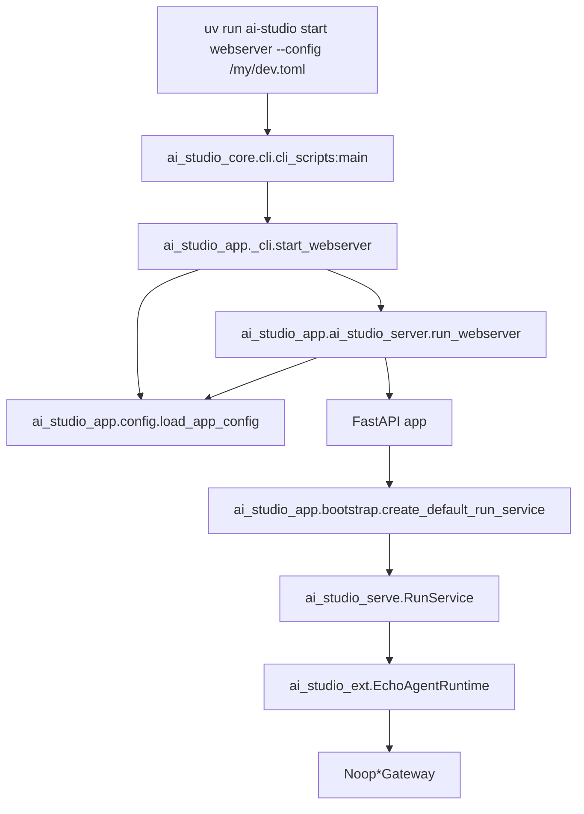
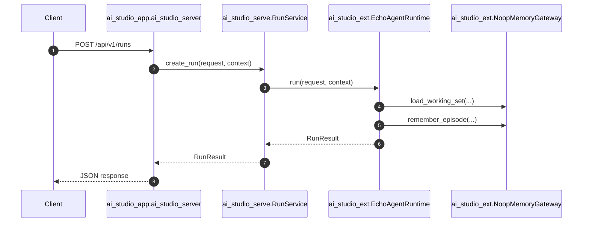

# 从零开始上手：uv、Workspace 与包加载链路

这篇文档是写给第一次接触 `AI Studio` 的人看的。

如果你对下面这些问题都不太确定，就先看这篇：

- `uv` 是什么，和 `pip` / `venv` / `poetry` 的关系是什么？
- 为什么这个仓库不是一个 Python 包，而是很多个 package？
- `pyproject.toml` 里那些 `[tool.uv.workspace]`、`[tool.uv.sources]`、`[dependency-groups]` 到底是什么意思？
- `uv run ai-studio start webserver --config /my/dev.toml` 这条命令到底做了什么？
- 一个请求进来以后，为什么会穿过 `core / app / serve / ext` 这么多层？

目标不是把所有细节讲完，而是让你先建立一个**能工作、能定位问题、能安全改代码**的脑内模型。

## 一句话总览

可以先把整个仓库理解成一句话：

> `uv` 负责把整个 monorepo 的 Python 环境装起来；`workspace` 负责声明“这个仓库里有哪些子包”；`core / ext / serve / app` 负责把“协议、实现、服务、启动”分层拆开。

换句话说：

- `uv` 解决“怎么装、怎么跑”
- `workspace` 解决“哪些包一起管理”
- `packages/` 解决“代码职责怎么拆”

## 先分清 4 个名字

第一次看这类仓库，最容易混的是这四件事：

1. 仓库根目录
2. workspace member
3. pip 包名
4. Python import 命名空间

在 `AI Studio` 里，这四件事的关系是：

| 你看到的东西 | 例子 | 它代表什么 |
|---|---|---|
| 仓库根目录 | `ai-studio/` | 整个 monorepo |
| workspace member | `packages/ai-studio-core/` | workspace 里的一个子项目 |
| pip 包名 | `ai-studio-core` | 安装时使用的包名 |
| Python import 名 | `ai_studio_core` | 代码里 `import` 用的名字 |

例如：

- 磁盘目录：`packages/ai-studio-core/`
- `pyproject.toml` 里的包名：`ai-studio-core`
- Python 代码里导入：`import ai_studio_core`

这个仓库比 `Umber Studio` 简单一点，因为这里的名字基本是同构的，没有它那种 “目录叫 `*-core`，但 pip 包名直接叫项目名” 的历史包袱。

## `uv` 到底是什么

在这个仓库里，你可以把 `uv` 暂时理解成：

- Python 环境管理器
- 依赖解析器
- 锁文件管理器
- 命令运行入口

如果你想对照官方说明，建议补看：

- [uv Projects](https://docs.astral.sh/uv/concepts/projects/)
- [uv Workspaces](https://docs.astral.sh/uv/concepts/projects/workspaces/)

对当前仓库来说，最常用的只有 3 个命令：

### `uv sync`

作用：

- 解析依赖
- 创建或更新 `.venv`
- 把当前项目需要的包装进去

在这个仓库里，推荐你直接用：

```bash
uv sync --all-packages
```

原因很简单：

- 这是一个 workspace
- 我们通常希望所有 workspace member 都被安装好
- 对新同学来说，这样最不容易踩“只装了根包，没装子包”的坑

### `uv run`

作用：

- 用 workspace 的虚拟环境执行命令

例如：

```bash
uv run ai-studio --help
uv run pytest
uv run python -c "import ai_studio_core"
```

你可以把它理解成“自动带着 `.venv` 跑命令”，不用自己先 `source .venv/bin/activate`。

### `uv add`

这个仓库里你短期不一定用得上，但要知道它是“往 `pyproject.toml` 里加依赖”的命令。

不过当前仓库更常见的做法仍然是：

- 直接编辑 `pyproject.toml`
- 然后再 `uv sync`

## 根 `pyproject.toml` 到底在做什么

仓库根 `pyproject.toml` 主要有 4 组信息。

### 1. `[project]`

这表示“根项目自己是什么”。

当前最关键的是：

```toml
[project]
name = "ai-studio"
dependencies = [
    "ai-studio-app",
]
```

这说明：

- 根项目本身叫 `ai-studio`
- 根项目运行时最直接依赖的是 `ai-studio-app`

也就是说，从“最终启动入口”视角看，根项目把 `app` 当成主装配层。

### 2. `[tool.uv.workspace]`

这表示：

> 这个仓库是一个 uv workspace，下面这些目录都是成员包。

例如当前有：

```toml
[tool.uv.workspace]
members = [
    "packages/ai-studio-core",
    "packages/ai-studio-ext",
    "packages/ai-studio-client",
    "packages/ai-studio-serve",
    "packages/ai-studio-app",
    "packages/ai-studio-sandbox",
    "packages/ai-studio-accelerator/ai-studio-acc*",
]
```

这就是为什么 `AI Studio` 不是一个包，而是一个“由多个子包组成的项目”。

### 3. `[tool.uv.sources]`

这表示：

> 如果依赖里出现这些包名，优先从当前 workspace 里找，不走 PyPI。

例如：

```toml
[tool.uv.sources]
ai-studio-core = { workspace = true }
ai-studio-ext = { workspace = true }
...
```

它解决的是一个非常实际的问题：

- `ai-studio-app` 依赖 `ai-studio-core`
- 但我们不想每改一次本地代码都先发包到 PyPI

所以 `workspace = true` 的意思就是：

- “这个依赖来自本仓库内部”
- “不要去外网下”
- “直接用当前工作区里的源码构建/安装”

### 4. `[dependency-groups]`

这表示：

> 这些依赖只用于本地开发，不是发布给用户的运行时依赖。

当前是：

```toml
[dependency-groups]
dev = [
    "mypy>=1.15.0",
    "pytest>=8.3.0",
    "ruff>=0.11.0",
]
```

也就是说：

- `mypy`
- `pytest`
- `ruff`

这些是开发工具，不属于最终业务运行依赖。

## 每个子 package 的 `pyproject.toml` 在做什么

每个 `packages/*/pyproject.toml` 都是在回答 3 个问题：

1. 这个子包叫什么？
2. 它依赖谁？
3. 它的 Python 代码在哪个目录？

以 `ai-studio-core` 为例：

```toml
[project]
name = "ai-studio-core"
dependencies = [
    "click>=8.1.0,<9.0.0",
]

[project.scripts]
ai-studio = "ai_studio_core.cli.cli_scripts:main"

[tool.hatch.build.targets.wheel]
packages = ["src/ai_studio_core"]
```

这 3 段的意思是：

- 这个包安装名叫 `ai-studio-core`
- 它自己运行时只依赖 `click`
- 安装后会暴露一个命令：`ai-studio`
- 真正的 Python 包代码在 `src/ai_studio_core/`

再看 `ai-studio-app`：

```toml
[project]
name = "ai-studio-app"
dependencies = [
    "ai-studio-core",
    "ai-studio-ext",
    "ai-studio-client",
    "ai-studio-serve",
    "ai-studio-sandbox",
    "ai-studio-acc-auto",
    "fastapi>=0.115.0,<1.0.0",
    "uvicorn>=0.30.0,<1.0.0",
]
```

这说明：

- `app` 是最外层装配包
- 它直接依赖 `core / ext / client / serve / sandbox / accelerator`
- 同时自己还需要 `fastapi` 和 `uvicorn` 才能起 webserver

## 为什么要拆成这么多 package

如果不拆，所有东西都会堆在一个包里：

- 启动逻辑
- 协议定义
- 数据库实现
- HTTP 接口
- SDK
- 沙箱

短期看写起来快，长期看一定会出问题：

- 改一个 API，容易顺手把协议层改坏
- 底层存储实现和上层业务逻辑互相 import
- 以后想替换某个实现时牵一发动全身

所以这里采用的是一个非常经典的分层：

```text
core <- ext / client / sandbox / serve <- app
```

可以先这么记：

- `core`：定义协议和模型
- `ext`：放具体实现
- `serve`：把底层能力组织成服务
- `app`：负责启动、CLI、HTTP 装配
- `client`：给外部调用方用
- `sandbox`：隔离执行
- `accelerator`：可选加速依赖层

## “依赖” 和 “加载” 是两件不同的事

很多人第一次看 monorepo 会把这两件事混在一起。

### 依赖

依赖是 `pyproject.toml` 层面的关系。

例如：

- `ai-studio-app` 依赖 `ai-studio-serve`
- `ai-studio-serve` 依赖 `ai-studio-core`

这表示“安装时”和“构建时”谁需要谁。

### 加载

加载是运行时的 import / 调用链。

例如执行：

```bash
uv run ai-studio start webserver --config /my/dev.toml
```

真正的运行链路是：

```text
uv
-> ai-studio 命令（ai_studio_core.cli.cli_scripts:main）
-> ai_studio_app._cli.start_webserver
-> ai_studio_app.ai_studio_server.run_webserver
-> load_app_config(...)
-> FastAPI app
-> create_default_run_service()
-> RunService
-> EchoAgentRuntime
```

所以要分清：

- “谁依赖谁”是安装层关系
- “谁调用谁”是运行层关系

## 启动链路到底怎么走

下面这张图是当前最小 webserver 壳的真实启动链路：



### 这里最关键的 3 个文件

1. `packages/ai-studio-core/src/ai_studio_core/cli/cli_scripts.py`
   负责把 `ai-studio start webserver` 这个命令挂出来
2. `packages/ai-studio-app/src/ai_studio_app/_cli.py`
   负责把 CLI 命令转给 app 层的 server 入口
3. `packages/ai-studio-app/src/ai_studio_app/ai_studio_server.py`
   负责真正起 FastAPI 和 `uvicorn`

## 配置文件 `/my/dev.toml` 为什么能工作

当前仓库把 `--config` 做成了一个“对新同学更友好”的解析规则。

你可以写：

```bash
uv run ai-studio start webserver --config /my/dev.toml
```

它会按下面顺序解析：

1. 如果这是一个真实存在的绝对路径，直接用
2. 如果它是 `/my/dev.toml` 这种“伪绝对路径”，就映射到 `configs/my/dev.toml`
3. 如果写的是 `my/dev.toml`，找不到时也会回退到 `configs/my/dev.toml`

所以：

```bash
--config /my/dev.toml
```

本质上等价于：

```bash
--config configs/my/dev.toml
```

## 一次请求是怎么穿过这些 package 的

启动服务以后，如果你发一个请求到：

```text
POST /api/v1/runs
```

它现在的最小执行链路是：



当前它还只是个最小骨架，所以：

- `app` 负责 HTTP
- `serve` 负责服务编排
- `ext` 负责 runtime 和 gateway 实现
- `core` 提供 `RunRequest / RunContext / RunResult` 协议

这已经足够表达“包边界是怎么配合工作的”。

## 从零开始，建议你按这个顺序上手

### 第 1 步：先让命令跑起来

在仓库根目录执行：

```bash
uv sync --all-packages
uv run ai-studio --help
uv run ai-studio start webserver --config /my/dev.toml
```

这一步的目标不是理解所有代码，而是先确认：

- 环境能装起来
- CLI 能跑
- webserver 能起

### 第 2 步：只看 4 个文件

先只看这 4 个文件：

- 根 `pyproject.toml`
- `packages/ai-studio-core/src/ai_studio_core/cli/cli_scripts.py`
- `packages/ai-studio-app/src/ai_studio_app/ai_studio_server.py`
- `packages/ai-studio-app/src/ai_studio_app/bootstrap.py`

这一步只回答一个问题：

> 一条启动命令是怎么走到 runtime 的？

### 第 3 步：再看协议和实现如何分开

继续看：

- `packages/ai-studio-core/src/ai_studio_core/contracts/`
- `packages/ai-studio-ext/src/ai_studio_ext/runtime/echo_runtime.py`
- `packages/ai-studio-ext/src/ai_studio_ext/gateways/noop_gateways.py`
- `packages/ai-studio-serve/src/ai_studio_serve/run_service.py`

这一步只回答一个问题：

> 为什么协议写在 `core`，实现写在 `ext`，服务编排写在 `serve`？

### 第 4 步：最后再回来看设计文档

到这时候，再回去读：

- [快速上手：当前工程骨架与最短阅读路径](./quick_code_onboarding.md)
- [目录结构与模块职责](./directory_and_module_map.md)
- [Packages 架构与包间分层设计](./packages_architecture.md)

你会发现这些文档突然就“有落点了”。

## 最常见的 6 个误区

### 误区 1：根项目就是最终业务代码

不是。

根项目主要是：

- workspace 容器
- 依赖入口
- 开发工具配置入口

真正的业务分层在 `packages/`。

### 误区 2：`core` 应该最先写很多实现

不是。

`core` 的职责是“定义真相”，不是“承载所有实现”。

### 误区 3：`app` 最大，所以什么都往里堆

也不是。

`app` 是最外层装配层，不是“万能层”。

它可以最复杂，但不能最混乱。

### 误区 4：`uv run` 只是 `python` 的别名

不是。

它的关键价值是：

- 自动带上 workspace 环境
- 自动使用锁定后的依赖集合
- 避免你手工切环境

### 误区 5：`workspace` 就等于“所有包自动互相 import”

不是。

`workspace` 只是说明“这些项目一起管理”。

真正谁能 import 谁，仍然取决于：

- 各自 `pyproject.toml` 的依赖声明
- 代码层面的分层约束

### 误区 6：目录存在就代表能力已经实现

也不是。

当前仓库里很多地方仍然是“壳先立住，再逐步长功能”。

这正是这个阶段最重要的工程策略。

## 你现在应该记住什么

如果读完这篇你只能记住 5 句话，那就记这 5 句：

1. `uv` 负责“装环境 + 跑命令”。
2. `workspace` 负责“把多个子包作为一个仓库一起管理”。
3. `core` 定义协议，`ext` 放实现，`serve` 做服务编排，`app` 做启动装配。
4. “依赖关系” 和 “运行加载链路” 不是一回事。
5. 新同学最先要搞懂的不是业务细节，而是“命令怎么进来、配置怎么读取、请求怎么流动”。

## 接下来读什么

读完这篇后，推荐继续看：

1. [快速上手：当前工程骨架与最短阅读路径](./quick_code_onboarding.md)
2. [目录结构与模块职责](./directory_and_module_map.md)
3. [Packages 架构与包间分层设计](./packages_architecture.md)
4. [开发 Playbooks 与使用方式](./development_playbooks.md)
