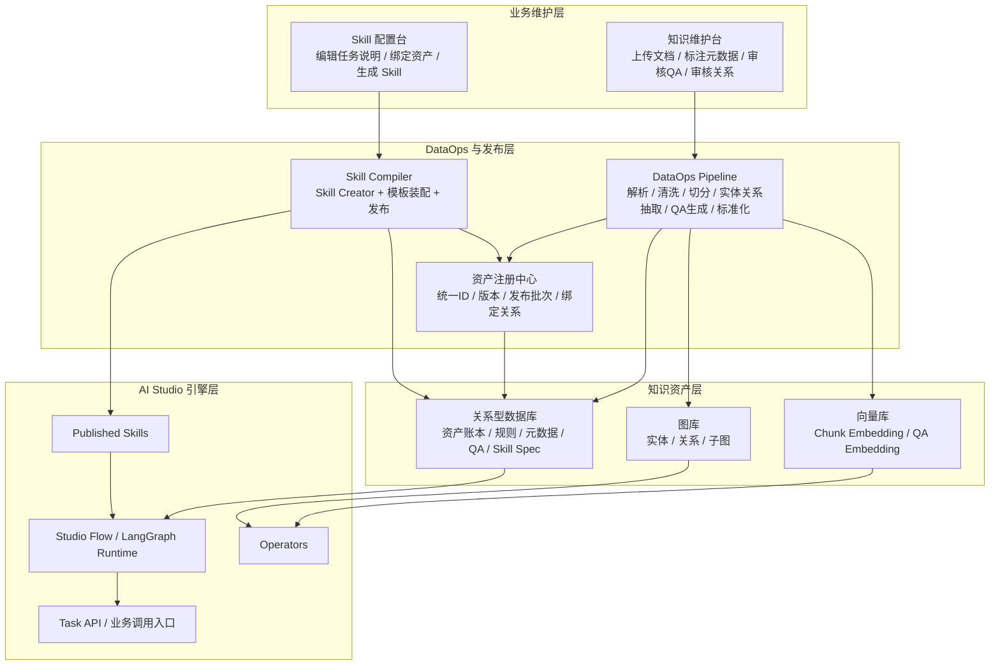
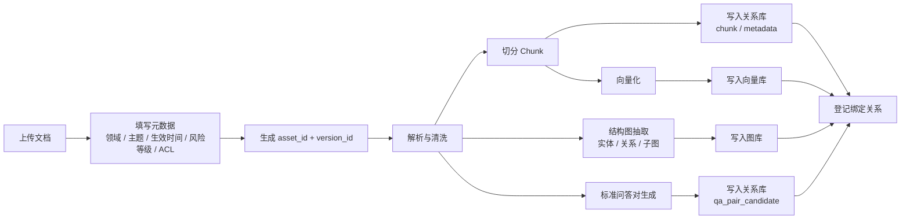
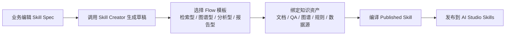

# AI Studio 功能设计

## 0. 设计目标

这份文档承接架构设计，回答的不是“平台分几层”，而是：

1. `knowledge + skill` 这套能力在产品侧到底怎么维护。
2. `PostgreSQL + Milvus + Neo4j` 三库如何协同，而不是各自为政。
3. 业务人员、系统和工程人员分别维护到哪一层。
4. Skill 如何从业务 Spec 变成 `AI Studio` 可运行能力。

## 1. 总体结论

这套功能设计可以收敛成一句话：

**三库一账本，两条业务维护链，一条能力发布链。**

- 三库：关系库、向量库、图库
- 一账本：统一资产账本 / 元数据注册表
- 两条业务维护链：`文档知识维护`、`Skill 配置维护`
- 一条能力发布链：把知识资产和 Skill Spec 编译成可执行能力

这套模型成立的前提是：

- `PostgreSQL` 承担系统总账，而不是“顺手存点元数据”
- `Milvus` 和 `Neo4j` 都只是知识资产的派生索引层
- Skill 不由业务直接维护原始目录，而由平台从 Spec 编译生成

## 2. 总架构



## 3. 文档知识维护链

文档知识维护的关键不是“上传文档后分别写三库”，而是：

**先有统一资产 ID 和版本，再把三库都视为这个资产的派生索引。**

### 3.1 总账本模型

关系库需要承担总账本角色，核心对象至少包括：

- `knowledge_asset`
  - 逻辑知识资产，唯一 `asset_id`
- `knowledge_asset_version`
  - 每次上传或修订生成一个 `version_id`
- `ingestion_job`
  - 一次处理任务
- `document_chunk`
  - chunk 结果
- `vector_binding`
  - `chunk_id -> vector_id`
- `graph_binding`
  - `version_id -> graph_subgraph_id / entity_ids / edge_ids`
- `qa_pair_asset`
  - 自动生成或人工确认的标准问答对
- `publish_batch`
  - 一次正式发布批次

### 3.2 上传文档流程



### 3.3 更新范围控制

更新范围由关系库总账本统一控制，至少依赖这 4 个键：

- `asset_id`
- `version_id`
- `ingestion_job_id`
- `publish_batch_id`

这样一来：

- 文档更新时，新建 `version_id`，不覆盖老版本
- 向量重建时，只处理这个 `version_id` 下的 chunk
- 图谱更新时，也只处理这个 `version_id` 对应的子图
- QA 重生成时，也知道该替换哪一批候选问答

结论是：

**不要让图库自己定义更新范围，而是由关系库总账本定义。**

### 3.4 标准问答对生成

标准问答对应该被视为衍生资产，但不要直接自动上线。推荐分三层：

- `qa_pair_candidate`
  - 模型自动生成
- `qa_pair_review`
  - 业务审核
- `qa_pair_asset`
  - 发布后的正式问答资产

这些 QA 有两个作用：

- 丰富 `knowledge` 问答
- 作为后续 `skill` 的 few-shot / reference

## 4. Skill 配置维护链

运行时 Skill 确实不只是 prompt，但业务人员也不应该直接维护原始 Skill 目录，更不应该直接维护 Python。

### 4.1 两层模型

Skill 需要被拆成两层：

1. `Skill Spec`
   - 给业务维护
   - 存在数据库里
2. `Published Skill Package`
   - 给 `AI Studio` 运行
   - 由系统编译生成

### 4.2 Skill Spec 字段

业务维护的不是 `.py`，而是这些结构化字段：

- `skill_name`
- `goal`
- `applicable_domain`
- `applicable_scenarios`
- `input_schema`
- `output_schema`
- `tone / answer style`
- `knowledge_asset_bindings`
- `graph_asset_bindings`
- `database_profile_bindings`
- `selected_flow_template`
- `citation_policy`
- `approval_policy`
- `report_template`
- `guardrails`

### 4.3 Skill 发布流程



### 4.4 Skill 类型

建议第一阶段只支持三类：

- `Prompt Skill`
  - 只有 `SKILL.md`
  - 适合纯问答、摘要、解释
- `Flow-bound Skill`
  - 绑定某条 `Studio Flow` 或 `LangGraph` 执行模板
  - 适合合同审查、财务分析、证据追踪
- `Engineer-extended Skill`
  - 允许附带 `scripts/`
  - 脚本仅由工程人员维护，不开放给业务直接写

### 4.5 核心原则

**业务维护 Spec，系统生成 Skill，工程维护脚本模板。**

不要让业务直接维护这种原始形态：

```text
my-skill/
├── SKILL.md
├── scripts/
├── references/
└── assets/
```

这类结构应该由平台自动生成。

## 5. 权限与维护边界

这套平台需要明确切成三层维护边界。

### 5.1 业务人员可维护

- 上传文档
- 编辑规则表单
- 编辑术语定义
- 审核关系候选
- 审核标准问答对
- 编辑 Skill Spec 的业务描述部分

### 5.2 系统自动生成

- chunk
- embedding
- 图谱候选关系
- 标准问答对候选
- `SKILL.md` 初稿
- references manifest
- 资产绑定清单

### 5.3 工程人员维护

- Flow 模板
- Operator 库
- Script 模板
- 数据源 profile
- 执行 guardrails
- Skill compiler

## 6. Published Skill 具像化方案

在 `AI Studio` 里，Skill 不应该等于“业务写一个 md”，而应该定义成：

**Skill = Task Contract + Asset Binding + Flow Binding + Optional Runtime Template**

一个 Published Skill 生成后可具像化为：

```text
skills/contract-subject-review/
├── SKILL.md
├── assets/
│   ├── report_template.md
│   └── output_schema.json
├── references/
│   └── asset_bindings.json
└── scripts/
    └── run_flow.py
```

其中：

- `SKILL.md`
  - 由 Skill Creator 根据 Spec 生成
- `assets/`
  - 从平台模板库选择
- `references/asset_bindings.json`
  - 记录绑定的知识资产、规则集、图库、数据库 profile
- `scripts/run_flow.py`
  - 尽量使用平台模板，不为每个 Skill 单独写一份自定义 Python

最关键的一条是：

**动态业务知识不要直接复制进 Skill 包。**

Skill 只保存绑定关系和使用策略，真正的知识内容仍然保留在：

- 关系库
- 向量库
- 图库

Skill 运行时再按 `asset_id / version / profile` 拉取。

## 7. 业务台面设计

这套产品最合理的业务界面，不是一个单页面，而是两个台面。

### 7.1 知识维护台

面向业务人员，负责：

- 上传文档
- 填元数据
- 预览解析结果
- 审核关系候选
- 审核 QA 候选
- 发布知识资产

### 7.2 Skill 配置台

面向高级业务人员或 AI 运营，负责：

- 选择任务类型
- 编写任务目标
- 选择绑定的知识资产
- 选择数据库 profile
- 选择图谱 profile
- 选择 Flow 模板
- 一键生成 Skill 草稿
- 审核并发布

## 8. 推荐实现顺序

1. 先做知识维护台
   - 文档上传
   - 元数据
   - 统一资产 ID
   - 三库绑定
   - QA 候选生成
2. 再做资产总账
   - `asset_id`
   - `version_id`
   - `vector_binding`
   - `graph_binding`
   - `publish_batch`
3. 再做 Skill Spec 台
   - 先不碰 Python
   - 只让业务配置任务和绑定关系
4. 最后才做 Published Skill 编译器
   - 调用内置 `skill creator`
   - 生成 `SKILL.md`
   - 装配 references / assets
   - 绑定到 `Studio Flow`

## 9. 一句话收口

`AI Studio` 这套平台的合理产品定义是：

**业务人员维护知识源和 Skill Spec，DataOps 把知识源归一化成三库资产，Skill Compiler 再把 Skill Spec 和知识资产绑定编译成 `AI Studio` 可运行的 Skill。**
