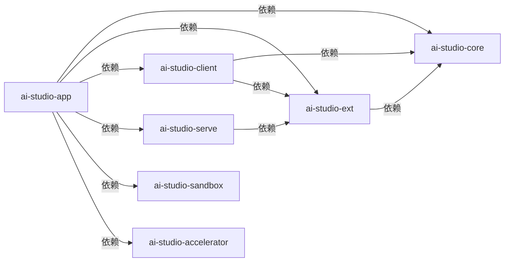

# 从零开始创建项目结构
> Python monorepo + uv workspace + 多 package

## 初始化 uv

```shell
uv init
```

## 生产默认python 3.12

```shell
# 切换 python 版本, 并且 pin 住
uv python install 3.12
uv python pin 3.12
uv sync
```

## 创建基础 package 壳

```shell
uv init --package packages/ai-studio-core
uv init --package packages/ai-studio-ext
uv init --package packages/ai-studio-client
uv init --package packages/ai-studio-serve
uv init --package packages/ai-studio-sandbox
uv init --package packages/ai-studio-accelerator
uv init --package packages/ai-studio-app
```

## 先分清两种关系

初始化这几个 package 之后，最容易混淆的是两件事：

1. `workspace 成员关系`
2. `package 运行时依赖关系`

它们不是一回事。

### 1. workspace 成员关系

这表示“这些目录都归同一个 monorepo 管”。

根 `pyproject.toml` 里通常会有：

```toml
[tool.uv.workspace]
members = [
    "packages/ai-studio-core",
    "packages/ai-studio-ext",
    "packages/ai-studio-client",
    "packages/ai-studio-serve",
    "packages/ai-studio-sandbox",
    "packages/ai-studio-accelerator",
    "packages/ai-studio-app",
]
```

这只是告诉 `uv`：

- 这些子目录都是 workspace member
- `uv sync --all-packages` 时要一起处理
- 本地包可以互相引用

### 2. package 运行时依赖关系

这表示“某个包在 `dependencies` 里真正依赖谁”。

例如：

- `ai-studio-ext` 依赖 `ai-studio-core`
- `ai-studio-app` 依赖 `ai-studio-serve`

这个关系不是 `uv init --package` 自动帮你设计好的，需要你后续自己补。

## 参考 Umber Studio 的包依赖关系

如果按 `Umber Studio` 的实际 `pyproject.toml` 依赖来映射，当前 `AI Studio` 更接近下面这条线：



这里有两个要点：

1. `serve` 在 `Umber Studio` 里不是直接依赖 `core`，而是直接依赖 `ext`
2. `sandbox` 在 `Umber Studio` 里基本是独立包，不依赖 `core`

如果用一句话记：

> `core` 最内层，`ext` 包住 `core`，`serve` 和 `client` 再往上，`app` 最外层负责最终装配。


## accelerator 的特殊点

`accelerator` 这一层在 `ai-studio` 里不是一个普通业务包，而是一个“可选依赖入口”：

- `app` 直接依赖 `ai-studio-acc-auto`
- `ai-studio-acc-auto` 再通过 optional extras 挂 `flash_attn`
- `flash_attn` 最终落到 `ai-studio-acc-flash-attn`

如果以后 `AI Studio` 完全对齐这层，推荐会长成：

```text
ai-studio-app -> ai-studio-acc-auto
ai-studio-acc-auto[flash_attn] -> ai-studio-acc-flash-attn
```

如果当前阶段先保留一个扁平的 `ai-studio-accelerator` 包，也应该把它理解成：

- 不属于核心业务链路
- 只负责可选加速依赖
- 不反向要求 `core` 依赖它

## 每个 package 的职责

### `ai-studio-core`

最稳定的内核层，放：

- contracts
- protocol / interface
- 运行时输入输出模型
- 领域内公用类型

它不应该依赖别的业务层包。

### `ai-studio-ext`

实现层，放：

- runtime adapter
- gateway adapter
- 具体实现

它依赖 `core`，但不反向污染 `core`。

### `ai-studio-client`

对外调用边界，放：

- SDK
- API client
- 对外访问封装

如果参考 `Umber Studio`，它通常不只是依赖 `core`，还会直接依赖 `ext`。

### `ai-studio-serve`

服务编排层，放：

- use case service
- application service
- 面向上层的稳定服务入口

如果参考 `Umber Studio`，它会直接依赖 `ext`，由 `ext` 往下再接 `core`。

### `ai-studio-sandbox`

受控执行边界，放：

- shell 执行隔离
- Python 执行隔离
- tool side effect 隔离

如果参考 `Umber Studio`，它更像一个独立能力包，不要求依赖 `core`。

### `ai-studio-accelerator`

可选加速层，放：

- GPU 推理相关依赖
- 加速包安装壳
- 和主运行链路解耦的性能增强能力

它不应该把复杂依赖直接压进 `core`。

### `ai-studio-app`

最外层装配层，放：

- 启动入口
- CLI
- WebServer
- 配置加载
- 最终对象装配

它负责把 `core / ext / serve / sandbox / accelerator` 组起来。

## 为什么要这样依赖

这样分层主要是为了避免两个常见问题：

### 问题 1：最内层被最外层反向污染

如果 `core` 反过来依赖 `app`，就会导致：

- 最稳定的协议层无法独立复用
- 单元测试变重
- 启动代码和领域代码缠在一起

### 问题 2：所有代码都堆进一个包

如果不拆层，最后会变成：

- contracts
- runtime
- router
- storage
- shell
- tool

全堆在一起，后面很难重构。

## 初始化后要注意的一点

`uv init --package` 只会帮你生成一个最小 package 壳。

刚初始化完时，每个子包的 `pyproject.toml` 往往还是这种状态：

```toml
[project]
name = "ai-studio-core"
dependencies = []
```

也就是说：

- 目录结构有了
- 包名有了
- 但包与包之间的依赖关系还没有接好

所以创建完 package 之后，下一步不是“直接开始写业务”，而是：

1. 先确定分层
2. 再补 `dependencies`
3. 最后再写代码

## 一句话总结

`uv` 负责把 package 壳和 workspace 管理起来，真正的包依赖关系要你自己设计。

在 `AI Studio` 里，如果按 `Umber Studio` 的依赖关系来学，最该记住的是这条线：

`ext -> core`，`client -> core + ext`，`serve -> ext`，`app -> core + ext + client + serve + sandbox + accelerator`。
