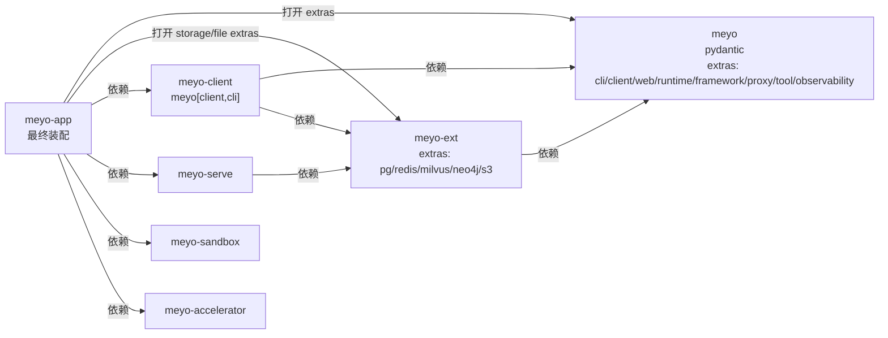

# 补充技术栈依赖
> 依赖不要一次性塞进根项目，而是按 package 边界和运行时职责分层打开

上一节已经把 workspace、CLI 入口和最小 FastAPI WebServer 接起来了。

这一节开始把 Meyo 后续要用到的技术栈补进项目里。

关联代码修订号：

```text
82a4c8cf
8076852b
```

这两个提交的关系是：

- `82a4c8cf`：主要落 package 重命名、依赖分层、`pyproject.toml`、启动壳、`uv.lock` 和最小 WebServer
- `8076852b`：继续把文档体系统一到 `meyo` 命名，并且把 `00/01` 中的 package 分层、依赖拆分、启动验证描述补齐

所以 `02` 不是只对应一个提交。`82a4c8cf` 更偏代码和依赖落地，`8076852b` 更偏文档体系和命名统一，但它修改了 `00/01` 的开发文档上下文，直接影响这一篇的写法顺序。

## 1. 先确认技术栈范围

当前项目先按下面这组基础设施准备：

```text
Python 3.12
FastAPI
PostgreSQL
Redis Stack
Milvus
Neo4j
LangChain Core
LangGraph
LangFuse
OpenAI-compatible API
MCP
S3 / MinIO
```

这里先补“项目会用到的依赖能力”，不在这一节展开业务代码。

这一节要解决的是：

- WebServer 能跑
- runtime 依赖能安装
- 存储、向量库、图库、对象存储的 driver 有明确归属
- app 层可以一次性装配完整能力
- core 层默认依赖仍然足够轻

## 2. 依赖不要放到根项目

根 `pyproject.toml` 只做 workspace 容器：

```toml
[project]
name = "meyo-mono"
dependencies = []
```

原因很简单：

- 根项目不承载运行时业务代码
- 真正可安装、可复用的是各个 package
- 依赖跟着 package 边界走，后面拆部署、拆 SDK、拆服务会更清楚

所以第三方依赖主要放在：

- `packages/meyo-core/pyproject.toml`
- `packages/meyo-ext/pyproject.toml`
- `packages/meyo-app/pyproject.toml`

## 3. core 保持轻量

`meyo-core` 的包名是 `meyo`。

默认依赖只放所有层都会用到的基础能力：

```toml
dependencies = [
    "pydantic>=2.7,<3.0",
]
```

`pydantic` 放在 core 是合理的，因为后续协议、配置、API schema、工具入参出参都需要它。

其它能力不要直接放进默认依赖，而是放到 optional extras 里。

这样可以避免只安装 SDK 或基础协议时，被迫带上 FastAPI、数据库驱动、LangGraph、OpenAI SDK 这些较重依赖。

## 4. core 的 optional extras

`core` 里按能力分组，而不是按某个最终应用场景分组。

### CLI 能力

```toml
[project.optional-dependencies]
cli = [
    "click>=8.1.0,<9.0.0",
    "rich>=13.0,<15.0",
    "tomlkit>=0.13,<1.0",
]
```

这一组服务于命令行入口：

- `click` 注册 `meyo start webserver` 这类命令
- `rich` 后续做更清晰的终端输出
- `tomlkit` 后续生成和修改配置文件时可以保留 TOML 格式

### Client 能力

```toml
client = [
    "httpx>=0.24,<1.0",
    "tenacity>=8.0,<10.0",
]
```

这一组用于 SDK、远程调用、模型代理请求：

- `httpx` 同时支持同步和异步 HTTP 调用
- `tenacity` 处理网络请求、模型调用、外部服务调用的重试

### Web 框架能力

```toml
simple_framework = [
    "aiofiles>=24.0,<25.0",
    "fastapi>=0.136,<0.137",
    "gunicorn>=23.0,<24.0",
    "pydantic-settings>=2.0,<3.0",
    "python-multipart>=0.0.20,<1.0",
    "uvicorn[standard]>=0.46,<0.47",
]
```

这一组支撑最小 WebServer：

- `fastapi` 是当前 HTTP API 框架
- `uvicorn[standard]` 用于本地和生产 ASGI 启动
- `gunicorn` 预留生产多进程管理
- `python-multipart` 支撑表单和文件上传
- `aiofiles` 支撑异步文件读写
- `pydantic-settings` 后续可以承接配置加载

这里命名成 `simple_framework`，是为了先表达“基础 Web 框架能力”，不把它和完整业务 framework 混在一起。

### Runtime 能力

```toml
runtime = [
    "langchain-core>=1.0,<2.0",
    "langgraph>=1.0,<2.0",
]
```

这一组是 agent runtime 主轴：

- `langchain-core` 只引核心抽象，不直接引完整 LangChain 大包
- `langgraph` 用于状态机、工作流、agent 编排

### Framework 能力

```toml
framework = [
    "alembic>=1.13,<2.0",
    "jsonschema>=4.0,<5.0",
    "SQLAlchemy>=2.0,<3.0",
]
```

这一组放更偏“平台框架”的基础设施：

- `SQLAlchemy` 是关系数据库访问基础
- `alembic` 管理数据库表结构演进
- `jsonschema` 用于工具 schema、配置 schema、协议校验

### OpenAI 代理能力

```toml
proxy_openai = [
    "httpx[socks]>=0.24,<1.0",
    "openai>=1.59,<3.0",
    "tiktoken>=0.8,<1.0",
]
```

这一组用于对接 OpenAI-compatible 模型服务：

- `openai` 是官方 SDK，也兼容很多 OpenAI-compatible endpoint
- `httpx[socks]` 支撑代理场景
- `tiktoken` 用于 token 预算、上下文截断、成本统计

### Tool 能力

```toml
tool = [
    "mcp>=1.0,<2.0",
]
```

这一组先只放 MCP SDK，后续用于接入工具生态。

### Observability 能力

```toml
observability = [
    "langfuse>=3.0,<4.0",
    "opentelemetry-api>=1.28,<2.0",
    "opentelemetry-exporter-otlp>=1.28,<2.0",
    "opentelemetry-instrumentation-fastapi>=0.50b0,<1.0",
    "opentelemetry-sdk>=1.28,<2.0",
    "prometheus-client>=0.20,<1.0",
    "structlog>=24.0,<26.0",
]
```

这一组用于日志、指标、链路追踪和 LLM 调用观测：

- `langfuse` 追踪 prompt、completion、token 和成本
- `opentelemetry-*` 统一 trace / metric / log 标准
- `prometheus-client` 暴露平台指标
- `structlog` 输出结构化日志

## 5. ext 放外部系统适配

`meyo-ext` 默认只依赖 core：

```toml
dependencies = [
    "meyo",
]
```

具体外部系统 driver 也拆成 optional extras。

### PostgreSQL

```toml
[project.optional-dependencies]
storage_postgres = [
    "asyncpg>=0.29,<1.0",
    "psycopg[binary,pool]>=3.2,<4.0",
]
```

- `asyncpg` 适合 async runtime 场景
- `psycopg[binary,pool]` 提供 PostgreSQL 官方驱动和连接池

### Redis

```toml
storage_redis = [
    "redis>=5.0,<8.0",
]
```

用于缓存、队列、短期状态和分布式锁。

### Milvus

```toml
storage_milvus = [
    "pymilvus>=2.4,<3.0",
]
```

用于向量检索、embedding 存储和语义记忆。

### Neo4j

```toml
storage_neo4j = [
    "neo4j>=5.0,<7.0",
]
```

用于实体关系、GraphRAG、洞见网络这类图结构能力。

### S3 / MinIO

```toml
file_s3 = [
    "boto3>=1.34,<2.0",
    "minio>=7.0,<8.0",
]
```

- `boto3` 对接 AWS S3 和兼容 S3 协议的对象存储
- `minio` 对接本地或私有化 MinIO

## 6. client 只打开 client 侧能力

`meyo-client` 当前依赖：

```toml
dependencies = [
    "meyo[client,cli]",
    "meyo-ext",
]
```

这里没有打开 Web、Runtime、DB、Observability。

原因是 client 包应该偏轻，主要服务于：

- SDK 封装
- 远程 API 调用
- CLI 侧复用
- 少量 ext 类型或 adapter 复用

## 7. serve 依赖 ext

`meyo-serve` 当前依赖：

```toml
dependencies = [
    "meyo-ext",
]
```

`serve` 是服务编排层。

它先依赖 `ext`，后续再把 core 协议和 ext 实现组织成 use case service。

这里暂时不直接打开数据库 extras，避免服务层默认被某一组存储实现绑定。

## 8. sandbox 和 accelerator 先留空

`meyo-sandbox`：

```toml
dependencies = []
```

`meyo-accelerator`：

```toml
dependencies = []
```

这两个包先保留 package 边界。

后续再按真实能力补依赖：

- `sandbox` 放隔离执行、受控环境、工具运行相关依赖
- `accelerator` 放性能优化、硬件加速或可选 native 依赖

## 9. app 做最终装配

`meyo-app` 是最终启动和装配层，所以这里一次性选择完整运行时需要的 extras：

```toml
dependencies = [
    "meyo[cli,client,framework,observability,proxy_openai,runtime,simple_framework,tool]",
    "meyo-accelerator",
    "meyo-client",
    "meyo-ext[file_s3,storage_milvus,storage_neo4j,storage_postgres,storage_redis]",
    "meyo-sandbox",
    "meyo-serve",
]
```

这里的重点是：

- FastAPI / Uvicorn 从 `meyo[simple_framework]` 打开
- LangGraph 从 `meyo[runtime]` 打开
- OpenAI / tiktoken 从 `meyo[proxy_openai]` 打开
- MCP 从 `meyo[tool]` 打开
- LangFuse / OpenTelemetry / Prometheus 从 `meyo[observability]` 打开
- PostgreSQL / Redis / Milvus / Neo4j / S3 从 `meyo-ext[...]` 打开

这样 `app` 可以完整启动，但 `core`、`client`、`serve` 仍然可以保持自己的轻量安装边界。

## 10. 同步依赖

改完各 package 的 `pyproject.toml` 后，在根目录执行：

```shell
uv sync --all-packages
```

这一步会：

- 解析 workspace 内所有 package
- 把本地 package 按 workspace source 关联起来
- 更新 `uv.lock`
- 安装 app 打开的所有 extras

如果只跑 `uv sync`，可能不会覆盖所有 workspace package。

这里统一用 `--all-packages`。

## 11. 补一个 FastAPI Hello World 验证

依赖补完后，不急着写完整业务。

先用一个最小 WebServer 验证链路：

```text
uv run meyo start webserver --config meyo.toml
```

启动链路仍然是上一节整理出来的那条：

```text
uv run meyo start webserver --config meyo.toml
-> pyproject.toml [project.scripts]
-> meyo.cli.cli_scripts:main
-> meyo_app.cli.start_webserver
-> meyo_app.meyo_server.run_webserver
```

启动后确认三个地址：

```shell
curl http://127.0.0.1:5670/
curl http://127.0.0.1:5670/api/healthz
curl http://127.0.0.1:5670/api/hello
```

这一节的 Hello World 不是业务功能，只是验证：

- CLI 入口能找到
- `meyo-app` 能被导入
- FastAPI / Uvicorn 已经正确安装
- 配置文件参数能走到 app 层
- HTTP 路由能正常响应

## 12. 到这里得到什么

做完这一步，项目依赖关系变成：



阶段性结果：

- 根项目仍然是干净的 workspace 容器
- core 默认安装保持轻量
- 技术栈依赖按能力拆进 optional extras
- ext 承接外部系统 driver
- app 负责最终选择完整运行时能力
- 最小 FastAPI Hello World 可以用来验证启动链路

下一步可以继续补：

- 配置文件结构
- 日志初始化
- 数据库连接生命周期
- FastAPI router 分层
- runtime service 的第一条业务链路
